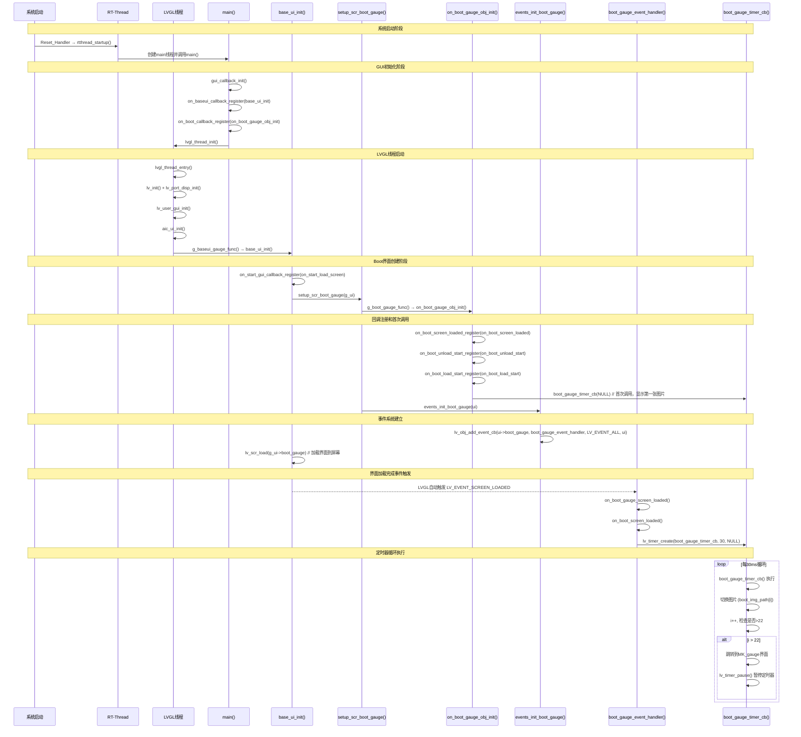

# 工作记录

## 使用方式
- 每周创建一个折叠区域
- 每天在对应周内添加记录（周一到周六）
- 第一行记录知识点，第二行记录工作所得
- 简单记录，重点突出

---

## 2026年第16周 (04-13 ~ 04-19)


### 2025-04-13 周五

**📚 今日知识点：** 


**💼 工作所得：** 


---

### 2025-06-05 周四

**📚 今日知识点：** 
A工程里两个文件夹添加到B工程里；生成BIN作为升级包；
J-LINK支持JTAG和SWD烧录，ST-link只支持SWD；
Flash 256KB地址范围0x08000000-0x0803FFFF；32位寄存器寻址范围0~0xFFFFFFFF；__HAL_FLASH_HALF_CYCLE_ACCESS_ENABLE启用Flash半周期访问；
正常模式：    ┌─────┐    ┌─────┐    ┌─────┐ 访问速度提升：理论上可以将Flash访问速度提高约50%
             │读取1│    │ 读取2│    │读取3│ CPU效率：减少CPU等待时间，提高整体系统性能
             └─────┘    └─────┘    └─────┘  适用场景：特别适用于STM32F1系列等需要优化Flash访问的
             完整周期    完整周期    完整周期

半周期模式：  ┌─┐ ┌─┐  ┌─┐ ┌─┐  ┌─┐ ┌─┐    兼容性：需要确认具体芯片型号是否支持
             │1│ │2│  │3│ │4│  │5│ │6│    稳定性：在某些极端条件下可能影响系统稳定性
             └─┘ └─┘  └─┘ └─┘  └─┘ └─┘    调试：如果系统不稳定，可以尝试禁用此功能
             半周期    半周期    半周期

__HAL_FLASH_SET_LATENCY配置Flash等待周期；
STM32F103xE 512KB，STM32F103xC 256KB；
osKernelInitialize()初始化RTOS内核；
MX_FREERTOS_Init()配置FreeRTOS任务队列信号量；
osKernelStart()启动RTOS调度器；
SystemClock_Config()配置时钟树；
HAL_TIM_PeriodElapsedCallback定时器周期回调；Error_Handler错误处理函数；
__disable_irq()全局禁用中断；
IS_IRQ()检测中断上下文；
FreeRTOS源码结构tasks.c/queue.c/portable；
volatile关键字防止编译器优化，保证内存访问

**💼 工作所得：** 
掌握工程文件添加方法：拷贝文件→新建工程文件→加入工程；学习升级包生成和JTAG/SWD烧录方式；理解Flash地址分配和32位寻址原理；掌握STM32 HAL库Flash配置宏定义；学习FreeRTOS初始化流程：内核初始化→任务配置→调度器启动；掌握时钟配置和定时器回调机制；理解错误处理和中断控制；学习volatile关键字在嵌入式开发中的应用

---

### 2025-06-06 周五

**📚 今日知识点：** 
Keil MDK多目标配置管理多个工程；Flash 256KB SRAM 64KB分配；
IAP bsp_jump_to_app()函数使得Bootloader跳转App原理；OTA地址长度useflash 0xFFFFFFF判断；FreeRTOS任务创建osThreadNew；BSP初始化bsp_ecu_init()板级支持包；
任务循环执行vs定时执行；优先级数值越小越高；
设备驱动框架通过结构体数组实现；433发送指令与CAT1通信控制MCU GPIO；
一线通通信拉高使能单线供电+数据收发

**💼 工作所得：** 
复盘Flash/SRAM分配：Bootloader占用32KB，App偏移0x08008000；OTA升级流程：地址判断→解压缩→写入APPLICATION_ADDRESS；FreeRTOS任务创建：StartDefaultTask→bsp_ecu_init→创建多个子线程；按键输入处理bsp_ecu_btn_loop；GPIO控制bsp_ecu_gpio_set_by_name；参考NFC代码写灯具代码；433规约控制MCU GPIO；CAT1解析数据MCU透传；灯和NFC一线通通信协议

---

### 2025-06-07 周六

**📚 今日知识点：** 
Cursor模型上下文协议MCP；Git同名分支拉取如果没有冲突，直接点击合并。如果有冲突需要处理冲突

**💼 工作所得：** 
学习Cursor工具使用；掌握Git merge合并分支操作

</details>

---

## 2025年第2周 (06-09 ~ 06-15)

<details>
<summary>📅 第2周记录 (点击展开)</summary>

### 2025-06-09 周一

**📚 今日知识点：** 
瑞魔有卡无485版本；485外挂IOT盒子不联网；A518_V2项目结构：firmware/software/hardware；software/app目录结构：Core/Drivers/Middlewares/Board/MDK-ARM；环境变量PATH配置Python路径；CMP运行PIP下载；Python deepface开发

**💼 工作所得：** 
增加485版本与之前版本共存；项目结构搭建：firmware固件工具、software软件、hardware硬件设计；配置Python环境变量PATH；安装Python deepface开发环境；

---

### 2025-06-10 周二

**📚 今日知识点：** 
Python开发环境搭建

**💼 工作所得：** 
继续了解Python；开发任务开始进行

---

### 2025-06-11 周三

**📚 今日知识点：** 
Ctrl+F文档搜索功能；4G模块处理数据MCU透传；VSCode配置ARMCC.EXE困难解决方案；VSCode makefile编译方法；DMA接收数据流程；Git指令配置；一线通半双工，单线供电+数据收发T = 1/Baudrate（例如 9600bps 时 T≈104μs）

**💼 工作所得：** 
掌握文档搜索技巧；理解4G-MCU数据流：4G处理数据MCU透传；VSCode配置问题：使用Cursor编辑Keil编译；VSCode makefile编译需公司统一环境；
DMA接收流程：启动→缓冲区→IDLE中断→停止→计算长度→释放信号量→入队→重启；配置Git用户名邮箱；生成SSH密钥；掌握Git基础指令；一线通通信时序计算

---

### 2025-06-12 周四

**📚 今日知识点：** 
J-flash-lite烧录HEX/BIN文件；或非门逻辑：A高B低写入，A低B低锁存；锁存器结构存储1bit数据；D锁存器E1可写E0锁存；上升沿触发避免多次触发；主从触发器MS触发器；8个MS触发器构成寄存器

**💼 工作所得：** 
无Keil时使用J-flash-lite烧录；学习数字电路基础：或非门、锁存器、D触发器、寄存器原理；理解时序逻辑电路设计

---

### 2025-06-13 周五

**📚 今日知识点：** 
485通信测试

**💼 工作所得：** 
测试485通信功能

---

### 2025-06-14 周六

**📚 今日知识点：** 

**💼 工作所得：** 

</details>

---

## 2025年第3周 (06-16 ~ 06-22)

<details>
<summary>📅 第3周记录 (点击展开)</summary>

### 2025-06-16 周一

**📚 今日知识点：** 
转速计算公式：RPM=60*f(交流电频率)/p(极对数)；一分钟轮子赚多少转；
霍尔脉冲数计算：500ms霍尔数N，RPM=(N/0.5)*(60/P)=120*N/P；霍尔脉冲数P=2p（单霍尔电机），三相120°安装6p，60°安装12p；LOG打印vs printf；printf重构fputc定义串口输出

**💼 工作所得：** 
掌握电机转速计算方法；理解霍尔传感器脉冲计数原理；学习一线通通信协议：雅迪同步信号vs追觅轮询方式；调试技巧：使用LOG打印避免printf串口配置麻烦；printf函数重构fputc指定串口输出
雅迪一线通：同步信号50ms+1ms脉冲+66.7%占空比高+33%占空比低；追觅一线通：轮询T50ms主节点+10ms间隔+从节点回复；

---

### 2025-06-17 周二

**📚 今日知识点：** 
485通信协议

**💼 工作所得：** 
485通信相关开发

---

### 2025-06-18 周三

**📚 今日知识点：** 
485通信深入理解

**💼 工作所得：** 
继续485通信开发

---

### 2025-06-19 周四

**📚 今日知识点：** 
485通信熟悉

**💼 工作所得：** 
熟悉485通信

---

### 2025-06-20 周五

**📚 今日知识点：** 
LOG_W函数使用

**💼 工作所得：** 
学习LOG_W函数

---

### 2025-06-21 周六

**📚 今日知识点：** 
逻辑分析仪原理：逻辑分析仪：对设备：记录各个探针的电平，记录电平发生变化的时刻，对PC：按照一定的格式把数据发给PC
H7-TOOL:可替代逻辑分析仪，更重要的是，能监测MCU的运行状态，比如：串口和程序执行到哪一步了

**💼 工作所得：** 
了解逻辑分析仪


</details>

---

## 2025年第4周 (06-23 ~ 06-29)

<details>
<summary>📅 第4周记录 (点击展开)</summary>

### 2025-06-23 周一

**📚 今日知识点：** 
485同步机制；原子操作；IDLE标志；DMA；信号量vs队列

**💼 工作所得：** 
学习485同步机制

---

### 2025-06-24 周二

**📚 今日知识点：** 
绝大多数情况下，每条半双工总线需要独立的同步控制信号
2、STM32 可同时在不同总线上进行通信（例如：在 Bus A 接收数据的同时，向 Bus B 发送数据），因为它们物理隔离且控制信号独立。
3、除非是单一共享总线上的主从仲裁，否则永远为每条独立的半双工总线配置专用的方向控制信号（同步信号）。跨总线共用单一同步信号会导致通信冲突和系统不可靠，是必须避免的设计错误
4、指令并行核心结论：
4.1	经典单流水线： 早期简单 MCU（如 8051）采用 顺序执行，一个时钟周期完成一条指令的取指、解码、执行、写回，实质是串行执行。
4.2	现代流水线技术： 绝大多数现代 MCU（如 ARM Cortex-M、RISC-V）采用 指令流水线，将指令处理拆分为多级（如 3~6 级），不同指令的不同阶段可并行处理，实现"宏观并行"。
4.3	超标量架构： 高性能 MCU（如 Cortex-M7）支持 多发射流水线，单周期可同时执行多条指令（如取指 2 条 + 执行 2 条），实现真正的指令级并行。
4.4	中断与异常： 任何时刻可能发生中断，立即暂停当前指令流，转去执行中断服务程序（ISR），形成"逻辑并行"。

**💼 工作所得：** 
理解半双工总线

---

### 2025-06-25 周三

**📚 今日知识点：** 
GPS卫星轨道：6个轨道平面每个平面4颗卫星，24颗GPS卫星轨道图
总共6个轨道平面分三组，每组都与赤道交角55°，绕地轴旋转60°是下一组，详见gps_satellite.py

**💼 工作所得：** 
了解GPS卫星轨道

---

### 2025-06-26 周四

**📚 今日知识点：** 
485-MCU-4G数据流

**💼 工作所得：** 
理解数据流

---

### 2025-06-27 周五

**📚 今日知识点：** 
按键操作；GPIO初始化；按键队列
Bsu_ecu.c这里bsp_ecu_gpio_scan是准备初始化串口GPIO的，但是并没有使用，而是使用了更加直接的for初始化每个按键每个灯具等。
在btn.c这个文件里，新建了按键队列
代码用宏控制

**💼 工作所得：** 
学习按键操作

---

### 2025-06-28 周六

**📚 今日知识点：** 
volatile指针；内存寻址
1、	volatile char*p; 只是说明指针指向的char是volatile不会被优化，但是p还是会被优化，想要p不被优化 char * volatile p
2、	定义的指针是变量，在内存里，然后32位寄存器地址（寻址），这个p可以直接被内存访问修改，但是GPIO和flash不能，所以让p指向另外两种内存，CPU对ram里的*p操作，就直接修改了另两个内存的值。
3、	多少位的处理器，表明寻址地址是32，就是指针的位数，指针内存能存多大的地址，可以寻找多大的内存
4、	volatile 关键字用于修饰变量，表示该变量可能被外部因素（如硬件中断、多线程访问等）修改，编译器不会对其进行优化，每次访问都会重新读取内存中的值。

**💼 工作所得：** 
理解volatile指针

</details>

---

## 2025年第5周 (06-30 ~ 07-06)

<details>
<summary>📅 第5周记录 (点击展开)</summary>

### 2025-06-30 周一

**📚 今日知识点：** 
1.	485设备发送 → UART1 DMA接收 → 中断回调 → 信号量释放
2.	485接收任务 → 信号量获取 → 数据拷贝 → 485输入队列
3.	485队列任务 → 队列获取 → 数据存储 → 触发485打包
4.	数据打包 → 协议封装 → UART输出队列 → UART3发送给4G
5.	4G回应 → UART3接收 → 协议解析 → 4G命令分发
6.	485处理 → 数据解析 → 485输出队列
7.	485发送 → 队列获取 → 485硬件发送 → 485设备接收
这个机制实现了485设备与4G模块之间的双向透明传输，MCU作为桥接器，负责协议转换和数据路由。
	当bsp_ecu_uart_data_out_queue_put 推送了 发送队列后osMessageQueuePut(uartOutQueueHandle 之后，此队列当队列中有数据时， FreeRTOS自动唤醒该任务 app_uart_out_task 任务调用函数bsp_ecu_uart_data_out_queue_handle专门负责处理UART发送队列阻塞等待：（任务使用 osMessageQueueGet(osWaitForever) 永久等待队列数据， 等待到队列当队列中有数据时，即刻启用任务task （循环处理： 任务在无限循环中持续处理队列数据），里面调用handle，hanndle启用发送send函数，里面封装 HAL_UART_Transmit(&huart3,
	appUartOutHandle = osThreadNew(app_uart_out_task, NULL, &appUartOut_attributes);
 osThreadNew 函数原型
任务句柄：appUartOutHandle
•	类型：osThreadId_t（FreeRTOS任务句柄类型）
•	作用：用于存储创建任务后返回的任务ID，系统通过此句柄来引用和操作该任务
•	生命周期：任务创建成功后，句柄有效；任务删除后，句柄失效
•	用途：可用于任务删除、挂起、恢复、查询状态等操作
任务函数：app_uart_out_task
•	功能：专用于处理UART3向4G模块发送数据的任务
•	工作机制：
•	永久阻塞等待输出队列 uartOutQueueHandle 中的数据
•	从队列取到数据后调用 bsp_ecu_uart_data_send() 发送到UART3硬件
•	发送完成后释放动态分配的内存
任务参数：NULL
•	含义：传递给任务函数的参数指针
•	值：NULL 表示不传递任何参数
•	用途：如果任务需要初始化参数，可以传递结构体指针等
任务属性：&appUartOut_attributes
变量类型：osThreadAttr_t
这个结构体定义了任务的各种属性
1任务名称："appUartOut"
•	作用：用于调试和系统监控，便于识别任务
•	限制：字符串长度通常有限制（如16个字符）
•	调试用途：在RTOS任务列表、调试器中显示
2.4.2 栈大小：256 * 4 = 1024字节
•	含义：为该任务分配的栈空间大小
•	单位：字节（在STM32上通常是字节）
•	用途：存储局部变量、函数调用栈、中断上下文等
•	设计考虑：
•	栈太小：可能导致栈溢出崩溃
•	栈太大：浪费RAM资源
•	1024字节对于这个相对简单的任务是合适的
2.4.3 任务优先级：osPriorityNormal
•	数值：通常对应数字24（在FreeRTOS中）
•	优先级体系（从低到高）：
按键发送
flowchart TD
    subgraph "1. 按键物理层"
        A[用户操作按键] --> B[GPIO引脚状态变化]
        B --> C[bsp_ecu_btn_loop扫描]
    end
    
    subgraph "2. 按键队列处理层"
        C --> D[检测到状态变化]
        D --> E[推送到btnQueueHandle]
        E --> F[app_btn_task任务]
        F --> G[bsp_ecu_btn_queue_handle]
    end
    
    subgraph "3. 按键状态管理层"  
        G --> H[按键名称匹配]
        H --> I[START_BTN处理]
        H --> J[PWR_BTN处理]
        H --> K[其他按键处理]
        I --> L[MCU_HB_SET更新状态]
        J --> L
        K --> L
    end
    
    subgraph "4. 数据封装层"
        L --> M[data_ecu_cmd_packet_process]
        M --> N[PTC_MCU_HEART封装]
        N --> O[ptc_mcu_heart_beat_handle]
        O --> P[将mcu_data.status_hb打包]
    end
    
    subgraph "5. 通信传输层"
        P --> Q[添加协议头尾和CRC]
        Q --> R[推送到uartOutQueueHandle]
        R --> S[bsp_ecu_uart_data_send]
        S --> T[通过UART3发送给4G模块]
    end
    
    subgraph "6. 4G模块接收处理"
        T --> U[4G模块接收按键状态]
        U --> V[上传到云端服务器]
        V --> W[APP/后台获取按键状态]
    end
    
    subgraph "7. 反向控制流程"
        X[云端/APP发送控制指令] --> Y[4G模块接收]
        Y --> Z[通过UART发送给MCU]
        Z --> AA[data_ecu_uart_process解析]
        AA --> BB[data_ecu_command_process分发]
        BB --> CC[ptc_4g_cmd_handle处理]
        CC --> DD[根据指令类型执行动作]
        DD --> EE[ptc_4g_ic_acc_handle ACC控制]
        DD --> FF[ptc_4g_ic_lock_handle 锁控制]
        DD --> GG[其他控制指令]
    end
    
    subgraph "8. 系统状态同步"
        EE --> HH[更新mcu_data状态]
        FF --> HH
        GG --> HH
        HH --> II[触发PTC_MCU_HEART上报]
        II --> M
    end


使用c+s+v预览，如果可以生成 Mermaid 图表
•	按键状态会随着心跳包，发送给云，这是与串口不同的地方
•	按键需要初始化状态
•	返回句柄=osMessageQueueNew （消息队列数量，消息队列大小，消息队列属性）
•	按键和数字输入需要再主函数里循环调用
•	按键和数字输入需要在主函数里循环调用： 周期性执行（由主任务调用）
•	在此函数里：状态检测：读取每个按键的当前GPIO状态
•	按键没有4G向MCU下发数据

**💼 工作所得：** 
学习队列机制

---

### 2025-07-01 周二

**📚 今日知识点：** 
	static void Callback(void *argument)
此函数可以再不同的C里面定义，定义了之后只在当前C内使用，如果没有static 将会报错
在 C 语言中，使用 static 关键字修饰函数时，该函数具有内部链接（Internal Linkage）特性。这意味着：
关键特性
	作用域限制：static 函数仅在定义它的源文件内可见
	可多次定义：允许在不同源文件中定义同名 static 函数
	无命名冲突：每个定义只在自己的编译单元有效，不会引发链接错误
	不要再头文件中定义static函数，因为头文件会被多个C文件包含，如果定义了static函数，会导致多个C文件中都有这个函数，从而导致链接错误
3、	 Markdown  支持mermaid语言 用 ```mermaid 开头，```结尾
语法
```语言标识符 mermaid
写入mermaid代码 就可以写好程序并进行流程图编写
```
.MD文档可以用VS等打开，然后展示预览c s v 然后形成运行结果
这样可以在中间写入对应语言代码可运行

**💼 工作所得：** 
学习静态函数

---

### 2025-07-02 周三

**📚 今日知识点：** 
VSCode C/C++扩展；按键发送流程；FreeRTOS任务/队列绑定；心跳包；printf；一线通；位操作

**💼 工作所得：** 
学习VSCode扩展

---

### 2025-07-03 周四

**📚 今日知识点：** 
J-LINK；Cursor MCP；JSON

**💼 工作所得：** 
1、	C/C++扩展不再支持VSCODE之外的编程环境，所以，需要手动下载1.23.5及其以下的VSIX才可以使用跳转F12功能
按键发送流程
2、	新建了一个缺省任务，任务StartDefaultTask 初始化一次，同样bspecuinit调用一次，初始化系统各个数据函数任务等，其中就有bspecubtninit初始化了按键消息队列btnQueueHandle，GPIO口使能，记录按键状态；
3、	StartDefaultTask里面，当bspecuinit执行完毕后，进入循环，其中按键相关的就是bspecubtnloop函数，此函数通过bspecugpioget读取到GPIO口状态，然后如果发现是btn按键有输入，那就与之前btn状态相比较，如果状态不一致，就认为按键（定义了结构体类型bspecugpiot的变量）有动作并且记录，（有涉及HIGHbtn远光灯特殊按5次，ACC开启，校准远光灯），同时记录下按键数据btn，通过通用队列推送函数osmessagequeueput(btnQueueHandle，&btn,0,0)推送按键队列；
4、	当队列推送完成后，会即可激活appbtntask任务，（为何会激活该任务，因为该任务内部的handle函数用了GET(BTN句柄)）队列绑定：app_btn_task 专门等待 btnQueueHandle 队列
5、	该任务调用bspecubtnqueuehandle(；在里面进行数据处理，定义了bspecugpiot变量btn存储按键队列句柄存储的数据，通过osmessagequequeget(btnQueueHandle,&btn 进行队列数值取出和等待按键信息ok，根据按键类型的值，对btn进行不同的操作；最终调用dataecucmdpacketprocess（PTCMCUHEART）进行数据封装
6、	心跳封装函数里，根据心跳包内容调用函数ptcmcuheartbeathandle（对数据进行心跳数据的封装，之后调用函数bspecuuartdataoutqueueput(data,len)，在里面使用osmessagequeueput(uartoutqueuehandle，&msg把数据推送到串口队列；
7、	当uart队列推送完成，会即刻激活appuartouttask任务，任务调用bspecuuartdataoutqueuehandle(;在里面定义变量bspecumsgt msg;进行队列数据存储输出队列句柄数据，通过osmessagequequeget(uartoutqueuehandle,&msg取出数据，调用bspecuuartdatasend(发送数据，然后vportfree释放内存；发送数据函数send调用 HALUARTTRANSMIT系统自带串口发送数据，整个按键数据发送流程至此结束
8、	要先生成关键词，才可以出现更好的结果
9、	追觅C39L项目 可参考C81项目。需要3个一线通双向
10、	数据电平同相：即对方1我方也是1
11、	电130mAh可以用于驱动座垫抬起
12、	BMS 与VCU之间 上拉电平可控，即BMS上拉后对VCU发送信号
13、	置位 |(1<<3) 或者|0x08  复位&（~（1<3））或者&0xF7
25.	2025年7月3日星期四
1、J-LINK的调试需要额外的安装些什么
2、corsur使用MCP需要安装NODE
https://server.smithery.ai/@wonderwhy-er/desktop-commander/mcp?api_key=5dbfdeaf-ad33-454b-a114-cbf0e51c9001&profile=cooing-kangaroo-V6LD6Z
4、	MCP 选择CURSOR自动帮忙写，然后要选择json然后选winodw ,直接复制然后替代原有即可
26.	2025年7月4日星期五
1、	开始灯和LED学习，并开始了解一线通
2、	生成HEX文档和bin文档，一般发送HEX文档用于测试
3、	逻辑灯和物理灯："逻辑灯"指的是一种通过软件逻辑控制的虚拟指示灯，而非真实的物理灯具。它代表程序中的状态指示标志，用于可视化系统状态或调试目的
4、	灯具使用的任务是timer 与task不一样，task用于多任务处理timer是定时操作，任务(Task) 和 定时器任务(Timer Task) 是两种核心的执行单元，它们共同构建了嵌入式系统的并发处理能力
osThreadNew 创建线程任务函数，osTimerNew创建定时任务


---

### 2025-07-04 周五

**📚 今日知识点：** 
LED/一线通；HEX/BIN；逻辑灯vs物理灯；Timer vs Task
1、	开始灯和LED学习，并开始了解一线通
2、	生成HEX文档和bin文档，一般发送HEX文档用于测试
3、	逻辑灯和物理灯："逻辑灯"指的是一种通过软件逻辑控制的虚拟指示灯，而非真实的物理灯具。它代表程序中的状态指示标志，用于可视化系统状态或调试目的
4、	灯具使用的任务是timer 与task不一样，task用于多任务处理timer是定时操作，任务(Task) 和 定时器任务(Timer Task) 是两种核心的执行单元，它们共同构建了嵌入式系统的并发处理能力
osThreadNew 创建线程任务函数，osTimerNew创建定时任务


**💼 工作所得：** 
学习LED控制

---

### 2025-07-05 周六

**📚 今日知识点：** 
LED定时器；左右转向；档位；系统复位；网络报警/超速定时器；定时器回调；闪烁逻辑
	定义了结构体，然后新建了4个变量，这四个变量为了另一个结构体的成员
	函数返回系统启动以来经过的tick数（即系统时钟节拍数，通常1 tick = 1ms，具体看RTOS配置）。
1、	新建了一个缺省任务，任务StartDefaultTask 初始化一次，同样bspecuinit调用一次，初始化系统各个数据函数任务等，其中就有bspeculedinit初始化了LED，并且初始化LED定时器appeculedtimerinit；此定时器里面创建（注册）了6个定时器（回调函数）任务，句柄分别是leftledtimerhandle\right\gear\sysrst\netalarm\netoverspeed，（左转，右转，挡位、系统重置、网络报警、网络超速定时器）,后两者甚至还调用ostimestart(Netalarmtimerhadle,1) ostimerstart(netoverspeedtimerhandle,1)启动了；1代表时钟周期，这里是是1ms一次
2、	在按键处理函数bspecubtnqueuehandl(e函数中，左转向按键按下时会调用appeculeftledtimerstart(，在此函数中启动了定时器ostimerstart(leftledtimerhandle,此句柄是之前注册的回调函数leftledtimercallback指向的，所以定时器启动后，RTOS会按照设定的周期自动调用回调函数，实现左转灯的周期性闪烁和状态检测；
在回调函数里，每当定时器重置或者开启，就把当前系统的ticks 赋值给startTick，同时计数器counter清零，重置标志位清零，直到左转灯已经运行的时间=系统时间（不断增加）---当前startTick，大于闪烁间隔（即InterVel 175ms 程序规定）,便开始执行闪烁，每当interVel一次，便会counter+1
闪烁周期是175*4,因为counter分了4个case
	case 0专门用来做故障检测，每个周期的起点都判断一次灯光是否异常（如电流过大/过小）。
如果检测到故障，后续case可以让灯光保持某种特殊状态（如持续点亮或熄灭），用灯光的异常闪烁来提示用户有故障。
	Case1：故障亮/正常灭
	Case2：灭
	Case3:亮
	分成4个case，是为了实现更复杂、更灵活的闪烁节奏，并且能在每个周期嵌入故障检测和提示，让灯光既能正常工作，又能在异常时通过特殊闪烁方式提醒用户。
	这种设计比简单的"亮-灭"循环更智能、更实用。
3、	松开时候调用appeculeftledtimerstop(,同时调用ostimerstop(leftledtimerhanle，停止定时器RTOS定时器
4、	除了左右转灯，另外就是挡位计时器appecugearletTimerstart
5、	也就是说，当4G模块下发特定指令（如远程上电、解锁）时，Gear灯定时器会被启动，Gear灯开始闪烁或常亮。
档位灯定时器：用于Gear灯的闪烁/常亮控制，带有自动熄灭功能，主要用于状态提示。
6、	系统复位定时器：用于定时触发系统重启，保证系统在特定场景下能自动恢复。仅仅系统OTA后会使用
•	网络报警定时器和网络超速定时器都是在系统初始化时自动启动的周期性定时器。
•	它们通过检测全局标志（如cia.alarm、cia.overspeed），在需要时自动控制灯光和PWM，实现报警、寻车、超速等功能的视觉提示。
•	触发方式：只要业务逻辑中将cia.alarm、cia.findCar、cia.overspeed等标志位置1，对应的定时器回调就会自动执行灯光提示。

**💼 工作所得：** 
学习LED定时器

</details>

---

## 2025年第6周 (07-07 ~ 07-13)

<details>
<summary>📅 第6周记录 (点击展开)</summary>

### 2025-07-07 周一

**📚 今日知识点：** 
UART Init vs MspInit；#if/#elif/#else；CAN数据转发；CAN中断触发；Mailbox/FIFO；CAN初始化；filter；notification；中断处理；CAN信号量vs队列

**💼 工作所得：** 
1、	MX_USART1_UART_Init()： 配置UART通信参数 (波特率、格式等)。HAL_UART_MspInit(&huart1)： 配置UART所需的底层硬件资源 (时钟、GPIO、中断、DMA)。
这两者所处理的内容完全不一样，所以必须都进行初始化；
2、	通常来说，MX_USART1_UART_Init()内部调用HAL_UART_Init(&huart1)，在这里面再次调用HAL_UART_MspInit(&huart1)完成UART初始化；
3、	#if 条件1
   // 代码块1（条件1为真时编译）
#elif 条件2  // 可选
   // 代码块2（条件2为真时编译）
#else       // 可选
  // 代码块3（所有条件为假时编译）
#endif
4、	数据转发CAN转发MCU 有可能错乱，参考ZM，缓存50条数据转发，修改RM代码 ，
一般项目中，建议重点实现 HAL_CAN_ErrorCallback，保证总线异常能被及时发现和恢复。如需对单条消息的发送失败做特殊处理，再实现 HAL_CAN_TxMailbox0AbortCallback（或1/2号邮箱的Abort回调）
5、	 
这是CAN的几个中断触发
邮箱Mail0 1 2用于发送数据，FIFO0和1用于接收数据，一般只用到FIFO0
应用程序 → 选择空闲邮箱 → 写入数据 → 启动传输 → 等待完成中断
CAN总线 → 过滤器 → FIFO0/FIFO1 → 中断通知 → 应用程序读取
void HAL_CAN_IRQHandler(CAN_HandleTypeDef *hcan)
与485不同的是，收发的错误都会在这里，并且因为
{
    // 1. 传输完成中断
    if (传输邮箱完成) {
        调用传输完成回调();
    }
    
    // 2. 接收中断
    if (FIFO有数据) {
        调用接收回调();
    }
   
    // 3. 错误中断
    if (总线错误) {
        调用错误回调();
    }
}
6、	在bspecuinit(调用MXCANInit对can通信进行初始化，调用了HALCANInit,其内部也调用了HALCANMspInit，在此函数中设置了CAN的中断优先级HAL_NVIC_SetPriority(USB_LP_CAN1_RX0_IRQn, 8, 0);同时也使能了中断
HAL_NVIC_EnableIRQ(USB_LP_CAN1_RX0_IRQn);这样完成所有can的初始化；定义了全局句柄CAN_HandleTypeDef hcan
7、	在bspecuinit里初始化了CAN的启动函数Bspecucanstart，此函数里面，首先调用bspecucanfilterinit，初始化过滤器，过滤掉不需要的can报文； 
创建了信号量cansemHandle=ossemaphoreNew(1,0,&cansem_attributes)，
调用函数HAL_CAN_Start(&hcan)，启动can口（仅一次），启动成功后，调用函数HAL_CAN_Activatenotification(&hcan, 激活CAN接收中断
8、	中断向量表中 #define CAN1_RX0_IRQHandler USB_LP_CAN1_RX0_IRQHandler，因使能了中断，can接收到数据时发生中断，自动调用该函数，而该函数将调用了HALCANIRQHandle(&hcan)，而此函数内部包含了大量错误处理回调函数，而涉及到数据处理的是(FIFO1不列出来）HALCANRxFiFo0MsgPendingCallback(hcan),，此回调函数内部用HALCANGetRxMessage将数据从FIFO0中取出，取出后重新开启接收，根据CANID是标准帧还是扩展帧，都推送到gcancache中，同时osSemaphoreRelese(cansemaHandle)；与队列相似的地方，task任务的内部循环执行的_handle函数，此函数因为关联了信号或者队列句柄：
Bspecubtnqueuehandle(,内部函数osmessagequeueget(btnQueuehandle ，所以此队列handle推送，会自动调用该队列处理函数；
Bspecucandataqueuehandle(,内部函数osSemaphore(cansemahandle,所以此信息handle释放，会自动调用该队列处理函数；
但是信号量和队列也有区别
9、	"信号量用于获取数据，队列用于发送数据" 抓住核心思想——信号量负责事件通知/同步（知道有数据来了），队列负责传递数据负载（把要发送的数据交给发送者）。
 
然后使用jwsdk_ecu_uart_data_send(PTUMCUCAN 发送，没有用process封装，直接在此函数内封装了，调用bspecuuartdatasend内括函数HALUARTTRANSMIT发送给4G
这是CAN总线设备→→→→(FIFO0)MCU(UART)→→→→4G.
4G→→→→(UART)MCU(MAIL))→→→→CAN总线设备
Mail仅仅用于MCU内部任务间传递数据
10、	当4G发送CAN报文给MCU时候，MCU的DMA接收，有数据进来即触发USART2_IRQhandle(,调用回调函数bspecuuartrevcallback,
回调函数调用HALUARTRECEIVEdma接收数据，
回调函数调用ossemaphoreRelease(uartsemhandle) 释放信号量
此信号量与bspecuuartdatasemhandle(绑定了（具体表现是osSemaphoreAcquire（uartsemhandle，））（有task循环），所以在此handle函数中处理数据，并调用dataecucommand,把数据发送，同时清空jwsdk_mcu_recv
11、	Dataecucommand中调用ptc_4g_can_handle（函数，此函数调用bsp_ecu_can_data_send 里面有CANID头，mail等操作，检查邮箱是否为空，最后调用HAL_CAN_AddTxMessage发送消息，推送到总线上


---

### 2025-07-08 周二

**📚 今日知识点：** 
CAN掩码机制
1、掩码就是"哪些位必须匹配，哪些位可以忽略"的开关。
作用是让你灵活筛选需要的CAN报文，减轻MCU负担，提高效率。
•	只关心某个ID：掩码全1，精确匹配。
•	关心一组ID（如某类设备）：掩码部分为0，范围匹配。
•	掩码全为1：表示ID的每一位都要和FilterId完全一致，只有完全相同的ID才会被接收（精确匹配）。
•	掩码部分为0：表示ID的某些位可以不管，只要其它位匹配就行（范围匹配、组匹配
掩码bit中0的 位数n表示可以有2的n次幂个CAN ID可以被接收


**💼 工作所得：** 
理解CAN掩码

---

### 2025-07-09 周三

**📚 今日知识点：** 
CAN回调；ZM vs RM CAN实现；UART/CAN差异；FIFO/队列溢出；数据处理
	回调函数 HAL_CAN_RxFifo0MsgPendingCallback、
ZM使用g_can_cache 存储数据，osSemaphoreRelease(canSemHandle)信号量同步；
rm的can使用了队列stat = osMessageQueuePut(canQueueHandle, &data, 0, 0)推送
	bsp_ecu_uart_start( 里面
	没有互锁：JWSDK_UART_USE_MUTEX
uart2_mutex = xSemaphoreCreateMutex();  // 初始化互斥锁
	增加了UART输入uartInQueueHandle
  UART和CAN区别
•	RS-485 (UART) 主用 DMA： 因为它本质上是长字节流、无固有帧结构、传输连续。DMA完美解决其"字节中断风暴"问题，高效搬运长数据包。
•	CAN 主用 FIFO： 因为它处理的是短小、独立、结构化、带硬件过滤的帧。小深度FIFO以较低硬件成本有效缓冲突发帧，提供结构化数据访问，匹配其协议特性。硬件过滤前置是FIFO方案高效的关键
	因为rm的can数据通过队列推送，推送后重新开启FIFO0接收，所以与zm的数据处理略有不同: app_proc_task_init  新建了appcantask任务
因为canQueueHandle在appcantask任务里的函数bspecucandataqueuehandle内括的osMessagequeueget(canQueueHandle （阻塞接收）获取数据，队列推送完毕后，会自动进入处理
	在创建队列的时候，硬件FIFO0是固定3帧的物理缓冲区
	canQueueHandle指向RTOS管理的消息队列（深度可自定义）是指一串队列，在初始化时侯就制定了队列容量
	osMessageQueueGet 总是获取队列中最旧的数据
	通过osMessageQueueGetCount(CAN)可实时监控队列负载（对应的队列）
	深度设计需满足：RTOS队列深度 > 硬件FIFO深度 × 处理延时系数
	当CAN硬件收到数据后，触发中断，从FIFO0里取出一条数据，然后通常会把这条数据通过osMessageQueuePut放入canQueueHandle对应的软件队列中。
	FIFO0溢出：中断响应不及时导致。每次CAN硬件FIFO0收到数据都会触发中断，理论上应该马上进入中断回调函数，把数据从FIFO0取出。但如果有更高优先级的中断正在执行，或者系统关中断、临界区等情况，CAN中断可能被延迟响应，导致FIFO0里的数据来不及取出。FIFO0最多只能存3条数据，如果来不及取出，新的CAN消息到来时，FIFO0就会溢出，导致数据丢失。
	软件队列溢出：任务处理不及时导致。但推送到队列后，数据的实际处理是在任务里完成，而任务的优先级、调度、系统负载等都会影响处理速度。如果任务处理不及时，队列里的数据会越来越多，最终超过队列容量，导致队列溢出，后续数据无法入队，也会丢失。
	数据get后调用dataecucmdpacketprocess(PTCMCUCAN),封装CAN数据，然后调用bspecuuartdataoutqueueput，在此函数里面，调用osmessagequeueput(uartOutQueueHandle,把数据放入队列（MCU给4G队列）， 同样app_proc_task_init初始化了的任务appuartouttask内部包含循环执行的函数bspecuuartdataouthandle里面调用osmessagequeueget(uartoutqueuehandle,故而执行，最终调用bspecuuartdatasend，（同时释放队列内存）其内HAL_UART_Transmit通过uart发送给4G

**💼 工作所得：** 
学习CAN回调

---

### 2025-07-10 周四

**📚 今日知识点：** 
队列内存管理；485 vs CAN回调逻辑；4G->MCU->CAN数据流；HAL_CAN_AddTxMessage；osKernelGetTickCount；CAN邮箱规则；IAP/Bootloader问题；MCU电源
MCU供电电源VDD，3.7V VSS为GND   
引脚符号
VDD
VSS
电压范围
2.0V~3.6V
OV (GND)
功能说明
设计要点
主数字逻辑正极供电需并联 1个10μF+1个100nF 陶瓷电容，靠近芯片放置
主数字逻辑接地
必须与PCB的 数字地平面 直接连接

VDDA是模拟电路供电电源，必须从LDO单独引出，避免干扰
VSSA与VSS单点连接
VREF+ ADC基准电压正极输入，不用必须短接VDDA，高精度时候可外界基准源
VREF- ADC基准电压负极输入，必须直接连接VSSA
VBAT,电池供电，不稳定，需要LDO单独供电保证ADC可正常工作，又可给MCU供电

**💼 工作所得：** 
学习队列管理
	如果队列存放的是结构体本身（存放小量数据），不需要vPortFree。大多数CAN队列的用法都是直接传结构体（静态分配），这样简单高效，不需要vPortFree。推送队列：一般指把数据放入队列，供其他任务异步处理。此时推荐用结构体，保证数据独立
结构体通常安全简单，拷贝开销大，适用于小数据，简单安全场景；CAN数据处理完毕后，结构体内存会被复用，不会一直被占用。只要代码没有内存泄漏，内存会被合理利用
	如果队列存放的是动态分配的指针（存放大量数据），需要vPortFree。比如RS485（可能用到）；如果只是通知/同步（如信号量、事件标志），通常不需要传递大数据，只需传递标志或小数据。
另外为什么回调函数中，485要使用消息而不是队列：485回调用消息同步，是因为数据帧不定长、收发频率低、处理方式简单。使用队列要通常只接受定长数据
指针高效省内存，内存管理复杂，大数据，需要动态分配，且需要手动释放
 
485回调函数，推送同步消息是同步信号量，所以，处理信号量，新建的指针msg用来存放队列数据，所以最后需要vportfree；
  
 
对比CAN：推送的是队列canQueueHandle，数据是新建的结构体msg获取，到最后没有vportfree,然后就是mcu get数据，然后打包后
 

1、	从4G→MCU→CAN
4G通过MCU的UART3口下发数据给MCU，所以当4G有数据下发给MCU的时候，会直接触发UART3的中断，USART3_IRQHandler。因为USART发送的数据是4G通过MCU下发给总线设备的报文，所以必然不可能是定长，因此使用DMA的不定长模式，中断函数内部的回调函数bspecuuartrecvcallback使用的是信号量同步
uartSemHandle 只被串口3（huart3）接收流程使用，用于同步通知主任务有新数据到达，
ossemaphorerelease(uartSemHandle；app_recv_task_init初始化任务app_uart_recv_task，任务内部循环调用bsp_ecu_uart_data_sem_handle，此函数内部内部执行了信号获取osSemaphoreAcquire(uartSemHandle,故而当回调函数信号量释放后，即刻执行此函数，动态分配给临时指针msg空间，将数据存在uartInQueueHandle,然后推送出去，同时释放pvPortMalloc的空间，重启DMA接收；这次，是4G把数据通过UART3 传进来，并且推送到了队列里面，而uartInQueueHandle是uart3对应的对接句柄。在bsp_ecu_uart_data_in_queue_handle里调用osMessageQueueGet(uartInQueueHandle赋值给指针msg，将msg通过data_ecu_uart_process函数进行解包。同时释放内存。解包后的数据调用data_ecu_command_process函数根据cmd的值调用ptc_4g_can_handle函数内部有bsp_ecu_can_data_send函数进行发送。
2、bsp_ecu_can_data_send ：MCU通过can口mail发送数据给到总线
在此函数内，当HAL_CAN_GetTxMailboxesFreeLevel为空的时候，
调用HAL_CAN_AddTxMessage(&hcan, &cTxHeader, data, &TxMailbox)，当邮箱有空闲，就会把数据自动放入邮箱，邮箱有数据，CAN硬件会通过CAN控制器的发送邮箱（mailbox）把can数据发送出去
osKernelGetTickCount()获取系统开机滴答时钟数，一般是1ms一次
•	CAN发送必须用邮箱机制，这是硬件和协议决定的，不能像UART那样直接"发"。
•	HAL_CAN_AddTxMessage 是CAN的标准发送API，HAL_UART_Transmit 只适用于UART，不能用于CAN。
•	两者的API和底层机制完全不同，不能混用。
CAN邮箱发送规则：
•	当你调用 HAL_CAN_AddTxMessage 时，只要有空闲邮箱，数据就会被放入邮箱。HAL_CAN_GetTxMailboxesFreeLevel邮箱满时不能再放新数据，需等待空闲
•	邮箱有数据后，CAN硬件会自动调度发送，不需要你手动触发。
•	如果多个邮箱同时有数据，CAN控制器会根据邮箱编号和报文ID优先级自动决定先发哪一帧（一般编号小的邮箱优先）。
2、	iap bootlooder和app分配空间有些许问题。另外因为mcu只会从0x8000000开始读取向量表，如果boot没有，app也无法启动，因为是从boot跳转到app，所以，boot必须有用才可以。

---

### 2025-07-11 周五

**📚 今日知识点：** 
osKernelGetTickCount()，获取系统启动以来的tick计数
osKernelGetTickFreq()，获取每秒tick数（tick频率）
 osKernelGetTickCount()/osKernelGetTickFreq()，获取系统启动以来的秒数
 


**💼 工作所得：** 
学习电磁阀控制

---

### 2025-07-12 周六

**📚 今日知识点：** 
LVGL图片库；GUI-GUIDER；VS Code移植；MCU调试；HMI屏幕等级；LVGL源码结构
1、	LVGL是一个图片库与程序对应的库，可以使用NXP的GUI-GUIDER或者是VGL官网网LVGL Editor，生成图片，设置好其属性后，就会对应生成相应的.c .h（C语言）；无论是将这个代码的整体文件复制出来，亦或者将代码CC CV到现有程序（比如VSCODE中）都可以将图片文件和程序文件保证关联性的移植。
2、	需要一周时间熟悉LVGL的三步：
	在GUI-GUIDER（LVGL模拟器）中，生成图片和程序，事件集的跳转；
如果没有GUI-GUIDER的源码（移植的图片和程序只是源码中的一小部分，必须要有源码才好修改图片的属性，和赋值等修改


**💼 工作所得：** 
学习LVGL

</details>

---

## 2025年第7周 (07-14 ~ 07-20)

<details>
<summary>📅 第7周记录 (点击展开)</summary>

### 2025-07-14 周一

**📚 今日知识点：** 
UI屏幕切换；LVGL层级：Top、Application、System
GUI只是做界面，内部数据如果要关联，需要移植到VS CODE来数据关联。而VScode内部关联数据，他不擅长的图形显示就交给了GUI显示了。关联后的VS CODE数据就没法在GUI内部进行模拟了，就需要在VS code内部模拟。除了数字还有别的，变化进度条也都是数据，仔细研究
8、	|---------------------|
|      Top Layer      | ㊣ 最上层：弹窗/菜单/提示
|---------------------|
| Application Layer   | ㊣ 中间层：主应用界面
|---------------------|
|    System Layer     | ㊣ 最底层：光标/状态指示
|---------------------|
     ▼ 显示屏物理层
	系统层（System Layer）
定位：最底层（Z-index 最低），全局唯一
核心作用：
o	显示跨应用的系统级元素：
	鼠标/触摸光标
	键盘焦点指示器
	状态栏图标（电池/WiFi等）
	调试信息（如FPS计数器）
o	特性：
	不会被其他层覆盖
	独立于应用状态存在
	由 LVGL 内部自动管理
	应用层（Application Layer）
定位：中间层（核心交互区）
核心作用：
o	承载主应用界面内容：
	按钮/列表/图表等交互控件
	页面布局（通过 lv_scr 管理）
o	特性：
	支持多屏幕（Screen）切换
	可被顶层覆盖
	开发者主要操作层
	顶层（Top Layer）
定位：最上层（Z-index 最高）
核心作用：
o	显示临时性交互元素：
	弹出对话框（Message Box）
	下拉菜单（Menu）
	提示条（Toast）
	模态遮罩（Overlay）
o	特性：
	覆盖其他所有层
	自动获得输入焦点
	关闭后自动销毁


**💼 工作所得：** 
边界框 (Bounding Box)：元素的宽度/高度围起来的区域（整个盒子的外轮廓）
边框 (Border)：边框有大小和颜色等属性（相当于盒子的厚度和颜色）
填充 (Padding)：对象两侧与其子对象之间的空间（盒子内部的填充物）
内容区域 (Content Area)：按边框宽度和填充大小缩小后的显示区域（盒子的实际内容空间）
轮廓 (Outline)：LVGL中没有外边距(margin)，取而代之的是轮廓(outline)。它绘制于元素边框边缘的外围，起到突出元素的作用（常用于焦点状态，如Tab键切换时）
┌─────────────────────────────────────────┐ ← 边界框 (Bounding Box)
│  ┌─────────────────────────────────────┐ │
│  │ ← 轮廓 (Outline)                    │ │
│  │ ┌─────────────────────────────────┐ │ │
│  │ │ ← 边框 (Border)                 │ │ │
│  │ │ ┌─────────────────────────────┐ │ │ │
│  │ │ │ ← 填充 (Padding)            │ │ │ │
│  │ │ │ ┌─────────────────────────┐ │ │ │ │
│  │ │ │ │                         │ │ │ │ │
│  │ │ │ │    内容区域              │ │ │ │ │
│  │ │ │ │   (Content Area)        │ │ │ │ │
│  │ │ │ │                         │ │ │ │ │
│  │ │ │ └─────────────────────────┘ │ │ │ │
│  │ │ └─────────────────────────────┘ │ │ │
│  │ └─────────────────────────────────┘ │ │
│  └─────────────────────────────────────┘ │
└─────────────────────────────────────────┘

---

### 2025-07-15 周二

**📚 今日知识点：** 
CMake；内部/外部构建；静态/动态库；SDL3 VS Code模拟
1、	CMaKe 编写CMakeList.txt生成相关的 MAKEFILE，这个是用于设定程序规则；
2、	内部构件：生成的文件和源文件一起，很多，不好处理
3、	外部构建；生成的文件在bulid里面
4、	静态库：.a （在linux和macOs系统中） .lib（windows） 直接整合到目标文件中去，编译成功的可执行文件可独立运行
5、	动态库：.so .dll 编译时不会放入目标文件中，可执行文件不能独立运行
6、	Cmake 扩展会生成，生成后可以编译，cmake只能使用# 进行注解
7、	使用SDL3来构建VS CODE的模拟 gui-guider+SDL3生成VSCODE的模拟

**💼 工作所得：** 
┌─────────────────────────────────────────────────────────────────────────────┐
│                           SDL3 3.2.18 开发包分类表                          │
├─────────────────────────────────────────────────────────────────────────────┤
│ 运行环境包 (Runtime)                                                        │
├─────────────────────────────────────────────────────────────────────────────┤
│ ARM64        │ GSDL3-3.2.18-win32-arm64.zip    │ Windows ARM64 64位运行时   │
├─────────────────────────────────────────────────────────────────────────────┤
│ x64          │ GSDL3-3.2.18-win32-x64.zip      │ Windows x64 64位运行时     │
├─────────────────────────────────────────────────────────────────────────────┤
│ x86          │ GSDL3-3.2.18-win32-x86.zip      │ Windows x86 32位运行时     │
├─────────────────────────────────────────────────────────────────────────────┤
│ macOS        │ GSDL3-3.2.18.dmg                │ macOS 安装包               │
├─────────────────────────────────────────────────────────────────────────────┤
│ 开发包 (Development)                                                         │
├─────────────────────────────────────────────────────────────────────────────┤
│ Android      │ GsDL3-devel-3.2.18-android.zip  │ 安卓开发包                 │
├─────────────────────────────────────────────────────────────────────────────┤
│ MinGW        │ GsDL3-devel-3.2.18-mingw.tar.gz │ Windows MinGW 开发包       │
│              │ GsDL3-devel-3.2.18-mingw.zip    │ (两种压缩格式)             │
├─────────────────────────────────────────────────────────────────────────────┤
│ MSVC         │ GsDL3-devel-3.2.18-Vc.zip       │ Visual Studio 开发包       │
├─────────────────────────────────────────────────────────────────────────────┤
│ 源代码包 (Source Code)                                                       │
├─────────────────────────────────────────────────────────────────────────────┤
│ ZIP格式      │ GSDL3-3.2.18.zip                │ 源代码包 (zip)             │
│              │ GSDL3-3.2.18.zip.sig            │ 签名文件                   │
├─────────────────────────────────────────────────────────────────────────────┤
│ TAR.GZ格式   │ GSDL3-3.2.18.tar.gz             │ 源代码包 (tar.gz)          │
│              │ GSDL3-3.2.18.tar.gz.sig         │ 签名文件                   │
└─────────────────────────────────────────────────────────────────────────────┘

---

### 2025-07-16 周三

**📚 今日知识点：** 
LogLevel枚举

**💼 工作所得：** 
typedef enum
{
    LOG_NONE,    // 关闭   关闭所有的LOG打印
    LOG_ERROR,   // 错误 
    LOG_WRANING, // 警告
    LOG_INFO,    // 消息
    LOG_DEBUG,   // 调试
    LOG_VERBOSE, // 冗余
} LogLevel;
Loglevel的等级从0-5； 除去none ，<=INFO 表示 就2 1 0 error warning info可以打印


---

### 2025-07-17 周四

**📚 今日知识点：** 
产品版本；Git工作流；透明度计算

**💼 工作所得：** 
FFFFFF全白，FF透明度0% 也就是不透明 那么 透明度60% 应该是（1-0.6）*255=102
GUI-GUIDer里透明度0% 就是完全透明正好相反

---

### 2025-07-18 周五

**📚 今日知识点：** 
Arc组件；边框/阴影

**💼 工作所得：** 
学习Arc组件
1、	arc 圆弧前景，背景，knob的设置 选focoused,后后者，不然会覆盖default设置
边框border和阴影shadow
+---------------------+
|     Border          |
|  +---------------+  |
|  |    Arc        |  |
|  |    (圆环)      |  |
|  +---------------+  |

   +---------------------+
   |     Arc Component   |
   +---------------------+
  ░░░░░░░░░░░░░░░░░░░░░░░░░░  ← 阴影


---

### 2025-07-19 周六

**📚 今日知识点：** 
XIP vs 非XIP芯片；Cortex-M vs RISC-V显示/控制
2、	XIP芯片：eXecuts In Place 就地执行 比如STM32芯片，CPU可直接访问RAM内存、FLASH（用户程序），所以上电后CPU即刻读取FLASH程序；
非XIP芯片：CPU可以直接访问RAM，通过SPI控制器读取FLASH，内部有个B(OOT)ROM,上电后CPU直接访问BROM，BROM通过SPI控制器读取FLASH头部程序（说明FLASH主程序：源地址，拷贝长度，拷贝的目的地址）,BROM把程序拷贝到RAM，在RAM内部执行
3、	芯片架构，CORTEX-M架构和RISC-V架构
4、	屏幕显示用 RISC-V"：本质是利用其 64位多核 + 低成本扩展内存 的优势，解决图形场景的算力需求。
5、	"普通控制用 STM32"：本质是依赖 ARM 实时性 + 成熟生态 的工程化优势
**💼 工作所得：** 
屏幕显示用 RISC-V"：本质是利用其 64位多核 + 低成本扩展内存 的优势，解决图形场景的算力需求。
5、	"普通控制用 STM32"：本质是依赖 ARM 实时性 + 成熟生态 的工程化优势


</details>

---

## 2025年第8周 (07-21 ~ 07-27)

<details>
<summary>📅 第8周记录 (点击展开)</summary>

### 2025-07-21 周一

**📚 今日知识点：** 
板子启动阶段：硬件、RT-Thread、应用、UI；RT-Thread初始化等级；JAL指令；动态模块加载

**💼 工作所得：** 
学习板子启动
板子启动流程
1、	第一阶段：硬件启动
	上电复位 → 汇编启动代码
	硬件初始化→rt_hw_board_init（）
	系统统初始化 → 定时器调度器
	在target/configs/d21x_demo128-nand_yyzlt_rt-thread_helloworld_defconfig中
配置了CONFIG_PRJ_CHIP="d21x"
CONFIG_PRJ_KERNEL="rt-thread"
jal（Jump and Link）是RISC架构（如MIPS/RISC-V）中的跳转指令；
在bsp/artinchip/sys/d13x/startup_gcc.S中，适配不同内核环境，确保程序正确初始化
有OS (rt-thread系统或者freeRtos)系统时，进入系统，裸机直接进入main；
#if (defined(KERNEL_RTTHREAD) || defined(KERNEL_FREERTOS))
    jal     entry 
#else
    jal     main
#endif
	entry函数有三处定义，前面定义了kernel=rt-thread，所以会进入kernel/rt-thread/src/components.c 调用其内部 entry(viod)函数，此函数调用 rtthread_startup()，此处无下划线。并且返回0；
	int rtthread_startup(void)
{
rt_hw_interrupt_disable();   //禁用硬件中断
    rt_hw_board_init();        // 硬件初始化
    rt_show_version();        //显示RT版本信息
    rt_system_timer_init();    // 定时器初始化
rt_system_scheduler_init(); // 调度器初始化
函数体未完
2、	    第二阶段：RT-THREAD启动
	创建主线程 → rt_application_init() 
	启动调度器 → rt_system_scheduler_start()
	执行主线程 → main_thread_entry()
rt_application_init();     // 创建主线程 rt_thread_t tid = rt_thread_create(
                     // "main",                     // 线程名称
                       //  main_thread_entry,          // 线程入口函数
                       //   RT_NULL,                    // 入口函数参数
                      //       RT_MAIN_THREAD_STACK_SIZE,  // 栈大小
                     //  RT_MAIN_THREAD_PRIORITY,    // 优先级
                       //   20    );                     // 时间片
                        //rt_thread_startup(tid);  // 启动线程（状态设为READY）
                 //创建后需显式启动（rt_thread_startup(tid)）才会进入就绪状态
    rt_system_timer_thread_init(); //初始化定时器线程
    rt_thread_idle_init();  //初始化空闲线程：回收线程资源，执行自定义任务，cpu低功
rt_system_scheduler_start(); // 启动调度器
                        //调度器开始调度，main线程启动，调用main_thread_entry() 开始执行
    return 0;
}
3、	应用初始化
	组件初始化 → rt_components_init()
	用户main函数 → main()
	自动初始化 → 按顺序执行 INIT_APP_EXPORT 的函数
main_thread_entry() 里面调用rt_components_init() 组件初始化
在application/rt-thread\helloworld/main.c里main()；
最后一行执行main()；
RT-THREAD定义了7个级别的初始化
INIT_BOARD_EXPORT(fn)           // 级别 "1" - 板级初始化
INIT_PREV_EXPORT(fn)            // 级别 "2" - 预初始化
INIT_DEVICE_EXPORT(fn)          // 级别 "3" - 设备初始化
INIT_COMPONENT_EXPORT(fn)       // 级别 "4" - 组件初始化
INIT_ENV_EXPORT(fn)             // 级别 "5" - 环境初始化
INIT_APP_EXPORT(fn)             // 级别 "6" - 应用初始化 ← 这里
INIT_LATE_APP_EXPORT(fn)        // 级别 "7" - 后期应用初始化

// 级别 1 - 板级初始化
INIT_BOARD_EXPORT(board_init);           // ".rti_fn.1"

// 级别 2 - 预初始化  
INIT_PREV_EXPORT(prev_init);             // ".rti_fn.2"

// 级别 3 - 设备初始化
INIT_DEVICE_EXPORT(device_init);         // ".rti_fn.3"

// 级别 4 - 组件初始化
INIT_COMPONENT_EXPORT(component_init);   // ".rti_fn.4"

// 级别 5 - 环境初始化
INIT_ENV_EXPORT(env_init);               // ".rti_fn.5"

// 级别 6 - 应用初始化
INIT_APP_EXPORT(app_init);               // ".rti_fn.6"

// 级别 7 - 后期应用初始化
INIT_LATE_APP_EXPORT(late_app_init);     // ".rti_fn.7"

•	board_init (".rti_fn.1") → rt_strcmp() <= 0 → 跳过
•	prev_init (".rti_fn.2") → 在范围内 → 执行
•	device_init (".rti_fn.3") → 在范围内 → 执行
•	component_init (".rti_fn.4") → 在范围内 → 执行
•	env_init (".rti_fn.5") → 在范围内 → 执行
•	app_init (".rti_fn.6") → 在范围内 → 执行
•	late_app_init (".rti_fn.7") → rt_strcmp() >= 0 → 跳出循环
•	第四阶段：UI启动
•	硬件初始化 → jw_hw_init()
 INIT_APP_EXPORT(jw_hw_init)
•	LVGL初始化 → lvgl_thread_init()
•	应用启动 → launch_xnapp() (INIT_APP_EXPORT)
•	INIT_APP_EXPORT(launch_xnapp)
1. 硬件启动
   ↓
2. RT-Thread系统启动
   ↓
3. 主系统main()执行 (application/rt-thread/helloworld/main.c)
   ↓
4. 自动初始化执行
   ↓
5. launch_xnapp() 启动
   ↓
6. 加载并执行 xnapp.mo 动态模块
   ↓
7. 动态模块main()执行 (packages/artinchip/aic-dm-apps/xnapp/main.c)
   ↓
8. lvgl_thread_init() 被调用
   ↓
9. LVGL界面启动

在本程序中
当系统调用 rt_components_init() 时，这些函数会按照注册顺序自动执行，无需手动调用。
// 这些函数会在 rt_components_init() 中被自动调用
INIT_APP_EXPORT(jw_hw_init);      // 硬件初始化
INIT_APP_EXPORT(launch_xnapp);    // 启动应用
4、	代码移植方面
Guider文件夹下 已有custom和generate文件夹
对比发现custom没有任何变化，故而不需要移植
而generate文件夹下
Images文件夹需要修改
MicroPython内部bin文件
新建一个界面setup_scr_Screen_03.c
界面里的数据全数移植。
	Main.h里on_guitest_callback_register( 声明
	Main.c里on_guitest_callback_register(注册
	Gui_guider.h里声明setup_scr_guitest_gauge(
	Gui_guider.h里结构体lv_ui 增加变量    
lv_obj_t *guitest_gauge;
bool guitest_gauge_del;
lv_obj_t *guitest_gauge_label_1;
lv_obj_t *guitest_gauge_label_2;

	events_init.h里声明events_init_guitest_gauge(；
	events_init.C里定义events_init_guitest_gauge(；用到handler
	events_init.C里定义static void guitest_gauge_event_handler调用
on_guitest_gauge_screen_loaded
on_guitest_gauge_screen_unloaded
on_guitest_gauge_unload_start
on_guitest_gauge_load_start
	events_init.C里定义
static gauge_func on_guitest_gauge_screen_loaded
static gauge_func on_guitest_gauge_screen_unloaded;
static gauge_func on_guitest_gauge_unload_start;
static gauge_func on_guitest_gauge_load_start;
static gauge_lvevent_func on_guitest_gauge_jump;
	gt_guitest.h声明了 业务逻辑层
on_guitest_unload_start_register(gauge_func fun);
extern void on_guitest_load_start_register(gauge_func fun);
extern void on_guitest_screen_loaded_register(gauge_func fun);
extern void on_guitest_screen_unloaded_register(gauge_func fun);
void on_guitest_gauge_obj_init(void);
	gt_guitest.C定义void on_guitest_gauge_obj_init(void)调用
    on_guitest_unload_start_register(on_guitest_unload_start);
    on_guitest_load_start_register(on_guitest_load_start);
    on_guitest_screen_loaded_register(on_guitest_screen_loaded);
on_guitest_screen_unloaded_register(on_guitest_screen_unloaded);
lv_obj_set_style_bg_img_opa(g_ui->guitest_gauge, 255, LV_PART_MAIN | LV_STATE_DEFAULT);
	events_init.C里定义了
void on_guitest_screen_loaded_register(gauge_func fun) 
使用RTM_EXPORT(on_guitest_screen_loaded_register);
void on_guitest_screen_unloaded_register(gauge_func fun)
使用RTM_EXPORT(on_guitest_screen_unloaded_register);
void on_guitest_unload_start_register(gauge_func fun)
使用RTM_EXPORT(on_guitest_unload_start_register);
void on_guitest_load_start_register(gauge_func fun) 
使用RTM_EXPORT(on_guitest_load_start_register);
static gauge_lvevent_func on_guitest_gauge_jump;
使用RTM_EXPORT(on_guitest_gauge_jump_register);


	
	Src_guitest_guage.c里定义on_guitest_callback_register(
	Src_guitest_guage.c里定义gauge_func g_guitest_gauge_func(
	Boot里直接用了setup_scr_guitest_gauge作为主界面
5、
6、界面设计工具 + 业务逻辑开发
application/rt-thread/helloworld/main.c，
界面设计工具 + 业务逻辑开发    在动态模块main()执行(packages/artinchip/aic-dm-apps/xnapp/main.c)
packages >artinchip >aic-dm-apps >xnapp > gui >gt_guitest.c此处为关联图片的事件集合，这是画面事件也就是业务逻辑的开发
packages >artinchip >Lvgl-ui >aic_demo >niu_player >quider >generated>
setup_scr_guitest_gauge.c，此处为gui-guider界面设计工具开发的原有静态画面
	业务逻辑层：
	Main.h和main.c  回调函数
	gt_guitest.h和gt_guitest.c相关内容
	图片UI层
	setup_scr_guitest_gauge.c
	events_init.h 和events_init.c
	Gui_guider.h

---

### 2025-07-22 周二

**📚 今日知识点：** 
MCU/4G版本不匹配；.py/.pyc；Flash/RAM分配；Keil IRAM分配；lv_font_conv工具；scons vs cmake；一键开关机逻辑
2、	.py和.pyc版本，后者是bin文件，由前者.PY生成
3、	关于flash的分配
┌─────────────────────────────────────────────────────────────────────────────┐
│                           详细地址分配表                                    │
├─────────────────────────────────────────────────────────────────────────────┤
│ 页号    │ 地址范围              │ 大小   │ 用途           │ 状态       │
├─────────────────────────────────────────────────────────────────────────────┤
│ 0-7页   │ 0x08000000-0x08001FFF │ 8KB   │ IAP启动程序    │ 固定分配   │
├─────────────────────────────────────────────────────────────────────────────┤
│ 8-253页 │ 0x08002000-0x0803F7FF │ 246KB │ 主应用程序     │ 固定分配   │
├─────────────────────────────────────────────────────────────────────────────┤
│ 254页   │ 0x0803F800-0x0803FFFF │ 1KB   │ 配置参数区     │ 固定分配   │
├─────────────────────────────────────────────────────────────────────────────┤
│ 255页   │ 0x08040000-0x080403FF │ 1KB   │ 未使用         │ 未分配     │
├─────────────────────────────────────────────────────────────────────────────┤
│ 备注    │ 升级包终地址，第255页往前推大小，比如255页往前推100页，那么升级包终地址就是 0x0803F800-0x0803F8FF                                                         │
└─────────────────────────────────────────────────────────────────────────────┘
4、	程序执行完毕后执行结果
Flash存储器 (程序存储器):
├── Code: 48,832 字节 (47.7 KB)代码段：程序指令、函数代码、中断向量表等
├── RO-data: 3,180 字节 (3.1 KB)只读数据段：常量字符串、常量数组、const变量等
└── RW-data: 2,008 字节 (2.0 KB)读写数据段：已初始化的全局变量、静态变量；初始值
总计: 54,020 字节 (52.8 KB)

RAM存储器 (数据存储器):
├── RW-data: 2,008 字节 (2.0 KB) – 读写数据段：运行时从Flash复制
└── ZI-data: 29,104 字节 (28.4 KB) – 零初始化数据段：未初始化的全局变量、静态变量、          栈空间、堆空间等；运行时初始化为0
 总计: 31,112 字节 (30.4 KB)
5、	关于keil里面IRAM内部分配的的Size
IRAM1配置: 0xC000 (48KB)
48KB RAM分配:
├── 系统栈: 1KB一般几百字节到1KB，用于中断处理、函数调用等，位于RAM高段
├── C库堆: 0.5KB   系统malloc和free使用
├── FreeRTOS堆: 20KB ➡️24KB
│   ├── 任务(TCB+栈): ~12.5KB 每个任务独立，从RTOS堆中动态分配
│   ├── 队列和信号量：~2.1KB
│   ├── 定时器：~1.1KB
│   ├── 动态消息：~2.1KB pvPortMalloc:   UART消息、485消息、UART消息发送、
│   │                                         485送消息   
│   ├── 堆管理开销：~1KB    
│   ├──  其他内核对象：~0.6KB  互斥量
│   │                           同步和系统状态事件组
│   │                           缓冲区
│   │                           内核开销管理
│   └── 剩余: ~0.6KB ➡️4.6KB
├── 静态缓冲区：SEGGER RTT缓冲区：1KB 调试输出缓冲区  
│                 UART DMA缓冲区：2KB UART/485接收缓冲区
├── 全局变量: ~2KB 应用数据结构 (静态分配)
├── 静态变量：~1KB （是否是静态缓冲期）用于RTT、UART等 (静态分配)
└── 剩余空间: 20.5KB ➡️16.5KB
6、	字体.ttf转换成C需要用到lv_font_conv工具
npm install -g lv_font_conv 命令行安装 检测版本后可使用
lv_font_conv --size 12 --bpp 4 --format lvgl --font ap.ttf --output ../font_c/ap_12.c --range "0x20-0x7F,0x4E00-0x9FFF" 自动跳过 可行
lv_font_conv --size 12 --bpp 4 --format lvgl --font korean.ttf --output ../font_c/korean_12.c --range "0x20-0x7F,0x4E00-0x4EFF" 缩小范围可行,需加引号
lv_font_conv --size 12 --bpp 4 --format lvgl --font korean.ttf --output ../font_c/korean_12.c --range "0x20-0x7F,0x4E00-0x9FFF" --no-compress 可行
7、	scons可能和cmake不一样，不会有生成和编译图标

**💼 工作所得：** 
学习版本匹配
1、	如果盒子不断重启，那么即判断MCU版本的和4G版本不匹配。

8、	发送一键上电指令后，一圈图标应该闪烁，按一下圈即刻上电。客户要求，在闪烁的时候，发送下电指令，即刻关机；同时因为按一下即刻上电，关机能正常关闭，客户要求的闪烁可关机不能影响闪烁情况下上电

---

### 2025-07-23 周三

**📚 今日知识点：** 
字节位域定义ACC控制

**💼 工作所得：** 
学习字节位域
byte 的位域定义：
•	bit 0 (0x01): 网络ACC开关控制
•	当 byte & (0x01 << 0) 为真时，执行 app_ecu_power_onff_start(1)
•	bit 1 (0x02): 本地ACC开关控制
•	当 byte & (0x01 << 1) 为真时，设置ACC状态为1并执行 app_ecu_power_on()
•	bit 2 (0x04): 临时ACC开关控制
•	当 byte & (0x01 << 2) 为真时，预留功能（目前为空实现）
•	bit 3 (0x08): 异常ACC开关控制
•	当 byte & (0x01 << 3) 为真时，设置网络ACC状态并执行上电操作
•	byte == 0: 关闭所有ACC功能
•	当 byte 为0时，关闭ACC电源，执行 app_ecu_power_off()

---

### 2025-07-24 周四

**📚 今日知识点：** 
Main.c/Page.c；文件系统挂载；scons用法Glob/DefineGroup；lv_user_gui_init调用；Kconfig动态编译；图片demo；系统启动等级；动态加载RTM_EXPORT
2、	挂载的底层原理
	文件系统识别
操作系统检测设备（如插入U盘）。
	分配访问点
将设备关联到目录（挂载点）。
	内核路由读写请求
当用户访问挂载点（如 /mnt/usb）时，请求被定向到实际存储设备

 **💼 工作所得：** 
学习文件系统挂载原理：设备识别→访问点分配→内核路由；掌握系统启动执行流程和GUI显示序列图分析

<details>
<summary>📊 详细流程图表 (点击展开)</summary>

**系统启动执行流程链：**
┌─────────────────────────────────────────────────────────────────────────────┐
│                           系统启动执行流程链                                │
├─────────────────────────────────────────────────────────────────────────────┤
│                                                                             │
│  ┌─────────────┐                                                           │
│  │   硬件上电   │                                                           │
│  └─────┬───────┘                                                           │
│        ▼                                                                   │
│  ┌─────────────┐                                                           │
│  │ RT-Thread   │                                                           │
│  │ 系统初始化   │                                                           │
│  └─────┬───────┘                                                           │
│        ▼                                                                   │
│  ┌─────────────┐                                                           │
│  │ 主程序      │                                                           │
│  │ main.c执行  │                                                           │
│  └─────┬───────┘                                                           │
│        ▼                                                                   │
│  ┌─────────────┐                                                           │
│  │ 动态模块加载 │                                                           │
│  │ xnapp.mo    │                                                           │
│  └─────┬───────┘                                                           │
│        ▼                                                                   │
│  ┌─────────────┐                                                           │
│  │ main函数执行 │                                                           │
│  │(业务逻辑控制)│                                                           │
│  └─────┬───────┘                                                           │
│        ▼                                                                   │
│  ┌─────────────┐                                                           │
│  │ GUI回调注册  │                                                           │
│  └─────┬───────┘                                                           │
│        ▼                                                                   │
│  ┌─────────────┐                                                           │
│  │ LVGL线程启动 │                                                           │
│  └─────┬───────┘                                                           │
│        ▼                                                                   │
│  ┌─────────────┐                                                           │
│  │ LVGL初始化   │                                                           │
│  └─────┬───────┘                                                           │
│        ▼                                                                   │
│  ┌─────────────┐                                                           │
│  │ 界面初始化   │                                                           │
│  └─────┬───────┘                                                           │
│        ▼                                                                   │
│  ┌─────────────┐                                                           │
│  │ 启动画面显示 │                                                           │
│  │(动态显示层)  │                                                           │
│  └─────────────┘                                                           │
│                                                                             │
│  ┌─────────────────────────────────────────────────────────────────────┐   │
│  │ 重要说明：画面显示只是动态显示，main函数才是控制业务逻辑的核心      │   │
│  └─────────────────────────────────────────────────────────────────────┘   │
└─────────────────────────────────────────────────────────────────────────────┘

**系统初始化与GUI显示序列图：**
┌─────────────────────────────────────────────────────────────────────────────┐
│                           系统初始化与GUI显示序列图                          │
├─────────────────────────────────────────────────────────────────────────────┤
│                                                                             │
│ 硬件    RT-Thread    LVGL线程    UI系统    屏幕管理                         │
│  │         │           │          │         │                              │
│  │         │           │          │         │                              │
│  │────────▶│          │          │         │                              │
│  │         │           │          │         │                              │
│  │         │◀──────────│          │         │                              │
│  │         │rt_components_init()  │         │                              │
│  │         │           │          │         │                              │
│  │         │──────────▶│          │         │                              │
│  │         │lvgl_thread_init()    │         │                              │
│  │         │           │          │         │                              │
│  │         │           │◀─────────│         │                              │
│  │         │           │lvgl_thread_entry() │                              │
│  │         │           │          │         │                              │
│  │         │           │──────────│         │                              │
│  │         │           │lv_user_gui_init()  │                              │
│  │         │           │          │         │                              │
│  │         │           │          │◀────────│                              │
│  │         │           │          │aic_u_init()                            │
│  │         │           │          │         │                              │
│  │         │           │          │─────────│                              │
│  │         │           │          │base_ui_init()                          │
│  │         │           │          │         │                              │
│  │         │           │          │────────▶│                              │
│  │         │           │          │on_start_load_screen()                  │
│  │         │           │          │         │                              │
│  │         │           │          │         │◀────────                     │
│  │         │           │          │         │显示boot_gauge界面             │
│  │         │           │          │         │                              │
│  │         │           │          │────────▶│                              │
│  │         │           │          │rt_thread_radelay(3000)                 │
│  │         │           │          │         │                              │
│  │         │◀──────────│          │         │                              │
│  │         │延时3秒     │          │         │                              │
│  │         │           │          │         │                              │
│  │         │──────────▶│          │         │                              │
│  │         │显示MX_gauge界面       │         │                              │
│  │         │           │          │         │                              │
│  │         │           │◀─────────│         │                              │
│  │         │           │while(1) lv_task_handler()                        │
│  │         │           │          │         │                              │
└─────────────────────────────────────────────────────────────────────────────┘

**说明：** 在gt_boot.c中，ui_load_scr_animation为初始界面设置

</details>

---

### 2025-07-25 周五

**📚 今日知识点：** 
丢包原因：Heap、波特率、阻塞发送
4、	关于scons的一些使用
	在D:\A451\packages\artinchip\lvgl-ui\lvgl\SConscript 文件内
	src = Glob('env_support/rt-thread/*.c') 
D:\A451\packages\artinchip\lvgl-ui\lvgl\env_support\rt-thread\lv_rt_thread_port.c
SCons 的 Glob()此模式常见于嵌入式开发（如 RT-Thread 项目），用于自动收集特定模块的所有源文件，（若是子目录下.c需递归匹配**/*.C）
	group = DefineGroup('LVGL', src, depend = ['LPKG_USING_LVGL'], CPPPATH = inc, LOCAL_CFLAGS = LOCAL_CFLAGS)
src, depend = ['LPKG_USING_LVGL'] 如果宏 LPKG_USING_LVGL 定义，则包含 lv_rt_thread_port.c 到编译列表
	D:\A451\kernel\rt-thread\src\Sconscript
在target/configs/ 目录下的配置文件（如 d12x_demo68-nor_rt-thread_helloworld_defconfig）中设置：CONFIG_PRJ_KERNEL="rt-thread"构建系统识别到后，会包含kernel/rt-thread/SConscript 此Sconscript会调用kernel/rt-thread/src/SConscript
	建立了一个组：group = DefineGroup('Kernel', src, depend = [''], CPPPATH = CPPPATH, CPPDEFINES = CPPDEFINES)
	此组表明如果项目配置使用RT-Thread内核，CONFIG_PRJ_KERNEL="rt-thread"，则该组会被添加到构建系统中，并且所有.C都会被编译，包含所有头文件，且将会全局定义该宏
	src = Glob('*.c')  #包含所有.c文件 依赖于空（就是总是生效）
	CPPPATH = [RTT_ROOT + '/include'] #包含所有头文件
	CPPDEFINES = ['__RTTHREAD__'] 此宏定义控制生效
5、	关于lv_user_gui_init的调用和定义
	调用
	Baremetal（裸机环境）： D:\A451\application\baremetal\helloworld\main.c
	freeRTOS:    D:\A451\application\freertos\helloworld\main.c
	RT-Thread:        D:\A451\packages\artinchip\lvgl-ui\lvgl\env_support\rt-thread\lv_rt_thread_port.c
	调用：本程序使用了使用lv_demo.c中的lv_user_gui_init

1、	丢包原因：
	Heap过小，线程执行迟滞，对问题解决影响不大；
	波特率过低，更加无影响；
	数据发送接收都是阻塞发送。这个可能有较大影响。
Kconfig文件中 config LPKG_USING_LVGL_SQUARELINE 为n 则不编译
bool "Support SquareLine Studio"
default n
如果LPKG_USING_LVGL_SQUARELINE为n，使用lv_demo.c中的lv_user_gui_init 调用aic_ui_init()
如果LPKG_USING_LVGL_SQUARELINE为y，使用lv_ui_entry.c中的lv_user_gui_init 调用ui_init()

```python
group = group + DefineGroup('LVGL-SquareLine', src, depend = ['LPKG_USING_LVGL_SQUARELINE'], CPPPATH = CPPPATH)
Return('group')
```

6、	在Kconfig中使用 choice 结构动态编译，确保只能选择一个界面，
动态编译的好处
•	动态显示的优势
编译时优化：
•	代码精简：只编译选中的界面代码
•	内存节省：未选中的界面代码不会占用ROM空间
•	启动速度：减少不必要的初始化代码
配置灵活性：
•	零代码修改：通过配置文件切换界面
•	快速切换：重新编译即可切换界面
•	版本管理：不同版本可以有不同的默认界面
开发效率：
•	并行开发：多个界面可以独立开发
•	测试便利：可以快速测试不同界面
•	发布灵活：同一套代码可以发布多个版本
7、	图片演示
CONFIG_LPKG_USING_LVGL =y (基础包) #启用LVGL图形库包
    ↓
AIC_LVGL_DEMO  =y (演示总开关)
    ↓
(config界面界面选择，选择界面和编译哪几个界面)
    ├── AIC_LVGL_BASE_DEMO (基础功能演示)
    ├── AIC_LVGL_METER_DEMO (仪表演示)
    ├── AIC_LVGL_LAUNCHER_DEMO (启动器演示)
└── ... (其他演示)
•	BASE_DEMO：功能最全面，包含图片、视频、动画
•	LAUNCHER_DEMO：类似手机主屏幕，图标式布局
•	METER_DEMO：仪表类界面，适合工业应用
•	DASHBOARD_DEMO：仪表盘界面，适合监控应用
CONFIG_AIC_LVGL_DEMO=y，是启用了演示总开关，当没有设置演示界面的时候，默认选择default    AIC_LVGL_BASE_DEMO作为演示界面
8、	系统启动的流程级别#define INIT_APP_EXPORT(fn) INIT_EXPORT(fn, "6")
系统启动
    ↓
硬件初始化 (级别1)
    ↓
设备初始化 (级别3)
    ↓
组件初始化 (级别4)
    ↓
环境初始化 (级别5)
    ↓
应用程序初始化 (级别6) ← lvgl_thread_init() 在这里执行
    ↓
后期应用初始化 (级别7)
lvgl_thread_init()  // 只执行一次
    ↓
创建LVGL线程
    ↓
lvgl_thread_entry()  // 线程入口函数 ，初始化，内部还有个while(1)最后一步
    ↓
lv_init()           // LVGL库初始化
    ↓
lv_port_disp_init() // 显示端口初始化
    ↓
lv_port_indev_init() // 输入设备初始化
    ↓
lv_user_gui_init()  // 用户GUI初始化 ← 只执行一次
    ↓
while(1) {          // 主循环
    lv_task_handler(); // 处理LVGL任务
}

9、	动态加载的实现
在D:\A451\packages\artinchip\lvgl-ui\aic_ui.c内部的aic_ui_init
实现，通过不同的#ifdef 确定编译哪个函数如base_ui_init
同时使用lv_scr_load进行界面切换
10、	新增画面操作
最初始 CONFIG_LVGL_STORAGE_PATH="/rodata/lvgl_data"
D:\A457\packages\artinchip\lvgl-ui\aic_demo\niu_player\lvgl_src\lvgl_data
aic_ui_init中进行操作，
// 在 aic_ui.c 中定义
gauge_func    g_baseui_gauge_func;  // 全局函数指针

void on_baseui_callback_register(gauge_func fun)
{
    g_baseui_gauge_func = fun;  // 保存传入的函数指针
}
RTM_EXPORT(on_baseui_callback_register);  // 导出函数给外界使用
                                     //比如main就能使用了
通过Kconfig里congfig_AIC_LVGL_NIU_PLAYER=y 所以，将会动态编译g_baseui_gauge_func（）,该函数被void on_baseui_callback_register(gauge_func fun)引用，同时RTM_EXPORT(on_baseui_callback_register) 的功能是导出 on_baseui_callback_register 函数，让其他模块可以调用这个回调注册函数。

11、	RTM_EXPORT(on_baseui_callback_register)应用
在xnapp\base_ui.c中，初始化了函数se_ui_init(  
aic_ui_init 中使用RTM_EXPORT(on_baseui_callback_register) ，使得在main里的调用on_baseui_callback_register(base_ui_init)可以把base_ui_init赋值给了全局指针函数g_baseui_gauge_func
aic_ui_init 调用 g_baseui_gauge_func() 就能执行的 base_ui_init
packages/artinchip/aic-dm-apps/xnapp/base_ui.c 仅仅这个生效
•	aic_ui_init 调用 g_baseui_gauge_func() 就能执行你的 base_ui_init
base_ui.c里的base_ui.init最后两行调用    
on_start_gui_callback_register(on_start_load_screen);将 on_start_load_screen 函数注册到 g_start_gui_gauge_func 全局变量
这样其他地方就可以通过 g_start_gui_gauge_func() 调用on_start_load_screen 函数
setup_ui(guider_ui_get()); 获取UI句柄 ，设置UI系统
init_scr_del_flag(ui);        // 初始化屏幕删除标志
g_start_gui_gauge_func();     // 调用注册的界面显示函函数
                          //也就是调用on_start_load_screen函数
 
12、只需要把guitest替换成 MX即刻达成，无需修改主屏幕导致一堆麻烦
static void on_start_load_screen(void) 首屏幕初始化boot：
g_ui = guider_ui_get();
setup_scr_boot_gauge(g_ui);  
lv_scr_load(g_ui->boot_gauge);
boot_gauge_timer_cb(lv_timer_t *timer) 计时器里的boot跳转guitest：
ui_load_scr_animation(g_ui, &g_ui->guitest_gauge,
                      g_ui->guitest_gauge_del, &g_ui->boot_gauge_del,
                      setup_scr_guitest_gauge, LV_SCR_LOAD_ANIM_NONE);

**💼 工作所得：** 
掌握动态模块编译系统：Kconfig配置→自动编译选中界面；学习RTM_EXPORT动态导出机制：函数注册→回调执行；理解LVGL初始化流程：硬件初始化→LVGL线程创建→界面加载；掌握界面切换机制：lv_scr_load加载界面；学习GUI设计工具与业务逻辑分离：静态UI+动态事件处理；理解字体转换工具lv_font_conv：TTF转C文件支持中文显示

---

### 2025-07-26 周六

**📚 今日知识点：** 
代码移植方法；界面切换优化

**💼 工作所得：** 
学习追觅代码；完成界面移植工作

</details>

---

## 2025年第9周 (07-28 ~ 08-03)

<details>
<summary>📅 第9周记录 (点击展开)</summary>

### 2025-07-28 周一

**📚 今日知识点：** 
cursor模型  地区禁用政策导致了cursor的模型无法使用
ChatGPT： OpenAI (微软是主要投资者和合作伙伴) 没了
Gemini 2.5 Pro： Google (谷歌) 没了
o3 (Claude 3 Opus)： Anthropic 有 伪AI
Grok-4： xAI (埃隆·马斯克创立)  有
**💼 工作所得：** 
1、外电power:IN:pwr_btn 外电会拉高,其值为0
acc status: 检测引脚 ACC2_BTN,ACC3_BTN ACC=1 ACC开启；ACC=0 ACC关闭；
2、ACC控制方式：
bit0=1网络ACC 调用 jwsdk_ctr_acc_power(1) 开启ACC电源
                停止LED延时定时器
                调用 app_ecu_power_on() 执行上电操作
byte==0 关闭所有ACC功能
当 byte 为0时，关闭ACC电源，执行 app_ecu_power_off()
bit1=1 本地ACC开关 与网络ACC执行相同操作  一般是钥匙或者是刷NFC卡
bit2=1 临时ACC控制 临时上电 用于报警，仅开启ACC电源，用于报警或者找车时候使用
bit3=1 网络ACC关，且本地ACC关
3、上电时序
 3.1 YACC2_DO 拉高  YACC3_DO 拉高预充电 保证电源稳定 0-100ms
 3.2 100-120ms  ACC2_DO 拉高  ACC3_DO 拉高  使能
 3.3 120 YACC2_DO 拉低  YACC3_DO 拉低 预充电关闭
4、热敏电阻
热敏电阻NTC 45℃对应4.88kΩ，当温度高于45℃时，热敏电阻阻值会降低，当温度低于45℃时，热敏电阻阻值会升高。
实际电阻值=实际电压值*10/(3.3-实际电压值) 当实际电压越大，电阻越大，大于4.88kΩ，表明温度低于45度，可以充电

5、修改 BMS的报文，对于bsp_ecu_485_data_send，通过uart1发送数据给4G
对于485来说，因为485可以使用第三个引脚，使能高电平就是TXD有效,RXD无效。这是485模块的特性
bsp_ecu_gpio_set_by_name("EN_485_DO", 1);使能高电平，保证在发送的时候，TXD有效，RXD无效。
发送   可以保证发送的时候，不会接收到数据串数据
bsp_ecu_gpio_set_by_name("EN_485_DO", 0);使能低电平，保证在接收的时候，TXD无效，RXD有效。
对于一线串口来说，TXD和RXD是共用的，可以使用HAL_UART_DMAStop(&huart1);来停止接收
发送 一线通
重启DMAHAL_UART_Receive_DMA(&huart1, mcu_data.RS485.data, RECV485_SIZE);


---

### 2025-07-29 周二

**📚 今日知识点：** 
打印某个引脚的电平
    GPIO_PinState pin_state = HAL_GPIO_ReadPin(GPIOB, GPIO_PIN_3);
    // 打印结果
    printf("GPIOB 3 = %s\n", (pin_state == GPIO_PIN_SET) ? "HIGH" : "LOW");
**💼 工作所得：** 
一线通：仪表，卡
一线串口：使用485的一线，也是用了485的一些通信特性，比如DMA；
bsp_ecu.c    各种结构体定义
1、NFC一卡通
BSP_ECU_GPIO(NFC_TX, DO, E, 4),   //NFC一线通TXD，默认低电平，拉高则总线为低电平。
BSP_ECU_GPIO(NFC_EN, DO, E, 7),//NFC一线通上拉使能。默认低，高有效
2、使用打包工具打包
可使用打包工具，打包bin文件多128字节
quicklz.py 把keil生成的bin文件打包成版本号的bin，然后打包工具把bin文件继续打包才可以在飞书里发送出去
3、比较工具
cd C:\Users\36017\Desktop\打包工具V1.3
fc /B 00001.1.1.bin 0000111.lz.bin
可以初步比较两个版本
使用比较工具 Bcompare 可以发现打包工具多了128字节 表明打包无误

4、分配给我电自DZ的。 骆工DM
4.1、右边都悬空，中间接一个 空一个，左边接两个
4.2、远光根据实际灯的状态判断。原来就是根据灯来算， 转向灯优先级高于双闪
4.3、T01没问题了。 
T10 雷达灯预留 正控和通信空？
轮询12ms，5条轮询， 坐桶灯删除
自动近光和近光不一样
左侧按一下是自动近光
5、打印版本号
5.1 通过485串口发送 JWSDKVERSION 打印版本号
5.2通过ZM服务器看板子打印版本号
5.3通过程序自带的log打印版本号
void bsp_ecu_init(void)
    LOG_E("\r\n\r\nVERSION: %s\r\n", BSP_ECU_VERSION);

DM

问题1：报警情况下 左右灯不闪烁：正常情况下 报警会暂时拉ACC供电 提供左右报警灯闪烁  ACC2 ACC3   /// 寻车时候也不闪烁   ACC2

t1: 收到IC_CAT1_ACC(bit2=1)
    ↓
    执行jwsdk_ctr_acc_power(1) → ACC电源开启
    ↓
    函数返回，程序继续运行其他任务
    ↓
    cia.alarm = 0, cia.findCar = 0 (未设置)

t2: NetAlarmTimerCallback每1ms执行一次
    ↓
    检查: if (cia.alarm | cia.findCar) → false
    ↓
    不执行闪烁，继续等待

t3: 收到IC_CAT1_ALARM指令
    ↓
    执行memcpy(&cia, &cat1_data.cmd.params, 1)
    ↓
    cia.alarm = 1 或 cia.findCar = 1

t4: NetAlarmTimerCallback再次执行
    ↓
    检查: if (cia.alarm | cia.findCar) → true
    ↓
    开始执行LED闪烁逻辑
**4G模块告警和寻车逻辑分析：**

1. **指令处理流程：**
   - 4G模块下发指令 → `data_ecu_command_process()` → `ptc_4g_cmd_handle()`
   - 根据指令类型分别处理：
     - `IC_CAT1_ACC` (0x06)：ACC电源控制
     - `IC_CAT1_ALARM` (0x03)：报警/寻车控制

2. **ACC指令处理 (`ptc_4g_ic_acc_handle`)：**
   
   // bit2: 临时ACC (报警时预上电)
   if (byte & (0x01 << 2)) {
       jwsdk_ctr_acc_power(1); // 只开启ACC电源，不执行完整上电
   }
   ```
   
**临时上电开启ACC后的后续执行流程：**

1. **硬件电源开启完成：**
   - 执行完 `jwsdk_ctr_acc_power(1)` 后，ACC2_DO和ACC3_DO已经拉高
   - 灯具获得电源供应，可以正常点亮

2. **等待ALARM指令：**
   - 临时ACC只提供电源，不设置任何软件标志
   - 系统继续等待后续的 `IC_CAT1_ALARM` 指令

3. **ALARM指令到达后：**
   ```c
   case IC_CAT1_ALARM:
       memcpy(&cia, &cat1_data.cmd.params, 1); // 设置cia结构体
   ```
   - 设置 `cia.alarm` 或 `cia.findCar` 标志

4. **LED闪烁定时器自动响应：**
   - `NetAlarmTimerCallback` 定时器已经在系统初始化时启动
   - 定时器周期为1ms，持续检测cia标志
   ```c
   if (cia.alarm | cia.findCar) {
       // 开始闪烁逻辑
       if (xTimerNow - xTimerCNT >= (500)) { // 500ms闪烁周期
           switch (state) {
           case 0:
               bsp_ecu_led_set_pos(1);        // 位置灯亮
               app_ecu_led_set_LR_led(LED_DIR_DBFLASH, 1); // 左右灯亮
               state = 1;
               break;
           case 1:
               bsp_ecu_led_set_pos(0);        // 位置灯灭
               app_ecu_led_set_LR_led(LED_DIR_DBFLASH, 0); // 左右灯灭
               state = 0;
               break;
           }
       }
   }
   ```

5. **关键发现：**
   - **临时ACC只提供硬件电源**，不执行任何软件初始化
   - **LED闪烁完全依赖ALARM指令设置的cia标志**
   - **闪烁定时器在系统启动时就已经运行**，只是等待cia标志被设置
   - **整个流程是：ACC供电 → 等待ALARM指令 → 设置cia标志 → 定时器检测到标志 → 开始闪烁**

6. **时序关系：**
   - ACC指令先执行：提供硬件电源
   - ALARM指令后执行：设置软件标志
   - 定时器持续运行：检测标志并控制闪烁

3. **报警指令处理 (`ptc_4g_cmd_handle` 中的 `IC_CAT1_ALARM` 分支)：**
   ```c
   case IC_CAT1_ALARM:
       memcpy(&cia, &cat1_data.cmd.params, 1); // 将cat1_data.cmd.params的值赋值给cia
   ```

4. **cia结构体定义：**
   ```c
   typedef struct __cat1_instruction_alarm {
       uint8_t alarm : 1;    // 报警标志
       uint8_t findCar : 1;  // 寻车标志
       uint8_t lock : 1;     // 锁车标志
       uint8_t unlock : 1;   // 解锁标志
       uint8_t ospd : 1;     // 超速标志
       uint8_t SOS : 1;      // SOS标志
       uint8_t eBreak : 1;   // 紧急刹车标志
       uint8_t reserve : 1;  // 预留
   } cia_t;
   ```
struct __cat1_data 
{
    struct __cat1_basic_info basic_info;
    struct __cat1_status_heartbeat status_hb;
    struct __cat1_cmd cmd;             
    struct __cat1_can can;
   // struct __cat1_485 RS485;
    struct __cat1_ota ota;
    // struct __cat1_key        key;
    struct __cat1_test_mode test_mode;
   // struct __cat1_vcm vcm;
};
typedef struct __cat1_data cat1_data_t;
cat1_data_t cat1_data; // 全局变量
struct __cat1_cmd
{
    enum __cat1_instruction_code
    {
        IC_CAT1_RST = 0x00, // 复位
        IC_CAT1_LED,        // 灯控
        IC_CAT1_LOCK,       // 锁控
        IC_CAT1_ALARM,      // 报警
        IC_CAT1_CAN,        // CAN 通信
        IC_CAT1_485,        // RS485 通信
        IC_CAT1_ACC,        // ACC开关
        IC_CAT1_CLOSE_DELAY, // 大灯延时关闭
        IC_CAT1_HEATING,    // 加热控制
        IC_CAT1_NFC,        // NFC
        IC_CAT1_RADAR,      // 雷达
        IC_CAT1_QIAN_CTR = 0x11,     // 位置灯
        IC_CAT1_HOU,        //一体尾灯
        IC_CAT1_HOR_BIG,    //水平大灯
        IC_CAT1_QIAN_POS_SET,    // 前位置灯设置
        IC_CAT1_HAND_LED_LIGHT,    // 把手灯亮度
        IC_CAT1_HAND_LED_SET,    // 把手灯设置
    } ic;

    uint8_t params;
};
5. **LED闪烁逻辑 (`NetAlarmTimerCallback`)：**
   ```c
   if (cia.alarm | cia.findCar) {
       // 根据findCar标志调整闪烁频率
       if (xTimerNow - xTimerCNT >= (250 * (cia.findCar + 1))) {
           // 控制左右灯、位置灯闪烁
           bsp_ecu_led_set("LEFT_LED", state);
           bsp_ecu_led_set("RIGHT_LED", state);
           // 寻车时额外控制logo灯和大灯
           if(cia.findCar) {
               bsp_ecu_led_set_logo(state);
               // 设置大灯状态
           }
       }
   }
   ```

6. **关键发现：**
   - **告警和寻车是分开处理的**：ACC指令先执行，ALARM指令后执行
   - **ACC指令的bit2专门用于报警时的临时供电**：只开启ACC电源，不执行完整上电流程
   - **LED闪烁依赖于cia.alarm和cia.findCar标志**：这些标志通过ALARM指令设置
   - **供电和闪烁逻辑分离**：ACC负责供电，ALARM负责设置闪烁标志

7. **问题分析：**
   - 如果报警时左右灯不闪烁，可能原因：
     1. ACC指令的bit2没有正确设置（临时供电失败）
     2. ALARM指令没有正确设置cia.alarm或cia.findCar
     3. LED定时器没有正确启动或运行
     4. 硬件连接问题

问题2 寻车也没有没闪烁

问题3：快速打左右灯的时候，会丢失左右灯的声音

问题4：充电检测 检测不到
已经解决，是充电检测的name错误

---

### 2025-07-30 周三

**📚 今日知识点：** 
1、#生成bin的时候，需要删除该版本前的其他版本号。
2、mcu的内容过于的不能把控全局，只能一个个功能掌握，但是整体架构和产品设计目标都不知道哪里拿
3、不能及时定位,对代码不熟悉，菜就多练
4、工具链羸弱，各种工具都比较羸弱，比如就说比较工具，notepade，这类都没用过 EC600U c++ python 大彩屏幕LUA
5、语法也有点问题，不熟悉。
6、对老项目的排斥，既要又要，新项目知道架构就知道自己该做啥
7、领导帮助和协调；找打包工具的，后来同就 热
IGOOER
8、switch 和case break；当case 执行完，使用break跳出switch，然后会继续执行switch后面的语句，但是一般会包含在if里面，if条件达成，会继续执行if里面的，会再次调用switch 和case break；
9、if (strcmp(name, "BAT_CHARGE_QIANSUAN_DI") == 0) {
    // 当 name 等于 "BAT_CHARGE_QIANSUAN_DI" 时执行的代码}

**💼 工作所得：** 
昨日问题1：(byte & (0x03 << 0)) == 0) 因为发的是0x04 所以同时也会进入此 // 网络 ACC 关 并且 本地 ACC 关
    else if ((byte & (0x03 << 0)) == 0) 增加else

问题2：学车闪烁和声音有，但是灯闪烁次数和声音有规定  DM版本更改成360ms 
收到IC_CAT1_ACC0X04 ，执行jwsdk_ctr_acc_power(1) 开启ACC电源，接下来4G发送IC_CAT1_ALARM: 0x01,
memcpy(&cia, &cat1_data.cmd.params, 1); // 将cat1_data.cmd.params的值赋值给cia 是8个1字节的变量，将params的值赋值给cia
结果：将 cat1_data.cmd.params 的1个字节数据按位映射到 cia 结构体的8个1位成员中  cia.alarm = 1  （寻车params = 0x02其他为0）
调用NetAlarmTimerCallback

ptc_4g_cmd_handle: IC_CAT1_ACC: 0x00，本地和网络ACC都是0进入ptc_4g_ic_acc_handle: acc_handle: LED_delay_flag:00  cat1_data.basic_info.closeLightDelay = 0 为0 jwsdk_ctr_acc_power 直接下电jwsdk_ctr_acc_power: jwsdk_ctr_acc_power: 0
本地和网络acc都是0还要顺序执行app_ecu_power_off 调用app_ecu_left_led_timer_stop 停止左灯闪烁定时器
app_ecu_right_led_timer_stop停止右灯闪烁定时器
然后IC_CAT1_ALARM: 置位为0


实验用：071400001 设备号

进入到app_ecu_4g_task: 取数据 4g cmd id  数据为APP_ECU_LED_SEND 0X0D：进入bsp_ecu_led_data_out_queue_handle


昨日问题3：快速打左右灯的时候，会丢失左右灯的声音 DZ一线通   发现灯声音并没有丢失

用户按下左灯按钮
bsp_ecu_btn_loop 检测到状态变化，推送到队列
bsp_ecu_btn_queue_handle 处理队列，更新 mcu_data.status_hb.btn1.kleft
心跳定时器 Callback 定期调用 data_ecu_cmd_packet_process(PTC_MCU_HEART)
ptc_mcu_heart_beat_handle 封装MCU状态（含左灯按钮状态）   
调用函数bsp_ecu_uart_data_out_queue_put(data, len)内部推送队列osMessageQueuePut(uartOutQueueHandle, &msg, 0, 0);
bsp_ecu_uart_data_out_queue_handle 取数据osMessageQueueGet(uartOutQueueHandle, &msg, 0, osWaitForever) == osOK)
bsp_ecu_uart_data_send(msg->data, msg->len); 通过UART发送数据包给4G模块
 send里面，要打印 LOG_E("HAL_UART_Transmit_DMA %x,count1:%d",HAL_UART_GetState(&huart2),count1); 看看发送次数和按钮是否匹配
 为什么这段打印没有执行

4G模块接收数据包，完成上报
结论：左灯按钮的状态通过MCU心跳包机制，定期自动上报给4G模块，数据流向为：
左灯按钮 → MCU状态结构体 → 心跳包封装 → UART串口 → 4G模块

今日问题4：DZ YXT 转向灯按钮和和近远光灯必须长按才能生效，实际上是短按就可以生效 ，再次按会关闭 双闪无效   T29一线通版本和T30一线通版本因为硬件组合开关不一样，所以软件控制不一样
我们自己的VCU控制，叫正控

---

### 2025-07-31 周四

**📚 今日知识点：** 
uint8_t value = btn.value ? 0 : 1  // 如果btn.value为1，则value为0，否则为1 等价于 uint8_t value = !btn.value;
**💼 工作所得：** 
问题1增加制动的功能
GPIO2_DI 制动信号 目前没有使用，读取不到刹车信号 GPIOD PIN1

问题2：
DZ 和非DZ 版本 bsp_ecu_btn_queue_handle  ZM_DZ_VERSION
T29组合开关使用T01 0617与T01一样，程序逻辑上是 bsp_ecu_btn.c里的 bsp_ecu_btn_queue_handle 参考电摩版本的 BTN_NAME_MATCH

按键逻辑：
bsp_ecu_btn_loop在主循环循环遍历，在按键触发后 记录按键当前值和上一次值，如果值发生变化，则推送到队列

bsp_ecu_btn_queue_handle 处理队列，osMessageQueueGet 获取数据 ，更新 mcu_data.status_hb.btn1.kleft


心跳定时器 Callback 定期调用 data_ecu_cmd_packet_process(PTC_MCU_HEART)
ptc_mcu_heart_beat_handle 封装MCU状态（含左灯按钮状态）   
调用函数bsp_ecu_uart_data_out_queue_put(data, len)内部推送队列osMessageQueuePut(uartOutQueueHandle, &msg, 0, 0);
bsp_ecu_uart_data_out_queue_handle 取数据osMessageQueueGet(uartOutQueueHandle, &msg, 0, osWaitForever) == osOK)
bsp_ecu_uart_data_send(msg->data, msg->len); 通过UART发送数据包给4G模块
 send里面，要打印 LOG_E("HAL_UART_Transmit_DMA %x,count1:%d",HAL_UART_GetState(&huart2),count1); 看看发送次数和按钮是否匹配


---

### 2025-08-01 周五

**📚 今日知识点：** 
用.py脚本将app和iap打包成一个固件包，同时读取版本，然后生成一个bin文件
修改版本号的获取逻辑，根据型号获取版本号

**💼 工作所得：** 

OTA 升级包制作：生成压缩的固件包用于 4G 远程升级
完整固件包：生成包含 IAP 和 APP 的完整固件
嵌入式开发：将二进制文件转换为 C 代码可用的头文件格式
1、要求添加break信息,已经改好了

---

### 2025-08-02 周六

**📚 今日知识点：** 
1、在程序里开辟一片代码空间，用于检测程序卡死在那里，然后检测此代码空间即可
2、有些地图公司自带投屏，可以实现地图投屏
3、现在可以通过WIFI模块连接手机，然后手机屏幕投屏到车机上，截屏发送 scoket
4、标准库（也是操作寄存器），HAL库就是cubemx生成调用的
5、使用串口调试助手1ms一次 发送大量485数据检验485的稳定性
6、试试加互锁来解决485通信阻塞问题


**💼 工作所得：** 
1、一线通就是BMS和BTN


</details>

---

## 2025年第10周 (08-04 ~ 08-10)


### 2025-08-04 周一

**📚 今日知识点：** 
 1、使用了soc3.exe打包
 2、gui-guider 可以把图片变成.c文件给lvgl使用，可以使用gui-guider继续生成.C文件，可以继续使用
 3、通过这两个函数的配合，实际上可以实现一个包含渐变效果的圆弧条。具体实现方式可以分为以下几个步骤：

 设置样式图片源：lv_obj_set_style_arc_img_src 函数通过设置 LV_STYLE_ARC_IMG_SRC 属性，将一个图片源应用到圆弧上。这个图片源通常是一个带有渐变效果的图片（比如一个渐变色图像）。

 局部样式的更新：lv_obj_set_local_style_prop 会根据指定的选择器更新局部样式，将渐变效果应用到目标对象的样式中。

 刷新样式：通过 lv_obj_refresh_style，确保对象的样式在更新后立即生效，显示出新的渐变效果。
 总结：
 这两个函数的协作是通过动态修改圆弧的样式，特别是通过设置 LV_STYLE_ARC_IMG_SRC 来实现渐变效果。lv_obj_set_style_arc_img_src 负责将图片源（通常是渐变图像）传入，而 lv_obj_set_local_style_prop 则负责将该图片源应用到目标对象的样式中，并通过刷新样式让其立即生效。这种方法提供了一种灵活的方式来为圆弧条应用渐变或图案背景。

**💼 工作所得：** 
1、需要进行版本释放。
2、新的也只能是使用第一次查到的BSP_ECU_VERSION进行打包，不能根据预定义哪个版本来打包
3、设置圆弧的渐变图片
lv_obj_set_style_arc_img_src 函数用于设置圆弧控件的图片源，这个函数是实现自定义圆弧外观的关键函数，特别是在需要图片纹理而不是纯色圆弧的场景中
这个函数的作用是让圆弧控件显示为图片纹理而不是纯色，
具体效果：
图片作为圆弧纹理: 圆弧会使用指定的图片作为其显示内容
动态圆弧效果: 当圆弧角度变化时，图片会沿着圆弧路径显示
具体功能是：
设置圆弧的图片纹理: 为圆弧控件指定一个图片作为其显示纹理
应用于圆弧指示器: 这个图片会作为圆弧的指示器部分显示
支持样式选择器: 可以针对不同的状态（正常、按下、禁用等）设置不同的图片
void lv_obj_set_local_style_prop(lv_obj_t * obj, lv_style_prop_t prop, lv_style_value_t value,
                                 lv_style_selector_t selector)
{
    lv_style_t * style = get_local_style(obj, selector);
    lv_style_set_prop(style, prop, value);
    lv_obj_refresh_style(obj, selector, prop);
}
参数说明
obj: 目标圆弧控件对象
value: 图片源指针，可以是图片路径或图片对象
selector: 样式选择器，指定应用样式的状态（如 LV_PART_INDICATOR）
自定义外观: 可以实现各种自定义的圆弧外观，如渐变、纹理等
  lv_obj_set_style_arc_img_src(g_ui->std_gauge_spd_ring, "L:/data/lvgl_data/std_gauge/5_1.png", LV_PART_MAIN | LV_STATE_DEFAULT); //设定为底色
        lv_obj_set_style_arc_img_src(g_ui->std_gauge_spd_ring, "L:/data/lvgl_data/std_gauge/std_spd_5.png", LV_PART_INDICATOR | LV_STATE_DEFAULT); //设定为渐变弧

---

### 2025-08-05 周二
**📚 今日知识点：** 
远程升级是APP完成的，APP会定期访问OTA服务器，
1、构建固件产物
1.1、编译链接：把 bootloader和app分别编译出来，输出bootloader.bin和app.bin;
1.2、生成固件包：将bootloader.bin和app.bin打包成一个固件包，合并成一个OTA镜像输出firmware.bin;（也就是之前quicklz.py的操作，此脚本文件，可以自动检测到内部version，生成合并后的bin用于OTA，以及IAP+APP HEX用于烧录。MCUbin是加了校验码的给客户用的升级，.h文件是无用的；mcu.bin是给客户用的，里面有校验码，
2、生成元数据文件mainfest.json(版本号，说明，大小等等各种信息)
3.用小脚本，生成firmware.bin,mainfest.json(版本号，说明，大小等等各种信息)，签名文件firmware.sig一起推送到 upload到你的OTA服务器
4、发布与分发索引更新：服务器端可能还有一张数据库表或索引文件，用来快速查找“最新版本的 manifest”——比如 /latest/manifest.json 指向具体的版本路径。
5、设备端如何获取
轻量请求：设备只下载 manifest.json（通常 <10KiB），根据其中的 "version"、"build" 与本地当前版本比对。

决定下载：若版本较新且校验通过（比如 signature 验证 OK），才会拉取 manifest["url"] 指向的完整固件包。

**💼 工作所得：** 
1、查阅了brake的相关逻辑，确保可用
2、ACC方面存在BUG
3、删除了rm的一个文件

4、背景：完整的渐变圆弧（使用 &_ring_bottom_alpha_84x37）
   前景：60%长度的渐变圆弧（使用 &_ring_top_alpha_84x37），覆盖在背景上
   结果：看起来像是一个填充了60%的渐变圆弧仪表
   cd packages/artinchip/aic-dm-apps

lunch 0
m
lunch 1
m
scons --target=sdk
scons --app=xnapp
copyfile_cmd.bat
lunch 1
m

---

### 2025-08-06 周三

**📚 今日知识点：** 
1、图片是84*37像素的，而实际设置圆弧大小和位置的时候设置的是288*288像素，他们不匹配所以不显示，使用gui-guider要生成同像素图片，圆弧的0-100 是指100% ，但是背景可能都达不到满圆弧，所以范围需要调整,即便是图片没有那一部分，圆弧value都会走到指定的value，但是不会在圆弧图片之外的地方显示
2、原来figma上图片倾斜，可以使用Duplicate to your drafts 生成可以自己操作的界面，比如vector可以旋转到-90 设置属性，正置可以很好设置属性，同时，也只能在这里，将半圆可以选择group select 下载整圆
3、gui-guider的原点在左上角，向右和向下都是正值，向下与正常坐标系相反，角度是按照顺时针旋转为正值，也与正常坐标系相反
4、对于非圆弧的旋转，其位置定位是0.0决定了 这个是图元的中心，而旋转中心是相对于其位置的相对坐标。旋转中心会有一个不明显的点在gui-guider上显示
5、gui-guider组件里的名字并不是生成的.c的名字，而是加载的那个图元的名字， 尽量让组件名字与 图元名字一致
6、鉴于.C文件太大，直接使用图元进行初始化，import里的图元，而不是使用.C作为指针。另外在gui-guider里面排序在上面的会覆盖下面的,vscode则恰好相反。使用图片OTA升级是不是可以不升级图片和字体
7.最好在gui-guider里使用控件 把在一起的一堆做成一个容器
8、可以在gt_MK.h包含各种的.C或者图片路径，这样我可以直接在MK_guage.c使用文件，而不需要在.C头部包含：是否可以直接包含整个文件夹，而不是一个个包含,可能无法完成
9、关于包含：#include "images/images_MK/_icon_alpha_36x36.c" 可以在MK_gauge.c里包含是因为generated/images/images_MK/_icon_alpha_36x36.c,而generated/MK_gauge.c 就在这里，他们其实在同一个大文件夹里，去掉大文件夹写这个可以，但是MK.h本来就不在这个文件夹，他无法包含，这边文件夹的内容，这边文件夹也无法包含那里
10、图片生成的.C要修改内部的一些内容才可以重命名后时候，具体就是.C内部也要修改


**💼 工作所得：** 
1、临时参加追觅会议
2、需要有emum 5个状态，动态加载动作条，右下角不同的状态加载不同角标
3、了解电瓶车的结构
电瓶车系统
├── 电动力系统              # 提供核心驱动力
│   ├── 电池（锂电/铅酸）       # 储存电能，供全车使用
│   ├── 电机（轮毂BLDC）       # 将电能转为驱动轮子的动能
│   ├── 电机控制器（MCU）     # 控制电机启停、转速、电流等
│   └── 电池管理系统（BMS）   # 保护电池，监测电压、电流、温度等状态
│
├── 整车控制系统              # 控制整车各子系统的“大脑”
│   ├── 整车控制器（VCU）     # 协调电池、控制器、灯光、仪表等
│   ├── 组合开关               # 包括转把、电门、刹车、灯光等按键输入
│   ├── 仪表盘（LCD/TFT）     # 显示车速、电量、故障、模式等
│   ├── GPS/物联网模块        # 远程定位、联网防盗、后台数据连接
│   ├── 手机互联模块（蓝牙）  # 支持APP控车、OTA升级、NFC解锁等
│   └── 蜂鸣器/提示音         # 倒车音、防盗报警、提示音效等
│
├── 照明与安全系统            # 提供行车照明与信号指示
│   ├── LED前灯/尾灯         # 夜间行驶照明，尾部警示
│   ├── 左右转向灯           # 转弯时提示后方车辆
│   ├── 刹车灯               # 刹车时自动亮起，警示后车
│   ├── 双闪系统             # 紧急停车或警示时使用
│   └── 倒车灯               # 倒车时自动点亮提示
│
├── 底盘与结构件              # 支撑整车的机械结构
│   ├── 轮胎/轮毂            # 承载与驱动
│   ├── 减震系统             # 吸收颠簸，提高骑行舒适度
│   ├── 刹车系统             # 控制减速停车，常见碟刹/鼓刹
│   └── 结构部件             # 包括车架、脚踏、座椅、储物箱等
│
└── 控制逻辑与联动功能         # 逻辑行为与功能组合
    ├── 启动流程             # 钥匙/NFC/APP启动，进入通电状态
    ├── 控制信号流           # 用户操作→VCU判断→控制器驱动电机
    ├── 仪表反馈             # 实时显示运行数据与故障信息
    ├── 联动逻辑             # 如刹车亮灯、倒车警音、自动关灯等
    └── OTA/APP管理         # 远程升级、定位锁车、智能操控

---

### 2025-08-07 周四

**📚 今日知识点：** 
1、字体转换 可以直接用gui-guider导入字体 选字号生成
1.1使用字体转换工具 lv_font_conv --font your_font.ttf --size 16 --range 0x20-0x7F --format lvgl -o my_font_16.c
  使用4位深度（推荐）
lv_font_conv --font D:\A457\packages\artinchip\lvgl-ui\aic_demo\niu_player\lvgl_src\lvgl_data\font\NIU_ACCESSARY_Regular.ttf --size 80 --range 0x20-0x7F --bpp 4 --format lvgl -o D:\A457\packages\artinchip\lvgl-ui\aic_demo\niu_player\guider\generated\guider_fonts\lv_font_NIU_ACCESSARY_Regular_80.c

 使用1位深度（最小文件）
lv_font_conv --font your_font.ttf --size 24 --range 0x30-0x39 --bpp 1 --format lvgl -o custom_font_24_1bpp.c

使用8位深度（最佳质量）
lv_font_conv --font your_font.ttf --size 24 --range 0x30-0x39 --bpp 8 --format lvgl -o custom_font_24_8bpp.c
lv_font_conv --font your_custom_font.ttf --size 24 --range 0x25,0x2E,0x30-0x39,0x41-0x5A --format lvgl -o custom_display_font_24.c
ASCII: 0x20-0x7F
中文常用字: 0x4e00-0x9fff 一般不用
数字: 0x30-0x39
特定字符: 0x25,0x2E,0x30-0x39 (%, ., 0-9)
1.2在字体文件中包含头文件，并且定义字体
lv_obj_set_style_text_font(ui->MK_gauge_powerpercent, &my_font_16, LV_PART_MAIN);
生成的字体也要在fonts_list.mk 加入编译链
但是本程序中SConscript 使用 Glob('guider/generated/guider_fonts/*.c') 自动包含所有 .c 文件，所以 fonts_list.mk 实际上不起作用。

1.3如果25 只显示了2，可能是间距不够或者外框不够宽，适当修改 
3、要了解下 cube生成的hal库 与实际hal库 以及寄存器区别

4、如果之前提交过.uvoptx 和 .uvmpw 那么git 就会自动跟踪，应该从git跟踪里移除，然后在 .gitignore 加入这些文件

**💼 工作所得：** 
1、图片相关：
//lv_img_set_src(ui->MK_gauge_vector01, "L:/data/lvgl_data/MK/vector01.png"); //用PNG作为图片源指针，暂时还有别的操作才能达成，目前是vector反色变形了
图片的//文件完整路径D:\A457\packages\artinchip\lvgl-ui\aic_demo\niu_player\lvgl_src\lvgl_data\MK\vector01.png
2、字体
路径：D:\A457\packages\artinchip\lvgl-ui\aic_demo\niu_player\lvgl_src\lvgl_data\font
字体生成路径：D:\A457\packages\artinchip\lvgl-ui\aic_demo\niu_player\guider\generated\guider_fonts

---

### 2025-08-08 周五

**📚 今日知识点：** 


**💼 工作所得：** 
1、在figma的vector设计组件下，fill可是选择vector颜色，stroke选项卡下颜色选择了vector向外 （outside）延伸的颜色填充也就是间隙，延伸多少 2X 被X Y轴剪切的比1X还厉害
描边
3*42的vector 其中心坐标是228.但是图元位置应该是226.5
中心线在 x = 2 处（即从图元左边起第 2 个像素是视觉中心），传入的 pivot 点是相对于图元自身左上角的偏移

2、battery 04 06 和power 04 06 是直接用的图片 没经过gui-guider的转化。

---

### 2025-08-09 周六

**📚 今日知识点：** 


**💼 工作所得：** 


</details>

---

## 2025年第11周 (08-11 ~ 08-17)

<details>
<summary>📅 第11周记录 (点击展开)</summary>

### 2025-08-11 周一

**📚 今日知识点：** 
1、动态链接库  原来实现功能的函数源代码隐藏  但是i使用函数
 首先使用 __declspec(dllexport)修饰函数名 declspec( dllexport )int add( int a, int b ) {a+b}

      命令行                                                                生成动态链接库 myDll.dll
向CL编译器传递 /LD 参数cl myDLL.c /LD
                                                                       生成 myDLL .lib文件

命令行     （使用者要包含 myDLL.H)
编译可执行文件的时候，向CL编译器传递 /link .lib     el test.c link muD11.lib （导入库与静态库区别）
文件用于成功编译可执行文件  一般动态库和.exe 放一起就好了 这一步就不用
 
2、静态链接库
首先编译源文件为.obj   :  cl /c mylib.c /Fo mylib.obj

其次 打包 lib mylib.obj /OUT:mylib.lib

使用者要包含（mylib.h)
编译cl main.c mylib.lib /Fe test.exe    那么test.ext就包含库lib了 会比较大

**💼 工作所得：** 
1、T01和T10 有一点区别，请追觅出相应的差别
2、电自T30 YXT和485电池包。灯控那边，正式版本发邮件；
3、T29电自版本正在写
4、如果group select都无法成圆，就整体拉动组图片下，就可以首先了
5、在使用图片作为圆弧前后景之后,依然要设置宽度；
(存疑：使用gui_guider正常导入后的也就是import文件夹的图片放入好像圆弧宽度可以随图片，圆弧宽度不需要设置，但是如果是直接下载下来的图片圆弧宽度需要手动设置)
选择圆弧，双击让圆弧变成闭合的路径，有用明确描边和边缘，这样的话可以alt按住两点测量其厚度
厚度分别是 battery04&power04 3.08 ；battery05&power05 28.8；battery06&power06 22
中心分别是：speed10 7.5；speed02 程序里是speed_mode 75；speedbg 48.6
另外大环的旋转中心是512,600+24=624

---

### 2025-08-12 周二

**📚 今日知识点：** 
1、系统Main：负责系统级初始化和调度，调用应用Main
应用Main：负责应用层初始化，完成后返回控制权
数据传导路径：系统Main → 应用Main → 文件系统 → 资源文件 → UI代码 → 画面显示
关键特点：
分层架构：系统层和应用层分离
自动初始化：通过注册机制自动执行
线程调度：应用Main在主线程中执行，LVGL在独立线程中运行

2、系统main数据传导到画面有3个方式
2.1 简单数据：通过全局变量共享
2.2 复杂数据：RT-THREAD的事件机制
2.3 大量数据：消息队列通信
系统Main或其他模块
    ↓
更新全局变量或发送事件/消息
    ↓
UI线程接收数据
    ↓
调用LVGL函数更新界面
    ↓
画面显示新数据
**💼 工作所得：** 

1、trcmp(name, "BAT_CHARGE_QIANSUAN_DI") == 0 为真（true）时，就说明 name 变量的值确实等于 "BAT_CHARGE_QIANSUAN_DI" 这个字符串。
2、value_LI = (bsp_ecu_gpio_get_by_name("BAT_CHARGE_LIDIAN_DI") != 0); 读取了GPIO口的值并与0作了比较操作:gpio高电平  返回true 给value; 如果为低电平 返回false 给value 


---

### 2025-08-13 周三

**📚 今日知识点：** 
D:\A457\packages\artinchip\aic-dm-apps\xnapp\main.c
int main(int argc, char *argv[]) // APP入口函数 step01
{
    gui_callback_init(); // 注册各界面回调函数   转入各个界面  step02
    unit_test_init(); // 单元测试
    // wdt_start();
    msg_center_thread_start(); // 消息中心线程
    parammanager_init(); // 参数管理初始化
    json_manager_init(); // JSON管理初始化
    app_uart5_thread_start(); // UART5线程启动
    app_uart3_thread_start(); // UART3线程启动
    lvgl_thread_init(); // LVGL线程初始化

static void gui_callback_init(void)
{
    on_baseui_callback_register(base_ui_init); // 注册baseui界面回调，然后会执行base_ui_init（）函数 step03
    on_boot_callback_register(on_boot_gauge_obj_init); // 注册boot界面回调
    on_guitest_callback_register(on_guitest_gauge_obj_init); // 注册guitest界面回调
    on_boost_callback_register(on_boost_gauge_obj_init); // 注册boost界面回调
    on_mapnav_callback_register(on_mapnav_gauge_obj_init); // 注册mapnav界面回调
    on_pgear_callback_register(on_pgear_gauge_obj_init); // 注册pgear界面回调
    on_readygear_callback_register(on_readygear_gauge_obj_init); // 注册readygear界面回调
    on_systemset_callback_register(on_systemset_gauge_obj_init); // 注册systemset界面回调
    on_MK_callback_register(on_MK_gauge_obj_init); // 注册MK界面回调
}
D:\A457\packages\artinchip\aic-dm-apps\xnapp\base_ui.c
void base_ui_init()
{
    my_brightness_precent_init();// 初始化亮度百分比
    初始化多个字体
    font_sc_14.name = "/rodata/lvgl_data/font/SHSSC.ttf"; // 字体文件路径
    font_sc_14.weight = 14;  // 字体大小
    font_sc_14.style = FT_FONT_STYLE_NORMAL; // 字体样式
    font_sc_14.mem = NULL; // 字体文件内存指针
    if (!lv_ft_font_init(&font_sc_14)) // 初始化字体
    {
        printf("\r\ncreate failed.\r\n\r\n");
    }
    {
        printf("\r\ncreate failed.\r\n\r\n");
    }

    font_sc_18.name = "/rodata/lvgl_data/font/SHSSC.ttf";
    font_sc_18.weight = 18;
    font_sc_18.style = FT_FONT_STYLE_NORMAL;
    font_sc_18.mem = NULL;
    if (!lv_ft_font_init(&font_sc_18))

   ……
   on_start_gui_callback_register(on_start_load_screen); // 注册加载屏幕回调:调用on_start_load_screen step04
    setup_ui(guider_ui_get());  // 初始化UI界面

static void on_start_load_screen(void)
{
    g_ui = guider_ui_get(); // 获取UI指针
    // setup_scr_pgear_gauge(g_ui);
    // lv_scr_load(g_ui->pgear_gauge);
    setup_scr_boot_gauge(g_ui); // 创建boot界面  step 05
    lv_scr_load(g_ui->boot_gauge); // 加载boot界面

setup_scr_boot_gauge(g_ui)
{
    ^
    调用boot_gauge_timer_cb 的地方 g_boot_gauge_func();       // 调用 on_boot_gauge_obj_init step08 内会调用boot_gauge_timer_cb
    lv_obj_update_layout(ui->boot_gauge);
    events_init_boot_gauge(ui);  step06 // 为 boot_gauge 对象注册事件处理器，监听所有事件

    void events_init_boot_gauge (lv_ui *ui)
{
lv_obj_add_event_cb(ui->boot_gauge, boot_gauge_event_handler, LV_EVENT_ALL, ui); step07

static void boot_gauge_event_handler (lv_event_t *e)
{
    lv_event_code_t code = lv_event_get_code(e);
    switch (code) {
    case LV_EVENT_SCREEN_LOADED:        // 界面加载完成
        on_boot_gauge_screen_loaded();
        break;
    case LV_EVENT_SCREEN_UNLOADED:      // 界面卸载完成
        on_boot_gauge_screen_unloaded();
        break;
    case LV_EVENT_SCREEN_UNLOAD_START:  // 界面开始卸载
        on_boot_gauge_unload_start();
        break;
    case LV_EVENT_SCREEN_LOAD_START:    // 界面开始加载
        on_boot_gauge_load_start();
        break;
    }
}
boot_gauge_timer_cb  会转入对应的界面

1、// 在 packages/artinchip/lvgl-ui/lv_demo.c 中注册GUI线程初始化
INIT_APP_EXPORT(lvgl_thread_init);

// 系统启动时自动调用
int lvgl_thread_init(void)
{
    // 创建LVGL专用线程
    rt_thread_init(&lvgl_thread, "LVGL", lvgl_thread_entry, RT_NULL,
                   &lvgl_thread_stack[0], sizeof(lvgl_thread_stack), 
                   LPKG_LVGL_THREAD_PRIO, 0);
    rt_thread_startup(&lvgl_thread);
    return 0;
}

// GUI线程入口函数
static void lvgl_thread_entry(void *parameter)
{
    lv_init();                    // 初始化LVGL
    lv_port_disp_init();          // 初始化显示
    lv_port_indev_init();         // 初始化输入
    lv_user_gui_init();           // 跳转到用户GUI界面
}

// 用户GUI初始化
void lv_user_gui_init(void)
{
    // 等待SD卡挂载
    if (!strcmp(LVGL_STORAGE_PATH, "/sdcard")) {
        aicos_msleep(1000);
    }
    
    lv_img_cache_set_size(LV_CACHE_IMG_NUM);
    aic_dec_create();
    aic_ui_init();  // 跳转到具体的GUI界面
}

2、系统启动时：

调用 rtthread_startup() 函数
在 rt_application_init() 中创建名为 "main" 的系统线程
这个线程执行的是 main.c 中的 main() 函数
动态模块加载时：

您的 main.c 是通过动态加载机制加载的
它有自己的 module_init() 和 module_cleanup() 函数
作为独立的模块在系统中运行

系统启动 → main() → lvgl_thread_init() → lvgl_thread_entry() → lv_user_gui_init() → aic_ui_init()

3、页面跳转：只是页面跳转、且对动画无需求：用 lv_scr_load。

想要平滑 UX，且动画就够了：用 lv_scr_load_anim（快速上手）。

应用复杂、有多级导航／需要回退栈／统一管理资源与生命周期：做 窗口管理器（screen manager）。

**💼 工作所得：** 
1、 8.1 启动调用链

Reset_Handler (startup_gcc.S)
    ↓
SystemInit (system.c)
    ↓
entry (components.c)
    ↓
rtthread_startup (components.c)
    ↓
rt_hw_board_init (board.c)
    ↓
rt_application_init (components.c)
    ↓
main_thread_entry (components.c)
    ↓
main (main.c)
2、灯具一线通是我们进行灯具控制，4G发送数据给MCU，MCU根据4G发送数据，然后与一线通通信 控制灯具

3、未充电前是高电平，充电后是低电平

4、默认高，低有效，表明是按下或者输出的是低
时序图 (Sequence Diagram)


---

### 2025-08-14 周四

**📚 今日知识点：** 

1、Keil通过在在C/C++的 define里可以直接 生成不同编译的工程文件，这样直接打开不同的工程文件，就能生成不同的bin，而不需要在程序里预定义执行，有多个#define和版本

2、p_vehicle_data->autohold_mode = (p_vehicle_data->autohold_mode == 0) ? 1 : 0;取反
oot_gauge_timer_cb 完整执行时序图

3、extern 与RTM_EXPORT
如果只是跨文件调用/链接，用 extern（或头文件）就够了。

只有在需要“模块化 / 动态加载 / 运行时按名字查找 API”时才用 RTM_EXPORT。


**💼 工作所得：** 
1、else 会和最近的、尚未配对的 if 配对，
if (a==1)
else if(a==2)
else if(a==3)
else

---

### 2025-08-15 周五

**📚 今日知识点：** 
1、lvgl可以更改

2、可以使用jflash烧写bin文件

**💼 工作所得：** 


---

### 2025-08-16 周六

**📚 今日知识点：** 


**💼 工作所得：** 
关于追觅：

1、之前顶替骆工在追觅呆了一周，第2、3周是我忙自己的项目和处理追觅事务，如果第四周再去追觅呆一周，这严重影响了我自己的项目进度，会影响我们整个屏幕组的项目进度；
2、之前去追觅呆了一周5天，实际工作压缩到两天，且在公司都可以完成，没有必要去现场；
3、现场压力大 5天4夜，我是每天都是1点才睡，出差回来一直在在吃药调节；昨晚想到要去追觅我直接到晚上2点多都没睡着
4、王工与我对现场的熟悉程度差不多，都过去是角色冗余。

老大

我想和您说说去追觅现场的工作，主要是因为我有点担心这次去追觅会影响到我手头项目的进度。之前顶替骆工在追觅呆了一周，第2、3周是我忙自己的项目和处理追觅事务，如果第四周再去追觅呆一周，这严重影响了我自己的项目进度。我不希望自己的进度影响我们整个屏幕组的项目进度。

我也认真分析了一下现在的工作情况，我发现在追觅的一周5天的工作量实际上完全可以压缩到2天，但是之前不得不在现场5天。加之我参与这个项目比较晚，尽管我努力做了很多工作，但是还是给自己很大压力，以至于我每天都是1点才睡，出差回来一直在在吃药调节。 昨晚想到要去追觅我直接到晚上2点多都没睡着。

这次去现场的还有王工，他与我对现场的熟悉程度差不多，他完全可以处理好相应的工作。如果我去现场会出现和他的工作重复，造成人员的浪费。

vector的角度：    360/0
            270         90
                 180
所以01:280-440   -60-80
02:180-450       -180-90
03:270-540       -90-180


</details>

---

## 2025年第34周 (08-18 ~ 08-23)

<details>
<summary>📅 第34周记录 (点击展开)</summary>

### 2025-08-18 周一

**📚 今日知识点：** 
1、在main.c里注册了所有的界面的回调函数，初始化，会优先初始化base_ui_init
on_baseui_callback_register(base_ui_init)

两种字体加载方法：
静态字体：
    使用gui_guider生成相应大小的字体文件.c 
    LV_FONT_DECLARE(lv_font_DINNextLTPro_BoldItalic_16)  // 在头文件中声明
动态字体：
font_din_b_16.name = "/rodata/lvgl_data/font/DINNextLTPro_BoldItalic.ttf";
font_din_b_16.weight = 16;
lv_ft_font_init(&font_din_b_16);  // 运行时从TTF文件加载

目前使用静态字体

虽然动态字体相比静态字体 占用RAM而不是flash 启动速度慢 支持完成字符集灵活性高 文件大 
但是这些几乎对于屏幕来说不需要如此灵活的字体，只需要很小一部分

2、开机动画+跳转的流程
main() → base_ui_init() → on_start_load_screen() → setup_scr_boot_gauge() → 显示开机动画 → boot_gauge_timer_cb() → 播放22张图片 → 跳转到MK界面
3、直接进入
main() → base_ui_init() → on_start_load_screen() → setup_scr_pgear_gauge() → 显示P档界面

使用开机动画的boot 可以展示品牌效果，一般会使用，调试阶段直接进入想要画面即可

4、需要 arc 数值驱动图片的显示必须用 lv_obj_set_style_arc_img_src() 使用图片，图片不能旋转
    不需要 arc 数值驱动，那就可以改成独立 lv_img，用 lv_img_set_angle() 来旋转
    所以我的图片必须旋转了才可以使用
    旋转后的图片，位置和大小都不需要变化

**💼 工作所得：** 
1、vector的角度：       360/0
                270            90
                        180
所以01:280-440   -60-80
02:180-450       -180-90
03:270-540       -90-180
2、LVGL坐标系           270
                180             360/0   
                        90 
所以圆弧工作范围：speed 185-355  battery 90-360 power 180-450
传递数值转化为百分比


3、三个圆弧圆心绝对坐标分别是：(512,624);(218,248);(806,248)


---

### 2025-08-19 周二

**📚 今日知识点：** 

1、
lv_arc_set_range(50,150) 并不是字面“50%–150%”，而是定义数值域为 50..150（单位就是你动画用的单位）。若 50..130 则是50 ，110

lv_arc_set_bg_angles(180,539) 决定了 value=50 对应 180°，value=150 对应 539°（视为 180°+359°）。 

lv_anim_set_values(&a, 50,125) 指定动画从数值 50 插值到 125；这个数值再通过上面的线性映射变为角度并绘制。即180°+0.75*359°~450°

第一个只是定义了圆弧的范围 Min-max  区间0-100  20-120 是对等的，不需要Miny一定对应角度 而且跨度也可以是20-100 不需要一定100，只是100好算
第二个是规定起始角度和终点角度，映射到 第一个区间的范围跨度，第一个跨度也不一定要100 
第三个就是在第一个基础上算跨度 所以理论上来说


2、了解事件集：
2.1     当LVGL事件系统检测到点击（比如btn），触发 LV_EVENT_CLICKED 事件
2.2     在MK屏幕初始化化最后一段，调用函数 events_init_MK_gauge(ui);
        lv_obj_add_event_cb(ui->MK_gauge, MK_gauge_event_handler, LV_EVENT_ALL, ui);
        将MK的所有事件LV_EVENT_ALL 通过该函数与MK_gauge_event_handler（举例可能是别的类型handler） 绑定了
2.3     因为2.1中触发了btn的clicked事件，该事件又在MK_s_btn_1_event_handler()里做了类似于mcu的消息get处理           
        lv_event_get_code,那就理所应当的调用该函数
2.4     在该函数中，执行执行 ui_load_scr_animation() 跳转函数创建setup_scr_screen02创建新屏幕，并且顺序执行了2.5的两步
        隐形操作
2.5     调用 lv_scr_load_anim() LVGL库函数 这个是系统级别的执行
                        ↓
                LVGL内部完成屏幕切换
2.6     显示 screen02 界面

**💼 工作所得：** 
1、
events_init.c
void events_init_MK_gauge (lv_ui *ui)
{
	lv_obj_add_event_cb(ui->MK_gauge, MK_gauge_event_handler, LV_EVENT_ALL, ui);
}

MK_gauge_event_handler   此函数里 
LV_EVENT_SCREEN_LOADED - 屏幕加载完成
LV_EVENT_SCREEN_UNLOADED - 屏幕卸载完成
LV_EVENT_SCREEN_UNLOAD_START - 屏幕开始卸载
LV_EVENT_SCREEN_LOAD_START - 屏幕开始加载

2、MK画面数据主要来源于5个MCU模块：
2.1 DB（仪表板）：0x10 速度 电量 里程等基础数据
2.2 FOC(电机控制器)： 0x20 电机状态 转速 扭矩
2.3 BMS（电池管理）：0x32 电池电压、温度、soc
2.4 ecu (整车控制)：0x40 -GPS位置、系统状态、传感器数据
2.5 EMCU（扩展控制） 0x41-额外控制功能

3、数据接收处理
UART5硬件中断 → uart_input回调 → 信号量唤醒 → 
serial_thread_entry线程 → 协议解析 → niu_data_instruction_analyze → 
数据分发到对应模块 → 回调函数更新UI

其中niu_data_instruction_analyze() → random_write_multibyte() → 
niu_ptc_write_singlebyte_xxx() → 数据结构更新

// 2. UI更新触发
数据更新回调 → on_xxx_callback() → 
update_speed_arc_animation() → LVGL动画更新
lv_timer_create(simple_test_cb, 1000, NULL)创建的定时器 每1秒调用一次update_speed_arc_animation 跟新动画

0x01: 顺序读取多字节
0x02: 顺序写入多字节
0x03: 随机读取单字节
0x04: 随机写入单字节 (主要用于数据更新)
0x0C: 随机写入多字节 (批量数据更新)

动画优化: 只在数据变化时触发UI动画更新
3、分布式嵌入式架构
MCU芯片：车辆控制逻辑 + 数据采集 → 通过UART5发送数据
显控芯片：接收数据 + 图形显示 + 用户交互 → 当前工程
这是典型的分布式嵌入式架构，MCU负责实时控制，显控芯片负责人机交互。


---

### 2025-08-20 周三

**📚 今日知识点：** 
1、可以return -RT_ERROR

2、RT的线程A 15 20ticks  B 16 10ticks 如果A 在5个就执行完毕了，会释放没用完的15个时间片，B会立刻执行，如果B 5个时间片执行完毕了，A有任务也会立刻调用A

3、线程 A（优先级最高）  (B 10 ticks其次 C最后)开始 B C都有任务
A在第 3 个 tick 有任务则 开始执行并抢占线程 B。

线程 A 执行完后，调度器会调度下一个就绪的线程 线程 B（因为线程 B 优先级高于线程 C）。

线程 B 执行剩余的时间片，即从第 4 个 tick 开始执行，直到它的 10 个 ticks 时间片用完。

线程 C 只有在线程 B 执行完它的时间片后，或者线程 B 被其他事件阻塞，才能开始执行。

阻塞是指：如果线程 B 由于某些原因（如等待 I/O、同步机制等）被阻塞，调度器会选择下一个就绪的线程（在你的例子中是线程 C），而不是继续等待线程 B。


**💼 工作所得：** 
1、
/*truct rt_device 是 RT-Thread 操作系统中用于描述设备（Device）的核心结构体。
    是 RT-Thread 设备管理的基础，所有设备（如串口、I2C、SPI、网卡等）都通过它进行统一管理和操作。
    结构体内包含了设备的类型、状态、引用计数、ID、回调函数、操作函数等信息。
    通过函数指针（如 init、open、read、write、control 等）实现设备的多态操作，便于不同类型设备的统一管理和扩展*/

  _____  _    _   _____   _____  ______   _____   _____
 / ____|| |  | | / ____| / ____||  ____| / ____| / ____|
| (___  | |  | || |     | |     | |__   | (___  | (___
 \___ \ | |  | || |     | |     |  __|   \___ \  \___ \
 ____) || |__| || |____ | |____ | |____  ____) | ____) |
|_____/  \____/  \_____| \_____||______||_____/ |_____/

2、data_append 这是全局数据存储的地方  在niu_ptc.c里有各种数据的解析
通过uint8_t niu_data_instruction_analyze(const uint8_t *data, uint32_t len) {解析

---

### 2025-08-21 周四

**📚 今日知识点：** 
1、cmake你要支持 大量开发者、IDE、Windows/Visual Studio、交叉平台的大型项目 → 首选 CMake（兼容性与生态是关键）。

2、你的项目是 嵌入式/固件/需要把构建、打包、签名、镜像制作流程写得非常灵活并且希望用 Python 控制流程 → SCons 很合适。
CMake = 用于生成构建系统的工具，适合大规模、多平台、与 IDE/社区集成的项目。

SCons = 用 Python 写的构建器 & 构建执行器，适合需要把复杂打包流程、签名、镜像制作直接写入构建逻辑的场景。
两者不是互斥，很多团队会根据构建需求把“编译”交给 CMake/Ninja，把“镜像/升级包/签名”交给 Python 脚本或 SCons 风格的工具来做。

3、所有程序分支的仓库地址都是一样的 比如main 比如newfork  ，一般下载下来都是main，需要切换下分支

**💼 工作所得：** 
1、深入了解scons的构建步骤
项目根目录
├── SConstruct           主构建文件（根级别）
├── 子目录1/
│   ├── SConscript      子构建文件
│   └── 源文件
├── 子目录2/
│   ├── SConscript      子构建文件
│   └── 源文件
└── 其他文件
2、SCons：一个 直接执行的构建系统（用 Python 写构建脚本并直接运行它们）。SConstruct/SConscript 本身就是构建控制脚本（包含构建动作），运行 scons 就完成整个 configure+build 流程。

3、将数据*10/10 得到整数部分，然后%10得到小数部分，中间打点.作为小数

4、宏定义1 // #define NIU_DB_DEF(item)    NIU_DATA_DEF(db, item)
    宏定义2
#define NIU_DATA_DEF(data, item)                      \
    {                                                 \
        .addr = (uint8_t *)&niu_ptc_data_##data.item, \  
        .len = sizeof(niu_ptc_data_##data.item),      \
        .status = 0,                                  \
        .cb = on_##data##_##item##_cb                 \
    }
执行代码NIU_DB_DEF(db_total_soc),会被替代成 NIU_DATA_DEF(db, db_total_soc)
进而会被替代成
{
    .addr = (uint8_t *)&niu_ptc_data_db.db_total_soc, //指指向全局变量 niu_ptc_data_db.db_total_soc 的地址
    .len = sizeof(niu_ptc_data_db.db_total_soc),//是该变量的字节长度
    .status = 0,
    .cb = on_db_db_total_soc_cb //是回调函数 on_db_db_total_soc_cb（即 NIU_DB_FUN_CB(db_total_soc) 生成的函数）
}

NIU_DB_FUN_CB(db_total_soc) {
    PRINT_DB_STATUS(db_total_soc);
} 它在数据被赋值后被调用，通常用于通知界面或打印调试信息。PRINT_DB_STATUS(db_total_soc) 只是打印当前 db_total_soc 的值。
协议数据更新了 db_total_soc，这个值就会被自动打印一次
5、数据处理
在main.c里会调用app_uart5_thread_start一次，该函数里会找到uart5 并且初始化该串口，创建线程serial_thread_entry 循环接收数据
5.1 数据接收和存储：uart5 接收到的原始协议帧都会存储在缓存区全局变量 data_append，帧包含有帧头、长度、命令吗、数据区、校验、帧尾
5.2 数据解析：serial_thread_entry不断循环接收数据，并且解析帧数据确认完整帧，并将完整数据存储在data_append 中，已经是有效数据了
5.3 数据分发：数据映射表niu_ptc_data_db_table里初始化NIU_DB_DEF(db_total_soc)，初始化全局变量niu_ptc_data_db.db_total_soc，
    在5.2的循环里调用niu_data_instruction_analyze(data_append, len - 2)，该函数会根据data_operation 的值
    调用random_write_singlebyte或者是random_write_multibyte写入到全局变量niu_ptc_data_db.db_total_soc
    该值更新后，会通过回调函数NIU_DB_FUN_CB(db_total_soc) 打印出来
5.4 直接调用niu_ptc_data_db.db_total_soc 的值即可


---

### 2025-08-22 周五

**📚 今日知识点：** 
1、刷新频率：
屏幕物理刷新率：panel refresh rate,这是屏幕硬件自有刷新率
数据采样频率：数据采样/计算频率（比如传感器 100 Hz）
界面更新频率：界面更新频率
我的做法是 每1秒更新一次数据，更新后的数据即刻显示，圆弧动画0.5S完成

#define  NDB(a) (niu_ptc_data_db.a)
NDB(db_hour)  就是(niu_ptc_data_db.db_hour)

2、关于数据更新（这些函数都只执行了一次）
2.1在main.c调用gui_callback_init 内嵌调用 on_pgear_callback_register(on_pgear_gauge_obj_init) 会把on_pgear_gauge_obj_init 赋值给g_pgear_gauge_func
2.2在on_pgear_gauge_obj_init 可以对很多数据初始化，在屏幕最后调用g_pgear_gauge_func();等于直接调用on_pgear_gauge_obj_init
2.3在on_pgear_gauge_obj_init里 调用on_pgear_unload_start_register(on_pgear_unload_start);会做成
    on_pgear_gauge_unload_start = on_pgear_unload_start;
    而pgear_gauge_event_handler里会调用on_pgear_gauge_unload_start 相当于调用on_pgear_unload_start
    相同的也on_pgear_load_start、on_pgear_screen_loaded、on_pgear_screen_unloaded赋值给
    on_pgear_gauge_load_start、on_pgear_gauge_screen_loaded、on_pgear_gauge_screen_unloaded

    重点第三个：on_pgear_screen_loaded 这个函数，也只会执行一次，但是其内部
    timerupdate_cb(NULL); //让界面在定时器启动前就先刷新一次数据，保证初始显示是最新的。
            timer = lv_timer_create(timerupdate_cb, 1000, NULL); //每1秒调用一次timerupdate_cb ，实现屏幕数据的周期性刷新
            timerupdate_cb内嵌：lv_label_set_text_fmt(g_ui->pgear_gauge_label_time, "%02d:%02d", NDB(db_hour), NDB(db_min))等
    pgeartimer = lv_timer_create(pgearflag_cb, 300, NULL); 
    db_status 的第2位（0x0004）被置位，则直接返回，不做任何操作。
        if(NDB(db_status)&0x0004) return;
        作用：用于判断某种特殊状态（如“准备就绪”或“锁定”等），在该状态下不允许切换或执行后续动画。
        ui_load_screen_animation(g_ui, &g_ui->pgear_gauge, &g_ui->readygear_gauge, setup_scr_readygear_gauge, true);
        在满足条件时，执行从pgear界面到readygear界面的切换动画
2.4 给两个定时器赋值，是为了在on_pgear_unload_start里  if (timer) 
        lv_timer_del(timer);
        timer = NULL;        
        删除定时器，避免重复创建定时器
    只有在“pgear”屏幕显示时才需要定时刷新数据和UI，切走时就要删除定时器，防止资源浪费和潜在bug。这是典型的界面生命周期管理。
2.5 程序启动时，gui_callback_init 注册好所有界面回调（如 on_pgear_callback_register(on_pgear_gauge_obj_init)）。
    屏幕切换时，UI管理模块会根据注册表，找到对应的回调函数并调用（如切到pgear时就调用 on_pgear_gauge_obj_init）。

2.6  gui_callback_init 里通过on_pgear_callback_register(on_pgear_gauge_obj_init) 进行了注册。
    on_pgear_callback_register 这个函数的作用，就是把 on_pgear_gauge_obj_init 这个初始化函数“登记”到一个全局变量或函数指针（通常叫 g_pgear_gauge_func 或类似名字）里。

    当你切换到 pgear 界面时，界面管理逻辑会查找并调用这个已注册的回调（即 g_pgear_gauge_func()），所以就会执行 on_pgear_gauge_obj_init。

因为定义了全局变量函数g_pgear_gauge_func() ，通过on_pgear_callback_register(on_pgear_gauge_obj_init) 注册 把on_pgear_gauge_obj_init 赋值（登记给）g_pgear_gauge_func，只要切换到pgear 界面时，界面管理逻辑会查找并调用这个已注册的回调（即 g_pgear_gauge_func()），所以就会执行 on_pgear_gauge_obj_init

总结：
所有的初始化都只会执行一次，
比如注册回调函数on_pgear_callback_register(on_pgear_gauge_obj_init) 
登记把on_pgear_gauge_obj_init 给g_pgear_gauge_func，
但是只要当界面管理逻辑切换到 pgear 屏幕时 就会调用全局变量g_pgear_gauge_func()，执行on_pgear_gauge_obj_init完成界面初始化和定时器等相关操作。


**💼 工作所得：** 
1、电量64% 和下面90km 都应该是battery字段，但是前期弄成power了，所以需要修改

2、
1vector的角度：       360/0
                270            90
                        180
所以01:280-440   -60-80
02:180-450       -180-90
03:270-540       -90-180
LVGL坐标系           270
                180             360/0   
                        90 
所以圆弧工作范围：speed 185-355  battery 90-360 power 180-450
lv_arc_set_range(50,150)  0-100  0-100     0-100

lv_arc_set_bg_angles(180,539) speed 185-355  battery 90-360 power 180-450

lv_anim_set_values(&a, 50,125) 0 100  0 100   0 100
传递数值转化为百分比

3、lv_obj_update_layout 更新布局：强制立即重新计算并刷新指定 LVGL 对象（及其子对象）的布局。

典型场景：你动态改变了控件的大小、位置、内容等，想让界面立刻生效时调用

4、数据更新有两种方式：
4.1 定时器定期刷新（常用）：用 LVGL 的 lv_timer_create 创建定时器，定期（如每100ms）调用你的数据刷新函数，读取最新数据并更新界面
4.2 事件/回调驱动（更高效）：可以在数据变化时立即刷新界面，无需定时轮询。事件驱动的关键是“数据变化时立即调用界面刷新函数”

5、
gauge_func g_pgear_gauge_func;声明一个全局函数指针变量，类型为 gauge_func（通常是 typedef void (*gauge_func)(void);），用于存储“pgear屏幕数据刷新函数”的地址。

定义一个注册函数 on_pgear_callback_register，参数是一个函数指针 fun。
调用时会把你自定义的数据刷新函数 fun 赋值给全局变量 g_pgear_gauge_func，实现“回调注册”。
void on_pgear_callback_register(gauge_func fun)
{
    g_pgear_gauge_func = fun;
}

让 on_pgear_callback_register 这个函数可以被外部模块调用（RT-Thread 宏，导出符号）。
RTM_EXPORT(on_pgear_callback_register); 这是内核导出
执行on_pgear_callback_register(on_pgear_gauge_obj_init);就是g_pgear_gauge_func = on_pgear_gauge_obj_init
调用你注册的回调函数，实际执行数据刷新、UI赋值等操作。
执行 g_pgear_gauge_func(); 等于执行on_pgear_gauge_obj_init  这是在gt_pgear.c里包含并定义了4大函数 里面就是动态初始化


---

### 2025-08-23 周六

**📚 今日知识点：** 


**💼 工作所得：** 


</details>

---

## 2025年第35周 (08-25 ~ 08-30)

<details>
<summary>📅 第34周记录 (点击展开)</summary>

### 2025-08-25 周一

**📚 今日知识点：** 
1、动画框架 比如TXT 比如arc 比如 vector 比如time 各种开关量，应该是在gt_mk.c里的on_MK_gauge_obj_init(void) on_MK_screen_unloaded_register(on_MK_screen_unloaded); 来编写，而不是使用原始的setup_scr_MK_gauge.c
2、setup_scr_MK_gauge.c 只有切换到该页面并在合适的回调中调用 setup_scr_MK_gauge，界面才会被初始化。

**💼 工作所得：** 

1、在on_MK_screen_loaded 里创建了两个定时器，timer 负责定时刷新界面数据。
                                    pgeartimer 负责定时检测状态并触发界面切换或动画。
    需要在里面增加    // setup_scr_MK_gauge(g_ui); // 动态创建控件
    // lv_scr_load(g_ui->MK_gauge); // 切换到该页面
    setup_scr_MK_gauge(g_ui) 的作用是创建和初始化 MK_gauge 相关的 LVGL 控件，并将其挂载到 g_ui->MK_gauge。
    也就是说，g_ui->MK_gauge 这个指针指向的就是 setup_scr_MK_gauge(g_ui) 创建出来的界面对象。
    所以，lv_scr_load(g_ui->MK_gauge); 实际上就是把你通过 setup_scr_MK_gauge(g_ui) 创建的界面显示出来。

    确保页面切换后，能正常显示
2、 main.c 启动时会调用 base_ui_init()。
    base_ui_init() 里调用 on_start_gui_callback_register(on_start_load_screen)，把 on_start_load_screen 注册到 g_start_gui_gauge_func。（只是注册，不是调用）
    base_ui_init() 还会调用 setup_ui(guider_ui_get())。
    setup_ui() 里会执行 g_start_gui_gauge_func()，即 on_start_load_screen()。
    on_start_load_screen() 里直接调用 setup_scr_MK_gauge(g_ui)，并 lv_scr_load(g_ui->MK_gauge)。
    确保页面切换后，能正常显示
3、直接启动时显示 MK 页面，不会走 on_MK_gauge_obj_init；只有通过切换机制进入 MK 页面时，才会调用 on_MK_gauge_obj_init。 lv_scr_load 不会触发on_MK_gauge_obj_init的调用
4、 NDB(db_hour)  就是(niu_ptc_data_db.db_hour)
5、使用my_scr_load(g_ui->MK_gauge) 统一切换屏幕
6、setup_scr_MK_gauge 里面ui->MK_gauge = lv_obj_create(NULL); 创建了ui->MK_gauge 这个指针，然后lv_scr_load(g_ui->MK_gauge) 切换到该页面

---

### 2025-08-26 周二

**📚 今日知识点：** 
1、中岛触发的事情，希望做成一个函数，然后被别的界面使能调用
2、../往上走一级目录上溯几层目录 → 就写几个 ../

上溯 5 层 → ../../../../../例如下去 3 层 → dir1/dir2/dir3/target.h
"../../../../../aic-dm-apps/xnapp/gui/gt_MK.h"


**💼 工作所得：** 
1、中岛：事件触发后，需要弹出文字；以前的文字是由对应屏幕监控事件，然后触发后调用，现在希望由一个单独的控件来管理，在事件触发后，由此控件弹出文字。
做法1：所有前端显示，事件跳出都由gui guider生成。前后端交互使用全局结构体变量，也可以使用消息队列这些同步，达到前后端分离
做法2：不管当前页面，只要有对应事件出现，都会弹窗；（排除密码设置事件）
所有前端显示，事件跳出都由gui builder生成。前后端交互使用全局结构体变量，也可以使用消息队列这些同步，达到前后端分离
全局结构体，也就是修改这个结构体的值，达到修改事件弹窗
消息队列，就是使用消息队列，推送消息显示

2、互斥量mutex 是一种特殊的二值信号量，用来在多任务环境下保护共享资源： UART、I2C 总线、SPI Flash、全局变量、显示屏缓冲区
2.1 作用：保证同一时间只有一个任务可以访问这个共享资源，避免数据混乱
2.2 使用：
2.2.1 xSemaphoreCreateMutex() 创建了一个互斥量。
2.2.2 xSemaphoreTake() 请求互斥量，拿到后进入临界区（只有一个任务能进入）。
2.2.3 xSemaphoreGive() 释放互斥量，别的任务才可以进入。
2.2.4 art_printf() 封装了 UART 的发送操作，保证多任务访问时不会乱序


#include "FreeRTOS.h"
#include "task.h"
#include "semphr.h"
#include "stdio.h"
#include "usart.h"   // 假设你用的是 STM32 HAL

// 定义一个互斥量句柄
SemaphoreHandle_t xUartMutex;

// 串口安全发送函数
void uart_printf(const char *msg)
{
    // 等待互斥量（无限等待）
    if (xSemaphoreTake(xUartMutex, portMAX_DELAY) == pdTRUE)
    {
        // 临界区：此时只有一个任务能进入
        HAL_UART_Transmit(&huart1, (uint8_t *)msg, strlen(msg), HAL_MAX_DELAY);

        // 释放互斥量
        xSemaphoreGive(xUartMutex);
    }
}

// 任务 A
void vTaskA(void *pvParameters)
{
    while (1)
    {
        uart_printf("Hello from Task A\r\n");
        vTaskDelay(pdMS_TO_TICKS(1000));
    }
}

// 任务 B
void vTaskB(void *pvParameters)
{
    while (1)
    {
        uart_printf("Message from Task B\r\n");
        vTaskDelay(pdMS_TO_TICKS(1500));
    }
}

int main(void)
{
    // 硬件初始化
    HAL_Init();
    SystemClock_Config();
    MX_USART1_UART_Init();

    // 创建互斥量
    xUartMutex = xSemaphoreCreateMutex();
    if (xUartMutex == NULL)
    {
        // 创建失败
        Error_Handler();
    }

    // 创建两个任务
    xTaskCreate(vTaskA, "TaskA", 256, NULL, 1, NULL);
    xTaskCreate(vTaskB, "TaskB", 256, NULL, 1, NULL);

    // 启动调度器
    vTaskStartScheduler();

    // 永远不会运行到这里
    while (1) {}
}

---

### 2025-08-27 周三

**📚 今日知识点：** 
1、使用寄存器、使用HAL库，使用cubemX库


**💼 工作所得：** 
1、每个src 回调函数对应的gt_showndown.c文件，里面都有对应的回调函数on_shutdown_gauge_obj_init(notice_info, g_ui->shutdown_gauge);），初始化
2、在使用shutdown_gauge_timer_cb(NULL); 内部调用了gauge_notic_update更新数据
2、

---

### 2025-08-28 周四

**📚 今日知识点：** 
1、break 在这里 只会跳出 do { … } while (0) 这一个小循环。
它不会跳出整个函数，更不会影响 do … while (0) 之后的代码。
所以函数中 do … while (0); 之后的语句还是会继续执行。
这是为什么很多人喜欢用 do { … } while(0) 包一段逻辑：

逻辑里可以随时 break 提前结束，不用写一堆 if-else 嵌套。

外面的代码照样继续运行。

2、set_ico_show 只是设置图标显示，没有创建或者销毁图片

3、当前屏screen lv_scr_act() / lv_obj_create(lv_scr_act()) 
    （top layer） — lv_layer_top()用于临时覆盖界面（如浮层、按钮槽、弹出、toast、overlay）。位于 screen 之上，但低于系统层。
    系统层（sys layer） — lv_layer_sys()，最高优先级，通常用于系统信息、调试性能标签、模态遮罩等需要始终在最上面的元素。
4、gauge_notice_init初始化了notice  gauge_notic_update弹出noctie 每个screen都会 调用init  ，然后都会调用对应的time定时器 里面再调用gauge_notic_update
    gauge_notice_init(notice_info, g_ui->nfc_gauge) 使用了当前屏幕做为了父对象显示notice
    lv_obj_t *parent = lv_layer_top();gauge_notice_init(notice_info, parent); 让父对象为top layer

**💼 工作所得：** 
1、我可以做一个定时器1跟新一次数据；
2、有新数据到来时

        先判断所有新数据的优先级，选出最高优先级作为候选。

        和当前显示的数据比较  如果 新 == 旧  如果 定时器还在跑 → 什么都不做（保持原来倒计时）。  //暂时不管 就只管是新的，
                                              如果 定时器已经结束 → 重启 3 秒定时器（重新显示 3 秒）。

                            如果 新 > 旧（优先级更高） 替换旧数据 → 显示新数据，并重新启动 3 秒定时器

                            如果 新 < 旧（优先级更低）  忽略，不替换。  这意味着如果老数据的 3 秒还没结束，低优先级的新数据会被“屏蔽”，永远不会显示。
    如果没有新数据   不做任何处理（维持当前状态，直到定时器结束隐藏）。


选择优先级最高的数据topx ,当   top0-top3 显示最小的top ,time,bottom;

---

### 2025-08-30 周五

**📚 今日知识点：** 
1、
1.1定时器的创建 lv_timer_t * t = lv_timer_create(notice_hide_cb, duration_ms, obj); 定时器的名称（函数），执行间隔，传给第一个参数，也就是回调函数
    lv_timer_cb_t timer_xcb：回调函数指针（定时器触发时要执行的函数）。

uint32_t period：定时器的周期，单位是毫秒（ms）。

void * user_data：用户自定义的数据指针，会传给回调函数，方便你在回调中使用


1.2lv_timer_get_user_data(timer)：获取定时器的用户数据指针。

与 lv_timer_set_user_data(timer, data) 配合使用可以动态修改定时器的数据。

避免使用全局变量，让定时器的状态更加模块化和可维护。
1.3  t这个定时器句柄，t == NULL → 定时器对象根本没有创建出来。

                t != NULL → 定时器对象已经创建成功，但并不代表它一定在运行。

2、初始化：让数据初始化依赖于TOP 层更新

2、SecureCRT 基本使用 ：好像和SSCOM差不多
2.1 连接方式：Serial（串口）：常见于调试嵌入式设备或工控设备。


**💼 工作所得：** 


---

### 2025-08-31 周六

**📚 今日知识点：** 


**💼 工作所得：** 


</details>

---

## 2025年第36周（09-01~09-06）

### 2025-09-01 周一

**📚 今日知识点：** 
1、搞清楚 MCP和API的具体区别
    MCP是为AI 代理 / 大模型专门设计的一套开放协议，更偏向 agent-to-tool 的协调层，MCP 是给模型/agent的“外设标准”
    MCP 可把若干 API 封装成“模型可直接操作的工具集合”
    MCP由 AI调用“MCP这个工具集合”处理需求
    MCP 的关键价值是 AI 与外部工具之间的桥梁，而不仅仅是调用工具。

    MCP 是把多种外部能力（API、搜索、工具、DB、脚本等）统一包装并暴露给上层（通常是 AI 或客户端），同时负责调度、转换、权限与合并结果的中间层

    API是程序与程序之间的“契约 / 接口”，任何程序都能以明确的请求/响应方式调用它，客户端 → 服务端API 是被“人写的程序”直接调用的
2、把现有 API 包装成 MCP server（即把 API 作为 MCP 的“工具”暴露给 agent）。
    这样模型可以用 MCP 标准化方式调用底层 API，而你仍然维护 API 的审计、配额、后端实现。
    许多 MCP server 本质上就是在做这件事

3、MCP使用：找到 MCP server → 配置 → 启用 → AI 自动调用工具
                这个服务器需要对应MCP供应商提供，而配置的过程就是一个鸡蛋呢MCP server制作的过程

    API的使用：API→ get API key → Read document → write code → Test & Debug 
    API 要求 API Key，主要就是 为了知道你是谁、控制权限、统计使用量以及保证安全。没有 Key，就像去银行柜台没有身份证，银行不会让你操作账户一样。

socket 编程 一般是python和nodejs 

4、在silly Tavern 配置API KEY

    SillyTavern 会把你的 Key 和你的请求一同发送给远程模型的 API。
    
    API 接收到请求，会验证 Key 是否有效。（是否有权限使用，以及使用量是多少，主要涉及计费）

    验证通过后，API 执行模型推理，把结果返回给 SillyTavern。

    SillyTavern 显示结果给你。

    所以 配置 API Key 并不是直接调用模型，它只是让你能安全合法地访问模型。

**💼 工作所得：** 

1、  如何通过TTL调试口发送测试信息

---

### 2025-09-02 周二

**📚 今日知识点：** 
SOC：System on Chip 系统级芯片
RISC-V 架构和ARM架构 X86架构 CPU执行层 指令集定义
XIP：Execute In Place 非XIP：RAM Execute 先拷贝到内存再运行   存储执行层
 
 屏控芯片之所以常见 RISC-V + RT-Thread，而 MCU 常见 ARM + FreeRTOS，并不是“必然”，而是由芯片厂商的设计目标、成本考量和生态成熟度决定的
 一句话总结：
    1、MCU 常见 ARM + FreeRTOS，因为 ARM 已是 MCU 市场标准，FreeRTOS 足够轻量，生态广。
    2、屏控芯片 常见 RISC-V + RT-Thread，因为 RISC-V 节省授权费、可扩展，RT-Thread 自带丰富组件和 LVGL 集成，适合屏幕/GUI 应用。
    3、这不是必然规律，而是成本 + 生态定位的现实选择。

1. 为什么屏控芯片偏向 RISC-V 架构 + RT-Thread
    1.1RISC-V 开源、免授权费
        屏控芯片（显示驱动、GUI 加速等）通常利润较低、出货量分散。选用 RISC-V 可以避免 ARM 授权费用（ARM 的 Cortex IP 授权对小厂商是显著成本）
        对厂商而言，RISC-V 可以自由裁剪或扩展指令，更容易在 SoC 里嵌入图形/AI/多媒体协处理器。
    1.2 RT-Thread 在中国生态活跃
        RT-Thread 是国产 RTOS，对 GUI、IoT、屏幕显示支持度很高，社区里就有现成的 LVGL 移植包、GUI demo、FinSH shell 等。
        厂商拿来直接集成，能快速给客户一个“开箱即用的屏幕方案”。
    1.3 屏控芯片的定位
        重点是 显示 UI、驱动 LCD、触控、人机交互，要求系统组件丰富（文件系统、GUI、网络协议），而 RT-Thread 本身就带了这些。
        对于这类应用，选 功能组件全的 OS 比选“轻量内核”更划算。
2、为什么 MCU 常见 ARM 架构 + FreeRTOS
    2.1 ARM 在 MCU 市场生态成熟
        Cortex-M 系列（M0/M3/M4/M7 等）已经是事实标准：几乎所有 MCU（STM32、NXP、GD32、瑞萨）都用 ARM
        工具链（Keil、IAR、GCC）、库（CMSIS、HAL）、社区支持极其完善
    2.2 FreeRTOS 内核轻量、足够应付控制类任务
        MCU 应用多数是传感器采集、电机控制、协议栈运行，对 GUI 要求低。
        FreeRTOS 作为小内核足够用，而且 AWS 在维护，长期 LTS，适合工业和控制系统。
    2.3 厂商的默认选择
        ARM 授权虽然要钱，但 MCU 厂商（大厂如 ST、NXP、TI）体量大，付得起，反而获得“市场统一生态”的好处。
        因此大部分 MCU 都内置 FreeRTOS 示例
3、屏控芯片不一定非要使用 RISC-V 架构
    3.1 屏控芯片也可以用 ARM（比如 STM32H7 + LCD 控制器就能直接跑 LVGL）
    但是；这个配置价格太高了，而是用很廉价的芯片即可达成；
        中小厂商做屏控芯片时，选 RISC-V 可以降低成本、自由定制
        再配合 RT-Thread 这种组件全、GUI 支持好的系统，能快速出货
        所以“RISC-V + RT-Thread”在屏控芯片里很常见，但不是唯一选择
4、ASCII art字符。可以通过做一个py程序做成  ,需要pip install pyfiglet
5、如果屏幕出现滞白，可以使用刷新
6、使用动作条范围是起始值和终点值 
    range模式  表示左右的起点和终点即进度条左边到开始值，右边到结束值  
    -100 ~ 1 值 -60 ，当设置这个范围为负的时候，内部动作条会通过下面两种模式翻转
    normal模式  动作条减少：左侧-100 ~ -100，右侧0 ~ -60
    symmetrical模式 动作条增加：左侧0 ~ -60 ，右侧0 ~ 0
7、容器与内部多个普通控件的区别（有很多）
    7.1 子控件的位置可以相对容器对齐
    7.2 移动容器时，子控件会跟随容器一起移动
    7.3 可以统一设置背景、边框、颜色、透明度等。
    7.4 可以统一设置事件回调（容器本身或通过事件向子控件分发）
    7.5 容器可以启用滚动（scrollable），用作滑动列表或滑动窗口
8、lv_bar 动作条 

**💼 工作所得：** 
1、A457的构建
    这是一个匠心创芯片(ArtInChip)的嵌入式SDK项目，于RISC-V架构的嵌入式系统开发框架，被称为"Luban-Lite SDK"。主要支持D21X芯片系列。
2、构建系统架构
    使用Scons作为主要的构建工具，而不是传统的Cmakefile
    SConstruct是SCons的主配置文件，类似于Makefile中的顶层Makefile
    SConscript文件分布在各个子目录中，定义具体的构建规则
3、build.py 自定义的构建脚本 封装了复杂的构建流程
4、启动代码架构startup_gcc.s  汇编语言用于底层启动
    中断向量表 (__Vectors)
    Reset处理器 (Reset_Handler)
    RISC-V特定的初始化（缓存使能、堆栈设置等）  工具链: RISC-V GCC工具链
5、启动流程：
    startup_gcc.S → 硬件初始化
    SystemInit → 系统初始化
    entry (RT-Thread/FreeRTOS) 或 main (baremetal) → 应用程序入口
6、项目配置系统
    使用Kconfig系统进行配置管理：
    .config文件存储当前配置
    defconfig文件定义默认配置
    支持通过menuconfig进行可视化配置
7、构建流程
    1. lunch命令 → 选择配置(bootloader/rt-thread)
    2. SCons读取配置 → 解析SConstruct和SConscript
    3. 编译启动代码 → startup_gcc.S
    4. 编译内核代码 → RT-Thread/FreeRTOS/baremetal
    5. 编译应用代码 → main.c
    6. 链接生成最终镜像 → .bin/.elf文件


---

### 2025-09-03 周三

**📚 今日知识点：** 
1、轻量级 = 小而精，够用就好
    1.1 资源层：低资源占用：对CPU、内存、存储、带宽要求少
    1.2 功能层：功能聚焦：只提供必要功能，不包含臃肿的附加要求
    1.3 实现层：实现简洁：代码量少，依赖少，移植性好
    1.4 适用层：适配约束环境：能运行在硬件资源有限或低质量网络的环境
    举例来说：
        MQTT轻量级是指协议本身尽量减少了计算、内存和网络带宽的占用，以便在资源受限的设备和低质量网络中仍能稳定工作
    对比重量级和轻量级
        重量级：Linux + Qt + OpenSSL + HTTP2
            功能全面，但需要 上百 MB 内存 + GHz CPU
        轻量级：FreeRTOS + LVGL + lwIP + MQTT
            功能聚焦（实时调度 + GUI + 网络 + 通信），在 几百 KB 内存的 ARM MCU 上也能流畅跑。


**💼 工作所得：** 

---

### 2025-09-04 周四

**📚 今日知识点：** 
1、在VS CODE里面使用MCP，必须你启用了copilot服务
    1.1 在扩展中安装copilot MCP服务
    1.2 在copilot MCP服务里，直接添加mcp.json来进行配置MCP，可以search，但是搜索到的mcp Deploy on Cloud MCP回收费 ， Install也可能是订阅会收费
    1.3 配置完毕后，在右下角的书本里，点选“发送聊天消息时自动启用MCP服务器”
    1.4 在工具里面勾选想启用的MCP服务
2、LLM Large Language Mode
    LLMs（Large Language Models，大型语言模型）
    LLMs 是一种基于深度学习的人工智能模型，专门用于处理和生成自然语言文本。
    它们可以理解上下文、回答问题、生成文章、总结信息、翻译语言，甚至写代码。
    典型例子：GPT 系列、Claude、LLaMA 等。
    “大型”指的是模型参数量很大（比如上百亿到上千亿参数），这使它们能捕捉语言中的复杂模式和细微语义。
3、MCP的参与者
    MCP Client：访问服务端的客户端：我本身配置mcp.json就是配置客户端
                有些会把自己的mcp client分享出来：包含可访问MCP server内置配置的可执行程序
    MCP Server：MCP服务的提供者：我会在mcp.json里面配置这个服务server，知道了服务器信息才能工作，可以是本地可以是云端
        你自己在本地电脑、公司服务器或自有设备上搭建 MCP Server。
        优点：
        完全可控：服务器逻辑、数据、权限完全掌握在你手里。
        可定制：可以根据自己需求修改功能、接口或数据源。
        安全性高：数据不必经过第三方，敏感信息可本地保存。
        缺点：
        维护成本高：需要自己负责服务器稳定性、更新、备份。
        访问受限：外网访问需要额外配置端口映射或 VPN。
        需要硬件：持续运行需要设备开机、耗电。
    云部署 MCP Server：搭建在服务器，但部署在云端。
        你自己搭建的 MCP Server，但是部署在云服务上（如 AWS、阿里云、腾讯云等）。
        优点：
        永远在线：云服务器 24/7 可用，客户端随时访问。
        可扩展：支持多客户端同时访问，流量大也不怕。
        省去硬件管理：无需自己维护物理服务器。
        易于远程访问：世界各地客户端都能访问服务器。
        缺点：
        成本高：云服务按计算资源、流量收费。
        安全依赖云端：虽然可以加密、认证，但数据在云上，安全风险需自己防护。
    官方 MCP Server：服务器由官方团队搭建和维护，用户客户端直接访问。
        优点
        零部署成本：你不用搭建服务器，直接用即可。
        高可用性：官方维护，服务器稳定、性能优化。
        快速接入：只需下载客户端或配置，即可使用服务。
        可能带有额外功能：官方可能提供认证、收费管理、最新模型接口等
        缺点：
        定制性低：只能使用官方提供的功能和接口。
        依赖官方：服务中断或限制访问时，你无能为力。
        隐私风险：数据需要经过官方服务器。
        | 类型   | 谁部署 | 可控性 | 可定制性 | 可访问性   | 成本      | 安全性 | 维护     |
        | ----   | --- | --- | ---- | ------ | ------- | --- | ------ |
        | 自己部署 | 自己  | 高   | 高    | 本地/局域网 | 硬件+维护   | 高   | 自己维护   |
        | 云端部署 | 自己  | 高   | 高    | 全球访问   | 云服务费    | 中高  | 云端运维简单 |
        | 官方部署 | 官方  | 中   | 低    | 全球访问   | 免费或官方收费 | 中   | 官方维护   |


**💼 工作所得：** 
1、MCU烧入了程序，需要手机通过蓝牙查找到设备，然后开机。
    A451 电源+36V 两根负线并接0V 选好某台设备 手机里面进行开关机
    USB下载口 不连接，屏幕也能显示。但是USB口无法识别
    波特率115200
2、看门狗阻止烧写
    closewdt\r\n   如果无法下载 在用第二个
    aicupg\r\n
3、A451是通过uart0来输出
4、cd packages/artinchip/aic-dm-apps
lunch 20
m
lunch 21
m
scons --target=sdk


scons --app=xnapp
copyfile_cmd.bat
lunch 21
m
箭头丄可以选过去命令 可以先F7再选

---

### 2025-09-05 周五

**📚 今日知识点：** 
1、跨目标调用函数
    想在D:\A451\packages\artinchip\aic-dm-apps\xnapp\base_ui.c调用
    D:\A451\packages\artinchip\lvgl-ui\aic_demo\niu_player\guider\generated\notice.C的函数
    1.1 notice.h里声明函数
    1.2 在base_ui.c 顶部 #include "..\..\..\lvgl-ui\aic_demo\niu_player\guider\generated\notice.h"
        或者在编译器/IDE 设置里，把 notice.h 所在目录加入 Include Path 顶部写#include "notice.h"
2、C 语言的 static 函数作用域 和 内核符号导出（RTM_EXPORT）
    2.1 static 限定 函数的作用域仅限于当前源文件（.c 文件）：任何其他 .c 文件 无法直接调用这个函数，即便你 #include 了头文件，也会报 undefined reference，或者在内核中符号表找不到。
        所以你想跨文件调用 base_ui.c 里使用 gauge_notice_init457()，不能用 static。
    2.2 RTM_EXPORT(gauge_notice_init457)会把函数放入 内核符号表，允许其他模块调用。
        函数不能是 static，因为 static 函数根本不会生成全局符号，自然不能导出


**💼 工作所得：** 

### 2025-09-06 周六

**📚 今日知识点：** 


**💼 工作所得：** 


---

## 2025年第37周（09-08~09-13）

### 2025-09-08 周一

**📚 今日知识点：** 
1、 MQTT
    HTTP/HTTPS
    CoAP：UDP是一种快速且适合实时应用的协议
    物理层（感知层）工业的485协议 can协议
    数据链路层 WIFI ZIGBEE 蓝牙 Lora 4g
    网络传输 MQTT？ UDP：COAP
    会话层MQ
2、宏替换的两种情况
    #define TEST(x) foo_##x
    TEST(ecu)  // → foo_ecu
    TEST(date) // → foo_date

    简单宏（无参数）：这种宏就像常量，会直接把名字替换成内容 #define ECU date，EUC的别名是data,出现ECU的地方就会被替代成data；
    带参数的宏：这种宏更像函数调用：只有在括号调用时，参数才会参与替换。
        #define NIU_DATA_FUN_CB(data, item) \
        static void on_##data##_##item##_cb(void)
        当写下NIU_DATA_FUN_CB(ecu, status) 
            宏展开过程 把 ecu 替换进 data，status 替换进 item
            得到static void on_##ecu##_##status##_cb(void)
            再执行##拼接得到static void on_ecu_status_cb(void)
3、全局变量（函数）
位于函数外部 → 全局变量 （不仅仅是结构体）

不加 static → 外部链接，可以在其他文件用 extern niu_ptc_data_ecu_t niu_ptc_data_ecu; 引用

加 static → 只能在当前源文件使用
**💼 工作所得：** 
1、宏定义展开
   1.1  #define   NIU_ECU_FUN_CB(item)          NIU_DATA_FUN_CB(ecu, item)
        #define    NIU_DATA_FUN_CB(data, item)    static void on_##data##_##item##_cb(void) 

   NIU_ECU_FUN_CB(ble_name)➡️NIU_DATA_FUN_CB(ecu, ble_name)➡️static void on_ecu_ble_name_cb(void)

   1.2  #define PRINT_ECU_STATUS(item) PRINT_DATA_STATUS(ecu, item)
        #define PRINT_DATA_STATUS(data, item)                         \
        do {                                                      \
        LK_LOG_D(#item ": 0x%08X", niu_ptc_data_##data.item); \
            } while (0)
        PRINT_ECU_STATUS(ble_name)➡️PRINT_DATA_STATUS(ecu,ble_name)➡️do {                                                      \
        LK_LOG_D("ble_name: 0x%08X", niu_ptc_data_ecu.ble_name); \
            } while (0)

   1.3 NIU_ECU_FUN_CB(ble_name) {PRINT_ECU_STATUS(ble_name);}
      ➡️static void on_ecu_ble_name_cb(void) { LK_LOG_D("ble_name: 0x%08X", niu_ptc_data_ecu.ble_name); }
    可以使用on_ecu_ble_name_cb() 直接调用
2、PRINT_DATA_STR 是32位打印
    PRINT_DATA_STATUS
3、NECU(ble_name) 等价于niu_ptc_data_ecu.ble_name
4、guage_ble_info_read() 不是读取蓝牙名称，而是按注释/命令顺序读取 BLE MAC 和 BLE AES（即 MAC 地址和 AES 密钥/信息）
5、另一个宏定义 
    5.1 #define NIU_DB_DEF(item)    NIU_DATA_DEF(db, item) 
        #define NIU_DATA_DEF(data, item)                      \
        {                                                 \
        .addr = (uint8_t *)&niu_ptc_data_##data.item, \
        .len = sizeof(niu_ptc_data_##data.item),      \
        .status = 0,                                  \
        .cb = on_##data##_##item##_cb                 \
        }
    NIU_ECU_DEF(ble_name) ➡️NIU_DATA_DEF(db,ble_name)➡️NIU_DATA_DEF（db,ble_name）
                                                        ➡️{
    .addr = (uint8_t *)&niu_ptc_data_db.ble_name,
    .len = sizeof(niu_ptc_data_db.ble_name),
    .status = 0,
    .cb = on_db_ble_name_cb
}
6、niu_ptc_data_ecu的成员 ble_name 会通过NIU_ECU_DEF(ble_name) 赋值给niu_ptc_data_ecu_table的成员变量NIU_ECU_DEF(ble_name)的 .addr  .len
                                                                   typedef struct
{
    uint8_t *addr;
    uint8_t len;
    uint8_t status; // 数值状态：初始空值态0，稳定态1
    void (*cb)(void);
} niu_data_table_t;                                       niu_data_table_t   niu_ptc_data_ecu_table  表明这个结构体数组成员

                                                        }

---

### 2025-09-09 周二

**📚 今日知识点：** 
1、在c+f后 在下箭头右边有个在选定中查找，然后替换

**💼 工作所得：** 
1、宏定义代码
    1.1 NIU_ECU_FUN_CB(ble_name) {PRINT_ECU_STATUS(ble_name);}
    等价于
    static void on_ecu_ble_name_cb(void) { LK_LOG_D("ble_name: 0x%08X", niu_ptc_data_ecu.ble_name); }
    1.2 NECU(ble_name) 等价于niu_ptc_data_ecu.ble_name
    1.3 NIU_ECU_DEF(ble_name)等价于  .addr = (uint8_t *)&niu_ptc_data_db.ble_name,
                                    .len = sizeof(niu_ptc_data_db.ble_name),
                                    .status = 0,
                                    .cb = on_db_ble_name_cb
2、结构体数组niu_ptc_data_ecu_table的每个成员都是  4个成员变量的niu_data_table_t 结构体，在其定义时候使用了NIU_ECU_DEF(ble_name)
3、结构体niu_ptc_data_db_t（各种数据）类型的数据niu_ptc_data_db
4、众多NIU_ECU_DEF(item) 、NIU_BMS_DEF(item)等都通过NIU_DATA_DEF(ecu,item) (bms,item)指向指向 niu_ptc_data_ecu 成员的指针

5、
    5.1 niu_ptc_data_ecu（数据存储）
        类型：niu_ptc_data_ecu_t 结构体实例
        作用：实际存储所有 ECU 数据的全局变量
        初始化：niu_ptc_data_ecu_t niu_ptc_data_ecu = { 0 };（全零初始化）
        数据来源：niu_ptc_data_ecu 的数据主要来自：
            外部通信模块（4G/蓝牙/串口等）
            上位机/服务器下发的配置和状态数据
            传感器数据（GPS、加速度计、陀螺仪等）
            系统内部生成的状态信息
        数据写入流程：外部数据包 → 解析 → niu_ptc_write_singlebyte_ecu(addr, data, len) → 写入到 niu_ptc_data_ecu.成员 → 触发回调函数 → UI更新/业务处理
        外部数据包通过 niu_ptc.c 中的 random_write_multibyte() 解析
        识别设备类型（eqp = 0x40 表示 ECU）
        调用 niu_ptc_write_singlebyte_ecu(addr, ptr, repeat)
        函数使用 niu_ptc_data_ecu_table[addr] 获取目标地址和长度（初始化使用NIU_ECU_DEF(ble_name)指向niu_ptc_data_ecu 成员的指针）
        执行 memcpy(table[addr].addr, ptr, table[addr].len) 写入实际数据
        调用 table[addr].cb() 触发对应回调 第四个成员为回调函数
        ┌─────────────────┐    ┌──────────────────┐    ┌─────────────────┐
        │   外部数据包    │ ->  │ niu_ptc_write_   │ -> │ niu_ptc_data_   │
        │  (4G/BLE/串口)  │    │ singlebyte_ecu() │    │ ecu.成员        │
        └─────────────────┘    └──────────────────┘    └─────────────────┘
                                │                        │
                                ▼                        ▼
                       ┌──────────────────┐    ┌─────────────────┐
                       │niu_ptc_data_ecu_ │    │   回调函数      │
                       │table[addr]       │    │ (UI更新/处理)   │
                       │{.addr,.len,.cb}  │    └─────────────────┘
                       └──────────────────┘
    5.2. niu_ptc_data_ecu_table（元数据映射表）
        类型：niu_data_table_t[] 数组
        作用：存储每个数据字段的元信息（地址、长度、状态、回调函数）
        内容：每个条目包含 .addr（指向 niu_ptc_data_ecu 成员的指针）、.len、.status、.cb
6、宏定义：其作用是这个宏为每个 dev（例如 db，ecu,emcu,foc,bms）生成一个写入函数 niu_ptc_write_singlebyte_<db>。函数的目的是：把新数据写入该设备对应的“表格条目”缓存（如果需要的话），并在实际写入时触发对应的回调，最后返回已写入的长度。
    // 使用宏生成不同类型的写入函数
NIU_PTC_WRITE_SINGLEBYTE(db);    // 生成 niu_ptc_write_singlebyte_db()
NIU_PTC_WRITE_SINGLEBYTE(ecu);   // 生成 niu_ptc_write_singlebyte_ecu()
NIU_PTC_WRITE_SINGLEBYTE(bms);   // 生成 niu_ptc_write_singlebyte_bms()

    6.1 表项 status 为 0（表示未初始化或未写过）触发memcpy数据写入和 回调cb()
    6.2 新数据与旧数据不同（memcmp(...) != 0）触发数据写入和回调
    6.3 repeat 为真（强制写）
    执行后status 设为 1，表明已初始化/已写过
    #define NIU_PTC_WRITE_SINGLEBYTE(dev)                                                                     \
    uint8_t niu_ptc_write_singlebyte_##dev(uint16_t addr, const uint8_t *ptr, uint8_t repeat) {           \
        if ((niu_ptc_data_##dev##_table[addr].status == 0) || (repeat) ||                                 \
            (memcmp(niu_ptc_data_##dev##_table[addr].addr, ptr, niu_ptc_data_##dev##_table[addr].len))) { \
            memcpy(niu_ptc_data_##dev##_table[addr].addr, ptr, niu_ptc_data_##dev##_table[addr].len);     \
            niu_ptc_data_##dev##_table[addr].cb();                                                        \
        }                                                                                                 \
        niu_ptc_data_##dev##_table[addr].status = 1;                                                      \
        return niu_ptc_data_##dev##_table[addr].len;                                                      \
    }
    
NIU_PTC_WRITE_SINGLEBYTE(db)➡️uint8_t niu_ptc_write_singlebyte_db(uint16_t addr, const uint8_t *ptr, uint8_t repeat) {
                                        if ((niu_ptc_data_db_table[addr].status == 0) || (repeat) ||
                                         (memcmp(niu_ptc_data_db_table[addr].addr, ptr, niu_ptc_data_db_table[addr].len))) {
                                         memcpy(niu_ptc_data_db_table[addr].addr, ptr, niu_ptc_data_db_table[addr].len);
                                         niu_ptc_data_db_table[addr].cb();
                                            }
                                        niu_ptc_data_db_table[addr].status = 1;
                                         return niu_ptc_data_db_table[addr].len;
}
7、
    7.1 NIU_PTC_WRITE_SINGLEBYTE 是一个函数生成器 在 niu_data_db.c 最后一行
        调用了宏NIU_PTC_WRITE_SINGLEBYTE(db); 就生成了niu_ptc_write_singlebyte_db（需要初始化写上一段 NIU_PTC_WRITE_SINGLEBYTE(db)；随便在哪里写）
    7.2 niu_ptc_data_ecu_table[] - 映射表（只存储指针和元数据） 因为上个宏会 地址关联niu_ptc_data_ecu - 全局数据结构（实际存储数据的地方）
        所以会把数据更新在全局数据结构里
    7.3 niu_ptc_write_singlebyte_ecu(addr, new_ble_name, 0); 更新数据后，就会存储可以被消费了memcpy(&niu_ptc_data_ecu.ble_name, new_ble_name, 32);

    7.4 这样访问 // 方式1：直接访问全局变量
        printf("BLE Name: %s\n", niu_ptc_data_ecu.ble_name);

        // 方式2：使用宏访问（实际是同一个数据）
        printf("BLE Name: %s\n", NECU(ble_name));  // NECU(a) = niu_ptc_data_ecu.a

        // 方式3：通过映射表的指针访问（也是同一个数据）
        printf("BLE Name: %s\n", (char*)niu_ptc_data_ecu_table[190].addr);
8、数据下发读取
    guage_ble_info_read他会下发一个数组
    uint8_t data[] = {
        0x40,//40    EQP 设备仪表地址
        0xA9,//40   ADDR L   这是mac
        0x00,//40    ADDR H
    需要把这个蓝牙的 地址和ADDR长度歘给 send 因为send 也有长度
9、figma :more layer opition -> remove all auto layout 可以避免删除 文字后整个Franme变形
    标签不能输入，文本框可以输入
10、中文无法显示

---

### 2025-09-10 周三

**📚 今日知识点：** 
1、字符串操作
    1.1 char str[] = "ABCD";
        实际存储：{'A','B','C','D','\0'}
        strlen(str) = 4（不含 \0）
        sizeof(str) = 5（包含 \0）

        char str[] = "ABCD";           // {'A','B','C','D','\0'}
        char strshow[sizeof(str)];     

        memcpy(strshow, str, sizeof(str));   // 拷贝 5 个字节
        因为 sizeof(str) = 5（包含了最后的 '\0'），
        所以 \0 也会被一起拷贝过去。
        strshow 最终内容 = {'A','B','C','D','\0'} ✅ 不需要手动补0
    1.2 但是某些字符串不一定是'\0' 所以 可以在目标字符串 多一位长度手动补 '\0'
        不要假设 NECU(ble_name) 总是以 '\0' 结尾。直接把该数组传给 %s、lv_label_set_text 等以 C 字符串为输入的 API 是不安全的，可能导致打印失败或内存越界。
        sizeof(NECU(ble_name)) + 1 字节，然后拷贝 sizeof(NECU(ble_name)) 字节并把最后一位 buf[sizeof(...)] = '\0'，这是安全的。即便原始数组已经以 '\0' 结尾，额外在末尾写入一个 '\0' 只是产生双重终止（内部已有 '\0'，尾部再一个 '\0'），不会破坏字符串，也不会被 printf 等函数看到（它们在第一个 '\0' 就结束）。
        可见行为：输出和 UI 显示不会改变，字符串仍然按第一个 '\0' 截断；如果原始数据包含中间的 '\0'，你仍只会看到中间之前的部分
    


**💼 工作所得：** 
1、字符串拷贝的时候，要多一位，最后为'\0'
2、     char set_lock_buf[] = {"龙头锁解锁失败,请重新开机"};
    🚀 全角逗号也就是中文逗号可能不显示，如果用ASCII码逗号也就是英文逗号可显示
        lv_label_set_text(lock_text, set_lock_buf);
        /* 启用循环滚动显示（文字宽度超过显示区域时在区域内轮播） */
        lv_label_set_long_mode(lock_text, LV_LABEL_LONG_SCROLL_CIRCULAR); 
    ⭐LV_LABEL_LONG_SCROLL_CIRCULAR,当TXT框体过短，TXT长的时候会自动滚动轮播

---

### 2025-09-11 周四

**📚 今日知识点：** 
1、如果新增加了 包含了.h 就会使用scons重新构建，因为包含的缘故，重新构建会因为包含路径的不同导致构建错误
    1.1 双引号会先在当前文件所在目录查找，再去 include 路径（CPPPATH）查找。
        尖括号只在 include 路径（CPPPATH）查找。


**💼 工作所得：** 
1、MCU烧入了程序，需要手机通过蓝牙查找到设备，然后开机。
    A451 电源+36V 两根负线并接0V 选好某台设备 手机里面进行开关机
    USB下载口 不连接，屏幕也能显示。但是USB口无法识别
    | ⚠️ | 正常情况下因为看门狗的问题，是无法烧写代码进去的
    | ❗ | 1.1 关闭大电源就是关机，关机情况下使用串口发送closewdt\r\n 关闭开门狗 如果无效，再加发送aicupg\r\n；
    | ❗ | 1.2 也可以使用关闭大电源，（关机），将地和旁边的引脚TX短接仅仅连接USB口强制升级，升级完毕后，移除短接，正常上电开机
    | ❗ | 1.3 可以在程序中移除 WDT看门狗可以不用强制升级  
2、关闭背光了之后，画面不显示，但是画面依然会运行。不合理，屏幕以及屏控芯片一直运行，非常不合理
3、 目前notice的显示逻辑是，同一条持续为 1 时，显示持续 10s，期间不重复创建；10s 后 hide 回调清理，才会重新创建
    当持续为1的时候，current_shown = NOTICE变成了非-1 就不会创建，但是10s后销毁了，他又变成-1了。然后会10秒后再次创建


---

### 2025-09-12 周五

**📚 今日知识点：** 
1、在 C 里，文件作用域的 static 变量有静态存储期（static storage duration）：它们在程序上电/重启并在程序镜像被加载时由启动代码初始化一次，之后在整个运行期保持（直到下一次复位/重启）


**💼 工作所得：** 
1、工作沟通：研发与客户直接对接，无法很好的“拒绝”客户的一些要求；
2、想让屏显启动，但是关闭背光，属于假关机。开机是使用OKGO图片+22张图片拼接的动画；设防会直接关机，关闭假关机，感应不关闭假关机；
3、将time02和time09移动到 bottom之前，也就是从 6 号位移动到了14  13号位 移动15号位置，之前的14变成了13  20变成12
4、


---

### 2025-09-06 周六

**📚 今日知识点：** 
| 🔥 | 热点/重要 | 看门狗、4G、蓝牙
| 🔥 | 热点/重要 | 导航、WIFI、4G、热点、与MCU通信，蓝牙
1、学习看门狗
    | 特性           |      IWDG（内部独立） |        WWDG（窗口） | 外部看门狗芯片              |
    | ------------ | --------------: | --------------: | -------------------- |
    | 时钟来源         |      LSI（独立但片内） |    PCLK 分频等（片内） | 芯片内部或外部 RC，完全独立      |
    | 是否依赖 MCU 主时钟 |               否 |     一般依赖片内时钟/外设 | 否（与 MCU 无关）          |
    | 是否可在运行中禁用    | 多数系列一旦启动必须复位才能停 |        可通过寄存器控制 | 看芯片（通常有 EN 引脚可控制）    |
    | 能否检测“过早喂狗”   |               否 |          支持（窗口） | 某些型号支持窗口             |
    | 触发动作         |          MCU 复位 | MCU 复位（可优先 EWI） | 拉低 NRST / 控制电源 / 发中断 |
    | 抗 MCU 错误能力   |        强（但仍是片内） |        用于更细粒度检测 | 最强（独立于 MCU）          |
    | 成本/复杂度       |           无外设成本 |           无外设成本 | 需要器件和 PCB 布线         |
    | 使用场景         |    最后保险、主时钟失效场景 |       检测“假正常”场景 | 关键安全场景、总线挂死也需复位      |
    IWDG片内：用来重启程序，软件
    WWDG片内：检测假正常场景，软件
    外部看门口：重启整个单片机，需要MCU定时发送脉冲给片外看门狗喂狗
2、wdt_start 
    2.1 main里调用wdt_start 内 注册了on_close_wdt_callback_register(wdt_close); 
                            将g_close_wdt_func = wdt_close 执行g_close_wdt_func；就是执行wdt_close
                调用wdt_init   | 💡 | 灵感/提示 | 虽然有两个，因为Main.c里面包含的是"app/app_wdt.h" 所以只会调用这里的 wdt_init
                            g_wdt_dev =  rt_device_find(AIC_WDT_DEV_NAME) 查找看门狗，#可以启用
                            ret = rt_device_init(g_wdt_dev);// 初始化设备 
                            rt_device_control(g_wdt_dev, RT_DEVICE_CTRL_WDT_SET_TIMEOUT, &timeout);//设置超时 SET_TIMEOUT timeout = 5s
                            rt_device_control(g_wdt_dev, RT_DEVICE_CTRL_WDT_START, RT_NULL); //功能：启动看门狗。RT_DEVICE_CTRL_WDT_START → 控制命令，表示“开启 WDT”
                           ⭐ rt_device_control(g_wdt_dev, RT_DEVICE_CTRL_WDT_EN_REG, &wreg_switch);
                                //功能：使能看门狗寄存器写保护。RT_DEVICE_CTRL_WDT_EN_REG → 控制命令，表示“使能 WDT 寄存器写保护”
                            wdt_thread = rt_thread_create("wdt_feed_thread", wdt_feed_thread_entry, RT_NULL, 2048, 16, 10);
                                //创建喂狗线程
                            rt_thread_startup(wdt_thread);//开启喂狗线程
    2.2 执行g_close_wdt_func；就是执行wdt_close
        rt_device_control(g_wdt_dev, RT_DEVICE_CTRL_WDT_EN_REG, &wreg_switch); // 关闭写保护
        rt_device_control(g_wdt_dev, RT_DEVICE_CTRL_WDT_STOP, NULL); // 停止看门狗
        rt_device_close(g_wdt_dev); // 关闭设备
        g_wdt_dev = NULL; // 置空设备句柄
3、 closewdt\r\n 为什么可以关闭看门狗
    3.1 MSH_CMD_EXPORT_ALIAS(close_wdt_fun, closewdt, ...) 的作用是把 closewdt 作为一个 shell 命令（MSH 命令）导出到 RT-Thread 的命令行系统（finsh/msh）。
    3.2 RT-Thread 的 shell（msh/finsh）会监听串口输入。当你通过串口工具输入 closewdt 并回车时，shell 会查找有没有叫 closewdt 的命令。
    3.3 命令匹配与调用
        shell 找到 closewdt，发现它对应的实现函数是 close_wdt_fun()，于是就会调用这个函数。
    3.4 回调机制
        close_wdt_fun() 内部会判断 g_close_wdt_func 是否为 NULL。如果不为 NULL，就调用它。
        而 g_close_wdt_func 是通过 on_close_wdt_callback_register(wdt_close) 注册的，实际指向 app_wdt.c 里的 wdt_close()
4、各种命令行
    166 处 MSH_CMD_EXPORT_ALIAS 宏注册的 shell 命令（包括测试、驱动、应用、内核、第三方包等各类命令）。

    这些命令通过 MSH_CMD_EXPORT_ALIAS(函数名, 命令名, 描述) 的方式注册到 RT-Thread 的 shell（msh/finsh），你可以在串口或终端直接输入这些命令名来调用对应的 C 函数。

    举例（部分）：

    closewdt → 关闭看门狗
    mybtn → 按键测试
    test_ota → OTA 测试
    fw_printenv → 打印环境变量
    reset → 设备复位
    reboot → 系统重启
    ls、cat、cp、rm 等 → 文件系统操作
    ping、ifconfig、netstat 等 → 网络相关
    test_wdt、test_adc、test_can 等 → 各类外设/驱动/功能测试

flowchart TD
  A[main 执行 - wdt 被注释] -->|若启用| B[wdt_start]

  subgraph WDT_START[wdt_start]
    direction TB
    B1[注册回调： on_close_wdt_callback_register -> wdt_close] --> B2[调用 wdt_init]
    B2 --> C{找到 wdt 设备?}
    C -- 否 --> F[打印 wdt start failed 并返回]
    C -- 是 --> D1[rt_device_init g_wdt_dev]
    D1 --> D2[设置超时 SET_TIMEOUT timeout = 5s]
    D2 --> E1[drv_wdt_set_timeout -> 写入 rst_thd 为 5s]
    D2 --> D3[启动看门狗 START]
    D3 --> E2[drv_wdt_start -> hal_wdt_enable 使能]
    D3 --> D4[开启写保护 EN_REG = 1]
    D4 --> G[创建喂狗线程 wdt_feed_thread]
    G --> H{喂狗线程循环}
    H -->|每 1 秒| I[调用 KEEPALIVE]
    I --> J[驱动 aic_wdt_ping -> hal_wdt_op_clr -> hal_wdt_clr_int]
    I --> H
    G --> K[初始化完成，返回成功]
  end

  subgraph WDT_CLOSE[wdt_close 与 on_close 回调]
    direction TB
    L[调用 wdt_close] --> L1{g_wdt_dev 是否为 NULL}
    L1 -- 是 --> L_end[直接返回]
    L1 -- 否 --> L2[EN_REG = 0 允许写]
    L2 --> L3[停止看门狗 STOP -> 禁能并清 IRQ]
    L3 --> L4[rt_device_close g_wdt_dev]
    L4 --> L5[设置 g_wdt_dev = NULL -> 喂狗线程检测后退出]
    L5 --> L_end
  end

  subgraph HAL_DRV_NOTE[驱动与硬件关键函数说明]
    direction LR
    N1[hal_wdt_rst_thd_set：秒到计数并写入 RST_THD] 
    N2[hal_wdt_enable：写 WDT_REG_CTL 以使能或设置调试继续]
    N3[hal_wdt_op_clr：写入特殊指令清计数；hal_wdt_clr_int 清中断状态]
  end

  E1 --> N1
  E2 --> N2
  J  --> N3

  style WDT_START fill:#f9f,stroke:#333,stroke-width:1px
  style WDT_CLOSE fill:#ff9,stroke:#333,stroke-width:1px
  style HAL_DRV_NOTE fill:#efe,stroke:#333,stroke-width:1px

    
2、
    2.1 STM32 标准库（Standard Peripheral Library, SPL）
        SPL：简单直接，效率高，适合对性能/代码可控性要求高的老手
        风格：配置 GPIO 口，你需要手动写 GPIO_InitTypeDef 结构体，然后调用 GPIO_Init()
        优点：
            简单直接，效率高。
            调用层次浅，可读性不错。
        缺点：
            功能覆盖不全，对新型号支持差。
            移植性差，不同系列芯片需要改代码
    2.2 HAL 库（Hardware Abstraction Layer）
        HAL：封装深，移植性强，适合快速开发，结合 CubeMX 很方便
        风格：例如初始化 GPIO，只要 HAL_GPIO_WritePin()、HAL_GPIO_TogglePin()
        优点：
            跨平台、跨系列统一，移植方便。
            覆盖全面，配合 CubeMX 使用几乎不用手工写初始化代码。
        缺点：
            封装层级深，调用一个 HAL 函数可能会套好几层，最终才写到寄存器。
            可读性和调试效率比 SPL 差。
            代码臃肿，执行效率比 SPL 低（不过大多数应用场景性能足够）。
    2.3 CubeMX
        CubeMX：代码生成器，本身不提供库，生成的初始化代码一般基于 HAL（也能选 LL）


**💼 工作所得：** 
1、可以通过调试口发送数据模拟MCU数据给到屏显MCU，但是因为MCU和屏显MCU通信会一直把屏显MCU数据清空。

---

## 2025年第38周（9.15~9.20）

### 2025.9.15 周一

**📚 今日知识点：** 

it' the kind of thing you look forward to instead of, some workouts you dread and you think of it as work and this is just fun!

**💼 工作所得：** 
1、蓝牙要从1到0 才会跳出弹窗


---

### 2025.9.16 周二

**📚 今日知识点：** 

1、static int test_name_flag = 0; //蓝牙名称变化标志 仅仅初始化一次，这句话写在循环里调用也不会再次设置为0，
    test_name_flag = 0;  // 这句话再循环里会反复被调用

**💼 工作所得：** 
1、在notice_init中，进行初始化ble_name，   lv_label_set_text(ble_text, ble_notice_text);只是设置了一次，当蓝牙名称变化时，必须重新拼接字符串，并且重新set_txt；
2、每回合清零NOTICE    那么记录下NOTICE对应的obj显示     if (NOTICE < num) {
            lv_obj_t *target = obj[NOTICE];
            if (current_shown == -1) {


---

### 2025.9.17 周三

**📚 今日知识点：** 

1、投屏,对新技术的把控
2、匠心创ArtInChip D13x及其以上芯片可以提供 导航模式，也就是使用热点连接（WiFi）模式，进行

**💼 工作所得：** 
一、投屏工作原理
    该工程实现了一个基于WiFi网络的H.264视频投屏系统，主要支持两种投屏模式：

    Android P2P模式：通过WiFi Direct技术建立点对点连接
    iOS WiFi模式：通过传统WiFi网络连接
二、系统架构图
┌─────────────────────────────────────────────────────────────┐
│                    投屏系统架构                               │
├─────────────────────────────────────────────────────────────┤
│  客户端设备                                                  │
│  ┌─────────────┐        ┌─────────────┐                     │
│  │Android设备  │        │iOS设备      │                     │
│  │(P2P模式)   │        │(WiFi模式)   │                     │
│  └─────────────┘        └─────────────┘                     │
│         │                       │                          │
│         │ H.264 视频流           │ H.264 视频流              │
│         ▼                       ▼                          │
├─────────────────────────────────────────────────────────────┤
│  D21x 投屏接收设备                                           │
│  ┌───────────────────────────────────────────────────────┐  │
│  │              网络接收层                                │  │
│  │  ┌─────────────┐    ┌─────────────┐                  │  │
│  │  │TCP Server   │    │WiFi Manager │                  │  │
│  │  │(端口11119)  │    │(RT-Thread)  │                  │  │
│  │  └─────────────┘    └─────────────┘                  │  │
│  └───────────────────────────────────────────────────────┘  │
│                         │                                   │
│                         ▼                                   │
│  ┌───────────────────────────────────────────────────────┐  │
│  │              协议解析层                                │  │
│  │  ┌─────────────────────────────────────────────────┐  │  │
│  │  │ RTP数据包解析                                   │  │  │
│  │  │ - 包头解析(ftype, dtype, fid)                  │  │  │
│  │  │ - H.264帧重组                                  │  │  │
│  │  │ - 分包处理                                     │  │  │
│  │  └─────────────────────────────────────────────────┘  │  │
│  └───────────────────────────────────────────────────────┘  │
│                         │                                   │
│                         ▼                                   │
│  ┌───────────────────────────────────────────────────────┐  │
│  │              视频处理层                                │  │
│  │  ┌─────────────────────────────────────────────────┐  │  │
│  │  │ MPP解码器(H.264)                               │  │  │
│  │  │ - H.264硬件解码                                │  │  │
│  │  │ - YUV420格式输出                               │  │  │
│  │  │ - 缓冲区管理                                   │  │  │
│  │  └─────────────────────────────────────────────────┘  │  │
│  └───────────────────────────────────────────────────────┘  │
│                         │                                   │
│                         ▼                                   │
│  ┌───────────────────────────────────────────────────────┐  │
│  │              渲染显示层                                │  │
│  │  ┌─────────────────────────────────────────────────┐  │  │
│  │  │ Framebuffer渲染                                │  │  │
│  │  │ - 视频层配置                                   │  │  │
│  │  │ - 缩放适配                                     │  │  │
│  │  │ - 垂直同步                                     │  │  │
│  │  └─────────────────────────────────────────────────┘  │  │
│  └───────────────────────────────────────────────────────┘  │
└─────────────────────────────────────────────────────────────┘
三、详细工作流程图
开始投屏
    │
    ▼
┌─────────────┐
│ WiFi连接建立 │
│ - Android P2P│
│ - iOS WiFi   │
└─────────────┘
    │
    ▼
┌─────────────┐
│启动TCP服务器 │
│端口: 11119  │
└─────────────┘
    │
    ▼
┌─────────────┐
│等待客户端连接│
└─────────────┘
    │
    ▼
┌─────────────┐     No    ┌─────────────┐
│收到连接请求？│ ---------> │继续等待     │
└─────────────┘           └─────────────┘
    │ Yes                      │
    ▼                         │
┌─────────────┐              │
│启动视频子系统│              │
│aic_video_   │              │
│start()      │              │
└─────────────┘              │
    │                         │
    ▼                         │
┌─────────────┐              │
│创建解码线程  │              │
│创建渲染线程  │              │
└─────────────┘              │
    │                         │
    ▼                         │
┌─────────────┐              │
│接收H.264数据 │              │
│包解析处理   │              │
└─────────────┘              │
    │                         │
    ▼                         │
┌─────────────┐     No       │
│完整帧接收？  │ ------------>│
└─────────────┘              │
    │ Yes                     │
    ▼                         │
┌─────────────┐              │
│送入MPP解码器 │              │
│硬件H.264解码 │              │
└─────────────┘              │
    │                         │
    ▼                         │
┌─────────────┐              │
│解码成功？    │     No ------│
└─────────────┘              │
    │ Yes                     │
    ▼                         │
┌─────────────┐              │
│YUV帧数据    │              │
│送入渲染队列  │              │
└─────────────┘              │
    │                         │
    ▼                         │
┌─────────────┐              │
│配置视频层    │              │
│- 缩放适配    │              │
│- 位置调整    │              │
└─────────────┘              │
    │                         │
    ▼                         │
┌─────────────┐              │
│更新FB显示    │              │
│等待垂直同步  │              │
└─────────────┘              │
    │                         │
    ▼                         │
┌─────────────┐     No       │
│连接断开？    │ ------------>┘
└─────────────┘
    │ Yes
    ▼
┌─────────────┐
│清理资源     │
│停止解码器   │
│关闭连接     │
└─────────────┘
    │
    ▼
结束投屏

四、核心函数调用机制
4.1 主要函数调用关系
app_uart5_thread.c
    │
    ├─ app_cross_screen_thread_start()
    │   │
    │   └─ cross_screen_thread_entry()
    │       │
    │       └─ my_h264_stream_test()
    │           │
    │           ├─ my_ip_addr_get()  // 获取IP地址
    │           ├─ tcp_server_start() // 启动TCP服务器
    │           └─ tcp_read_packet()  // 接收数据包
    │               │
    │               └─ aic_video_send_data() // 发送到解码器
    │
    └─ android_p2p_start() / ios_wifi_start()
        │
        ├─ rt_wlan_set_mode() // 设置WiFi模式
        ├─ wifi_ap_event_register() // 注册事件
        └─ app_cross_screen_thread_start()

sink_video.c (视频处理核心)
    │
    ├─ aic_video_start()
    │   │
    │   ├─ mpp_decoder_create() // 创建H.264解码器
    │   ├─ mpp_decoder_init()   // 初始化解码器
    │   ├─ pthread_create(decode_thread) // 解码线程
    │   └─ pthread_create(render_thread) // 渲染线程
    │
    ├─ aic_video_send_data()
    │   │
    │   ├─ mpp_decoder_get_packet() // 获取空包
    │   └─ mpp_decoder_put_packet() // 投递H.264数据
    │
    ├─ decode_thread()
    │   │
    │   ├─ mpp_decoder_get_frame() // 获取解码帧
    │   └─ // 帧缓冲管理
    │
    ├─ render_thread()
    │   │
    │   ├─ video_layer_set() // 配置显示层
    │   ├─ rt_device_control(AICFB_UPDATE_LAYER_CONFIG)
    │   └─ rt_device_control(AICFB_WAIT_FOR_VSYNC)
    │
    └─ aic_video_stop()
        │
        ├─ pthread_join() // 等待线程结束
        └─ mpp_decoder_destroy() // 销毁解码器
4.2 数据流处理流程
网络数据包
    │
    ▼
struct niu_packet {
    uint8_t ftype;    // 帧类型
    uint8_t dtype;    // 数据类型 (0x05=视频流)
    uint8_t fid;      // 帧ID
    uint8_t payload[]; // 载荷数据
}
    │
    ▼
struct h264_packet {
    uint32_t nbytes;    // 总字节数
    uint16_t remaining; // 剩余分包数
    uint8_t payload[];  // H.264数据
}
    │
    ▼ (分包重组)
g_frame.buffer (完整H.264帧)
    │
    ▼
aic_video_send_data()
    │
    ▼
MPP解码器 (H.264硬件解码)
    │
    ▼
struct mpp_frame {
    struct mpp_buf buf; // YUV数据缓冲
    // 格式: MPP_FMT_YUV420P
}
    │
    ▼
video_layer_set() (显示层配置)
    │
    ▼
struct aicfb_layer_data {
    uint32_t layer_id;     // 视频层ID
    uint32_t enable;       // 使能标志
    struct mpp_size pos;   // 显示位置
    struct mpp_size scale_size; // 缩放尺寸
    struct mpp_buf buf;    // 帧缓冲
}
    │
    ▼
Framebuffer显示输出
五、具体技术实现
5.1 网络连接管理
WiFi P2P模式: 使用rt_wlan_set_mode("ap0", RT_WLAN_AP)创建热点
TCP服务器: 监听端口11119，支持多客户端连接
IP地址管理: 通过DHCP动态分配IP地址
5.2 协议解析机制
自定义RTP协议: 3字节包头(ftype+dtype+fid) + 载荷数据
H.264分包重组: 支持大帧分包传输，通过remaining字段控制重组
错误处理: 包含CRC校验和超时重传机制
5.3 视频解码系统
硬件加速: 使用ArtInChip MPP(Media Process Platform)硬件解码器
多线程处理: 解码线程和渲染线程分离，提高性能
缓冲管理: 10个帧缓冲池，支持流畅播放
5.4 显示渲染系统
视频层叠加: 使用Framebuffer的VIDEO_LAYER，支持与UI层叠加
自适应缩放: 根据屏幕尺寸自动计算缩放比例和居中位置
垂直同步: 通过AICFB_WAIT_FOR_VSYNC确保无撕裂显示

六、最终实现目标
6.1 核心功能目标
无线投屏: 支持Android和iOS设备的无线视频投屏
低延迟播放: 硬件解码 + 零拷贝渲染，实现低延迟显示
高画质支持: 支持H.264硬件解码，最大支持1080p分辨率
稳定连接: 自动重连机制，断线后自动恢复

6.2 技术特性
硬件加速: 充分利用D21x芯片的视频解码能力
多模式支持: 同时支持P2P和WiFi两种连接模式
自适应显示: 根据输入分辨率自动适配显示尺寸
资源管理: 完善的内存和线程资源管理机制
6.3 应用场景
智能座舱: 车载显示系统，手机内容投屏到车机
工业显示: 工业平板，支持移动设备内容投射
智能家居: 智能显示设备，支持多媒体内容共享


---


### 2025.9.18 周四

**📚 今日知识点：** 
superhero costumes ，as usual,are big this year ---especially from recent movies like THor and the Green Lantern
投屏实现：安卓设备的p2p模式，和ios设备的wifi模式 走H.264的视频流
1、 Android:Wi-Fi P2P（Wi-Fi Direct）通过WiFi Direct技术建立点对点连接 
    IOS :Wi-Fi（SoftAP）通过传统WiFi网络连接，需要screen chip 发送热点
    Android 走 Wi-Fi P2P（Wi-Fi Direct）：Android 平台暴露了 P2P API 且厂商支持比较普遍
        提供 Wi-Fi P2P（Wi-Fi Direct）API，应用可以发起/加入 P2P group，设备能作为 group owner 或 client，方便建立点对点连接而不依赖路由器    
    iOS 走 Wi-Fi（SoftAP / 基础设施模式）：苹果生态更倾向通过 SoftAP/热点或其他官方协议（Bonjour/ExternalAccessory/BT）来实现设备直连。
        没有对第三方开放等同的 Wi-Fi Direct 控制接口。iOS 应用不能随意创建/管理 ad-hoc / P2P 网络，通常的可行方案是让“外设（screen chip）”做 SoftAP（自身作热点），然后 iPhone 以 STA（Station）模式连接；或通过蓝牙做配网/发现，再切换到 Wi-Fi。
2、常见实现策略（现实中常见的折中做法）工程上常见的做法就是针对 iOS 使用 SoftAP（或软热点）方案，而在 Android 上可以同时支持 Wi-Fi P2P 以获得更好的直接连接体验
    2.1 双模实现：
        芯片同时支持 SoftAP（为 iOS 服务）和 Wi-Fi P2P（为 Android 服务），启动时根据客户端类型选择连接方式。
        配网/发现通常用 Bluetooth LE（扫描/配网凭证），配网完成后建立 Wi-Fi 连接并开始 H.264 流。
    2.2 统一用 SoftAP + 蓝牙配网：最简单跨平台兼容方案（牺牲一点点 UX），iOS/Android 都能连。
3、H.264视频流：是一种广泛应用的视频压缩标准
    H.264，也被称为 AVC（Advanced Video Coding），是一种广泛使用的视频压缩标准，主要用于数字视频传输。
    它通过将视频帧进行压缩，使得视频文件的体积减小，便于网络传输，同时还能保证视频质量。
    H.264 经常用于直播、视频会议、流媒体播放、以及在导航系统中对实时地图、路况信息等进行视频流的传输。
4、投屏技术：视频流形式传输，传输过程通过协议实现比如AirPlay,一般使用30fps以上的帧率
    投屏并不仅仅是简单的“传输图片”，而是实时地传输设备屏幕上的内容，通常以视频流的形式传输，实时传输设备显示内容的每一帧。这个过程通过一定的协议来实现，如 Miracast、AirPlay、Google Cast
5、VPU（硬件解码器）通常作为 SoC/屏控芯片内部的硬件模块被集成；MPP 是厂商提供的中间件/SDK + 驱动/库，负责把上层的码流和控制命令交给 VPU 并管理缓冲/DMA/输出。
    VPU：硬件解码器通常是 SoC（芯片）内部的一个 VPU/解码 IP block，不是“MPP 软件”本身也不是单独放在 PCB 上的必然模块。
    MPP（Media Process Platform）通常是厂商提供的一套软/中间件 + 驱动/HAL 层，它负责把上层的 H.264/H.265 等码流交给 SoC 上的硬件解码单元并管理缓冲、格式转换、输出等。


**💼 工作所得：** 
1、在time那边
    所有db_dbcmd 需要与实际状态一致显示；
    所有的db_status量，需要上升沿触发3秒后消失，只有检测到上升沿才需要触发。触发后不管后续状态是否一直持续为1
2、边撑和ready均以现有为主
3、 Wi-Fi创建
    rt_wlan_set_mode("ap0", RT_WLAN_AP) 创建的是传统热点（适合 iOS）。Android P2P 不需要你直接创建此 AP；Wi‑Fi Direct 协商会创建一个 GO（类似热点）的网络，由 P2P 工具/驱动（如 wifi_test START_P2P）和固件/操作系统完成。你现在的实现里同时准备了 AP（兼容 iOS）并调用 P2P 启动命令（兼容 Android），这是一个常见的折中做法，但要注意驱动是否支持两者并存以及相应的资源冲突
    3.1 调用 rt_wlan_set_mode("ap0", RT_WLAN_AP) 创建的是一个 Wi‑Fi AP（热点），这通常是为了 iOS 客户端方便连接（iOS 不能像 Android 那样主动做 P2P）。
    3.2 Android P2P（Wi‑Fi Direct）通常不需要你显式以传统 AP 模式创建热点：Wi‑Fi Direct 由设备间通过 P2P 协商产生 Group Owner（GO）角色，GO 会以类似热点的方式广播 SSID 并承载连接，但这是 Wi‑Fi Direct 协议栈自动处理的（不等同于手动配置的 ap0 AP）。
    3.3 调用 rt_wlan_set_mode("ap0", RT_WLAN_AP) 创建的是一个 Wi‑Fi AP（热点），这通常是为了 iOS 客户端方便连接（iOS 不能像 Android 那样主动做 P2P）。
        iOS：启动 ap0 AP（rt_wlan_set_mode("ap0", RT_WLAN_AP)），设置 SSID（例如 NIU Link+...），启动 DHCP，等待 iOS 连接，然后启动 TCP 服务（11119）接收视频数据。
    3.4 调Android：用 P2P 命令（wifi_test START_P2P ... 或等效工具/驱动接口）发起 Wi‑Fi Direct，使嵌入式设备参与 P2P，会出现 GO 的 SSID（由 P2P 协议创建）。Android 端通过 Wi‑Fi Direct API 搜索并连接。通常你不需要也不应同时把设备手动设置成 ap0

---

### 2025.9.19 周五

**📚 今日知识点：** 


**💼 工作所得：** 
1、使用jflash.exe 通过J-LINK烧写 MCU的bin文件；(使用AiBurn 通过usb-typc烧写artInChip的img文件)
    SWDIO ←→ SWDIO（或 TMS）
    SWCLK ←→ SWCLK
    芯片型号：STM32F103VE
1.1 J-Link Commander V8.44a  使用命令行烧写 .hex
1.2 或者使用JFlash.exe
        创建新工程，选好指定芯片，其他默认
        连接J-Link:target----------connect
        file:open file选择.hex
        烧录： target---------production programming F7
        烧录完成后，MCU 可能处于暂停状态。点击 Target -> Reset -> Reset and Halt (或 Reset and Run
1.3 烧录了mcu后，如果没有烧录蓝牙，将无法使用手机连接蓝牙开机，但是可以通过jflash.exe连接connect 连接 mcu开机，但是一旦关闭了jflash，屏幕关掉了
    虽然MCU启动了，但它没有向屏显芯片发送旋钮相关的数据
2、使用FreqChip_Download.exe通过usb-ttl烧写蓝牙bin文件，
    2.1 硬件准备TTL需要短接3.3V
    2.2 加载烧录bin文件
    2.3 打开串口
    2.4 勾选自动烧录和自动重启，打开烧录，断然后在TTL上通过断开3.3V电源与连接触发（所以外电12V和usb-typec等都要断电） 自动烧录；
3、
    __________
    __________
     line2pin2B    pin3 A
||              ||
||              ||

Lin2 pin2 B pin3 A
使用通过485转USB串口，通过NIU仪表生产配置工具  配置蓝牙模组参数
3.1 读取参数
3.2 蓝牙配置：在数据输入区：5488FE1FC940,fhFQZBqKByaBb0Ih,3gJ7CJTcXOpEN2AA,NIU Link C940,123456
                          BLE_MAC       BLE_Password    BLE_AES         BLE_NAME    PIN  
3.3 蓝牙模组参数配置
3.4 NIE LINK C940就是对应了 ML-ED测试车2


---

### 2025.9.20 周六

**📚 今日知识点：** 


**💼 工作所得：** 
1、下发mcu，下发蓝牙，调试蓝牙

---

## 2025年第39周（9.22~9.26）

### 2025.9.22 周一

**📚 今日知识点：** 
1、详细了解投屏代码
2、数据接收的波特率和传输时间的关系，字节数；
3、static 修饰
    3.1 函数体内 static变量，仅仅函数内可见，静态存储（即修改后一直保存），用于保存函数状态
    3.2 函数体外的static变量，当前.c可见，
    3.3 函数体外不加static变量，全程序可见头； 在某个 .c 文件里做一次定义 int g = 0;其他文件里应 extern int g;（不在.h里定义，会造成额外的资源浪费）
    结构体无法用static声明，加了static的结构体，一定是结构体类型的变量；
    3.4 不带结构体名称，也就是匿名类型（没有struct tag名称）static struct { ... } wifi_info = { 0 }; wifi_info成员全部初始化为0，清零初始化，且定义符合3.2的函数体外定义 
        static变量，此结构体不能再次被调用
    3.5 结构体带名称，可以在别的.h声明 extern，然后被调用
4、使用版本管理，并进行文档说明
5、破坏性测试，测量系统底限；

**💼 工作所得：** 
1、手机无法通过app连接蓝牙，让mcu启动的时候，可以通过J-LINK的connect连接mcu并且启动,启动后，即可解除J-LINK的物理连接，app不操作
    虽然MCU启动了，但它没有向屏显芯片发送旋钮相关的数据
    "rotary ANALYZE ERR!!!" - 这个错误来自 app_uart3_thread.c:340 行，表示旋钮数据解析失败
    "rotary_encoder_flag = 0" - 这表示旋钮编码器标志为0，意味着没有接收到有效的旋钮数据
#### 2、 启动
    2.1 Wifi模式初始化
    外部数据输入 (my_wifi_data_cb)
    │
    ├─ case 0x09: 模式选择
    │   ├─ wifi_info.mode = 0 (iOS导航)
    │   │   └─ g_ios_wifi = 1
    │   └─ wifi_info.mode = 6 (Android P2P)
    │       └─ g_android_p2p = 1
    │
    ├─ case 0x0C: 设备类型
    │   ├─ phone_device = 0 (iOS)
    │   └─ phone_device = 1 (Android)
    │
    └─ case 0x0D: iOS启动触发
        └─ ios_wifi_start()
        2.1.1 Android p2p启动流程
        android_p2p_start()
        │
        ├─ snprintf("wifi_test START_P2P NIU Link+ %02X%02X%02X") // 构造P2P名称
        ├─ rt_wlan_init() // WiFi初始化
        ├─ rt_wlan_set_mode("ap0", RT_WLAN_AP) // 设置AP模式
        ├─ system(sys_p2pname) // 执行P2P启动命令
        ├─ wifi_ap_event_register() // 注册WiFi事件
        └─ app_cross_screen_thread_start() // 启动投屏线程
        2.1.2 IOS WiFi启动流程
        ios_wifi_start()
        │
        ├─ snprintf("NIU Link+ %02X%02X%02X") // 构造AP名称
        ├─ memcpy(appasswd, NECU(ble_aes) + ..., 8) // 提取密码
        ├─ rt_wlan_init() // WiFi初始化
        ├─ rt_wlan_set_mode("ap0", RT_WLAN_AP) // 设置AP模式
        ├─ jw_wifi_ap_start(apname, appasswd) // 启动AP热点
        └─ app_cross_screen_thread_start() // 启动投屏线程

        ---
#### 3、 核心投屏线程流程
    3.1 线程创建和管理
    app_cross_screen_thread_start() 
    |                            
    └─ thread = rt_thread_create("cross_screen", cross_screen_thread_entry, ...)
        │// 创建名字为 "cross_screen" 的线程，入口函数为 cross_screen_thread_entry，堆栈大小为 10KB，优先级为 14，时间片为 10
        |// 该线程功能：建立 TCP 服务器，处理客户端连接，接收和处理 H.264 视频数据
        |rt_thread_startup(thread);//开启该线程
        └─ cross_screen_thread_entry() //循环调用my_h264_stream_test，确保TCP服务器持续运行
            │                           //WiFi投屏服务的守护线程,启动TCP服务器等待连接,处理一次完整的投屏会话（直到连接断开）
            └─ while(1) {
                ├─ my_h264_stream_test(0, NULL) //WiFi投屏功能的核心TCP服务器实现，
                └─ 错误处理和重连逻辑
            }
        3.1.1 TCP服务器创建流程
        my_h264_stream_test()
        │
        ├─ my_tcp_server_create() // 创建TCP服务器
        │   │
        │   ├─ socket(AF_INET, SOCK_STREAM, 0) // 创建socket
        │   ├─ setsockopt(SO_REUSEADDR) // 设置socket选项
        │   ├─ setsockopt(SO_RCVBUF, 1024*1024) // 设置1MB接收缓冲
        │   ├─ bind(sockfd, PORT=11119) // 绑定端口11119
        │   ├─ listen(sockfd, 5) // 监听连接
        │   │
        │   ├─ if (phone_device == 1) // Android设备
        │   │   └─ my_ip_addr_get() // 获取IP地址
        │   │       └─ dhcp_start(netif) // 启动DHCP
        │   │
        │   └─ tcp_connect_status() // 更新连接状态
        │
        ├─ accept(sockfd, &client_sockaddr, &sin_size) // 等待客户端连接
        ├─ setsockopt(TCP_NODELAY) // 禁用Nagle算法
        ├─ video_layer_set_data(1024, 520, 0, 80) // 设置视频层
        ├─ rt_thread_create("heartbeat", heartbeat_thread_entry) // 创建心跳线程
        └─ my_h264_data_process(client_fd) // 处理H264数据

        ---
#### 4、 数据接收和处理
    4.1 H264数据处理主循环
    my_h264_data_process(sockfd)
    │
    ├─ malloc(BUFFER_SIZE=256KB) // 分配接收缓冲区
    ├─ malloc(BUFFER_SIZE=256KB) // 分配帧缓冲区
    ├─ aic_video_start() // 启动视频解码器
    │
    └─ while(1) {
        ├─ tcp_read_packet(sockfd, &rtp_info) // 接收数据包
        ├─ process_packet(&rtp_info) // 处理数据包
        └─ 协议应答处理
    }
        4.1.1 数据包接收详细流程
        tcp_read_packet(sockfd, rtp_info)
        │
        ├─ Step 1: 接收包头 (4字节)
        │   ├─ recv(sockfd, buffer, 4-total_received, 0)
        │   └─ 检查同步字节: 0x5A 0xA5
        │
        ├─ Step 2: 解析帧长度
        │   └─ frame_length = (buffer[2] << 8) | buffer[3]
        │
        └─ Step 3: 接收完整帧数据
            └─ while(total_received < frame_length) {
                └─ recv(sockfd, buffer[total_received], remaining, 0)
            }
        4.1.2 数据包解析和处理
        process_packet(rtp_info)
        │
        ├─ 解析NIU协议包头
        │   └─ struct niu_packet {
        │       ├─ uint8_t ftype;  // 帧类型
        │       ├─ uint8_t dtype;  // 数据类型
        │       ├─ uint8_t fid;    // 帧ID
        │       └─ uint8_t payload[]; // 数据负载
        │   }
        │
        ├─ if (dtype == 0x05) // 视频流数据
        │   │
        │   ├─ 解析H264包头
        │   │   └─ struct h264_packet {
        │   │       ├─ uint32_t nbytes;    // 总字节数 (大端转小端)
        │   │       ├─ uint16_t remaining; // 剩余分包数 (大端转小端)
        │   │       └─ uint8_t payload[];  // H264数据
        │   │   }
        │   │
        │   ├─ 数据拷贝到帧缓冲
        │   │   └─ memcpy(g_frame.buffer + g_frame.data_len, 
        │   │            h264_packet->payload, 
        │   │            actual_data_size)
        │   │
        │   └─ if (remaining == 0) // 完整帧接收完成
        │       └─ aic_video_send_data(g_frame.buffer, g_frame.data_len)
        │
        ├─ if (dtype == 0x07) // 投屏开始应答
        │   ├─ 构造应答包: [0x5A, 0xA5, 0x00, 0x07, 0x06, 0x07, ...]
        │   ├─ niu_crc16() // 计算CRC校验
        │   ├─ send(sockfd, data, sizeof(data), 0) // 发送应答
        │   └─ msg_data_send(MSG_WIFI_NAV_START) // 发送开始消息
        │
        └─ if (dtype == 0x08) // 投屏结束应答
            ├─ 构造应答包并发送
            ├─ msg_data_send(MSG_WIFI_NAV_STOP) // 发送停止消息
            └─ break // 退出数据处理循环 

            ---
#### 5、 视频解码和显示流程
    5.1 视频系统启动
    aic_video_start() // 在sink_video.c中实现
    │
    ├─ mpp_decoder_create() // 创建MPP H264解码器
    ├─ mpp_decoder_init() // 初始化解码器
    ├─ pthread_create(decode_thread) // 创建解码线程
    └─ pthread_create(render_thread) // 创建渲染线程
    5.2 数据送入解码器
    aic_video_send_data(g_frame.buffer, g_frame.data_len)
    │
    ├─ mpp_decoder_get_packet() // 获取空的输入包
    ├─ 拷贝H264数据到包中
    └─ mpp_decoder_put_packet() // 投递到解码器
    5.3 解码和渲染流程
    decode_thread() // 解码线程
    │
    ├─ mpp_decoder_get_frame() // 获取解码后的YUV帧
    └─ 帧缓冲管理

    render_thread() // 渲染线程
    │
    ├─ video_layer_set_data() // 配置视频显示层
    ├─ rt_device_control(AICFB_UPDATE_LAYER_CONFIG) // 更新层配置
    └─ rt_device_control(AICFB_WAIT_FOR_VSYNC) // 等待垂直同步
    ---
#### 6、 心跳和连接管理
    6.1 心跳线程
    heartbeat_thread_entry()
    │
    └─ while(1) {
        ├─ if (时间间隔 > 2秒) {
        │   ├─ 构造心跳包: [0x5A, 0xA5, 0x00, 0x0A, 0x06, 0x09, ...]
        │   └─ send(g_clientfd, data, sizeof(data), 0)
        │}
        └─ rt_thread_mdelay(1000)
    }
    6.2 连接状态管理
    socket_exit(flag)
    │
    ├─ shutdown(g_sockfd, 2) // 关闭socket
    ├─ closesocket(g_sockfd) // 释放socket
    │
    ├─ if (flag == 1) // iOS
    │   ├─ rt_wlan_ap_stop() // 停止AP
    │   └─ rt_wlan_disconnect() // 断开连接
    │
    └─ else // Android
        └─ system("wifi_test STOP_P2P") // 停止P2P

        ---
#### 7、 系统时序图
客户端设备                    D21x设备                      视频子系统
    │                          │                              │
    │──── WiFi连接建立 ──────→ │                              │
    │                          │                              │
    │                          │──── aic_video_start() ─────→│
    │                          │                              │├─ 创建解码器
    │                          │                              │├─ 启动解码线程
    │                          │                              │└─ 启动渲染线程
    │                          │                              │
    │──── TCP连接(11119) ────→ │                              │
    │                          │                              │
    │──── 0x07投屏开始 ──────→ │                              │
    │                          │──── 应答包 ──────────────→   │
    │                          │──── MSG_WIFI_NAV_START ───→ │
    │                          │                              │
    │──── H264数据流 ────────→ │                              │
    │      (dtype=0x05)        │──── 分包重组 ──────────→     │
    │                          │──── aic_video_send_data() ──→│
    │                          │                              │├─ 硬件解码
    │                          │                              │├─ YUV输出
    │                          │                              │└─ 渲染显示
    │                          │                              │
    │──── 心跳包(0x09) ──────→ │                              │
    │←──── 心跳应答 ──────────  │                              │
    │                          │                              │
    │──── 0x08投屏结束 ──────→ │                              │
    │                          │──── 应答包 ──────────────→   │
    │                          │──── MSG_WIFI_NAV_STOP ────→ │
    │                          │──── aic_video_stop() ──────→│
    │                          │                              │├─ 停止线程
    │                          │                              │└─ 释放资源


---
### 2025.9.23 周二

**📚 今日知识点：** 

1、数据接收的波特率和传输时间的关系，字节数；
    1.1 串口设置：用于帧对齐，通常设置是
        起始位start：必有。永远是 1位、固定为低电平（0），且存在
        数据位data：决定传输的数据宽度（7/8最常见）。通常为8位
        校验位parity：增加一点点错误检测能力。通常选择none
        停止位stop：增加帧间隔，提高容错性。必有，1~2位，固定为高电平1，表示结束.通常为1位
        流控flow control:none 或者软硬件流控，不占位，通常设置为none
    总结：正常通用送一个Byte需要发送:1 位0起始位  +   8位数据位  +  1位停止位1  10bits,
    1.2 波特率每秒发送的bits数，9600 波特率 那么意味着是 每秒发送9600 bits 也就是发送960字节
    1.3 帧frame定义 
        1.3.1 UART 层：“UART 帧（UART frame）” 或者 “字符帧（character frame）”
        一帧 = 1 字节 + 起始/停止/校验位（通常 10 bit 左右）。
        1.3.2 协议层：“数据帧（data frame）” 或者更具体：“协议帧（protocol frame）”
        一帧 = 一整段数据（可能是 10、100、甚至上千字节）。
        1.3.3 工程上为了避免歧义，常用 “UART 帧” vs “协议帧” 来区分。
    1.4 每协议帧（数据帧）发送需要的时间 = 数据字节数*10/波特率
2、 else不会跟随已经使用}即封闭的 if


**💼 工作所得：** 
1、 命令注册（shell别名）：在bsp_hw_init.c中
    1.1 MSH_CMD_EXPORT_ALIAS(jw_hw_btn_test, mybtn, my btn test demo); 把 mybtn 映射到 jw_hw_btn_test（该文件内的函数）
    1.2 在main.c函数里执行了unit_test_init();
        main(int argc, char *argv[]){
        │
        └─ unit_test_init(){        //在unit_test.c中
            │
            └─on_unit_test_callback_register(jw_hw_btn_test);   //bsp_hw_init.c
                │
                └─g_unit_test_func = jw_hw_btn_test;  //bsp_hw_init.c
            }
        }
    1.3 发送 mybtn 8\r\n  
    小结（一句话）
    当你在控制台输入 "mybtn 8\r\n" 时，shell 会将整行读入并按空格切分成 token，构造 argc=2、argv[0]="mybtn"、argv[1]="8"（字符串以 NUL 结尾），再在命令表中找到 mybtn 对应的函数并以这些参数调用 jw_hw_btn_test，因此函数内可以通过 argv 访问到传入的参数（例如 argv[1][0] == '8'）。
        1.3.1 shell 把"mybtn 8\r\n" 变成函数参数
            用户在串口终端输入（并按回车）： mybtn 8\r\n
            读取到的原始行（包含回车）可能是这个字节序列（用 ASCII 表示）：
            'm' 'y' 'b' 't' 'n' ' ' '8' '\r' '\n' '\0' （shell 会以 NUL 结尾便于处理）
            移除或忽略末尾的 CR/LF，得到一个以 '\0' 结束的 C 字符串："mybtn 8\0"。
            按空白（空格、tab）分割：
                第一个 token = "mybtn"（从缓冲区的起始位置）
                第二个 token = "8"（指向缓冲区中字符 '8' 的位置）
            shell 会在内部构造一个 argv 数组（通常是 char *argv[]），并把这些 token 的地址写进去
                argv[0] = pointer to 'm' (字符串 "mybtn")
                argv[1] = pointer to '8' (字符串 "8")
                把 argv[2] = NULL（便于遍历），并把 argc = 2  
        1.3.2 shell 调用命令处理函数：jw_hw_btn_test(argc, argv)
                传入的 argc==2，argv 指向同一命令行缓冲区中的子串（注意：argv 字符串通常并不是独立复制的，而是指向 shell 的输入缓冲区中被 NUL 终止的部分）
                在函数里你看到的操作例如 argv[1][0] 就是 '8'，所以 switch (argv[1][0]) 能匹配 case '8'。
                | 🔥 | 热点/重要 |argv 是 char **
                | 🔥 | 热点/重要 |输入缓冲区 buf: ['m','y','b','t','n','\0','8','\0', ...]
                | 🔥 | 热点/重要 | argv[0] -> &buf[0] （字符串 "mybtn"）
                | 🔥 | 热点/重要 | argv[1] -> &buf[6] （字符串 "8"）
                | 🔥 | 热点/重要 | argv[1][0] -> buf[6] -> '8'
                | 🔥 | 热点/重要 |控制台会打印两行： btn: 0, mybtn btn: 1, 8
        1.3.3 jw_hw_btn_test(int argc, char **argv)  ➡️  jw_hw_btn_test(argv[0] = "mybtn"，argv[1] = "8")
            并把内部变量 NDB(db_dbcmd) 设为 0x8D
        


---

### 2025.9.24 周三

**📚 今日知识点：** 

1、LVGL的对齐方式
    1.1 TXT也就是lable水平对齐是有的，可以设定为left\center\Right
        lv_obj_set_style_text_align(label, LV_TEXT_ALIGN_LEFT, 0);
    1.2 单行文本没有“垂直对齐”,Label垂直设定的方式，单行文本
            Label 的高度默认就是由字体大小决定的（文本行高 ≈ label 高度），所以文本在 label 内其实是“自然垂直居中”的，不存在上下余量。
            💡但是label 的 height 设置得比文本行高大，LVGL 不会自动把文字垂直居中，它始终是贴着 label 的 顶部 绘制的。
    1.3 labal默认会换行，设置两倍字体的行高，就可以自动换行显示两行label
    1.4 控件（例如 label、button 等）在父容器内的水平 / 垂直对齐
        /* 顶部居中，向下偏移 10 像素 */
        lv_obj_align(label, LV_ALIGN_TOP_MID, 0, 10);
2、 驱动外设的方法
    MCU驱动专门的驱动芯片，驱动芯片再去驱动电机
    驱动芯片驱动电机的电流大
    驱动芯片内部就是mos管做的h桥
    2.1 如果芯片内部集成了功率 MOSFET（或功率晶体管）做成 H 桥，
        既提供开/关控制又承担把电源（VM、Vs 等）直接送到负载，也就是有电流通路，负载的电源经由驱动芯片流过（需看芯片的 VM/VS、最大输出电流、Rds(on)、功耗等）。
    2.2 如果芯片只是“栅极驱动器 / logic driver”（gate driver、PWM 驱动、逻辑开关芯片等）
        供控制信号（驱动外部 MOSFET 或功率开关的栅极），真正给外设供电的是外接的功率MOSFET / 电源总线，驱动芯片本身不承载大电流。

**💼 工作所得：** 

1、 invalid frame head: [00 00 00 00]表示屏显芯片没有接收到mcu数据
    rotary ANALYZE ERR!!! rotary_encoder_flag = 0
    最可能的原因：旋钮没有响应轮询请求，屏显正在发送轮询帧给旋钮（每20ms发送一次A2或A3命令）
2、 Size: 36px 字体大小36
    Weight | 700 
    Line height: 48px行高
    | Font    | DIN Next LT Pro    |    字体
    |---|---|   
    | Weight    | 700    |              字重700:700通常对应Bold（粗体）。数字越大，字体越粗
    | Style    | Bold Italic    |       字体样式：Bold Italic，即粗体加斜体
    | Size    | 36px    |               字号：36
    | Line height   | 48px    |         行高：这表示行高（Line height）是48像素
    | Letter spacing | 0px    |         字母间距：（Letter spacing）是0像素
    | Horizontal alignme...Right |    | 水平对齐方式：Horizontal alignment: Right
    | Vertical Alignment top/center/middle   垂直对齐方式：
3、 小组件的显示逻辑
    3.1 根据选择的 ont_size == 1 显示大容器，隐藏小容器
                    ont_size == 2 隐藏大容器，显示小容器
    3.2 1为大容器，不需要切割成2个1x小容器了
        2,3为小容器，只要有2x命令，就会合并2\3为一个大容器，4\5一样
    3.3 当车辆处于boost冷却状态时按下boost按键，MCU发送db_dbcmd = 129给ITE
    3.4 
        3.4.1 初始化布局
            element_select_by_key(g_ui->readygear_gauge,0,       1,    20,    156,   294,   142,    0);
            element_select_by_key(parent,             cont_num, size, pos_x, pos_y, size_x, size_y, now_hover_step)
            parent: 父容器对象（这里是g_ui->readygear_gauge）
            cont_num: 容器编号（0-4，对应5个组件位置）
            size: 组件尺寸类型（1=大组件，2=小组件）
            pos_x: X坐标位置
            pos_y: Y坐标位置
            size_x: 组件宽度
            size_y: 组件高度
            now_hover_step: 当前显示的组件类型索引（0=音乐，1=导航，2=功耗，3=能耗，4=电量等）
        3.4.2 高亮边框
            ui_readygear_element_select_hover1(g_ui->readygear_gauge,20,156,300,147);
            parent: 父容器
            pos_x, pos_y: 高亮边框的位置（20, 156）
            size_x, size_y: 高亮边框的尺寸（300x147）

            属性
            透明背景
            白色边框（5px宽）
            圆角效果（15px圆角半径）
            初始状态为隐藏（LV_OBJ_FLAG_HIDDEN）
        3.4.3 
            change_status.hover_status = INACTIVE 的含义
            功能： 设置悬停状态为非激活状态
            枚举状态
                enum {
                INACTIVE = 0,    // 非激活状态 - 用户没有选中任何组件
                ACTIVE,          // 激活状态 - 用户正在操作某个组件
                STATE_PAUSE,     // 暂停状态
                STATE_RESUME     // 恢复状态
                };
            change_status结构体：
                typedef struct {
                uint8_t hover_status;      // hover状态：激活/未激活
                uint8_t select_step;       // 当前选中的容器编号(0-4)，第一个cont
                now_hower_t now_hower[5];  // 5个容器的hover信息
                uint8_t now_hower_step[5]; // //当前hover的中element的值
                uint8_t size_big_small[2]; // 大小尺寸变化信息
                } hover_status_t;
    3.5 1x（小组件）↔ 2x（大组件）切换逻辑
        // 每个组件都创建了两套UI：大组件(1x) 和 小组件(2x)
        if(cont_size == 1)  // 显示大组件(2x尺寸)
        {
            set_ico_show(g_ui->readygear_music_cont, 1);      // 显示大组件
            set_ico_show(g_ui->readygear_music_small_cont, 0); // 隐藏小组件
        }
        else if(cont_size == 2)  // 显示小组件(1x尺寸)
        {
            set_ico_show(g_ui->readygear_music_cont, 0);      // 隐藏大组件
            set_ico_show(g_ui->readygear_music_small_cont, 1); // 显示小组件
        }
        布局切换过程
        3.5.1 小变大 (1x → 2x)：
            隐藏相邻小组件：如果位置1变大，则隐藏位置2
            重新布局：将当前组件重新创建为大尺寸(294x142)
            位置调整：移动到合适的位置占据2个小组件的空间
            显示当前画面，"吞掉"相邻画面
            使用 now_hower_step[select_step]-1 作为显示内容
            不是从头开始，而是基于当前内容进行调整
        3.5.2 大变小 (2x → 1x)：
            显示相邻小组件：恢复之前被隐藏的小组件
            重新布局：将当前组件重新创建为小尺寸(142x142)
            位置复原：回到原始的小组件位置
            显示当前选中位置的画面内容
            now_hower_step[select_step] 保持当前滚动位置
            当前和隔壁都是保持被吞前的画面
        3.5.3 高亮大
                    if(change_status.select_step == 0)  // 位置0
            {
                lv_obj_set_size(g_ui->readygear_element_hover1_cont, 300, 147);  // 大尺寸
                lv_obj_set_pos(g_ui->readygear_element_hover1_cont, 20, 156);   // 位置0坐标
            }
            else if(change_status.now_hower[change_status.select_step].now_hower_size == 1)  // 其他位置的大组件
            {
                if(change_status.select_step == 2)
                    lv_obj_set_pos(g_ui->readygear_element_hover1_cont, coordinates[1][0], coordinates[1][1]);
                if(change_status.select_step == 4)
                    lv_obj_set_pos(g_ui->readygear_element_hover1_cont, coordinates[3][0], coordinates[3][1]);
                lv_obj_set_size(g_ui->readygear_element_hover1_cont, 300, 147);  // 大尺寸高亮
            }
        3.5.4 高亮小
                    else if(change_status.now_hower[change_status.select_step].now_hower_size == 2)  // 小组件
            {
                lv_obj_set_pos(g_ui->readygear_element_hover2_cont, coordinates[change_status.select_step][0], coordinates[change_status.select_step][1]);
                lv_obj_set_size(g_ui->readygear_element_hover2_cont, 147, 147);  // 小尺寸高亮
            }
    3.6 旋转编码器操作
        3.6.1 左转操作 (0x8D)：
            检查当前容器是否隐藏，如果隐藏且continue_flag == 1，则使用前一个容器
            在ACTIVE状态下：循环滚动内容（0→10→0）
            在INACTIVE状态下：当速度为0时进入设置页面
        3.6.2 右转操作 (0xA1)：
            检查当前容器是否隐藏，如果隐藏且continue_flag == 1，则使用前一个容器
            在ACTIVE状态下：循环滚动内容（10→0→10）
            在INACTIVE状态下：当速度为0时进入设置页面
        3.6.3 点击操作
            单击 (0x7C)：调用opt_btn_click_one()：在不同的cont中选择
            双击 (0x7D)：预留功能
            三击 (0x7E)：调用opt_btn_triple_click()激活/取消hover效果 ：加上白色选框
            长按 (0x7F)：当前被注释掉   
        3.6.4 总hover 应该是11项 hover == 0 now_hover_step =0 应该是音乐


    3.7 页面吞噬和拆分
        3.7.1 左吞右，或者右吞左，都会“切换成2X”这个页面的上一个页面，目前上一个页面是 “不显示组件”这个页面
        3.7.2 左下和右下2X变成1x 
                左大变左1和右1：左大是从 "切换成2X"这个页面变成 左大界面的，然后从左大再分裂成两个，那么都会显示合并前的切换成2X画面，和原右1画面
        3.2.3 左上大变小：应该显示切换到2X页面，与别的相符
        3.2.4 左上小变大：应该显示上一个页面，上一个页面：“不显示组件”这个页面，也和其他相符
    
    3.8 容器显示逻辑
        3.8.1 如果当前容器被隐藏，且继续标志continue_flag为1，将显示前一个容器
        continue_flag 是一个“跳过/继续”标志，用来标记 change_status.select_step 在 dis_select_hover2() 中
        因为遇到“大尺寸”组件而向前额外跳过了一个索引（也就是逻辑选择索引与实际可见容器索引产生偏移）。
    3.9 修改后的逻辑  总共12个画面  0~11
        3.9.1 让选中框只跳到可见的容器中，三击一定会选中 cont[0],而且cont[0] 是必定可见的
        3.9.2 通过3击 选中或者不选中
                    如果三击选中的是1x 或者2x截面   10 三击如果是active  再三击 就是1切 2 或者 2合一
                                                 ！=10  三击如果是active 再三击取消
            当前大界面 没有未 白框也就是  无actvie的时候，上下会跳转别的界面  长按会返回
            当前   有选中active的时候 也就是有白框 在激活的cont上  时， 上下会正常跳转
        3.9.3 单击>>>>>>在cont中切换
                上下>>>>>>在图片中切换
                三击选中或者取消 三击10 切换  小切大 10变9 大切小 10-10 还原
                g_ui->readygear_element_select_cont[1] 代表1号容器整体
                readygear_element_hover1_cont 大框容器
                readygear_element_hover2_cont 小框容器
                未选中 上下>>>>>> 切换别的界面 并break
        3.9.4 opt_btn_triple_click 激活外框
                ui_readygear_element_select_hover1()创建大框
                ui_readygear_element_select_hover2()创建小框
        3.9.5 dis_select_hover2 这个选择某个cont
        3.9.6 //每个容器大小，值（图片），都有，当i为select_step时，就是当前的cont
            // change_status.now_hower[i].now_hower_size  = 1; //大框 1//小框2 i应该是select_step 0-4号是否大小
			//change_status.now_hower_step[i] 	 0-4号容器目前的值
            也就是该结构体存储了：当前 选中的容器索引，外框是否隐藏，5个容器的大框小框， 以及 当前容器的图片  
            // element_select_by_key(g_ui->readygear_gauge,4,2,1014,438,142,142,3);
           // //cont4 小框2 坐标1014,438 大小142,142 显示3
            控制cont 显示的属性，但是图片需要
            切换后只是选中框 背景换了，但是整个界面没有更换，也就是说 显示图片没更换
        | 🔴 | 严重问题 (红色标记) 3.9.7
            对象重复创建 - ui_readygear_element_size 被多次调用，每次都创建新对象
            指针覆盖 - 全局指针被新对象覆盖，但旧对象仍在 UI 中存在
            堆叠冲突 - 多个对象重叠，导致显示异常>>>>>>>>>>>>>>>>>>>>>>>>>>>>>>>>..导致每次只能显示更底层显示，而且
            lv_obj_clean() 解决 - 清理了所有旧对象，重新开始
            element_select_by_key
                    |_ ui_readygear_element_size
                            |——readygear_size_cont = lv_obj_create(parent)
                            |——g_ui->readygear_size_small_cont = lv_obj_create(parent);

                            从parent创建的两个项目，到最后不会释放         指针覆盖 - 全局指针被新对象覆盖，但旧对象仍在 UI 中存在
                                                                        堆叠冲突 - 多个对象重叠，导致显示异常
                            从parent创建多个项目时候，lv_obj_clean() lv_obj_clean(g_ui->readygear_element_select_cont[change_status.select_step]); 清除该容器
                            
---

### 2025.9.25 周四

**📚 今日知识点：** 

1、LVGL的对齐方式
    

**💼 工作所得：** 

1、 应该将bug解出来，做出初步测试，然后交付给测试与对方测试进行对接，不应在与对方测试方面有太多的纠葛；
2、 on_readygear_screen_loaded 内部定义了 readygear_timer_cb 定时器 (20ms周期)和dis_func_cb 定时器 (100ms周期)
    readygear_timer_cb 高频率的核心状态监控定时器，负责车辆关键状态和用户交互
    用途： 主要负责车辆状态的实时监控和界面核心功能更新
        车辆模式处理： 处理助力推行模式(_opt_mode_r())和助力倒车模式(_opt_mode_a())
        速度显示更新： 实时更新车速显示(db_speed)和速度条控件
        图标显示： 更新准备档位相关的图标显示(display_readygear_icon())
        界面跳转逻辑： 处理界面跳转功能(jump_function_gauge())
        按键命令处理： 处理按键操作命令(opt_btn_cmd_process())
        通话显示： 显示通话相关界面(display_call_gauge())
        Boost模式检测： 监控并跳转到Boost增压模式界面
        P档检测： 监控P档状态
        测试模式： 处理夹具测试模式的界面跳转
    dis_func_cb 定时器 (100ms周期) 中频率的显示更新定时器，负责各种功能组件的数据显示更新
    用途： 主要负责大小组件功能的显示更新
        主要功能：
        音乐组件更新： 更新蓝牙音乐的播放信息，包括歌曲名、歌手、播放进度等
        导航组件更新： 更新导航信息，包括距离、道路名称、转向信息、进度、到达时间等
        续航组件更新： 更新电池续航里程和电量信息
        能耗组件更新： 更新平均能耗信息
        其他组件： 电池、胎压、功率等组件的更新(部分被注释掉)
3、 element_select_by_key(parent,             cont_num, size, pos_x, pos_y, size_x, size_y, now_hover_step)
    cont_num: 容器编号（0-4，对应5个组件位置）
    now_hover_step: 当前显示的组件类型索引（0=音乐，1=导航，2=功耗，3=能耗，4=电量等）
    3.1 左上小组件应该默认显示大尺寸导航组件而不是蓝牙音乐组件
        line 921
        element_select_by_key(g_ui->readygear_gauge,0,1,20,156,294,142,1);  // 左上大组件：导航
    3.2 左下左小组件应该默认显示小尺寸蓝牙音乐组件,左下右小且件应该默认显示小尺寸功耗组件
    element_select_by_key(g_ui->readygear_gauge,1,2,20,438,142,142,0);  // 左下左小组件：蓝牙音乐
	element_select_by_key(g_ui->readygear_gauge,2,2,172,438,142,142,2); // 左下右小组件：功耗
    3.3 右下小组件应该默认显示大尺寸电量组件
    element_select_by_key(g_ui->readygear_gauge,3,1,710,438,294,142,4); // 右下大组件：电量
	element_select_by_key(g_ui->readygear_gauge,4,2,1014,438,142,142,3); // 右侧小组件：能耗
    15.蓝牙音乐歌词滚动显示不完整
        Line 1002 
    	lv_label_set_long_mode(g_ui->songLyrics, LV_LABEL_LONG_SCROLL_CIRCULAR);  // 使用循环滚动模式
        lv_obj_set_size(g_ui->songLyrics, 200, 40);  // 增加宽度以显示更多内容

    3.5 导航功能异常无法测试,一直显示为UI默认
        line784行的导航是什么，要取消注释；IF分支: 收到导航数据 - 不管是通过WiFi、WiFi Direct还是蓝牙 ELSE分支: 未收到导航数据 - 所有传输方式都没有活跃的导航数据


    line 4086
            lv_label_set_text(music_comp_mgr.items[i].song_label, name);
            line 4091 
                    lv_label_set_text(music_comp_mgr.items[i].singer_label, name);

4、 边撑撑起状态下，启动键误触，会有概率跳出 ready 通知
5、 单击在各个之前选择，三击是确定当前选择，

---

### 2025.9.25 周五

**📚 今日知识点：** 

1、 软包电池一般是指软包锂电池：软包电池的鼓包确实是它寿命终点的最典型表现之一
    鼓包并不是单一原因造成的，而是副反应气体累积导致：电解液分解 → 生成气体（CO₂、H₂ 等）。
2、 数组等的边界检查很有必要
    
**💼 工作所得：** 
1、 右下是大控件的时候，切过去的框是右小框，这个切换逻辑不对，应该是切换右大框
    左上切小后，会消失整个框体，且左上2不显示

---

## 2025年第40周（9.28-9.30）
### 2025.9.28 周日

**📚 今日知识点：** 

1、 问题分级：
    C：小组件UI边角需优化
    B：电量、续航里程等信息与实际不符
    A: 连蓝牙仪表花屏    
**💼 工作所得：** 
1、 每次都在调用函数的时候创建对象，那么下次创建的时候要使用clea father对象
2、容器静态 创建好了，调用事件 去欸换容器，直接切换，我这个调用函数去动态创建  灵活性更大。这是两种调用的方式
3、


---

### 2025.9.29 周一

**📚 今日知识点：** 

1、 让2和4 同一做法
    case 2:
    case 4:
        // 当 value == 2 或 value == 4 时执行这里
        do_something();
        break; 
2、 do
                {
                    change_status.select_step = (change_status.select_step + 1) % 5;
                } while (is_hidden == 0); //跳过隐藏的  is_hidden 为change_status 对应的select_step 是否隐藏
    他会先+1 再判断，所以至少会做一次
    now_cont_index = change_status.select_step; 只是把 change_status.select_step 当时的值拷贝到 now_cont_index，之后两者互不关联

**💼 工作所得：** 
1、 每次都在调用函数的时候创建对象，那么下次创建的时候要使用clea father对象
2、 容器静态 创建好了，调用事件 去欸换容器，直接切换，我这个调用函数去动态创建  灵活性更大。这是两种调用的方式
3、 如果Mcu没有启动，那么将不能烧写屏显芯片，因为无法连接，供12V也不可以


---

### 2025.9.30 周二

**📚 今日知识点：** 


**💼 工作所得：** 
1、 默认的4是隐藏的，如果当前激活的cont 是4，从4跳转到 别的界面再跳转回来的时候，定位还在4上；所以要保证 切回来的时候重新回到 cont =0 
2、 容器之间的切换，还是容器内的index切换，以及大小size的切换都是以有激活对象的情况下来做的
    2.1 必须保证刚进入画面的时候为Inactive状态
    2.2 必须保证默认的change_status.select_step 为长期可见的 cont 比如cont 0
    2.3 默认cont的状态从  inactive ➡️ active 即可保证是有效的开始，这样围绕激活的cont进行新的各种图形操作即可

---

## 2025年第42周（10.9-10.11）
### 2025.10.9 周四

**📚 今日知识点：** 
1、 while
    while (1) {
    ret = ser_recv_data(g_serial, &b, 1, 1000);
    if (ret != 1) continue;    // 超时或没读到,跳出循环,重新再次迭代while
    continue 会立即跳到当前 while 循环的下一次迭代（对 while(1) 就是回到循环顶端重新开始执行

**💼 工作所得：** 
1、 单例结构体： 你有一个只在当前源文件可用、且不能在其它文件中直接声明/重用其类型的单例结构体变量。
    static struct {
        music_small_ui_t items[MAX_MUSIC_COMPS];
        uint8_t count; 
    } music_small_comp_mgr = {0};

    struct { ... }：定义了一个匿名结构体类型（没有 struct tag），并同时声明了一个该类型的变量 music_small_comp_mgr。

    static（在文件作用域）使得 music_small_comp_mgr 只在当前 .c 文件内可见（内部链接）。

    = {0} 把整个结构体成员初始化为 0（清零初始化）。
2、 复用结构体
    2.1 少写一个struct 通常用这个
        typedef struct {
        music_small_ui_t items[MAX_MUSIC_COMPS];
        uint8_t count;
    } music_small_comp_mgr_t;

    static music_small_comp_mgr_t music_small_comp_mgr = {0}; //typedef struct { ... } music_small_comp_mgr_t;：定义了一个匿名结构体类型并给它一个 typedef 别名                                                         //music_small_comp_mgr_t，使用时不用写 struct。

    2.2 另一个结构体复用的办法
    struct music_small_comp_mgr_s {
    music_small_ui_t items[MAX_MUSIC_COMPS];
    uint8_t count;
    };
    static struct music_small_comp_mgr_s music_small_comp_mgr = {0};  //struct music_small_comp_mgr_s { ... };：给结构体一个tag 名 music_small_comp_mgr_s，使用时通常要
    
    2.3 内部结构体完全不需要复用                                                                 //写 struct music_small_comp_mgr_s（除非另行做 typedef）。
3、 音乐数据更新
    3.1 niu_data_instruction_analyze() 中：
    若命令码为 VARIABLE_LENGTH_DATA（0x13），会调用：
    variable_length_data(data + 1, len - 1);
    3.2 在 variable_length_data() 中：
        解析每个 attribute：1 字节 id + 3 字节 len + len 字节 data
        对每个 attribute 调用：
        my_music_data_cb(att.id, ptr, att.len);
        my_call_data_cb(...)
        my_wifi_data_cb(...)
        my_music_data_cb（在 gauge_timer.c）根据 id（4=歌名, 5=歌手, 6=总时长, 7=进度）处理数据并写入 opt_music 结构。

    // 定义音乐信息结构体
    typedef struct {
        struct {
            uint8_t txt[512];
            uint8_t flag;
        } song;

        struct {
            uint8_t txt[512];
            uint8_t flag;
        } singer;
        uint8_t songtotaltime[20];
        uint8_t songtimeprograess[20];
    } OptMusic;
    3.3 数据更新频率
        歌名/歌手/总时长（id 4/5/6）：只在曲目变化时发送 → 很少（每首歌一次）。
        播放进度（id 7）：如果 MCU 主动推送，常见 1 次/秒；极少见的高频为几次/秒。
        较极端情况：若 MCU 在音频解码端每帧都发，会非常频繁（几十到几百 Hz），这一般不合理。
4、 不定长数据传输，用来转发蓝牙的来电信息，音乐信息
    “$CMC" ATTID LEN 13H DATA CRC8 '&' 
5、 帧格式
    | 帧头 | 帧长度 | 操作码 | 数据域 | CRC8 | 帧尾 |
    | $CMC | 2字节  | 1字节  | N字节  |1字节 | '&'  |

    帧长度
    小端格式：即低位在前 17 00 表示 0X 00 17

    操作码
    0x01: 顺序读取多字节
    0x02: 顺序写入多字节
    0x03: 随机读取单字节
    0x04: 随机写入单字节
    0x05: 升级开始
    0x06: 升级数据包
    0x07: 升级校验
    0x08: 升级指令完成
    0x0C: 随机写入多字节
    0x0D: 接收图片数据包
    0x13: 变长数据   在数据域里 类别ATTID 1   长度len 3 数据 date : len⚠️ 警告 / 注意
    0x09: 进入工具测试模式

    数据域：
    | EQP | ADDL | ADDH | 数据... |
    |设备地址|地址低位|地址高位| 实际数据|

    EQP: 设备地址 (0x10=DB, 0x20=FOC, 0x31=BMS, 0x40=ECU, 0x41=EMCU, 0x44=ECU_BT, 0xA2=ROT, 0xA3=WINK)
    ADDL/ADDH: 16位地址（小端格式）
    数据: 要写入的实际数据
6、 串口接收流程
    // 1. 接收帧头 "$CMC" (4字节)
    ret = ser_recv_data(g_serial, (uint8_t *)&ch, 4, 1000);

    // 2. 接收帧长度 (2字节)
    ret = ser_recv_data(g_serial, len_buf, 2, 1000);
    len = len_buf[0] | (len_buf[1] << 8);

    // 3. 接收数据段 (操作码+数据域+CRC8+帧尾)
    ret = ser_recv_data(g_serial, (uint8_t *)data, len, 1000);

    // 4. 解析指令 (去掉CRC8和帧尾，len-2)
    niu_data_instruction_analyze(data, len - 2);
7、 static int ser_recv_data(rt_device_t dev, uint8_t *buf, int len, int timeout_ms) {
    int recv_total = 0;        // 累计已接收的字节数
    rt_size_t recv_len;        // 单次接收的字节数
    while (recv_total < len) {  //只要累计接收的字节数小于目标长度，就继续接收
    7.1 变量含义
    dev: 串口设备句柄
    buf: 接收缓冲区指针
    len: 要接收的字节数
    timeout_ms: 超时时间（毫秒）
    7.2         recv_len = rt_device_read(dev, 0, buf + recv_total, len - recv_total);
    buf + recv_total: 这里使用了指针算术，指向缓冲区中下一个要写入的位置
    len - recv_total: 剩余需要接收的字节数
    指针会移动：每次接收后，buf + recv_total会指向下一个空闲位置 //rt_device_read 会从串口驱动/FIFO 中“消费”字节** 会
        if (recv_len > 0) {
        recv_total += recv_len;    // 累加已接收字节数
        continue;                  // 继续接收剩余数据
        }
    成功接收处理：如果接收到数据，更新累计计数器并继续循环
            if (rt_sem_take(&g_rx_sem, rt_tick_from_millisecond(100)) != RT_EOK) {
            timeout_ms -= 100;         // 减少超时时间
            if (timeout_ms < 0) {
                return recv_total;     // 超时返回已接收的字节数
            }
        }
        | ⚡ | 高效/加速 |第一次rt_device_read 过滤掉帧头4字节
        | ⚡ | 高效/加速 |第二次rt_device_read 过滤LEN 2字节 同时数据存起来
        | ⚡ | 高效/加速 |第三次读取到 操作码，把其指针地址存放在data里面
        | ⚡ | memcpy(data_append, data, len) 拷贝指针是data，长度是len的数据 到data_append
        | ⚡ | niu_data_instruction_analyze(data_append, len - 2)过滤掉crc8和'$'
        | ⚡ | data_append[0]=0X13,表示变长数据指令variable_length_data(data + 1, len - 1);  跳过操作码 长度同时减1
    要做的    | ⚡ | ptr[0] ATTID  ptr[1] 2 3为实际🔥数据长度，不包含ATTID和LEN， ptr += 4; 为实际数据指针；
        | ⚡ | my_music_data_cb(att.id, ptr, att.len);ATTID ,数据指针首地址，数据总长度 （注意此处LEN ）
        | ⚡ | 当ATTID为4时候，memcpy(opt_music.song.txt, data, len); 这个操作没问题，但是没能车工


        
    7.3 使用案例分析
        ret = ser_recv_data(g_serial, (uint8_t *)&ch, 4, 1000);
        //其内部调用了rt_device_read 会从串口驱动/FIFO 中“消费”字节**，虽然g_serial指针指向的内存没变化，但是读取的数据移动了4个
    第一次可能接收到2字节，写入 ch[0] 和 ch[1]
    第二次接收到2字节，写入 ch[2] 和 ch[3]
    函数返回总共接收的字节数（成功时为4）

    传入的指针 ch 本身不变
    🚀 提示 / 强调：但是**rt_device_read 会从串口驱动/FIFO 中“消费”字节** —— 换言之，一旦 ser_recv_data 成功读走了 4 字节，这 4 字节就从串口输入队列里取出，下一次读到的是随后到            来的字节。这个行为等同于“流向前进”，不是改变 g_serial 串口句柄本身。
    函数内部通过指针算术确保数据写入正确位置
    函数是阻塞式的，会一直尝试接收直到收满指定字节数或超时
    返回值是实际接收到的字节数
### 2025.10.10 周五

**📚 今日知识点：** 
1、 行高60px 对应48px字体，而设计成33的高度是不合理的
    一般来说设计成1.25字体px倍的行高是合理的
2、 RTM_EXPORT(lv_font_din_2014_bold_italic_48); 如果字体不通过这个编译，会导致黑屏，编译通过但是无法启动屏幕
3、 初始化的txt 文字可以为 "使其为空"

**💼 工作所得：** 
1、 问题
    1.1、 音乐的当前时间条，读取数据缓慢，已播放时间会突变： MCU获取数据频率相关；
    1.2、 音乐的歌词在暂停后消失，实际上应该保持：获取到的数据就是空
    1.3、 导航的黑色背景框：是方框要改成圆框
    1.4、 电机功率和天气温度数据暂时无法获取
    1.5、 WIFI模块是否连接应该是问P2P或者WIFI热点来显示
    1.6、 某些数据过高或者过低
    1.7、 导航箭头反了，只是demo 根据实际情况会进行调整✅
2、 烧写：关机+短接，然后再开机烧写
        关机，再开机
    短按：解P档 才能进入小组件
    长按：关机
    手机开机可以绕过 密码
    
3、胎压和天气顺序颠倒了

4、 小组件画面排序注释标识符 
    4.1 UI显示
        1音乐              //✅ ，mcu暂停时候传输为空，mcu传输的时间进度数据要做到1s一次
        2导航              
        3. 电量组件        //✅
        4. 能耗组件       //数据✅待验证 曲线⭕️
        5. 电池组件        
        6. 骑行组件         //
        8. 电机功率组件
        7. 气压组件
        9. 天气组件
        11. 尺寸组件
        10. 无播放组件
    4.2 MCU数据获取
        1音乐数据获取
        2导航数据获取
        3电量数据获取
        4能耗
        5电池数据
        6骑行
        7胎压
        8功率
        9天气
    4.3 MCU赋值给UI
        1music 设置music 
        2navigatoin导航
        3power电量
        4energy能耗
        5battery电池
        6crcling骑行
        8motor_power电机功率
        7press胎压
        9weather天气

        4.1 g_ui 的控件指针打包并保存到管理器
        首先 4.1在每个UI初始化了，并在结尾power_comp_mgr.items[cont_num] 调用这个来赋值 g_ui->readygear_power_cont_lab1, 参与了赋值，
        4.2 mcu获取数据并读取 调用4.3函数 5个cont都赋值，然后 4.1作为UI显示出来

---

### 2025.10.11 周六

**📚 今日知识点：** 
1、 屏幕尺寸
    4.3，5，7 尺寸
    "480x272"
    "800x480"
    "1024x600"
2、 进度条的宽度 > 长度  水平进度条
    进度条的宽度 < 长度  垂直条
3、 NDB(db_total_soc)值为77，如果要当做txt并不能显示
    lv_label_set_text_fmt(power_comp_mgr.items[i].lab3, "%d", soc);
    3.1 会把 soc 根据格式转成字符串并设置到 label 上，通常就能显示数字。
    3.2 不能直接把整数当作字符串传给 lv_label_set_text（那会把整型当地址去读，会崩溃或无显示）。


**💼 工作所得：** 
1、 问题
    29、 待确认规约
    34、 待验证
    37-39 待验证
    43、 歌词无问题 时间卡顿是由于mcu给于的时间卡顿
    44、 待验证
    62、 待验证
    63、 待验证
    64、 默认进入界面会重新初始化，即进入默认的界面。不会显示进入别的界面时候的图片
    65、 进度条是根据读取的数据来显示的，歌词目前应该能正常工作待验证，进度条颜色，需要用户提供对应的完整进度条，目前只有一半。
    66、 待验证
    67、 导航：正在解
    68、 电量：正在解
    69、 正在解
    70、 正在解
    71、 正在解
    72、 
    73、 
    74、
    75、
    76、
2、 导航图片本来是圆角，但是切换过去变成了方角
3、 readygear_timer_cb 20
    dis_func_cb 100
    ui_readygear_element_select_hover1 激活大白框1
    ui_readygear_element_select_hover2 激活小白框2
    display_readygear_icon 显示小图标 设置运动模式等
    music_comp_set_all_song 设置music

    针对每一个组件的某个显示，都有5个cont ，每个cont显示都做了定义
    static struct {
    power_ui_t items[MAX_COMP_COUNT]; //定义了5个大cont item[0-4]的Power都是一个power_ui_t结构体
    power_small_ui_t small_items[MAX_COMP_COUNT];//定义了5个小cont item[0-4]的Power都是一个power_small_ui_t结构体
    uint8_t count;
    } power_comp_mgr = {0};

    调用需要循环赋值，每个对应的lab都 进行赋值
    void power_comp_set_all_lab1(uint16_t val) {
    for (uint8_t i = 0; i < MAX_MUSIC_COMPS; i++) {
        // lv_label_set_text(power_comp_mgr.items[i].lab1, val);
         lv_label_set_text_fmt(power_comp_mgr.items[i].lab1, "%dkm", val);
    }
}


---

## 2025年第43周（10.13-10.18）
### 2025.10.13 周一

**📚 今日知识点：** 
1、 进度条染色
    1.1 进度条按比例染色
    1.2 已填充进度按比例染色：已填充区域按区间染色，未填充区域显示背景色
    1.3 进度条两个颜色
        如果只是两个颜色的简单线性梯度，用 lv_obj_set_style_bg_color + lv_obj_set_style_bg_grad_color 再 lv_obj_set_style_bg_grad_dir 更简洁
        lv_obj_set_style_bg_color(btn, lv_color_hex(0xFF0000), 0);  起点颜色
        lv_obj_set_style_bg_grad_color(btn, lv_color_hex(0x0000FF), 0); 终点颜色
        lv_obj_set_style_bg_grad_dir(btn, LV_GRAD_DIR_HOR, 0);
    1.4 进度条多个颜色
        static lv_grad_dsc_t grad;
        grad.dir = LV_GRAD_DIR_HOR;
        grad.stops_count = 3;
        grad.stops[0].color = lv_color_hex(0xFF0000); grad.stops[0].frac = 0;
        grad.stops[1].color = lv_color_hex(0x0000FF); grad.stops[1].frac = 227;  89%
        grad.stops[2].color = lv_color_hex(0x0000FF); grad.stops[1].frac = 255;  100%
        lv_obj_set_style_bg_grad(btn, &grad, 0);
2、 有关显示转义字符和普通字符区别
    %d 是整数的格式化占位符
    km 是普通的文本字符，不需要特殊转义
    💡只有 % 字符本身需要转义为 %%
    💡别的普通字符比如" \ 要用\" \\  ，单引号' 可以转义\' 也可不转义 '
3、 绘制曲线
    3.1 lv_chart（推荐，等距点、快速开发）

    3.2 lv_canvas（自由度最高，可指定任意 x 间隔与样式）
4、 const
    energy_comp_set_all_label2(const char *label2) 
    4.1 不可改变输入的值
    4.2 输入值转化为 char


**💼 工作所得：** 
1、 电池电量目前使用的是db_total_soc，暂时等于db_bat_soc
2、 进度条 想实现已经填充的进度条（不是总进度条）    
     0% 0493C3
    89% 0CE6A4
    100% 7AF4C9 从0-89% 按如图颜色演变， 89-100%这样渐变
    
---

### 2025.10.14 周二

**📚 今日知识点：** 
1、 
    1.1 数值显示位数和补齐：格式化整数
        lv_label_set_text_fmt(cycling_comp_mgr.items[i].lable1, "%d.%02d", val1, val2);val1.val2 val2至少是2位小数
        %02d    val1=12, val2=5   → "12.05"  2位,前置用0填充
        %2d     val1=12, val2=5   → "12. 5"  2位,前置用空格填充
        %01d    val1=12, val2=5   → "12.5"   1位,前置用0  %01d 是最安全的选择，因为它确保了即使 val2 = 0 时也能正确显示，避免了空小数部分的问题
    1.2 格式化小数
        float val1 = 3.14159f;
        float val2 = 3.0f;
        lv_label_set_text_fmt(label, "%.2f", val1);   // 显示 "3.14"
        lv_label_set_text_fmt(label, "%.2f", val2);   // 显示 "3.00"
        int raw = 123;
        lv_label_set_text_fmt(label, "%.2f", raw / 100.0);  // 显示 "1.23"
        lv_label_set_text_fmt(label, "%06.2f", val1);  // 例: "003.14"  总宽6，总是显示两位小数
    1.3 *0.01和/100区别
        需要保证小数精度并且不想出现整除截断：使用浮点运算（*0.01 或 /100.0）
        截断时候使用 /100
2、 数据赋值
    2.1 const void *label1
        ⭐const - 保证传入的数据不会被意外修改
        ⭐void* - 允许传入任意类型的数据
        由 lv_img_set_src() 内部根据实际情况解析类型 （不需要知道具体类型，由接收函数内部处理）⭐给图片赋值
        lv_img_set_src(img, const void * src)：src 可以是：
        ⭐指向已转换为 lv_img_dsc_t 的图片变量（&my_img_dsc），
        ⭐或是文件路径字符串（例如 "S:folder/img.bin"），
        ⭐或 LVGL 的符号常量（LV_SYMBOL_OK）等。因为支持多种类型所以使用 void *。
    2.2 函数定义直接将字符串赋值给字符串 不应该是ser_src 
        void music_comp_set_all_label1(const void *label1){lv_img_set_src(music_comp_mgr.items[i].music_cont_lab1, label1);}
        应该是  const也可以用
        void music_comp_set_all_label1(const char *label1){lv_img_set_txt(music_comp_mgr.items[i].music_cont_lab1, label1);}
        music_comp_set_all_label1(opt_music.songtimeprograess);
    2.3 数值赋值给txt
        void cycling_comp_set_all_lable1(uint32_t val)
        lv_label_set_text_fmt(cycling_comp_mgr.items[i].lable1, "%d.%01d", val1, val2);
**💼 工作所得：** 
1、 问题
    1.1、 开始骑行时间没有关键字
            边撑0x
            本次汽车耗电量
2、 
2、 烧写：关机+短接，然后再开机烧写
        关机，再开机
    短按：解P档 才能进入小组件
    长按：关机
    手机开机可以绕过 密码
    
3、胎压和天气顺序颠倒了

4、 小组件画面排序注释标识符 
    4.1 UI显示
        1音乐              //✅ ，mcu暂停时候传输为空，mcu传输的时间进度数据要做到1s一次
        2导航              //待测⭕️
        3电量        //✅
        4能耗       //数据✅待验证 曲线❌
        5电池      // ✅
        6骑行         //待验证 ✅ 小牛要求：通过MCU 给骑行时间，给当前时间db_timestamp，反推算出开始骑行的时间   86400 位前为24小时
                                // 客户要求 使用开始骑行时的soc 电池百分比 - 停止骑行时的电池百分比 作为本次骑行耗电量，无法获取开始骑行的时候电池百分比
                                // 待记录P档得到时间然后 相减
        8电机功率        //✅
        7胎温胎压          //✅
        9天气组件          //✅
        11. 尺寸组件
        10. 无播放组件
    4.2 MCU数据获取
        1音乐
        2导航
        3电量
        4能耗
        5电池
        6骑行
        7胎温胎压
        8电机功率
        9天气
    4.3 MCU赋值给UI
        1音乐
        2导航
        3电量
        4能耗
        5电池
        6骑行
        7胎温胎压
        8电机功率
        9天气

        4.1 g_ui 的控件指针打包并保存到管理器
        首先 4.1在每个UI初始化了，并在结尾power_comp_mgr.items[cont_num] 调用这个来赋值 g_ui->readygear_power_cont_lab1, 参与了赋值，
        4.2 mcu获取数据并读取 调用4.3函数 5个cont都赋值，然后 4.1作为UI显示出来
    4.4  db_  用NDB
        emcu_front_wheel_pressure 用NEMCU


---
### 2025.10.15 周三

**📚 今日知识点：** 
1、 关于数据计算
    1.1 uint类型
        这些均是整型，mcu也是通过整型传输，比如胎压2.2实际上是220传输的
        val/100.0（或 val * 0.01）把整数 val 转成浮点（double）
    1.2 如果要显示浮点型
        两种写法在语义上等价（都会把 val 转成浮点并按 %.1f 输出）
        lv_label_set_text_fmt(press_comp_mgr.items[i].label0, "%.1f", val*0.01); 
        sprintf(press_comp_mgr.items[i].label0, "%.1f", val / 100.0);
2、 figma
    在figma的设计界面，右边的第二个大选项中，有个clip content，剪辑内容
    当有时候框体是294X142 ，但是预览界面和实际下载是305X153，可以勾选去除剪辑
3、 容器
    容器可以设置clor 无需图片背景填充
    可以通过lv_obj_set_style_text_align 设置对齐方式，让百分比数值 右对齐
4、 赋值和拼接 18
    lv_img_set_src(navigation_comp_mgr.items[i].img0, "L:/data/lvgl_data/navigation/j.png (pic[j].png)"); 或者pic[j].png 都无法实现
    j和pic[j] 都只是字符串 而不是18
        char path[128];
    双引号内数据变化拼接，snprintf(path, sizeof(path), "L:/data/lvgl_data/navigation/%u.png", (unsigned)img0); 可以拼接
5、 char 字符
    char* 字符串
**💼 工作所得：** 
1、 与会 0x0004 P档状态 职位为1 清零为0
2、 关于status 和cmd的说明
    一般来说status 为1 对应一直置为1
    而cmd 则是触发一次显示3秒
3、
    3.1 骑行：
        记录第一次解P档电量百分比； 解P档标志位为1  val1
        记录当前电量百分比
        关机后解P档标志位 为0
        val1 - 当前 = 骑行能耗
        骑行开始时间 = 当前timestamp - 本次骑行时间
    3.2 胎压
        如果没绑定温度计 温度也显示为 -

                             常驻 一直显示，status
                             cod 触发一次 显示3秒
    3.3 导航界面默认界面更改
    当规约与UI相冲突的回收，以UI为主

---

### 2025.10.16 周四

**📚 今日知识点：** 
1、 关于 浮点数显示问题
    1.1 lv_label_set_text_fmt 不能用来直接显示 xx.xx 浮点数 只能显示整数转化txt
        lv_label_set_text_fmt(energy_comp_mgr.items[i].label2,"%.1f", label2/100.0) 
        lv_label_set_text_fmt(energy_comp_mgr.items[i].label2,"%.1f", 12.4)
        显示%f
    1.2 lv_label_set_text_fmt 拆分整数部分和小数部分，都作为整数拼接一起显示
        //float   VAL = val * 0.01;
        uint32_t val1 = val /100;
        uint32_t val2 = val %100;
        lv_label_set_text_fmt(cycling_comp_mgr.items[i].lable7, "%d.%02d", val1, val2);
    1.3 sprintf 直接显示浮点数
        uint8_t tmp[20] = { 0 }; //不能定义为char
        for (uint8_t i = 0; i <MAX_MUSIC_COMPS; i++) {
        sprintf(tmp, "%.1f", label0 * 10.0);
        lv_label_set_text(energy_comp_mgr.small_items[i].label0, tmp);
        显示正确
    1.4 sprintf 直接把浮点数赋值给lab 会导致死机
        sprintf(energy_comp_mgr.items[i].label2, "%.1f", label2 / 100.0)会死机
2、 时间戳 
    时间戳是UTC时间,计算出这个时间后,再根据时区添加相应的时间，才是当地时间
3、 lv_label_set_text(g_ui->readygear_navigation_cont_road, "中山南二路辅路")
    屏蔽掉不初始化就会显示txt
    sprintf(tmp, "--");可以使用这个来初始化
4、 lv_label_set_text_fmt可以使用行内着色 #RRGGBB...#（例如"#ff0000 红色文本#"） 这样可以直接着色
    lv_label_set_recolor(battery_comp_mgr.items[i].label0, true); // 启用行内着色
    lv_label_set_text_fmt(battery_comp_mgr.items[i].label0, "#0000ff -%d#", batt_tp);
5、 不初始化就会显示txt


**💼 工作所得：** 
1、 

    1.1 耗电量百分比变化一下，变了4%  再次掉电不显示
    1.2 永远显示0.
    1.3 小组件每公里能耗 有的0.01 有的0.00

---

### 2025.10.17 周五

**📚 今日知识点：** 
1、 关于°
    %d\xC2\xB0  用这个写出来
    不显示中文，或者符号，极大概率是字体问题
    ⚠️经过gui-guider生成了°字体，然后和原有的对比，发现果然是没法正常显示°，文件比对多了°；
    \xC2\xB0  等价于° 
2、 sprintf与snprintf
    sprintf(tmp_path, "L:/data/lvgl_data/navigation/%d.png", direction);
    // 自动检查缓冲区大小，防止溢出
    snprintf(tmp_path, sizeof(tmp_path), "L:/data/lvgl_data/navigation/%d.png", direction);
    将derection 格式化成 %d的 格式 作为整个字符串存在 tmp_path中 ，但是后者有溢出检查


**💼 工作所得：** 
1、 天气组件
    1.1 最高和最低温度 °没有显示
    1.2 天气描述没有
    1.3 温度右上角的°没有 lv_label_set_text_fmt(g_ui->std_gauge_cur_temp, "#ff0000 %d°#", NDB(db_air_temperature));
    %d°#设置温度 依然显示的20# 20# 没有度
    A451
    lv_obj_set_style_text_font(ui->std_gauge_cur_temp, &lv_font_DINNextLTPro_BoldItalic_20, LV_PART_MAIN|LV_STATE_DEFAULT);
    lv_label_set_text(ui->std_gauge_cur_temp, "24°");
    ⚠️1.4 最终解决方案 使用字体编译
2、 陡坡缓降和TCS 信息中岛

---
## 2025年第44周（10.20.-10.25）
### 2025.10.20.周一

**📚 今日知识点：** 
1、 字体显示
    1.1 字体不显示
    直接复制含有“°”的代码到原有的.C文件中 °依然不能正常显示，因为有很多条目
    LVGL 的字体 C 文件不仅包含像素位图（glyph_bitmap）
    还包含描述该位图如何被查找和渲染的多个表（glyph 描述、cmaps/映射、位图偏移等
    bitmap、glyph_dsc、cmap 的三处改动
    1.2 会导致其他的字体显示乱码，比如回多行显示别的乱字体 就很难看、
    1.3 原有的字体文件
    /*******************************************************************************
    * Size: 24 px
    * Bpp: 2
    * Opts: --bpp 2 --size 24 --no-compress --stride 1 --align 1 --font SHSSC.ttf --range 32-126,19968-40959 --format lvgl -o lv_font_SHSSC_24.c
    ******************************************************************************/
    1.4  有范围的大面积制造字体  说明
    Opts: --bpp 2 --size 24 --no-compress --stride 1 --align 1 --font SHSSC.ttf --range 32-126,19968-40959 --format lvgl -o lv_font_SHSSC_24.c
    --bpp 2：位深 2 bits/pixel（优点：体积比 4bpp 小；缺点：灰度更少，抗锯齿弱）。
    --size 24：字号 24px。
    --no-compress：不做额外压缩（生成的是原始位图），便于调试但占空间更多。
    --stride 1 --align 1：字节对齐/行对齐参数（通常与嵌入对齐有关）。
    --range 32-126,19968-40959：只包含 Unicode 32–126（即空格到 ~）和 19968–40959（即 0x4E00–0x9FFF，整块汉字）。
    注意：U+00B0（°）的 codepoint = 176，不在 32–126 范围内，因此不会被包含，除非另行通过 --symbols 或把 range 扩到包含 176。
    --format lvgl：输出 LVGL 可用的 C 结构（glyph_bitmap, glyph_dsc, cmaps 等）。
    1.5 代码执行
    npx lv_font_conv \
    --font SHSSC.ttf \
    --size 24 \
    --bpp 2 \
    --no-compress \
    --stride 1 \
    --align 1 \
    --range 32-126,19968-40959 \
    --symbols "°" \
    --format lvgl \
    -o lv_font_SHSSC_24_with_degree.c
    可执行代码
    ✅cd D:\A457\packages\artinchip\lvgl-ui\aic_demo\niu_player\lvgl_src\lvgl_data\font
    ✅npx lv_font_conv --font "SHSSC.ttf" --size 24 --bpp 2 --no-compress --stride 1 --align 1 --range 32-126,19968-40959 --symbols "°" --format lvgl -o lv_font_SHSSC_24.c
    32-126 ASCII             176 ° B0
    //lv_font_conv --size 12 --bpp 4 --format lvgl --font korean.ttf --output ../font_c/korean_12.c --range "0x20-0x7F,0x4E00-0x4EFF" --> -->
    1.5.1  原有ASII字符
        ✅npx lv_font_conv --font "SHSSC.ttf" --size 24 --bpp 2 --no-compress --range 0x20-0x7E,0x4E00-0x9FFF --format lvgl -o lv_font_SHSSC_24.c     
    1.5.2  加单字符
        单独加
        ✅npx lv_font_conv --font "SHSSC.ttf" --size 24 --bpp 2 --no-compress --range 0x20-0x7E,0x00B0,0x4E00-0x9FFF --format lvgl -o lv_font_SHSSC_24.c
        //✅npx lv_font_conv --font "SHSSC.ttf" --size 24 --bpp 2 --no-compress --range 0x20-0x7E,0x4E00-0x9FFF --symbols "°" --format lvgl -o lv_font_SHSSC_24.c
        范围加
        ✅npx lv_font_conv --font "SHSSC.ttf" --size 24 --bpp 2 --no-compress --range 0x20-0xB0,0x4E00-0x9FFF --format lvgl -o lv_font_SHSSC_24.c
        构建的.c可用 
    1.5.3  SHSSC.TTF没有 °使用组合字符
        Set-Location "D:\A457\packages\artinchip\lvgl-ui\aic_demo\niu_player\lvgl_src\lvgl_data\font"
        npx lv_font_conv `
        --font "SHSSC.ttf" --range 0x4E00-0x9FFF `
        --font "C:\Windows\Fonts\arial.ttf" --range 0x20-0x7E,0x00B0 `
        --size 24 --bpp 2 --no-compress --format lvgl `
        -o lv_font_SHSSC_24_with_degree.c

        ✅npx lv_font_conv --font "SHSSC.ttf" --range 0x20-0x7E,0x4E00-0x9FFF --font "arial.ttf" --range 0x007F-0x00B0 --size 24 --bpp 2 --no-compress  --format lvgl -o lv_font_SHSSC_24.c
        注：如果后面字体不在同一文件夹可以使用路径  
        使用两种字体组合成字体文件.c，可以弥补单一字体某些文字或者符号不显示的问题
2、 判断为空
    void weather_comp_set_all_label0(char *label0)
    if (label0) 只是判断指针是否为 NULL，不会判断字符串内容是否为空串（""）
    //label0不空且有数据 把label0给 txt ，否则就赋值 --
    应该如此判断const char *txt = (label0 && label0[0] != '\0') ? label0 : "--";
3、 屏幕错乱或者不断重启
    多见于UI 对象在赋值时未创建或已被释放（最常见）
    2.1 可能是因为没有设置src
    2.2 设置的src为LV_OBJ_FLAG_CLICKABLE：允许对象接收并响应用户输入事件（可交互）。
        可能导致bug ：LV_OBJ_FLAG_HIDDEN：隐藏对象（不绘制、不接收事件），其子对象也会随之不可见/不可交互。 视觉上也不可见，
        不再绘制这个对象（不会进入 draw 阶段），也就是说屏幕上完全看不见；
        即使对象本身或其子对象本来有内容、颜色、边框、图片等，都会被跳过；
        LVGL 不会为它刷新区域（它等价于从显示树暂时移除）。

4
    背景层 (img0) - 不设置 CLICKABLE
    图标层 (img) - 可以设置 CLICKABLE
    文本层 (label) - 根据需要设置 CLICKABLE    
5、 有效范围
    为什么要额外定义全局变量设置，而是因为 Ui的设置出去了就不生效了

    


**💼 工作所得：** 
1、 看看PM2.5第六张图为什么没有显示
    修改下除非新开机，否则不需要跳回默认页面
    修改下天气文字说明出现乱的问题 因为字体加了某个 ° 但是别的bitmap、glyph_dsc、cmap 都没有改，整体受到影响
    修改下城市名出现乱码的情况： 因为字体加了某个 ° 但是别的bitmap、glyph_dsc、cmap 都没有改，整体受到影响
    修改下温度° 又不显示的问题。之前是修改了部分加了 °的代码不知道为什么不能显示 因为字体加了某个 ° 但是别的bitmap、glyph_dsc、cmap 都没有改，整体受到影响
    ❌典型错误：
    //lv_label_set_text(g_ui->readygear_navigation_cont_mi, "280米"); 
    在新建的时候如果是这样的，之后也会报错
2、 如果没有接收到导航的标志
    所以最开始初始化的时候应该是用的是全空
    将显示 图片1 附带各种字体的导航标记
    如果启用了导航 则选择另一张图片全空

now 01:08:27 arrive 08:88

### 2025.10.21 周二

**📚 今日知识点：** 
1、 溢出
    uint32_t secs = (now_stamp+8*3600) % 86400;  //当天的秒数用16存储就会溢出
    秒或者时间戳，一定要用32位存储
2、 容器倒角和图片倒角
    2.1 容器倒角：lv_obj_set_style_radius(obj, r, state) 设置该对象绘制时的圆角半径（像素）
    2.2 图片倒角：从figma下载的时候自己手动设置
    2.3 容器有圆角 ≠ 子图片自动被裁剪为相同圆角
**💼 工作所得：** 
1、 ui_readygear_element_select_hover1 大 15倒角
    ui_readygear_element_select_hover2 小 20倒角
2、 figma中 
    2.1 现象
        如果两个图层放在一个 Auto Layout Frame 中，隐藏其中一个（👁关掉）后，
        Auto Layout 会自动重新计算布局，把剩下的对象重新排列 → 所以 ℃ 位置改变。
        这是 Auto Layout 的默认行为：自适应布局，而不是固定坐标布局。
    2.2 解决方法1：大部分有用，实际不好用
        选中这两个元素所在的 Frame。
        在右侧属性面板中点 “Remove Auto Layout”。
        手动设置它们的位置（x, y 坐标）。
        此时隐藏 --，℃ 位置不会再变。
    2.3 解决方法2：透明法
        不隐藏 “--”，而是让它变成透明：
        选中 -- → 设置不透明度为 0%。
3、 蓝牙连接不稳定    
    3.1 导航的标识符 总是触发中断
        如果一直是1，导航很稳定
    3.2 使用的是wifi导航
    3.3 蓝牙传输各种数据
        wifi传输图片

---

### 2025.10.22 周三

**📚 今日知识点：** 
1、 scons --target=sdk
    构建包含链#include
2、 字体和构建
    2.1 bold  加粗
        italic 倾斜
    2.2 不能在同一个 LVGL label 的单一文本串里同时指定不同的字体或字号（但可以指定局部文字颜色
    2.3 
        2.3.1 同步构建
                创建一个容器 cont
                在容器里创建一个 mi
                再以 mi 作为父对象创建 mimi
        2.3.2 结构体赋值
                typedef struct {
                lv_obj_t *cont;
                lv_obj_t *img;
                lv_obj_t *mi;
                /* 新增： */
                lv_obj_t *mimi; /* 用于保存 mi 的子对象 */
                } TYPEB
                机构体数组赋值
                typedef struct {
                TYPEB B[5];
                TYPEC C[3]
                } A
        2.3.3 访问
                尽管mimi的父对象是mi,依然可以通过A.B[i].mimi直接访问，而不需要通过mi来访问
        
    这样，父对象移动或隐藏，子对象会自动跟随
    但是访问子对象不需要经过父对象
    子对象也需要在guiguider.h里面声明
4、 LVGL的显示
    有时候如果长度不够，可能中文就显示半个中文，而不是完全不显示，或者在下一行显示

5、 界面初始化
    5.1 on_readygear_gauge_obj_init 所有的界面初始化都在这里
    5.2 切回该界面 必定会动态创建该界面，所以该界面的相关数据不能不初始化
    5.3 再次初始化的数据：每个cont大小，画面序号
        实时数据：画面的Mcu数据
    5.4 可以让一个结构体设置初始值为默认状态，然后一旦数据变化就更改为最新的数据即可，开机默认，初始化一次
    5.5 获取当前激活界面
        if (g_ui == NULL) {
        g_ui = guider_ui_get();
        }可以获取当前屏幕的句柄
        如果获取不到句柄，这剩下的无法实施
        lv_label_set_text(g_ui->readygear_navigation_cont_milage, "--");
        lv_label_set_text(g_ui->readygear_navigation_cont_road, "--");
        lv_label_set_text(g_ui->readygear_navigation_cont_arrive, "--:--");
6、 除法运算，如果除以0，会显示nan
7、 苹果导航P档页面覆盖地图。安卓没有

2、 容器倒角和图片倒角
    2.1 容器倒角：lv_obj_set_style_radius(obj, r, state) 设置该对象绘制时的圆角半径（像素）
    2.2 图片倒角：从figma下载的时候自己手动设置
    2.3 容器有圆角 ≠ 子图片自动被裁剪为相同圆角
**💼 工作所得：** 
1、 ui_readygear_element_select_hover1 大 15倒角
    ui_readygear_element_select_hover2 小 20倒角
2、 figma中 
    2.1 现象
        如果两个图层放在一个 Auto Layout Frame 中，隐藏其中一个（👁关掉）后，
        Auto Layout 会自动重新计算布局，把剩下的对象重新排列 → 所以 ℃ 位置改变。
        这是 Auto Layout 的默认行为：自适应布局，而不是固定坐标布局。
    2.2 解决方法1：大部分有用，实际不好用
        选中这两个元素所在的 Frame。
        在右侧属性面板中点 “Remove Auto Layout”。
        手动设置它们的位置（x, y 坐标）。
        此时隐藏 --，℃ 位置不会再变。
    2.3 解决方法2：透明法
        不隐藏 “--”，而是让它变成透明：
        选中 -- → 设置不透明度为 0%。
3、 蓝牙连接不稳定    
    3.1 导航的标识符 总是触发中断
        如果一直是1，导航很稳定
    3.2 使用的是wifi导航
    3.3 蓝牙传输各种数据
        wifi传输图片

---

### 2025.10.23 周四

**📚 今日知识点：** 
1、 LUBANLITE:SDK
    配置SDK的时候
    Using File System lmage 0  （文件系统映像0）      开启
    Using File System lmage 1  （文件系统映像1）      开启
    LVGL Resource Directory /rodata/lvgl_ data      设置 （图片视频文件夹）
    这些配置都会存在：D:\A457\target\d21x\demo128-nand\pack\image_cfg.json里面
2.  这个存储
    D:\A457\packages\artinchip\lvgl-ui\aic_demo\niu_player\lvgl_src\config.json  在这里存储的config.json 可以保存数据
    内部有定义 "pre_screen":0 
    2.1 获取config.json数据
        通过 int pre_screen = json_get_intvalue("pre_screen"); 获取数据
    2.2 修改config.json数据
        2.2.1 通过 json_set_intvalue("pre_screen", 5); 设定数据
        2.2.2 修改字符串
            const char *path = json_get_strvalue("skinpng_path");
            rt_kprintf("皮肤路径：%s\n", path ? path : "无");
            // 修改字符串
            json_set_strvalue("skinpng_path", "/rodata/skin/default.png");
    2.3 数据保存
        修改后30s数据会自动保存，基于设定
        或者直接保存：
            json_set_intvalue("device_connect", 1);
            // 立即保存到 Flash（无需等待定时器）
            save_file_realtime();
3、 获取cpu消耗指令
    static void fps_cpu_show(lv_timer_t *timer)
    {
	lv_obj_t *target = (lv_obj_t *)timer->user_data;
	char buf[32] = {0};
	sprintf(buf,"cpu:%d%% fps:%d",(int)cpu_load_average(),fbdev_draw_fps());
	lv_label_set_text(target, buf);
    }

    void fps_cpu_lable_create(void)
    {   
	lv_obj_t * fps_cpu = lv_label_create(lv_layer_sys());
    lv_obj_set_size(fps_cpu, LV_PCT(30), LV_PCT(3));
	lv_obj_align(fps_cpu, LV_ALIGN_TOP_MID,0,LV_PCT(3));
    lv_obj_clear_flag(fps_cpu, LV_OBJ_FLAG_SCROLLABLE);
	lv_obj_set_style_bg_opa(fps_cpu, 250, LV_PART_MAIN|LV_STATE_DEFAULT);
	lv_timer_create(fps_cpu_show, 300, fps_cpu);
    }


4、 双击是在新标签页中打开文件
    单击是替代之前的文件打开

5、 nand-128M空间分配
    文件名	大小	类型	用途
    STORAGE_ANALYSIS.md	18KB	📖 理论	核心原理分析
    STORAGE_VISUALIZATION.md	31KB	📊 图表	可视化流程图
    STORAGE_CODE_TRAVERSAL.md	24KB	💻 代码	代码实现遍历
    STORAGE_PARAMETERS_TABLE.md	13KB	📋 表格	参数对照表
    README_STORAGE.md	12KB	🗂️ 索引	文档导航指南
    QUICK_REFERENCE.md	7.5KB	⚡ 速查	快速参考卡片
    ANALYSIS_COMPLETE.md	9.8KB	✅ 总结	完成情况总结
    总计	114.8KB	🎯 完整	全套参考资料
    5.1 1️⃣ 存储空间分配
        128MB SPI-NAND Flash 完整分配图：
        ├─ SPL (1MB)           → 启动代码
        ├─ ENV (512KB)         → 环变(冗余)
        ├─ OS (30MB)           → 系统(冗余)  
        ├─ RODATA (35MB)       → 资源和 .mo 文件
        ├─ DATA (50MB)         → ★ config.json + 应用数据 ★
        └─ 预留 (11.5MB)       → 坏块和管理
    5.2 2️⃣ config.json 掉电保护
        三层保护机制：
        Layer 1: NAND Flash 硬件特性 ✓ 最强
        Layer 2: NFTL 翻译层(磨损平衡/坏块管理) ✓ 强  
        Layer 3: 定时保存(30秒自动) ✓ 中等
        结果：掉电最多丢失30秒内的修改
    5.3 3️⃣ .mo 格式的本地化（翻译）二进制文件
        位置：rodata 分区 (35MB FATFS)
        加载：系统启动时完全加载到 RAM
        用途：gettext 国际化支持
    5.4 4️⃣ 遍历程序详解
        源代码位置明确：
        ├─ 分区解析：partition.c
        ├─ JSON 管理：app_config.c (核心！)
        ├               // app_config.c - JSON 管理核心
        ├                 #define JSON_FILE_PATH "/data/config.json"
        ├                 #define SAVE_INTERVAL  30000  // 30秒自动保存
        ├─ NFTL 驱动：nftl/ 目录
        └─ 配置定义：image_cfg.json
    5.5 关键流程 
        应用修改 → 内存更新(<1ms) → 30秒定时 → 序列化 → 文件系统 → NFTL转换 → NAND编程 → 掉电安全 ✓
    5.6 文件目录
        d:\A\文件\artinchip flash内存分配
                    ├─ ANALYSIS_COMPLETE.md          ← 📌 看这个了解完成情况
                    ├─ QUICK_REFERENCE.md            ← ⚡ 快速查询
                    ├─ README_STORAGE.md             ← 🗂️ 导航和索引
                    ├─ STORAGE_ANALYSIS.md           ← 📖 完整理论
                    ├─ STORAGE_VISUALIZATION.md      ← 📊 图表流程
                    ├─ STORAGE_CODE_TRAVERSAL.md     ← 💻 代码分析
                    └─ STORAGE_PARAMETERS_TABLE.md   ← 📋 参数表格


**💼 工作所得：** 
1、 之后的数据获取在屏幕销毁时候才获得，并不可靠
    需要调整到第三个
    第三个连保存都无法做到

---

### 2025.10.24 周五
**📚 今日知识点：**
1、 函数定义为：
    void on_readygear_screen_loaded_register(gauge_func fun)
    {
	    on_readygear_gauge_screen_loaded = fun;
    }
    调用了on_readygear_screen_loaded_register(on_readygear_screen_loaded);
    on_readygear_gauge_screen_loaded = on_readygear_screen_loaded;
    在该readygear_gauge_event_handler函数里每次调用on_readygear_gauge_screen_loaded，等同于调用on_readygear_screen_loaded
2、 mcu 64kb -512kb 
    mpu 128M 容量，主频等都可能影响处理效果
3、 test
    命令注册（shell别名）：在bsp_hw_init.c中
    3.1 MSH_CMD_EXPORT_ALIAS(jw_hw_btn_test, mybtn, my btn test demo); 把 mybtn 映射到 jw_hw_btn_test（该文件内的函数）
    3.2 在main.c函数里执行了unit_test_init();
        main(int argc, char *argv[]){
        │
        └─ unit_test_init(){        //在unit_test.c中
            │
            └─on_unit_test_callback_register(jw_hw_btn_test);   //bsp_hw_init.c
                │
                └─g_unit_test_func = jw_hw_btn_test;  //bsp_hw_init.c
            }
        }
    3.3 发送 mybtn 8\r\n  
    小结（一句话）
    当你在控制台输入 "mybtn 8\r\n" 时，shell 会将整行读入并按空格切分成 token，构造 argc=2、argv[0]="mybtn"、argv[1]="8"（字符串以 NUL 结尾），再在命令表中找到 mybtn 对应的函数并以这些参数调用 jw_hw_btn_test，因此函数内可以通过 argv 访问到传入的参数（例如 argv[1][0] == '8'）。
        3.3.1 shell 把"mybtn 8\r\n" 变成函数参数
            用户在串口终端输入（并按回车）： mybtn 8\r\n
            读取到的原始行（包含回车）可能是这个字节序列（用 ASCII 表示）：
            'm' 'y' 'b' 't' 'n' ' ' '8' '\r' '\n' '\0' （shell 会以 NUL 结尾便于处理）
            移除或忽略末尾的 CR/LF，得到一个以 '\0' 结束的 C 字符串："mybtn 8\0"。
            按空白（空格、tab）分割：
                第一个 token = "mybtn"（从缓冲区的起始位置）
                第二个 token = "8"（指向缓冲区中字符 '8' 的位置）
            shell 会在内部构造一个 argv 数组（通常是 char *argv[]），并把这些 token 的地址写进去
                argv[0] = pointer to 'm' (字符串 "mybtn")
                argv[1] = pointer to '8' (字符串 "8")
                把 argv[2] = NULL（便于遍历），并把 argc = 2  
        3.3.2 shell 调用命令处理函数：jw_hw_btn_test(argc, argv)
                传入的 argc==2，argv 指向同一命令行缓冲区中的子串（注意：argv 字符串通常并不是独立复制的，而是指向 shell 的输入缓冲区中被 NUL 终止的部分）
                在函数里你看到的操作例如 argv[1][0] 就是 '8'，所以 switch (argv[1][0]) 能匹配 case '8'。
                | 🔥 | 热点/重要 |argv 是 char **
                | 🔥 | 热点/重要 |输入缓冲区 buf: ['m','y','b','t','n','\0','8','\0', ...]
                | 🔥 | 热点/重要 | argv[0] -> &buf[0] （字符串 "mybtn"）
                | 🔥 | 热点/重要 | argv[1] -> &buf[6] （字符串 "8"）
                | 🔥 | 热点/重要 | argv[1][0] -> buf[6] -> '8'
                | 🔥 | 热点/重要 |控制台会打印两行： btn: 0, mybtn btn: 1, 8
        3.3.3 jw_hw_btn_test(int argc, char **argv)  ➡️  jw_hw_btn_test(argv[0] = "mybtn"，argv[1] = "8")
            并把内部变量 NDB(db_dbcmd) 设为 0x8D
4、 打印屏幕cpu和fps
    // static void fps_cpu_show(lv_timer_t *timer)
    // {
	// lv_obj_t *target = (lv_obj_t *)timer->user_data;
	// char buf[32] = {0};
	// sprintf(buf,"cpu:%d%% fps:%d",(int)cpu_load_average(),fbdev_draw_fps());
	// lv_label_set_text(target, buf);
    // }

    // void fps_cpu_lable_create(void)
    // {   
	// lv_obj_t * fps_cpu = lv_label_create(lv_layer_sys());
    // lv_obj_set_size(fps_cpu, LV_PCT(30), LV_PCT(3));
	// lv_obj_align(fps_cpu, LV_ALIGN_TOP_MID,0,LV_PCT(3));
    // lv_obj_clear_flag(fps_cpu, LV_OBJ_FLAG_SCROLLABLE);
	// lv_obj_set_style_bg_opa(fps_cpu, 250, LV_PART_MAIN|LV_STATE_DEFAULT);
	// lv_timer_create(fps_cpu_show, 300, fps_cpu);
    // }
    
**💼 工作所得：** 
1、 之后的数据获取在屏幕销毁时候才获得，并不可靠
    需要调整到第三个
    第三个连保存都无法做到
    切屏后返回，select_step可以保存
    关机后select_step归零
2、 定义组件信息
    typedef struct {
	uint8_t hover_status;   //hover 状态  激活/未激活   readygear_cont_hidden 小组件0隐藏 1显示
	uint8_t select_step;    //第几个cont    切画面存储，关机置为0 保存在 select_step
	now_hower_t now_hower[5];  //总共5个hover cont 
	uint8_t now_hower_step[5];	//当前hover的中element的位置  小组件cont显示[readygear_step]的图片 
	uint8_t size_big_small[2];  //size 改变了的大小   小组件cont  readygear_size 0大  1小
    }hover_status_t;
    hover_status_t change_status ={0};
3、 P档切换到R档的按键指令并没有给到，而是P档检测 
    db_status & 0x0004  1  P档图标状态 1为显示，0清零
    db_status4 & 0x0004  1 R档图标状态 1显示 0清零
4、 在gt_pgear里面写 数据赋值和修改
    在src里动态初始化固定的ui

5、 长按一定时间就选中了，但是不会一直来回横条，合理，放开后再次长按才会再次选择
    从别的界面长按跳转过来，一直长按 不会选中，合理，修改即可
6、 界面跳转函数
    pgear_gauge_looptimer_cb

---

## 2025年第45周（10.27.-11.01）
### 2025.10.27 周一
**📚 今日知识点：** 
1、 UI导致界面卡死问题
    snprintf(path, sizeof(path), ""); 
    sprintf(path, "");
    赋值空给path 会导致UI错误
    1.1 直接写path[0] = '\0'
    1.2 设置错误路径复制给path
2、 &运算   按位与：按位与后不是变成 0 或 1，而是保留该位本来的权值
    如果 bit3 为 0，(NDB(db_status3) & 0x00000008) 的结果是 0。 只保留权值在bit3的这个位的值
    如果 bit3 为 1，结果是 0x00000008（也就是十进制的 8），不是 1。
**💼 工作所得：** 
1、 确定了：
    1.1 不切换到别的界面，小组件的没法记录；
    1.2 如果没有设置立即保存，需要30s才可以保存
2、 胎压
    胎压如果有一个没绑定
### 2025.10.28 周二

**📚 今日知识点：** 
1、 cont内部图片切换动画
    cont设置圆角后：图片切换动画，会因为cont是圆角，图片也是圆角，但是图片其他部分是直线，不是圆角的部分会溢出cont 显示出尖角
    _______
    |/
    |
    1.1 lv_obj_set_style_clip_corner(obj, true, part) 的关键作用： 强制边界裁剪：确保所有内容（包括边框）被裁剪到圆角边界内 动画一致性：在动画过程中保持  
        圆角效果的连续性和准确性 防止边框超出：避免边框像素在过渡时显示为方角
    1.2 同一个cont 从图片1向上滚动切换到图片2
        <!-- 在cont内部切换多张图片的时候，从图片1切换到图片2的时候，是要设置图片1 和2都使用lv_obj_set_style_clip_corner(obj, true, part)， 如果1是从下往上 的动画，上面两个尖角是1的 ，下面两个尖角是2的 --> 这条false
        通常只需要设置父容器parent进行图片切割：确保所有内容（包括边框）被裁剪到圆角边界内 动画一致性

2、 一张照片转成字符画
    2.1 ascii art 或者字符画
            /\_/\  
           ( o.o ) 
            > ^ <   ← 小猫
            
                /\
               /  \
              /____\
               |  |
               |  |
              /____\
    2.2 Unicode 字符画
        ┌─────────────────────────┐
        │   我的卡片 Title         │
        ├──────────┬──────────────┤
        │ 项目 A   │ 这是说明文字   │
        │ 项目 B   │ 更长一点的说明 │
        └──────────┴──────────────┘
                ██████
                ██  ██
                ██████
    2.3 ANSI art（终端 ANSI 颜色 + 扩展字符）
        echo -e "\e[31m /\_/\ \e[0m\n\e[33m( o.o )\e[0m\n\e[36m > ^ < \e[0m"
        会看到彩色小猫
    2.4 ASCII diagram / text diagram（用于流程图、框图、线路图）
             |
            \|/
            --*--   ← 交汇点，用 / \ | 表示方向
            /|\
             |
                +---------+    +---------+    +--------+
                |  Start  | -> | Process | -> |  End   |
                +---------+    +---------+    +--------+
                    |
                    v
                +--------+
                |  Log   |
                +--------+
3、 切换.c 因为箭头不知何故隐藏，使用快捷键
    向后（Go Back）：Alt + ←
    向前（Go Forward）：Alt + →
4、 lv_obj_set_flex_flow(cont, LV_FLEX_FLOW_COLUMN)
    4.1 作用
        把 cont 的子对象按竖直方向依次排列（从上到下）。它更像是“垂直布局/列布局”，用于把多个控件有规律地堆叠在一个容器里。
        flex column 本身只是布局，不负责动画
    4.2 说明
        作用：把子控件按列（垂直）排列，自动处理位置、对齐与换行（若使用 wrap）。
        适用场景：菜单、竖直控件组、表单行、自动排列的卡片列表等。
        不是动画器：它不会自动做滑动/切换动画；要滑动/切换需要你自己用 lv_anim、lv_obj_set_y、透明度动画等去实现。
        对齐与间距：可通过 lv_obj_set_flex_align() 设置主轴/交叉轴对齐，可通过样式（pad_row / pad_column）调整行间距（gap）。
        子项伸缩：可以使用 lv_obj_set_flex_grow(child, n) 让某些子项按比例拉伸填充空间
    4.3 使用场景举例
        4.3.1 这种情形下“切换”通常是显示/隐藏某一项或响应点击，并不是滑动过渡——适合列表、菜单、表单。
            场景 A — 你要的是“竖直排列/列表”（直接用 flex column）
            如果你希望一个 cont 里同时显示多个控件并垂直排列（例如：按钮列表、选项卡垂直排列），直接用 LV_FLEX_FLOW_COLUMN 就很合适。
            lv_obj_t *cont = lv_obj_create(lv_scr_act());
            lv_obj_set_size(cont, 200, 240);
            lv_obj_center(cont);

            /* 设置为竖直流布局 */
            lv_obj_set_flex_flow(cont, LV_FLEX_FLOW_COLUMN);
            lv_obj_set_flex_align(cont, LV_FLEX_ALIGN_START, LV_FLEX_ALIGN_CENTER, LV_FLEX_ALIGN_CENTER);

            /* 行间距（示例）*/
            lv_obj_set_style_pad_row(cont, 8, 0); // 每行间距 8 px

            /* 添加若干子控件，它们会自动竖直排列 */
            for (int i = 0; i < 4; i++) {
                lv_obj_t *btn = lv_btn_create(cont);
                lv_obj_set_width(btn, 180); /* 宽度会按容器宽度或指定宽度 */
                lv_obj_t *lbl = lv_label_create(btn);
                lv_label_set_text_fmt(lbl, "Item %d", i+1);
            }
        4.3.2 
            场景 B — 你要的是“页面式的竖直切换（滑动/上移下移）”
            场景 B1  — 用“绝对定位”的页容器 + 动画（推荐做滑动）
            把每个页面做成 cont 的子对象并铺满父容器（绝对位置），然后用 lv_anim 改变它们的 y 值（或 style translate / opacity）来做滑动/淡入淡出。
            父容器可以启用 clip_corner（若需圆角裁剪）。
                // 设置垂直Flex布局
                    📌将容器设置为弹性布局，子对象按列方向（垂直）自动排列
                    📌每添加一个子组件，LVGL会自动将其放在上一个组件（索引）的下方
                    📌不需要手动计算Y坐标，LVGL自动管理布局
            ⭐lv_obj_set_flex_flow(g_ui->readygear_element_select_cont[cont_num], LV_FLEX_FLOW_COLUMN);            
                // 关闭滚动条（保持整洁）
            ⭐lv_obj_set_scrollbar_mode(g_ui->readygear_element_select_cont[cont_num], LV_SCROLLBAR_MODE_OFF);
                // 关键：子项间隙为0（让11个索引紧密排列）
            ⭐lv_obj_set_style_pad_gap(g_ui->readygear_element_select_cont[cont_num], 0, 0);
            ⭐ui_readygear_element_music 此函数以readygear_element_select_cont[cont_num]为parent来创建了控件
                ui_readygear_element_navigation 同理创建，因为使用了lv_obj_set_flex_flow设置垂直Flex布局会自动将其放在上一个索引下方
                大小基于创建的每个索引，每个索引都是紧密排列没有间隙
                ……………………
            总高度 = 11 × 142 = 1562像素
            但容器可见区域只有 142像素高！
            ⭐每个组件创建时位置都是 (0, 0)，因为Flex布局会自动计算实际位置
                每个组件同时创建大框版本和小框版本
                根据cont_size参数，只显示一个版本（另一个隐藏）
            ⭐滚动切换
                lv_obj_scroll_to_y(g_ui->readygear_element_select_cont[cont_num], now_hover_step*(142), LV_ANIM_OFF);
                初始状态（now_hover_step = 0，显示音乐）
                ┌──────────────────────┐  ← 容器可见区域
                │  [0] 音乐组件 ✓      │  ← 当前显示
                ├──────────────────────┤
                │  [1] 导航组件        │  ← 隐藏在下方
                │  [2] 功耗组件        │
                │  ...                │
                └──────────────────────┘

                按右转1次（now_hover_step = 1，滚动142px）
                ┌──────────────────────┐
                │  [0] 音乐组件        │  ← 滚出视野
                ├──────────────────────┤
                │  [1] 导航组件 ✓      │  ← 当前显示
                ├──────────────────────┤
                │  [2] 功耗组件        │  ← 隐藏在下方
                │  ...                │
                └──────────────────────┘

                再按右转1次（now_hover_step = 2，滚动284px）
                ┌──────────────────────┐
                │  [1] 导航组件        │  ← 滚出视野
                ├──────────────────────┤
                │  [2] 功耗组件 ✓      │  ← 当前显示
                ├──────────────────────┤
                │  [3] 能耗组件        │  ← 隐藏在下方
                │  ...                │
                └──────────────────────┘
**💼 工作所得：** 
1、 使用了element_select_by_key 进行cont创建
    故而只需要对lv_obj_set_style_clip_corner(obj, true, part)这个父容器进行圆角裁剪，就可确保动画一致性，没有凸起尖角
2、 PET
    D:\A457\packages\artinchip\lvgl-ui\aic_demo\niu_player\lvgl_src\lvgl_data\pet
3、 typedef struct {
	uint8_t hover_status;   //hover 状态 ：激活/未激活   保存在readygear_cont_hidden 小组件0隐藏 1显示
	uint8_t select_step;    //第几个cont    切画面存储，关机置为0 保存在 select_step
	now_hower_t now_hower[5];  //总共5个hover cont 
	uint8_t now_hower_step[5];	//当前hover的中element的位置  小组件cont显示[保存为readygear_step]的图片 
	uint8_t size_big_small[2];  //size 改变了的大小   小组件cont  保存在readygear_size 0大  1小
    }hover_status_t;
    hover_status_t change_status ={0};

    change_status通过函数赋的值，可以与保存的值可以互相赋值：
    element_select_by_key(g_ui->readygear_gauge,0,1,20,156,294,142,1); 比如我通过这项进行了赋值；
    其内部的readygear_step是该cont的第一个图片 ,hidden是否隐藏, readygeary_size大小
    与保存的值可以相互赋值

---
### 2025.10.29 周三

**📚 今日知识点：** 
1、 
从parent创建多个项目时候，lv_obj_clean() lv_obj_clean(g_ui->readygear_element_select_cont[change_status.select_step]); 清除该容器
方便再次创建，尤其是2x与1x窗口重复创建的时候，只会显示第一个创建
**💼 工作所得：** 
1、 开始调整各种颜色显示

---
### 2025.10.23 周四

**📚 今日知识点：** 
1、 关于按位与指令 & 
    back_flag & 0x40 的结果不是布尔的 1 或 0，而是要么 0（表示对应位为 0），要么等于掩码 0x40（表示对应位为 1）。
    在 C 语言的 if(...) 中，任何非 0 值都被当作 true，所以写 if (back_flag & 0x40) 就是「如果 bit6 为 1 则为真」。
    if (!(back_flag & 0x40)) 就是「如果 bit6 为 0 则为真」
2、 查看cpu和fps
    2.1 将函数写入链表和包含.h
    #include "cpu_usage.h"
    RTM_EXPORT(cpu_load_average);
    #include "lv_port_disp.h"
    RTM_EXPORT(fbdev_draw_fps);

    2.1 fps显示
    static void fps_cpu_show(lv_timer_t *timer)
    {
        lv_obj_t *target = (lv_obj_t *)timer->user_data;
        char buf[32] = {0};
        sprintf(buf,"cpu:%d%% fps:%d",(int)cpu_load_average(),fbdev_draw_fps());
        lv_label_set_text(target, buf);
    }

    void fps_cpu_label_create(void)
    {
        fps_cpu_label = lv_label_create(lv_layer_sys());
        lv_obj_set_size(fps_cpu_label, LV_PCT(30), LV_PCT(3));
        lv_obj_align(fps_cpu_label, LV_ALIGN_TOP_MID,0,LV_PCT(3));
        lv_obj_clear_flag(fps_cpu_label, LV_OBJ_FLAG_SCROLLABLE);
        lv_obj_set_style_bg_opa(fps_cpu_label, 250, LV_PART_MAIN|LV_STATE_DEFAULT);
        lv_timer_create(fps_cpu_show, 300, fps_cpu_label);
    }

    void fps_cpu_label_destroy(void)
    {
        if (fps_cpu_timer != NULL) {
            lv_timer_del(fps_cpu_timer);
            fps_cpu_timer = NULL;
        }
        if (fps_cpu_label != NULL) {
            lv_obj_del(fps_cpu_label);
            fps_cpu_label = NULL;
        }
    }
3、 不透明度
    3.1 定义 #define LV_OPA_TRANSP 0   完全透明
            #define LV_OPA_0      0
            #define LV_OPA_100    255
            #define LV_OPA_COVER  255  100%完全不透明
            #define LV_OPA_60     153  60% 不透明度
    3.2 叠乘 父对象*子对象 不透明 =子对象最终不透明度，但是如果父对象只是设置背景不透明度，不涉及到父对象，即无关
        整体（object）不透明度的合成规则（lv_obj_set_style_opa 或 style 的 opa）。
        如果父对象只是设置了背景不透明度（bg_opa），而不是整体 opa，那么那只影响父对象背景，不会乘到子对象的整体不透明度上。
        多层嵌套是一样的，按链式相乘：opa_total = opa_anc1*opa_anc2*...*opa_child / 255^n（实际实现是每次乘后除255，等效于连续乘）。
    3.3 opa 对比
        3.3.1 控制对象背景填充的不透明度
            lv_obj_set_style_bg_opa(g_ui->readygear_weather_cont, LV_OPA_80, LV_PART_MAIN|LV_STATE_DEFAULT);
                这是设置 背景填充（background fill / background color 或 gradient） 的不透明度（bg_opa）。
                只影响容器自己绘制的背景（颜色或渐变）的透明度，不会直接改变容器上其它绘制内容（比如背景图片、子对象、子控件）的不透明度。
                LV_OPA_80 表示 80% 不透明（内部值 204）。
        3.3.2 控制背景图片的不透明度
            lv_obj_set_style_bg_img_opa(g_ui->readygear_weather_cont, LV_OPA_COVER, LV_PART_MAIN|LV_STATE_DEFAULT);
                这是设置 背景图片（background image）的不透明度（bg_img_opa）。
                只影响背景图片本身被绘制时的透明度（LV_OPA_COVER = 255 表示图片绘制为完全不透明）。
                背景图片会在背景色之上绘制（如果同时存在背景色），所以看起来是“覆盖”背景色的某些部分。
        3.3.3 控制整个对象（包括它自己绘制的所有内容以及子对象）的透明度，使用：
            lv_obj_set_style_opa(obj, LV_OPA_60, 0);
4、 同时显示： 可以同时显示两段 text 可以进入一个buf里面
    sprintf(buf,"cpu:%.1f%% fps:%d",(float)cpu_load_average(),fbdev_draw_fps());
    sprintf(buf,"cpu:%.1f%% fps:%d",(float)cpu_load_average()*1.0,fbdev_draw_fps());

    有时候(float)cpu_load_average() 不能让其显示显示一位小数，*1.0可以
5、 重绘定时器
    flushscreentimer = lv_timer_create(flushscreen_cb, 1000, NULL);
    flushscreen_cb
        |
        |————————    lv_obj_invalidate(lv_scr_act());
    对整个屏幕（lv_scr_act()）调用 lv_obj_invalidate() 重绘
    lv_timer_set_repeat_count(flushscreentimer, 3); 只调用三次


**💼 工作所得：** 
1、 小组件cont 设置了80%的背景不透明度，没设置整体不透明度
            故而子对象60%就是60%
2、 NDB(db_dbcmd)的值为
    0x81 校验无误
    0x7C 单击
    0x7D 双击
    0x7E 三击
    0x7F 长按
    0xA1 右转
    0x8d 左转
    操作后清零
3、 time1 
    用于更新组件信息 100➡️200
    time
    用于监控按键 20➡️100
4、 4大
    on_readygear_load_start() - 页面加载开始时调用（当准备进入 ready 页面时）
    on_readygear_screen_loaded() - 页面加载完成后调用（ready 页面完全加载后）
    on_readygear_unload_start() - 页面卸载开始时调用（当准备离开 ready 页面时）
    on_readygear_screen_unloaded() - 页面卸载完成后调用（离开 ready 页面后）

---
### 2025.10.24 周五
**📚 今日知识点：**
1、 dlsyms.c 
    该文件管理着所有的RTM_EXPORT函数
2、 你碰到的“必须同时 (float) 和 *1.0 才正常”的现象几乎肯定是调用时类型与 printf 所期望类型不匹配导致的未定义行为
    现象：
    sprintf(buf,"cpu:%.1f%% fps:%d",(float)cpu_load_average()*1.0,fbdev_draw_fps());  如果不加float  打印是一串长值，如果不加1.0 打印的没有一位小数，理论上来说，无论是*1.0，还是强制转换float都应该可以直接实现打印一位小数的 浮点数，但是现在必须同时加上float 和*1.0才可以 
3、 导致小宠物动画卡顿
    3.1 cpu占用高？RAM过小
    3.2 PNG解码芯片算力不够
    3.3 其他占用cpu高
        timer1 = lv_timer_create(dis_func_cb, 500 ,NULL); 跟新小组件的数据，如果此定时器禁用
        cpu 95 变化成 38
        fps 3变  12
        修改成500
    3.4 fps和图片动画有关，最主要看cpu
4、 目前的ready档画面
    4.1 UI和数据更新
        4.1.1 UI 每次会重绘UI
        4.1.2 数据更新 每次会重新数据赋值
    4.2 理论上
        4.2.1 UI 在SET_SCR里面创建不会更改的UI
                在gt里面初始化的时候创建相关的数据更新，可以通过事件更新数据
                数据如果没有变化则不需要重新set (可以做对比，但是实际不占用太多cpu)

    
**💼 工作所得：** 
1、 现象
    在Lvgl的top层做了一个通知显示，该通知有个定时器，1s更新一次，数据显示3s 然后3s后判断通知条件，如果有，继续显示；因为top层 不依赖于任何画面，所以其显示也不依赖于当前画面，但是某个画面内容很多fps很低，cpu占用很高，导致视觉上 该通知无法做到3秒后销毁 然后马上显示，在别的界面可以达到
    原因：
    不是 LVGL 的“定时器 bug”，而是运行时调度/阻塞导致定时器回调和渲染不能按期执行。换句话说：当某个页面做了大量 CPU/绘制工作，主循环被占住或调度延迟，LVGL 的定时器回调 / 刷新就会被延后——因此看起来通知不能在严格的 3s 后销毁并马上重显，而是在主 loop 空闲时才“补办”这件事。
    LVGL 的定时器/任务是在主线程（调用 lv_timer_handler() / lv_task_handler() 的地方）执行的。
    如果主线程被阻塞或被高 CPU 工作占用，定时器回调就会延迟执行。
2、 陡坡缓降16-22 7个只持续1s  15-23（龙头锁两个已经改了，但是Ui没有同步）

3、 陡坡缓降退出 db_status4 & 0x0100 从 0 到 1的时候跳出来 显示3s  
    陡坡缓降生效中  db_status4 & 0x0004 0000  从0 到 1的时候 触发 即时显示 最少维持1s

---

## 2025年第46周（11.03.-11.08）
### 2025.11.3 周一
**📚 今日知识点：** 
1、 ACGN
    Anime
    Comics
    Games
    Novels
    +------------+------------------------------+--------------------------------+----------------------------------+
    | 特性       | Pixiv                        | Fanbox                         | Patreon                          |
    +------------+------------------------------+--------------------------------+----------------------------------+
    | 核心定位   | 作品展示社区                 | Pixiv的创作者赞助平台          | 独立的全球创作者会员平台         |
    | 主要内容   | 免费插画、漫画、小说         | 画师的付费独家内容（含R-18）   | 全领域创作者的付费独家内容       |
    | 主要用户   | 艺术家、粉丝                 | Pixiv画师及其核心粉丝          | 全球各领域创作者及其粉丝         |
    | 关系       | 根基和流量来源               | Pixiv的变现工具                | 独立的竞争对手                   |
    +------------+------------------------------+--------------------------------+----------------------------------+
    在 Pixiv 上发布自己最精美的完成品，吸引大量免费粉丝，打响知名度。
    在个人简介或作品描述中告诉粉丝：“想看到我的作画过程、线稿、PSD源文件和限制级内容，请来我的 Patreon 支持我！”
    将Pixiv吸引来的核心流量引导至 Patreon，实现粉丝变现，并获得持续创作的动力。
2、 Full-HD 显示”就是指分辨率为 1920 × 1080（也就是“1080p”），长宽比 16:9，像素总数约 2,073,600 像素。
3、 了解下匠心创\ESP\BEKEN芯片区别
4、 主频
    4.1 主频就是处理器每秒钟产生的时钟周期数，单位通常是赫兹（Hz）。
        CPU 在每个时钟周期上可以进行状态推进、发出指令执行、让流水线前进一步 —— 主频越高，理想情况下每秒能“推进”的周期越多
        600Mhz 1.67ns   320Mhz 3.125ns
    4.2 原始算力（理想情况下）
        指令吞吐量（instructions per second, IPS）≈ 主频 × IPC（每周期平均执行的指令数）。如果 IPC 相同，主频比值就是性能比值。
    4.3 延迟 / 响应时间
        单个任务需要的循环数固定时，主频越高，完成同样循环所需的实际时间越短（时间 = 所需 cycles ÷ 主频）。
    4.4 CPU 占用/并发体验
        主频高时，单线程任务完成更快，系统在同样负载下占用更少时间片，响应性更好，UI 更流畅。
    4.5 功耗与发热
        动态功耗近似与频率成正比，且还受电压影响（P_dynamic ∝ C × V² × f）。通常要提高最高主频会同时提高供电电压，功耗增长可能是超线性的
    4.6 时序与外设匹配
        主频影响总线/外设同步、内存控制器可用带宽利用率、DMA 时序等。若内存/外设带宽是瓶颈，单纯提高主频收益会下降（memory-bound 情况）。
    4.7 实时性与确定性
        更高主频可降低执行延迟，但实时性还依赖中断延迟、调度与缓存行为。主频只是一个方面。
    4.8 设计复杂度与成本
        高主频芯片可能需要更复杂的封装、散热与更高成本的电源管理器件。
5、 蓝牙投屏和WIFI投屏
    蓝牙：带宽小、延迟相对大、主要用于配对/控制或音频（A2DP）——不适合视频/高清投屏。
    Wi-Fi：带宽大、延迟低、支持多种镜像/投屏协议（Miracast、AirPlay、Chromecast 等）——适合视频镜像、高清视频流与游戏级低延迟场景。
6、 Flash 写入与旋钮切换cont 动画是同步操作，阻塞 UI 线程，导致动画卡顿
    100ms 定时器高频触发 → 连续滚动时不断阻塞 UI 线程
    结果：动画执行到一半被 flash 写入打断，出现卡顿
    6.1 可以使用500ms定时器延时保存
    6.2 可以使用消息队列数据保存
        main函数里有对config.json的初始化
        int main(int argc, char *argv[])
    
        gui_callback_init();
        unit_test_init();
        wdt_start();
        msg_center_thread_start();
        parammanager_init();
        json_manager_init();
        app_uart5_thread_start();
        app_uart3_thread_start();
        lvgl_thread_init();
    6.3 json_manager_init();
            |
            |----g_tid = rt_thread_create("json_save", save_task, RT_NULL, 2048*4, 18, 10);//创建定时保存线程
            |----rt_thread_startup(g_tid);//启动线程

        save_task
            |   while (1)
            |--  rt_thread_mdelay(SAVE_INTERVAL); //延迟写入延迟时间 延迟30秒
            |--  json_save_file(JSON_FILE_PATH); //写入路径 3然后执行写入

        save_file_realtime
            |
            |-- json_save_file(JSON_FILE_PATH); //写入路径 3然后执行写入 直接写入路径
    6.4 关于保存的时候延迟0.5s
        6.4.1 用延迟0.5s后保存
            void save_file_cont(void)
                    |
                    |-- rt_thread_mdelay(SAVE_CONT);
                    |-- json_save_file(JSON_FILE_PATH);
        LVGL 是单线程事件驱动的 GUI 系统
            save_file_cont() 是在LVGL的事件回调中被调用的
            事件回调运行在GUI主线程上
            rt_thread_mdelay(500) 会阻塞当前线程（也就是GUI主线程）
            GUI主线程被阻塞500ms → 无法处理动画帧 → 动画消失
        6.4.1 用任务延迟30S   json_save线程
            static void save_task(void *parameter)
                        | while (1)
                        |-- rt_thread_mdelay(SAVE_INTERVAL)
                        |-- json_save_file(JSON_FILE_PATH)  
            只阻塞后台线程：不影响GUI主线程
    
    &运算   按位与：按位与后不是变成 0 或 1，而是保留该位本来的权值
    如果 bit3 为 0，(NDB(db_status3) & 0x00000008) 的结果是 0。 只保留权值在bit3的这个位的值
    如果 bit3 为 1，结果是 0x00000008（也就是十进制的 8），不是 1。 非0就是真
**💼 工作所得：** 
1、 Artinchip和Beken  匠心创和博通面向图像/显示的RISC-V芯片
    **ArtInChip（匠芯创）**更偏向于“以显示/GUI 为中心”的RISC-V SoC/MCU产品线，面向工业/HMI/车载/家电等需要高质量图形显示的场景。
    **BK 系列（以 Beken/BK7256 等为例）**更常见于“带无线/多媒体能力的音视频/摄像 SoC”，集成 Wi-Fi/BT、摄像头接口与视频编解码硬件，常用于可视门铃、IPC、智能家居设备。
    🎯AIC部分高端 SoC 支持视频处理，但总体以显示/GUI 为主；针对工业级应用有更丰富的接口与实时性能保障。
	BK通常集成摄像头接口（DVP/USB UVC）、硬件 MJPEG/H.264 编解码（或加速），且带音频处理模块，适合视频设备。
    🎯ArtInChip 更专注 SoC/MCU 自身能力，若需无线通常由外部模块/子系统配合。
	很多 BK 芯片内置 Wi-Fi/BT（例如 BK7256 为 Wi-Fi 6 + BT 组合），这是其重要卖点。
2、 升级包
    差分升级包
3、 P切READY  ,READY 切 P ，P切回R ，会有没选定框，但是可以操作的情况


---
### 2025.11.4 周二

**📚 今日知识点：** 
1、 LVGL赋值
    1.1 数据状态
        场景	                        数据行为	            说明
        开机初始状态	    所有字段值为 0，status=0（未接收）	    等待MCU首次发送数据
        首次接收	        无条件更新 + 调用回调	                status==0 触发更新
        MCU不发送新数据	    数据保持不变	                        内存中的值会一直存在，直到下次更新
        MCU发送相同数据	    不更新，不触发回调	                    memcmp 检测到数据未变化
        MCU发送新数据	    立即更新 + 调用回调	                    memcmp 检测到数据变化
        强制刷新模式	    每次都更新 + 调用回调	                repeat=true（如实时速度
```c
    1.2 具体胎温胎压
        场景1：正常工作流程
        1.2.1 开机启动
                └─ NEMCU(emcu_front_wheel_pressure) = 0
                └─ status = 0

        1.2.2. 调用 guage_tire_pressure_info_read()
                └─ 发送查询命令: 0x03 0x41 0x0E 0x00 (读取前轮胎压)

        1.2.3. MCU回复: 0x04 0x41 0x0E 0x00 0x0A 0x28 (胎压=260 = 2.6 bar)
                └─ random_write_singlebyte() 解析
                └─ niu_ptc_write_singlebyte_emcu(0x0E, ptr, repeat)
                └─ 检查: status==0 ✅ 首次接收，更新！
                └─ memcpy(&NEMCU(emcu_front_wheel_pressure), 260)
                └─ 调用回调: on_emcu_emcu_front_wheel_pressure_cb()
                └─ status = 1

        1.2.4. MCU 30秒后再次发送相同数据 260
                └─ 检查: memcmp() ✅ 数据相同，不更新
                └─ 不调用回调，节省CPU

        1.2.5. 胎压变化，MCU发送新数据 280
                └─ 检查: memcmp() ✅ 数据变化，更新！
                └─ NEMCU(emcu_front_wheel_pressure) = 280
                └─ 调用回调更新界面
    1.3 胎温胎压
        场景2：MCU长时间不发送数据
        1.3.1 开机收到胎压数据 260
                └─ NEMCU(emcu_front_wheel_pressure) = 260
                └─ status = 1

        1.3.2. MCU 10分钟内不发送新数据
                └─ NEMCU(emcu_front_wheel_pressure) 保持 260 ❌ 不会清零！
                └─ 界面可持续显示该值

        1.3.3. 重新开机
                └─ NEMCU(emcu_front_wheel_pressure) = 0 ✅ 内存清零
                └─ 需要重新查询

2、 main(int argc, char *argv[])
        |-- gui_callback_init(); 注册多个回调函数
                |-- on_baseui_callback_register(base_ui_init); 调用g_baseui_gauge_func等同调用base_ui_init
        |--
        |--


        |-- app_uart5_thread_start()  //串口5用于与MCU进行交互
                |-- rt_thread_t thread = rt_thread_create("mcu-uart5", serial_thread_entry, RT_NULL, 2048 * 15, 16, 10);
                |        // 创建了 serial_thread_entry 线程函数用于接收MCU数据  线程名称
                |       虽然 "mcu-uart5" 不直接在业务逻辑里用，但它是：
                |        调试信息显示名
                |        shell 命令输出名
                |        线程查找的唯一标识
                |        所以非常推荐取有意义的线程名，方便后期调试维护。
                |-- rt_thread_startup(thread); 开启线程
                    serial_thread_entry
                        |-- rt_thread_t fotathread = rt_thread_create("fota", fota_thread_entry, RT_NULL, 2048*4, 16, 10);//创建线程
                        |-- rt_thread_startup(fotathread); //开启线程
                        |-- while (1)
                                |-- ret = ser_recv_data(g_serial, (uint8_t *)&ch, 4, 1000);// 1. 接收帧头 "$CMC"
                                |-- ret = ser_recv_data(g_serial, len_buf, 2, 1000);  // 2. 接收帧长度
                                |-- ret = ser_recv_data(g_serial, (uint8_t *)data, len, 1000);// 3. 接收数据域（命令码 + 数据 + CRC8 + 帧尾）
                                |-- memcpy(data_append, data, len);
                                |-- niu_data_instruction_analyze(data_append, len - 2); // ← 核心解析函数
                                        |--     uint8_t data_operation = data[0]; // 获取命令码
                                                switch (data_operation)
                                                case RANDOM_WRITE_SINGLEBYTE:  // 0x04 - MCU回复的写入命令
                                                ret = random_write_singlebyte(data + 1, len - 1);
                                                        |-- ptr += niu_ptc_write_singlebyte_db(addr, ptr, NIU_PTC_DATA_REPEAT_ONCE); 
                                                        |    //eqp == 0x10)  // DB 数据
                                                        |-- ptr += niu_ptc_write_singlebyte_ecu(addr, ptr, NIU_PTC_DATA_REPEAT_INFINITE);
                                                        |       (eqp == 0x40)  // ECU 数据
                                                        |-- ptr += niu_ptc_write_singlebyte_ecu_bt(addr, ptr, NIU_PTC_DATA_REPEAT_INFINITE);
                                                        |       (eqp == 0x44)  // ECU_BT 蓝牙数据

    宏定义
    #define NIU_PTC_WRITE_SINGLEBYTE(dev)                                                                     \
    uint8_t niu_ptc_write_singlebyte_##dev(uint16_t addr, const uint8_t *ptr, uint8_t repeat) {           \
        // 更新条件（满足任一即更新）：
        if ((niu_ptc_data_##dev##_table[addr].status == 0) ||     // 1. 首次接收
            (repeat) ||                                            // 2. 强制重复更新
            (memcmp(niu_ptc_data_##dev##_table[addr].addr, ptr,    // 3. 数据有变化
                    niu_ptc_data_##dev##_table[addr].len))) {
            
            // ✅ 更新数据到全局变量
            memcpy(niu_ptc_data_##dev##_table[addr].addr, ptr, 
                   niu_ptc_data_##dev##_table[addr].len);
            
            // ✅ 调用回调函数（通知界面更新）
            niu_ptc_data_##dev##_table[addr].cb();
        }
        niu_ptc_data_##dev##_table[addr].status = 1; // 标记为已接收
        return niu_ptc_data_##dev##_table[addr].len;
    }

    展开后
    niu_ptc_write_singlebyte_db()
    niu_ptc_write_singlebyte_ecu()
    niu_ptc_write_singlebyte_ecu_bt()

     // 更新全局变量 
    memcpy(&niu_ptc_data_db.bd_module_ver, ptr, 8);       
    // 调用回调通知界面                                     
    on_db_bd_module_ver_cb();  
        |-- NIU_DB_FUN_CB(bd_module_ver) {                           │
        │-- PRINT_DB_STR(bd_module_ver);  // 打印日志  

    ❌aic_ui_init  调用  g_baseui_gauge_func 等同于调用base_ui_init 这一段还需要细细研究

3、 base_ui_init
        |
        |-- guage_setting_info_read  //设置页面读取数据
        |       |-- niu_data_send(0x03, one_dim_data, 57);
        | 
        |-- guage_ver_info_read     //读取蓝牙和MCU版本号
        |       |-- niu_data_send(0x03, one_dim_data, 6);
        |-- sync_version //同步版本号
        |-- void my_brightness_precent_init(void) //点亮屏幕
        |-- on_start_gui_callback_register(on_start_load_screen) 
        |                |-- g_start_gui_gauge_func = on_start_load_screen //注册on_start_load_screen
        |                                                   //调用g_start_gui_gauge_func() 等于调用on_start_load_screen
        |-- setup_ui(guider_ui_get());
                |-- init_scr_del_flag(ui); //ui = guider_ui_get()   
                |        |-- ui->MK_gauge_del = true;等数个屏幕                //*_del 标志通常用来表示 对应的 screen（或该 screen 的资源）当前是“已删 
                |                                                              除 / 不存在，需要（重新）创建”。把所有这些标志在初始化时设为 true，就是在
                |                                                                告诉程序：这些屏 现在都没有被创建（或它们应该在下一次使用时被重新创
                |                                                                   建），以避免重复创建或误用已删除的句柄。
                |-- g_start_gui_gauge_func(); //相当于调用on_start_load_screen
                    on_start_load_screen
                        |-- g_ui = guider_ui_get(); //获取集中管理UI的结构体指针
                        |-- setup_scr_boot_gauge(g_ui); //在gui的boot_gauge屏幕上初始化
                        |        |-- ui->boot_gauge = lv_obj_create(NULL) //创建屏幕没有父对象
                        |        |-- g_boot_gauge_func 通过on_boot_callback_register(on_boot_gauge_obj_init);
                        |        |    on_boot_gauge_obj_init
                        |        |        |-- g_ui = guider_ui_get();
                        |        |        |-- on_boot_unload_start_register(on_boot_unload_start);
                        |        |        |-- on_boot_load_start_register(on_boot_load_start);
                        |        |        |-- on_boot_screen_loaded_register(on_boot_screen_loaded);
                        |        |        |-- on_boot_screen_unloaded_register(on_boot_screen_unloaded);
                        |        |        |-- lv_obj_set_style_bg_img_opa(g_ui->boot_gauge, 255, LV_PART_MAIN | LV_STATE_DEFAULT);
                        |        |        |-- 📍boot_gauge_timer_cb(NULL); //内部即为初始界面 并进行各种跳转
                        |        |
                        |        |-- lv_obj_update_layout(ui->boot_gauge);//强制重新计算并应用该对象及其子对象的布局（包括自动尺寸、对齐、Flex / Grid 布
                        |        |                                        局等），使修改后的样式/属性立即生效并反映到位置/尺寸上
                        |        |              //手动触发重新计算布局”的工具：当你在运行时改变文本、样式或容器布局规则并希望立刻让这些改变生效时就用它
                        |        |-- events_init_boot_gauge(ui); //把 boot 屏需要的事件处理器、定时器和清理逻辑都注册起来——负责用户交互、周期刷新与安全
                        |                                清理。按上面模板实现后，你的 boot 屏就既会响应操作，又能在删除时正确释放资源而不留悬指针。
                        |
                        |-- lv_scr_load(g_ui->boot_gauge); 把 g_ui->boot_gauge 这个 lv_obj_t*（代表一个 screen）加载为当前显示屏，LVGL 会把它设置为活动屏幕并在下一次刷新时绘制
                                |-- lv_disp_load_scr(scr);
                                        |-- lv_scr_load_anim(scr, LV_SCR_LOAD_ANIM_NONE, 0, 0, false);
                                    
3、 LVGL        
    g_ui = guider_ui_get(); //意图：获取/初始化一个集中管理 UI 元素的结构体指针（通常由 GUI 生成器或你自己封装的 guider_ui 模块提供）。
                            //常见实现：guider_ui_get() 通常返回一个 static 或单例的 g_ui 结构体，里面包含各屏（screen）和控件的 lv_obj_t * 指针，例如 boot_gauge, main_screen, label_status 等。
                            //好处：把所有句柄集中管理，方便在其它模块直接访问 UI 元素。
    setup_scr_boot_gauge(g_ui);//意图：在 g_ui 的 boot_gauge 屏/容器上创建所有子控件（表盘、进度、label 等）并设置样式、事件回调等。
                        //常见实现细节：
                        创建一个 screen 对象： g_ui->boot_gauge = lv_obj_create(NULL); 或 lv_obj_t *scr = lv_obj_create(NULL);
                        在该 screen 上创建控件：g_ui->gauge = lv_gauge_create(g_ui->boot_gauge);、lv_label_create(...) 等。
                        为控件设置样式、布局（flex/grid）、对齐、定时器、事件回调（lv_obj_add_event_cb）等。
                        //好习惯：把控件创建和样式配置封装好，避免多处重复代码；如果屏只使用一次可以在创建后删除旧屏释放内存。 
    lv_scr_load(g_ui->boot_gauge); //意图：把 g_ui->boot_gauge 这个 lv_obj_t*（代表一个 screen）加载为当前显示屏，LVGL 会把它设置为活动屏幕并在下一次刷新
                                时绘制。
                               // 行为细节：
                                lv_scr_load(screen)：立即把 screen 设为当前活动屏幕（lv_scr_act()），并在内部做一些必要联动（例如清理上一个活动屏幕的对象显示）。
                                LVGL 支持 lv_scr_load_anim(screen, anim_time, delay, direction, auto_del) 如果你要带加载动画可以用这个。
                                //常见问题：传入的指针必须是一个有效的屏/对象，且通常应先创建屏（lv_obj_create(NULL)）并在上面创建控件后再 lv_scr_load。

```
**💼 工作所得：** 
1、 数据更新
    1.1 数据更新的三个触发条件：
        首次接收：status == 0（同步显示初始值）
        强制更新：repeat == true（无条件刷新，如实时速度）
        数据变化：memcmp != 0（只在数据改变时更新界面）
    1.2 为什么这样设计：
        节省CPU资源：避免每次都刷新界面
        数据一致性：通过回调函数统一管理数据变更通知
        解耦：协议解析与业务逻辑分离（通过映射表 + 回调）
    1.3 实际例子（MCU版本号）：
        屏幕发送：0x03 0x10 0x4C 0x00（读取DB设备的0x4C寄存器）
        MCU回复：0x04 0x10 0x4C 0x00 "Z4C2CV10"（写入8字节版本号）
        屏幕解析：更新 niu_ptc_data_db.bd_module_ver = "Z4C2CV10"
    1.4 调用回调：on_db_bd_module_ver_cb() 打印日志
        界面可通过 NDB(bd_module_ver) 获取最新值
        这样就实现了从发送查询到数据更新的完整闭环！🎯
2、 线程
    2.1 list thread
    
        线程名字  优先级  状态（RUN\RE\SU\BLOCK) 栈指针的值 栈大小 历史最大使用比例 剩余时间片B表示11 错误标志位OK正常
        thread           pri  status      sp     stack size max used left tick  error
        ---------------- ---  ------- ---------- ----------  ------  ---------- ---
        adb-trr           22  suspend 0x00000330 0x00000800    67%   0x0000000b O
        [13:58:38.201]收←◆K
        adb-trw           22  suspend 0x000002e0 0x00000800    39%   0x0000000c OK
        adbd-usb          22  suspend 0x000002b0 0x00000800    50%   0x0000000c OK
        tshell            23  running 0x00000bf0 0x00002000    37%   0x00000005 OK
        wlan              15  suspend 0x00000234 0x00002000    06%   0x0000000a OK
        mmcsd_detect      22  suspend 0x000002e0 0x00002000    16%   0
        [13:58:38.285]收←◆x0000000a OK
        alarmsvc          10  suspend 0x00000284 0x00000800    31%   0x00000005 OK
        sys workq         23  suspend 0x00000234 0x00002000    06%   0x0000000a OK
        tcpip              7  suspend 0x00000334 0x00002000    11%   0x00000014 OK
        etx               12  suspend 0x00000290 0x00002000    08%   0x00000010 OK
        erx               12  suspend 0x000002c0 0x00002000    08%   0x00000010 OK
        tidle0            31  ready   0x00000270 0x00000400    60%   0x0000000f OK
        timer              4  suspend 0x00000220 0x00002000    06%   0x00000008 OK
        aic /> 
        aic /> 
        aic /> 
        aic /> 
        printf("LVGL thread init %d----------------------\n",LPKG_LVGL_THREAD_PRIO);   LVGL主线程优先级 为什么上述没有
    2.2 线程说明
        adb-trr
        可能是 ADB（Android Debug Bridge）或 artinchip 工具链里“ADB read/recv”类线程，负责从 USB/串口接收 adb 数据（trr ≈ thread receive/read）。
        adb-trw
        对应“ADB write/send”线程，负责把数据写到 USB/串口（trw ≈ thread write）。
        adbd-usb
        ADB 守护/USB 连接管理线程，处理 USB ADB 会话、控制命令与连接状态。
        tshell
        交互式 shell（tiny shell / tshell）的主线程，负责接收命令行输入并执行命令（你看到它是 running，说明当前在交互）。
        wlan
        无线网卡（Wi‑Fi）驱动或管理线程，处理连接、扫描、认证、数据收发的控制工作。
        mmcsd_detect
        MMC/SD 卡检测线程（检测卡插拔、通知上层挂载/卸载）。
        alarmsvc
        报警/定时服务线程，处理 RTC/闹钟相关的回调与任务。
        sys workq
        系统工作队列线程，用于处理被推到工作队列（deferred work / bottom half / workqueue）的任务。
        tcpip
        TCP/IP 协议栈线程（常见于 lwIP：tcpip_thread），负责网络协议处理、分包/重组、定时器回调等。
        etx / erx
        很可能是以太网的 tx（transmit）和 rx（receive）线程，分别处理发送与接收的数据流（网络驱动的 TX/RX 处理线程）。
        tidle0
        idle 线程（低优先级，系统空闲时运行）。名字中有编号的情况表明多核或多实例的 idle 线程。
        timer
        某些 RT-Thread 实现会有一个专门的 timer/soft-timer 线程，处理延时/定时任务的回调（如果有的话）。
        aic / aic /> prompt
        你日志里看到 aic />，这可能是某个设备/应用的 CLI 提示符（artinchip 平台自带的交互或 REPL），对应后台的控制线程。

    2.3 left tick
        剩余时间片就是该线程在当前被调度到 CPU 上时还剩下多少个调度时钟节拍（ticks）。每当线程获得 CPU 运行时，调度器会给它分配一个“时间片”（time slice），时间片以内核节拍（tick）为单位递减；当时间片用尽，调度器会把 CPU 切换给同优先级的下一个就绪线程（如果启用了时间片轮转）
        left tick 是“上次该线程被调度时剩下的时间片”，如果线程被挂起（suspend）或阻塞了，那么当它下次被唤醒并放回就绪队列时，它的剩余时间片仍然是上次留下的值（实现可能在唤醒时保留或重置，取决于内核配置）。所以看到非 0 值不奇怪。
        只有当线程真正处于 running 并且时间片逐步消耗时，该值才会递减。

        时间片只在同一优先级内轮转：若有更高优先级线程进入 ready，会立即抢占当前线程，无论其剩余时间片多少。被抢占的线程的剩余 tick通常被保存在其 TCB

        A（20 ticks）被调度为 running，剩余 20 → 每 10 ms 减 1。到剩余 5 时你看到 5。
        A 被阻塞（等待 IO），内核把剩余 5 保存在 A 的 TCB；A 状态变为 suspend。
        B（同优先级）运行并耗尽它的时间片，轮到 idle（或其他线程）。
        A 被唤醒并恢复 ready；如果内核保存了剩余 tick，下次调度 A 时它会以剩余 5 继续跑；如果内核重置，那它会从 20 开始新的时间片。

        就是A 被阻塞了  其同优先级的B 会唤醒，然后回复运行，如果B耗尽之前 A 被唤醒了。那么B 执行完 执行A ，如果B完了 A没被唤醒 则执行别的 或者IDLE ，但是当A唤醒了 就会即可抢占 IDLE 因为A级别高， 内核会把A 保存在TCB内的 时间片还给他
    2.4 LVGL
        list thread 显示的是 RTOS 层所有线程（系统/后台和你自己创建的线程）。
        LVGL 本身不是“必须有独立线程”的框架：它的定时输入（lv_tick_inc）通常由定时器/中断提供，而 lv_task_handler() 必须周期性被调用 — 这个调用可以放在一个专门的 LVGL 线程里，也可以由某个已有的系统线程（如 sys workq、主线程或其他工作线程）去调用。
        LVGL的大多数 API 不是线程安全的，原则上应让 LVGL 的操作在“单一执行上下文”中运行（即“单线程执行”），或者在多线程环境下用互斥/异步调用来序列化访问。
        LVGL 的内部执行是单线程的（即内部任务串行执行于 lv_task_handler()），但你可以在多个线程中“请求”对 LVGL 的改动，前提是这些请求要被序列化：常见模式有
        使用消息队列/信号，把一份任务或事件投递到 LVGL 线程，由 LVGL 线程执行（推荐）；
---
### 2025.11.5 周三

**📚 今日知识点：** 
1、 LVGL的主线程
    状态异步保存模块
    * 用途：避免 LVGL 主线程被文件 I/O 阻塞，通过消息队列 + 后台线程实现异步保存
    * 
    * 使用场景：左转/右转/长按操作时，即刻保存小组件数据，但不阻塞动画
    不在 LVGL 主线程做文件 I/O。LVGL 线程只负责将“保存请求”封装成轻量事件并入队（非常快）
    后台线程/任务处理队列中的事件，做节流（debounce）与合并（merge），降低写入频率
    写文件时使用原子写入（写到临时文件并 rename），并在需要时加文件系统互斥（mutex）
2、 赋值
    数据众多0.5s 进行赋值一次会占用较大cpu

3、 工作队列（Workqueue）概念
    工作队列是 RT-Thread 中的一种异步处理机制，允许将任务推迟到稍后在专用的工作线程中执行。
    3.1 作用：这种设计确保了 Flash 写入操作不会阻塞当前执行流程，提高了系统的实时性和可靠性。
        这种模式常用于：
        数据保存操作（如配置、状态保存）
        耗时但不紧急的任务
        需要在下文切换中执行的操作
        避免在中断上下文中直接执行的复杂操作

    使用这个方法可以用后台IO存储，但是并没有直接保存解决小组件卡顿
    static struct rt_work save_readygear_work;  //工作项结构体，用于描述一项代码执行的工作
    static int save_readygear_work_inited = 0; //初始化标志，确保工作项只初始化一次
    static void save_readygear_work_func(struct rt_work *work, void *work_data) //工作项处理函数 
    {
        save_readygear_state_to_flash(); // 当工作项被调度执行时，此函数会被调用
    }
    if (!save_readygear_work_inited) {//首次调用初始化 工作项，工作项关联的函数
        rt_work_init(&save_readygear_work, save_readygear_work_func, NULL);
        save_readygear_work_inited = 1;
    }
    使用rt_work_submit(&save_readygear_work, 0);//调用线程提交工作项
    3.2 IO保存不会导致LVGL的动画卡顿，但是如果在LVGL里面保存就会卡，上述使用了低级线程来保存
    3.3 在main 最后一个函数，是LVGL init，查看LVGL的线程优先级

**💼 工作所得：** 
1、 未保存，小卡
    使用IO的直接保存，或者是后台线程保存，均会卡

---
### 2025.11.6 周四

**📚 今日知识点：** 
1、 niu_ptc_data_db.db_dbcmd NDB(db_dbcmd) 赋值
    1.1 可以通过函数niu_ptc_write_singlebyte_db 来写值
    1.2 可以通过 直接赋值 NDB(db_dbcmd) = 值 
    风险：MCU 是该 DB 的数据来源（权威），本地临时写入会被 MCU 后续传包覆盖，或出现 UI/控制逻辑基于“旧”或“伪造”值运行的情况。
2、 目前就是在显示时间内再次触发无法再次显示
3、 资源占用：  lvgl线程
    lvgl_thread_init();
    3.1 CPU消耗
        每次调用 lv_label_set_text(), lv_bar_set_value(), lv_img_set_src() 等LVGL函数都会：
        触发LVGL的脏区域标记（dirty area marking）
        可能触发重新渲染和重绘
        即使值没有变化，LVGL也会执行比较和更新逻辑
    3.2 内存消耗
        LVGL会分配内存用于脏区域管理
        频繁的UI更新会导致内存碎片
        RAM消耗虽然不是主要问题，但频繁的内存操作会影响性能
    3.3 CPU消耗和内存
        CPU消耗来源：
        LVGL渲染引擎处理每个UI更新
        脏区域计算和标记
        文本/图像内容比较
        屏幕重绘操作

        RAM消耗：
        LVGL使用内存池管理对象
        频繁更新不会增加RAM总量
        但会导致内存碎片和缓存失效
        脏区域bitmap占用临时内存
        
        关系：
        高CPU使用 → 频繁内存访问 → 缓存miss增加
        减少UI更新 → CPU降低 + RAM访问减少 → 整体性能提升
4、 git操作
    合并分支会有冲突，可以选择接受组合（传入优先还是当前优先选择谁放在前面），接受传入和本地修改

**💼 工作所得：** 
1、 
    1音乐 music 0
    2导航 navigation 1
    3电量 power 2
    4能耗 energy 3
    5电池 battery 4
    6骑行 cycling 5
    7胎温胎压 press 6
    8电机功率 motor_power 7
    9天气 weather 8
                typedef struct {
                uint8_t hover_status;      // hover状态：激活/未激活
                uint8_t select_step;       // 当前选中的容器编号(0-4)，第一个cont
                now_hower_t now_hower[5];  // 5个容器的hover信息
                uint8_t now_hower_step[5]; // //当前hover的中element的值
                uint8_t size_big_small[2]; // 大小尺寸变化信息
                } hover_status_t;

    小组件为显示窗口不赋值可以达成 降低CPU消耗的效果
    if (change_status.now_hower_step[i] == CONT_PRESS) 判断是否为当前窗口

---
### 2025.11.7 周五
**📚 今日知识点：**
1、 通过解决赋值问题，释放了CPU，然后小组件卡顿缓解
2、 中文的.C 静态字体 更改为ttf的动态加载字体 也可以减少卡顿
3、 Xshell 
    Xshell 是一个 SSH/SFTP/Serial 客户端。它的工作是去连接并登录到那些开启了SSH服务端的计算机。
    标准的 Windows 10/11 家庭版或专业版，默认情况下没有安装 也没有开启 SSH 服务端。所以，你的电脑没有一个“门”让 Xshell 来敲。
    协议不同：
    SSH 是类 Unix 系统（如 Linux, macOS）上最常用的安全远程登录和管理协议。
    Windows 原生的远程管理协议是 RDP，对应的工具是 远程桌面连接。
    3.1 在 Windows 上启用 SSH（适合用 Xshell）
        现代 Windows 10/11 可以直接安装 OpenSSH Server
        优点：可以直接用 Xshell 登录（命令行、文件传输）
        缺点：默认 Windows GUI（桌面）不是通过 SSH 提供
    3.2 用 Windows 原生的远程桌面（RDP） 
        远程操作图形桌面（看画面、点鼠标），Windows 的原生选项是 RDP（mstsc）
        windows 访问windows
        但是Xshell并不支持
    3.3 在 Windows 上运行 WSL/安装 Linux 子系统或 VM
        3.3.1 在windows上安装“VM” Virtual Machine（虚拟机）,常用的虚拟机软件：VMware；
                使用这些工具都能“创建”出一个虚拟机，然后可以在其中安装一个新的操作系统。
        3.3.2 在VM上安装的系统有很多，主要是是linux系统，比如ubuntu；当然也可安装windows和其他系统
        3.3.3 Ubuntu 启动 sshd 服务 通过Xshell系统连接到该系统


    
**💼 工作所得：** 

---

### 2025.11.8 周六
**📚 今日知识点：**
1、 CPU消耗的含义 CPU处理器
    CPU消耗指的是：
    CPU执行线程代码的时间占比 // 线程占用处理器时间的比例
    线程占用CPU计算资源的情况
    通常用百分比表示（如线程占用20%的CPU时间）
2、 RAM 
    RAM是工作内存
    程序代码存储在Flash中
    运行时，代码和数据被加载到RAM
    CPU从RAM读取指令并执行
    处理结果写回RAM
3、 线程2048
    线程分配的2048通常指的是RAM中的栈空间
    一般来说给所有线程分配的heap堆是固定的，而一个线程占用的stack是相对固定的
    
**💼 工作所得：** 


---

## 2025年第47周（11.10.-11.15）
### 2025.11.10 周一
**📚 今日知识点：** 
1、 
    Full-HD 显示”就是指分辨率为 1920 × 1080（也就是“1080p”），长宽比 16:9，像素总数约 2,073,600 像素。
    4K (3840x2160) 的像素总量：4个 Full-HD

**💼 工作所得：** 
1、 修改了字体，导致cpu消耗增加


---
### 2025.11.11 周二

**📚 今日知识点：** 
```c
1、 npx lv_font_conv \
    --font SHSSC.ttf \
    --size 24 \
    --bpp 2 \
    --no-compress \
    --stride 1 \
    --align 1 \
    --range 32-126,19968-40959 \
    --symbols "°" \
    --format lvgl \
    -o lv_font_SHSSC_24_with_degree.c
    1.1 npx node.js的包运行器，用于直接运行本地或者远程的npm包，此处是用npx运行lv_font_conv这个工具
    1.2 bpp:bits per pixel  每像素用多少位表示
    bpp 1   2灰度                  bpp 2  4灰度          bpp 4  16灰度 常用                      bpp 8  256灰度        
    □ □ □ ■ ■ ■ □ □ □       □ □ □ ▩ ▩ ▩ □ □ □
    □ □ ■ □ □ □ ■ □ □       □ □ ▩ ▦ ▦ ▦ ▩ □ □       更细腻的抗锯齿，字形边缘明显平滑，     几乎无锯齿，字形边缘非常平滑
    □ ■ □ □ □ □ □ ■ □       □ ▩ ▦ □ □ □ ▦ ▩ □       细小字符在中等分辨率下仍保持可读性      能够表现细腻的轮廓和半透明效果
    ■ □ □ □ □ □ □ □ ■       ▩ ▦ □ □ □ □ □ ▦ ▩             适合大多数嵌入式 UI              视觉上接近矢量渲染的质量。
    ■ □ □ □ □ □ □ □ ■       ▩ ▦ □ □ □ □ □ ▦ ▩
    □ ■ □ □ □ □ □ ■ □       □ ▩ ▦ □ □ □ ▦ ▩ □
    □ □ ■ □ □ □ ■ □ □       □ □ ▩ ▦ ▦ ▦ ▩ □ □
    □ □ □ ■ ■ ■ □ □ □       □ □ □ ▩ ▩ ▩ □ □ □    
    1.3 no compress 不对生成的字体数据进行压缩  ，默认压缩（即不写no compress）  
        优点：渲染时不需要解压，运行效率更高
        缺点：字体文件体积更大   
```
2、 使用` 单行` 给指定单行某几个字着色
    使用```c 代码块 ```给代码块着色
    2.1 注意
   ```c
        代码块
   ```
    空格0  1 2 3位，但是不能是≥TAB 4位，否则该终止符或者起始符会被当做字符，
    只会给对应的语法着色
    2.2 如果是同行 `c 但是` 则会给中间这段着色
```c
3、 rt_thread_create动态创建：用户层可变任务、插件/模块动态加载、需要频繁创建/删除线程的场景（并且能接受 heap 的运行时开销和失败处理）
    rt_thread_init 静态创建：系统服务线程、早期启动代码、对内存放置/对齐有严格要求、或系统没有可靠 heap 时
        LVGL 线程通常是常驻且在系统启动时就需要运行，所以使用 rt_thread_init 把栈和控制块放在全局/特定内存是合理且常见的做法。它保证了早期可用性与内存确定性
        项目后来需要模块化（动态加载界面模块、运行时释放某些 UI 任务），可以考虑用 rt_thread_create 创建那些可被删的短生命周期线程，但保持 LVGL 主线程为静态线程较为稳妥
        //系统启动时自动创建，不可删除
    err = rt_thread_init(&lvgl_thread, "LVGL", lvgl_thread_entry, RT_NULL,
                        //线程控制块指针、名字、    入口、          入口参数
           &lvgl_thread_stack[0], sizeof(lvgl_thread_stack), LPKG_LVGL_THREAD_PRIO, 0);
                //栈起始地址、          栈大小、                    优先级、        时间片
    rt_thread_startup(&lvgl_thread); //开启TCB   静态 init 不依赖 heap，可以在系统非常早期使用（heap 未就绪）。如果 init 同时就绪并触发立即上下文切换，会带来不可控的早期调度问题    ，只能开启TCB ，把对象交给调度器，不能直接开启入口函数      
        //可删除
    thread = rt_thread_create("mcu-uart5", serial_thread_entry, RT_NULL, 2048 * 15, 16, 10);
                    //（6 个参数：名字、        入口、             入口参数、栈大小、优先级、时间片
            // 函数返回 rt_thread_t（句柄），失败返回 RT_NULL
    rt_thread_startup(thread); //开启入口 rt_thread_create 为常用场景提供便捷一步到位的接口，所以可以直接入口函数
    //API 语义清晰：init = “对象构造/资源绑定”；startup = “把对象交给调度器”。这与构造/初始化与“注册到系统”这种常见模式一致。

    rt_thread_find("LVGL") ;执行结果为空，很可能是因为该线程对象没有被放在全局的“对象容器 thread 列表”里，而是被放到了某个模块（module）的对象链表中
```
4、 `list thread`
    `list_thread`
    `ps`
    均可列出thread 线程
    `INIT_*_EXPORT `家族用于`“注册初始化函数”`，目的是在系统启动过程中自动调用某个`初始化`例程（按 level 顺序
    `RTM_EXPORT `用于`“导出符号供模块使用”`，目的是让可加载模块能通过符号名找到并`调用`内核/系统的函数或变量。
**💼 工作所得：**
1、 VSCODE单击是临时预览，双击是正式打开 临时预览会被新的临时预览替代
2、 通知的db_dbcmd
3、 能耗曲线
    3.1 一线上红色、二线下绿色，双线之间白色 两条线分别代表什么能耗值
    3.2 大组件需要多少点，小组件需要几个点   10个点
4、 返回键
    三击改成返回键

---
### 2025.11.12 周三
**📚 今日知识点：** 
1、 RT_THREAD的shell导出宏MSH_CMD_EXPORT_ALIAS
```c
    MSH_CMD_EXPORT_ALIAS(jw_hw_btn_test, mybtn, my btn test demo)

2、 uint8_t 和int8_t 无符号整数和有符号整数
```


**💼 工作所得：** 
1、 长按逻辑
    当窗口激活：长按 调整为非激活        当cont! =10 时候 长按无变化
                    cont=10 大小切换    当cont =10 时 长按调整非激活 大小切换
                    cont !=10 不选中
2、 当窗口非激活：长按 激活
	uint8_t hover_status;   //hover 状态 ：激活/未激活   保存在readygear_cont_hidden 小组件0隐藏 1显示
                            //change_status.hover_status = INACTIVE 只是逻辑上的“是否处于 hover/激活模式”的状态位，不等同于 cont 的显示/隐藏。
	uint8_t select_step;    //第几个cont    切画面存储，关机置为0 保存在 select_step
	now_hower_t now_hower[5];  //总共5个hover cont 
	uint8_t now_hower_step[5];	//当前hover的中element的位置  小组件cont显示[保存为readygear_step]的图片 
	uint8_t size_big_small[2];  //size 改变了的大小   小组件cont  保存在readygear_size 0大  1小
    }hover_status_t;
    hover_status_t change_status ={0};


    白框由 LVGL 对象 g_ui->readygear_element_hover1_cont / ...hover2_cont 的可见性控制（调用 set_ico_show(obj,1)）。
    逻辑位 change_status.hover_status = INACTIVE 只是表示“当前不处于激活模式”，但不会自动隐藏已经可见的 hover 对象。
    每个 cont 的隐藏状态是被存储和恢复的。hover_status 表示“高亮框是否显示/激活”，与 cont 的隐藏/显示无关。cont 的隐藏/显示由 cont_hidden[i] 控制。
    hover_status 不会隐藏和显示框，还需要操作set让其隐藏或者显示


    切换到别的界面后 长按可以返回，如果此时切换+返回+长按 就会导致一直切换画面 ，因为没清除 左右键值，会来回操作长按返回和 左右键值切换
3、 因为之前的db_dbcmd的值只可能为一个，所以长按 单击 左右转的值都是互斥的，不可能同时存在
    而当这些值变成了需要判断三个值的时候，就需要全部清理3个值 否则就会导致各种的问题
    比如：当inactive的时候，左右转切换到别的界面，但是如果你从别的界面按回 来的时候，左右转的值已经被长按清空了，所以需要在别的界面那里对所有数据进行清空

    1. readygear INACTIVE状态 → 旋转 → btn_cmd_rotate = ±1
    2. 跳转到systemset → NROT(rotary_switch_rotate)保存了±1的值
    3. systemset长按返回 → readygear重新初始化
    4. 但是NROT(rotary_switch_rotate)仍然是±1 ← 这是关键!
    5. opt_btn_cmd_process()读取btn_cmd_rotate = ±1
    6. 第734行:btn_cmd_rotate != 0 → 不会break
    7. 第780/835行:INACTIVE状态 + btn_cmd_rotate != 0 → 又跳转systemset
    8. 无限循环...
    

---
### 2025.11.13 周四

**📚 今日知识点：** 
1、 Xcode
    1.1 Xcode 是苹果公司官方推出的、用于为所有苹果平台（如 iOS, iPadOS, macOS, watchOS, tvOS）开发软件的集成开发环境（IDE）。
    您可以把它想象成一个功能超级强大的“软件工厂”或“全能工作台”。如果您想开发一个在 iPhone、Mac、Apple Watch 或 Apple TV 上运行的 App，Xcode 是您必须使用的核心工具
    Xcode 是进入苹果开发生态的唯一官方钥匙和核心工具集。 它把编码、设计、调试、测试和发布等所有环节无缝地连接在一起，为开发者提供了一个高效、强大的工作环境。、
    1.2 Developer Mode（开发者模式） 是专门为这种场景准备的：

👉 让开发者可以在自己的 iPhone 上安装、运行、调试自己用 Xcode 开发的 App，即使这个 App 没有上架 App Store。
    | 项目       | 免费 Apple ID | 付费 Apple Developer ($99/年)    |
    | -------- | ----------- | ----------------------------- |
    | 安装上限     | 最多 3 台设备    | 可绑定更多设备                       |
    | 证书有效期    | 7 天         | 1 年                           |
    | App 发布   | 仅限本机调试      | 可上架 App Store、TestFlight、企业签名 |
    | Debug 调试 | ✅ 支持        | ✅ 支持                          |
    | 无线调试     | ✅ 支持        | ✅ 支持                          |
2、 
```c
    static char cur_weather_city[25] = {0};
    const char *wheather_city_src = NDB(db_aero);
    memcpy(cur_weather_city, NDB(db_aero), 24);
    与
    static char prev_weather_city[25] = {0};
    static char cur_weather_city[25] = {0};
    memcpy(cur_weather_city, NDB(db_aero), 24);
    cur_weather_city[24] = '\0';
    if (memcmp(prev_weather_city,cur_weather_city,24)  == 0)
    {
        printf("weather city no change\n");
    }
    else
    {
        printf("weather city change\n");
        memcpy(prev_weather_city, NDB(db_aero), 24);
        prev_weather_city[24] = '\0';
        weather_comp_set_all_label0(NDB(db_aero)); //城市
    }
    NDB(db_aero)是宏定义
    使用 wheather_city_src 与直接使用 NDB(db_aero) 相比
    这个宏定义会读 Flash、访问数据库、甚至更新缓存，就会带来副作用或性能浪费；而直接使用 wheather_city_src 则不会
```

**💼 工作所得：** 
1、 
    1音乐 music 0
    2导航 navigation 1
    3电量 power 2
    4能耗 energy 3
    5电池 battery 4
    6骑行 cycling 5
    7胎温胎压 press 6
    8电机功率 motor_power 7
    9天气 weather 8
                typedef struct {
                uint8_t hover_status;      // hover状态：激活/未激活
                uint8_t select_step;       // 当前选中的容器编号(0-4)，第一个cont
                now_hower_t now_hower[5];  // 5个容器的hover信息
                uint8_t now_hower_step[5]; // //当前hover的中element的值
                uint8_t size_big_small[2]; // 大小尺寸变化信息
                } hover_status_t;

    小组件为显示窗口不赋值可以达成 降低CPU消耗的效果
    if (change_status.now_hower_step[i] == CONT_PRESS) 判断是否为当前窗口

---
### 2025.11.14 周五
**📚 今日知识点：**
```c
1、 关于字符串的赋值strncpy的赋值
    1.1 源的字符串如果以'\0'结尾，长度：目标 ≥ 源，会拷贝'\0'
                                      目标 < 源 ，会截断
    1.2 最安全易于维护的做法
        strncpy(prev_weather_city, cur_weather_city,sizeof(prev_weather_city) - 1);// 或者sizeof
        prev_weather_city[sizeof(prev_weather_city) - 1] = '\0';  //但是一定要指定最后一位'\0'
2、 关于赋值
    static int8_t prev_air_temperature = 0;  //静态变量，执行到函数里 只会定义一次，且这样赋值一次
    int8_t cur_air_temperature = NDB(db_air_temperature); //普通局部变量，每次执行到这里，都会重新定义并赋值
    函数内 static：只在本函数内可见，生命周期全局。
    文件内 static：只在本 .c 文件内可见，生命周期全局，外部不可见。
    函数内无 static ：普通局部变量，每次函数执行都定义并释放
    文件内无 static : 全程序.c可见，生命周期全局
3、 曲线
    lv_chart 要做常见的时序折线、面积图、点图，想用最少代码并享受内置坐标/网格/动画功能。性能和实现都更省心
    readygear_energy_curve_canvas 需要非常自定义的外观、特殊抗锯齿、复杂填充、或做动画特效，或需要把图像缓存到 buffer 做后续处理时
    平滑贝塞尔曲线、填充渐变、抗锯齿策略、复杂点映射
4、 设置颜色
    4.1 进度条两个颜色
        如果只是两个颜色的简单线性梯度，用 lv_obj_set_style_bg_color + lv_obj_set_style_bg_grad_color 再 lv_obj_set_style_bg_grad_dir 更简洁
        lv_obj_set_style_bg_color(btn, lv_color_hex(0xFF0000), 0);  起点颜色
        lv_obj_set_style_bg_grad_color(btn, lv_color_hex(0x0000FF), 0); 终点颜色
        lv_obj_set_style_bg_grad_dir(btn, LV_GRAD_DIR_HOR, 0);
    4.2 进度条多个颜色
        static lv_grad_dsc_t grad;
        grad.dir = LV_GRAD_DIR_HOR;
        grad.stops_count = 3;
        grad.stops[0].color = lv_color_hex(0xFF0000); grad.stops[0].frac = 0;
        grad.stops[1].color = lv_color_hex(0x0000FF); grad.stops[1].frac = 227;  89%
        grad.stops[2].color = lv_color_hex(0x0000FF); grad.stops[1].frac = 255;  100%
        lv_obj_set_style_bg_grad(btn, &grad, 0);
    4.3 曲线颜色
                static lv_color_t get_curve_color(uint8_t percent) {
            if (percent <= 50) {
                // 绿 → 白 渐变 (0-50%)
                uint8_t ratio = (percent * 255) / 50;
                return lv_color_make(ratio, 255, ratio);
            } else if (percent <= 75) {
                // 全白 (50-75%)
                return lv_color_make(255, 255, 255);
            } else {
                // 白 → 红 渐变 (75-100%)
                uint8_t ratio = ((percent - 75) * 255) / 25;
                return lv_color_make(255, 255 - ratio, 255 - ratio);
            }
        }
5、 Lottier
    Lottie 是一种基于 JSON 的动画文件格式。
    设计师可以在 After Effects 等动画软件中制作复杂的动画，然后通过一个名为 Bodymovin 的插件将其导出为一个单一的 .json 文件，这个文件就是 Lottie 文件。
    开发者可以轻松地将这个 .json 文件集成到网站（iOS, Android, Web, Windows）的应用程序中，并由 Lottie 这个开源库进行渲染播放。
    
```
**💼 工作所得：** 
1、 UI显示
    1.1 传输过来的默认为0，所以会set显示出来 0
    1.2 当做比较的时候，传输来的都是0，所以不会调用set函数,显示的就是UI默认的 --
2、 UI曲线
    2.1 Y轴的值分为3段，有用两个能耗界限值划分了3段，上一条线25%线， 0-25为红切白， 下一条线为75% 而从25%白 切到50% 白，到100%绿

        Y 方向从上到下映射 0% → top、100% → bottom（值域 0..100）。
        根据百分比计算颜色 (0-50%: 绿→白, 50-75%: 白, 75-100%: 白→红)
        0–25%：红 → 白 渐变；

        25–50%：全白；

        50–100%：白 → 红 渐变；

        X 轴等距 10 点；

        画布位置 (x=12, y=76)，大小 w=268, h=55；

        曲线用线段连接并根据每段中点的百分比着色（段上颜色按该位置值决定）。
3、 SHOW_CURVE 控制曲线

---
## 2025年第48周（11.17-11.22）
### 2025.11.17 周一
**📚 今日知识点：**
```c
1、 iphone钥匙串勾选：
    「加密本地备份（Encrypt local backup）」
    设置一个备份密码（务必记住）
    点击 立即备份（Back Up Now）
    ✔ 这个备份包含以下内容：
    iCloud 密码（钥匙串）
    WiFi 密码
    账号密码
    健康数据
    App 数据
2、 Aiburn   （TAB和shift+TAB）
    AiBurn = ArtInChip Burn Tool，用于给开发板（通常是 ArtInChip 的 SoC 芯片板子）烧写（flashing）固件镜像
    | 分区        | 功能归类        | 是否可写     | 内容举例                  |
    | ---------- | -------------- | ------------ | --------------------- |
    | **SPL**    | 启动链最底层引导 | ❌ 不可写    | DDR 初始化、加载 bootloader |
    | **ENV**    | 启动环境配置     | ✔ 可写     | bootargs、bootcmd 参数   |
    | **OS**     | 系统镜像         | ❌/✔（看实现） | kernel + rootfs 等     |
    | **RODATA** | 静态资源，只读  | 只读             | 字体、图片、脚本资源包           |
    | **DATA**   | 用户数据可写区  | 读写         | 配置、缓存、用户文件            |
    A457分区
    spl、os、os_r、rodata：一般只读，升级或烧录时才会写入。
    env、env_r：仅存储关键环境变量，建议定期备份。
    data：所有需掉电保存的用户/应用配置、运行数据、缓存等，均应存储于此，结构可根据应用需求自定义。
    | 分区名   | 典型大小   | 用途说明                         |
    |----------|------------|----------------------------------|
    | spl      | 1MB        | Bootloader，负责芯片上电启动和加载主系统镜像。|
    | env      | 256KB      | 存储系统环境变量（如启动参数、配置信息），支持掉电保存。|
    | env_r    | 256KB      | 环境变量备份区，主区损坏时可恢复。|
    | os       | 15MB       | 主操作系统镜像，系统启动后运行的主固件。|
    | os_r     | 15MB       | 操作系统镜像备份，主固件损坏时可切换。|
    | rodata   | 35MB       | 只读数据区，存放静态资源（如UI、字库、固件等）。|
    | data     | 60MB       | 用户数据区，存储应用运行时产生的数据。|
3、 LVGL曲线绘制 LV_chart和lv_canvas
    lv_chart（Chart）—— 横向间距是由控件自动等分的：当你设定 point_count（点数）后，Chart 会把可绘制的宽度（去掉内边距/坐标轴/刻度等）按 point_count 个点的索引等间距映射到 x 轴上（通常是 0..point_count-1 映射为等距 x 坐标）。
    → '意味着：你只给 Y 值，Chart 自动把这些点在横轴上均匀分布。宽度/点数-1 均布'

    lv_canvas（Canvas）—— 横向间距由你决定：Canvas 是像素/矢量的低级画布，所有点坐标（x,y）都由你直接传入并以像素为单位绘制，不会自动等分。
    → '意味着：你可以做等距、也可以做不等距、也可以做任意坐标变换，全都由你控制。指定距离'

    lv_canvas_create创建 canvas
    g_ui->readygear_energy_curve_canvas = lv_canvas_create(g_ui->readygear_energy_cont); //创建曲线
    lv_obj_set_pos(g_ui->readygear_energy_curve_canvas, 12, 76); //曲线位置
    lv_obj_set_size(g_ui->readygear_energy_curve_canvas, 268, 55); //设置 Canvas 的宽度为 268 像素，高度为 55 像素 —— 这是可绘制区域的尺寸
    
    // 为 Canvas 分配缓冲区 (ARGB8888 格式)
    static lv_color_t energy_curve_buf[268 * 55];//为 Canvas 分配像素缓冲区（数组元素数 = width * height）
    lv_canvas_set_buffer(g_ui->readygear_energy_curve_canvas, energy_curve_buf, 268, 55,LV_IMG_CF_TRUE_COLOR_ALPHA );
    //LV_IMG_CF_TRUE_COLOR_ALPHA 带 alpha 通道，透明清空会真实清除像素（把 alpha 设为 0），因此不会保留上帧像素，问题消失。
    //LV_IMG_CF_TRUE_COLOR 是不带 alpha 的像素格式（无透明通道）。当你用 lv_canvas_fill_bg(canvas, ..., LV_OPA_TRANSP) 试图“清空”画布时，如果 buffer 不支持 alpha，透明操作无法把像素清成透明（alpha=0），也无法擦除先前绘制的像素，导致旧帧残留在 buffer 上，表现为“背景色/残留曲线”。
    //把上面分配的 buffer 与 Canvas 绑定：参数依次是 canvas 对象, 缓冲区指针, 宽, 高, 像素格式
    lv_canvas_fill_bg(g_ui->readygear_energy_curve_canvas, lv_color_hex(0x000000), LV_OPA_TRANSP);
4、 LVGL渐变色
    设置颜色
    4.1 进度条两个颜色
        如果只是两个颜色的简单线性梯度，用 lv_obj_set_style_bg_color + lv_obj_set_style_bg_grad_color 再 lv_obj_set_style_bg_grad_dir 更简洁
        lv_obj_set_style_bg_color(btn, lv_color_hex(0xFF0000), 0);  起点颜色
        lv_obj_set_style_bg_grad_color(btn, lv_color_hex(0x0000FF), 0); 终点颜色
        lv_obj_set_style_bg_grad_dir(btn, LV_GRAD_DIR_HOR, 0);
    4.2 进度条多个颜色
        static lv_grad_dsc_t grad;
        grad.dir = LV_GRAD_DIR_HOR;
        grad.stops_count = 3;
        grad.stops[0].color = lv_color_hex(0xFF0000); grad.stops[0].frac = 0; //起点
        grad.stops[1].color = lv_color_hex(0x0000FF); grad.stops[1].frac = 227;  89% //2点
        grad.stops[2].color = lv_color_hex(0x0000FF); grad.stops[1].frac = 255;  100% //终点
        lv_obj_set_style_bg_grad(btn, &grad, 0);
    4.3 曲线颜色
        static lv_color_t get_curve_color(uint8_t percent) {
        if (percent <= 50) {
            // 绿 → 白 渐变 (0-50%)
            uint8_t ratio = (percent * 255) / 50;
            return lv_color_make(ratio, 255, ratio);
        } else if (percent <= 75) {
            // 全白 (50-75%)
            return lv_color_make(255, 255, 255);
        } else {
            // 白 → 红 渐变 (75-100%)
            uint8_t ratio = ((percent - 75) * 255) / 25;
            return lv_color_make(255, 255 - ratio, 255 - ratio);
        }
        }
5、 Lottier
    Lottie 是一种基于 JSON 的动画文件格式。
    设计师可以在 After Effects 等动画软件中制作复杂的动画，然后通过一个名为 Bodymovin 的插件将其导出为一个单一的 .json 文件，这个文件就是 Lottie 文件。
    开发者可以轻松地将这个 .json 文件集成到网站（iOS, Android, Web, Windows）的应用程序中，并由 Lottie 这个开源库进行渲染播放。
```
6、 我们`无法`在`已经高亮`的代码块中`再`对部分代码进行行内代码的`高亮`


**💼 工作所得：** 
1、 canvas 画布
    curve 曲线

---

### 2025.11.18 周二
**📚 今日知识点：**
```c
1、 绘制曲线curve方法：算法Catmull-Rom 算法是 LVGL 中曲线绘制的核心技术
    1.1 canvas绘制
        灵活性最高，可以绘制任意复杂曲线，支持贝塞尔曲线等，可以精准控制每个点的位置和样式；支持抗锯齿，横轴间隔可控
        内存占用过大
    1.2 chart组件
        横轴间隔不可控，使用简单。
        灵活性有限，不适合艺术绘图
    1.3 Line组件多点描线
        简单直接，适合折线图
        绘制的是直线段，如果平滑曲线，需要多点
    1.4 catmull-Rom算法
        一般来说
        Catmull-Rom 算法本质上是分段三次插值，每4个点生成一段曲线：
            2个点 → 只能线性插值（直线）
            3个点 → 贝塞尔二次曲线
            4个点 → Catmull-Rom 一段曲线
            更多点 → 多段 Catmull-Rom 曲线拼接，整体更平滑
        增加控制点密度和调整插值参数
        `控制点`(表示每段需要4个控制点绘制)
        `插值` 表示两个点之前需要多少段(32段) //因为是分了小段，所以可以根据百分比着色
2、 使用canvas绘制curve
    2.1 初始化
        lv_obj_set_size(g_ui->readygear_energy_curve_canvas, 268, 59); //曲线显示区域，这三处都要设置成
        
        // 为 Canvas 分配缓冲区 (ARGB8888 格式)
        static lv_color_t energy_curve_buf[268 * 59]; //分配给曲线的buf
        lv_canvas_set_buffer(g_ui->readygear_energy_curve_canvas, energy_curve_buf, 268, 59, LV_IMG_CF_TRUE_COLOR_ALPHA);//画布绑定曲线
        这三处都设置成59 ，但是在绘制函数draw_energy_curve里 const uint16_t w = 268; const uint16_t h = 55; 这里依然是55，而且在这里进行Y轴向下偏移 2
        画布布局（268 × 59）：
        ┌─────────────────────────────┐
        │  2mm padding (top)          │  ← 不绘制曲线
        ├─────────────────────────────┤
        │                             │
        │   曲线绘制区域 (55高)        │  ← h=55，计算 Y 坐标
        │                             │
        ├─────────────────────────────┤
        │  2mm padding (bottom)       │  ← 不绘制曲线
        └─────────────────────────────┘


    2.2 绘制函数调用
        static uint8_t energy_curve_data[10] = {10,50, 0, 60, 30, 100, 0, 70,30, 80};
        draw_energy_curve(g_ui->readygear_energy_curve_canvas, energy_curve_data, 10); 
        //条件更新导致画布上旧曲线残留，新曲线叠加，产生割裂效果。那么旧的曲线
        //所以每次数据更新，都要调用新的12个点进行重绘
    2.3 绘制曲线函数 draw_energy_curve(lv_obj_t *canvas, const uint8_t *data_points, uint8_t num_points)
        2.3.1 根据每个data_points定义了 控制4个点
        2.3.2 这四个点调用 catmull_rom_interpolate()函数进行插值段绘制，多次绘制完毕插值段，然后完成两个point之间的曲线段绘制
    2.4 自定义的catmull_Rom函数 catmull_rom_interpolate(float p0, float p1, float p2, float p3, float t)
        static float catmull_rom_interpolate(float p0, float p1, float p2, float p3, float t) {
            float t2 = t * t;
            float t3 = t2 * t;
            return 0.5f * (
                (2.0f * p1) +
                (-p0 + p2) * t +
                (2.0f * p0 - 5.0f * p1 + 4.0f * p2 - p3) * t2 +
                (-p0 + 3.0f * p1 - 3.0f * p2 + p3) * t3
            );
        } 
        这是 catmull-Rom 4控制点的自定义函数，不是系统函数；
        这样是4个控制点，区别于直线是2个控制点，贝塞尔曲线的3个控制点。
        这个控制点只是 绘制了 point1 到point2中的某一段插值（如果插值是128的话），
        曲线的每一段使用 catmull_rom_interpolate 来根据 4 个控制点插值，确保整个曲线的平滑过渡，总共会绘制128个插值曲线


    2.5 “+0.5f” 后取整，不是偏移，是四舍五入


2、 Aiburn   （TAB和shift+TAB）
    AiBurn = ArtInChip Burn Tool，用于给开发板（通常是 ArtInChip 的 SoC 芯片板子）烧写（flashing）固件镜像
    | 分区        | 功能归类        | 是否可写     | 内容举例                  |
    | ---------- | -------------- | ------------ | --------------------- |
    | **SPL**    | 启动链最底层引导 | ❌ 不可写    | DDR 初始化、加载 bootloader |
    | **ENV**    | 启动环境配置     | ✔ 可写     | bootargs、bootcmd 参数   |
    | **OS**     | 系统镜像         | ❌/✔（看实现） | kernel + rootfs 等     |
    | **RODATA** | 静态资源，只读  | 只读             | 字体、图片、脚本资源包           |
    | **DATA**   | 用户数据可写区  | 读写         | 配置、缓存、用户文件            |
    A457分区
    spl、os、os_r、rodata：一般只读，升级或烧录时才会写入。
    env、env_r：仅存储关键环境变量，建议定期备份。
    data：所有需掉电保存的用户/应用配置、运行数据、缓存等，均应存储于此，结构可根据应用需求自定义。
    | 分区名   | 典型大小   | 用途说明                         |
    |----------|------------|----------------------------------|
    | spl      | 1MB        | Bootloader，负责芯片上电启动和加载主系统镜像。|
    | env      | 256KB      | 存储系统环境变量（如启动参数、配置信息），支持掉电保存。|
    | env_r    | 256KB      | 环境变量备份区，主区损坏时可恢复。|
    | os       | 15MB       | 主操作系统镜像，系统启动后运行的主固件。|
    | os_r     | 15MB       | 操作系统镜像备份，主固件损坏时可切换。|
    | rodata   | 35MB       | 只读数据区，存放静态资源（如UI、字库、固件等）。|
    | data     | 60MB       | 用户数据区，存储应用运行时产生的数据。|
3、 LVGL曲线绘制 LV_chart和lv_canvas
    lv_chart（Chart）—— 横向间距是由控件自动等分的：当你设定 point_count（点数）后，Chart 会把可绘制的宽度（去掉内边距/坐标轴/刻度等）按 point_count 个点的索引等间距映射到 x 轴上（通常是 0..point_count-1 映射为等距 x 坐标）。
    → '意味着：你只给 Y 值，Chart 自动把这些点在横轴上均匀分布。宽度/点数-1 均布'

    lv_canvas（Canvas）—— 横向间距由你决定：Canvas 是像素/矢量的低级画布，所有点坐标（x,y）都由你直接传入并以像素为单位绘制，不会自动等分。
    → '意味着：你可以做等距、也可以做不等距、也可以做任意坐标变换，全都由你控制。指定距离'

    lv_canvas_create创建 canvas
    g_ui->readygear_energy_curve_canvas = lv_canvas_create(g_ui->readygear_energy_cont); //创建曲线
    lv_obj_set_pos(g_ui->readygear_energy_curve_canvas, 12, 76); //曲线位置
    lv_obj_set_size(g_ui->readygear_energy_curve_canvas, 268, 55); //设置 Canvas 的宽度为 268 像素，高度为 55 像素 —— 这是可绘制区域的尺寸
    
    // 为 Canvas 分配缓冲区 (ARGB8888 格式)
    static lv_color_t energy_curve_buf[268 * 55];//为 Canvas 分配像素缓冲区（数组元素数 = width * height）
    lv_canvas_set_buffer(g_ui->readygear_energy_curve_canvas, energy_curve_buf, 268, 55,LV_IMG_CF_TRUE_COLOR_ALPHA );
    //LV_IMG_CF_TRUE_COLOR_ALPHA 带 alpha 通道，透明清空会真实清除像素（把 alpha 设为 0），因此不会保留上帧像素，问题消失。
    //LV_IMG_CF_TRUE_COLOR 是不带 alpha 的像素格式（无透明通道）。当你用 lv_canvas_fill_bg(canvas, ..., LV_OPA_TRANSP) 试图“清空”画布时，如果 buffer 不支持 alpha，透明操作无法把像素清成透明（alpha=0），也无法擦除先前绘制的像素，导致旧帧残留在 buffer 上，表现为“背景色/残留曲线”。
    //把上面分配的 buffer 与 Canvas 绑定：参数依次是 canvas 对象, 缓冲区指针, 宽, 高, 像素格式
    lv_canvas_fill_bg(g_ui->readygear_energy_curve_canvas, lv_color_hex(0x000000), LV_OPA_TRANSP);
4、 LVGL渐变色
    设置颜色
    4.1 进度条两个颜色
        如果只是两个颜色的简单线性梯度，用 lv_obj_set_style_bg_color + lv_obj_set_style_bg_grad_color 再 lv_obj_set_style_bg_grad_dir 更简洁
        lv_obj_set_style_bg_color(btn, lv_color_hex(0xFF0000), 0);  起点颜色
        lv_obj_set_style_bg_grad_color(btn, lv_color_hex(0x0000FF), 0); 终点颜色
        lv_obj_set_style_bg_grad_dir(btn, LV_GRAD_DIR_HOR, 0);
    4.2 进度条多个颜色
        static lv_grad_dsc_t grad;
        grad.dir = LV_GRAD_DIR_HOR;
        grad.stops_count = 3;
        grad.stops[0].color = lv_color_hex(0xFF0000); grad.stops[0].frac = 0; //起点
        grad.stops[1].color = lv_color_hex(0x0000FF); grad.stops[1].frac = 227;  89% //2点
        grad.stops[2].color = lv_color_hex(0x0000FF); grad.stops[1].frac = 255;  100% //终点
        lv_obj_set_style_bg_grad(btn, &grad, 0);
    4.3 曲线颜色
        static lv_color_t get_curve_color(uint8_t percent) {
        if (percent <= 50) {
            // 绿 → 白 渐变 (0-50%)
            uint8_t ratio = (percent * 255) / 50;
            return lv_color_make(ratio, 255, ratio);
        } else if (percent <= 75) {
            // 全白 (50-75%)
            return lv_color_make(255, 255, 255);
        } else {
            // 白 → 红 渐变 (75-100%)
            uint8_t ratio = ((percent - 75) * 255) / 25;
            return lv_color_make(255, 255 - ratio, 255 - ratio);
        }
        }
5、 Lottier
    Lottie 是一种基于 JSON 的动画文件格式。
    设计师可以在 After Effects 等动画软件中制作复杂的动画，然后通过一个名为 Bodymovin 的插件将其导出为一个单一的 .json 文件，这个文件就是 Lottie 文件。
    开发者可以轻松地将这个 .json 文件集成到网站（iOS, Android, Web, Windows）的应用程序中，并由 Lottie 这个开源库进行渲染播放。

**💼 工作所得：** 
1、 canvas 画布
    curve 曲线
    2X：12点
    1X：6点
```
---

### 2025.11.19 周三
**📚 今日知识点：**
```c
1、 绘制曲线curve方法：算法Catmull-Rom 算法是 LVGL 中曲线绘制的核心技术
    1.1 canvas绘制
        灵活性最高，可以绘制任意复杂曲线，支持贝塞尔曲线等，可以精准控制每个点的位置和样式；支持抗锯齿，横轴间隔可控
        内存占用过大
    1.2 chart组件
        横轴间隔不可控，使用简单。
        灵活性有限，不适合艺术绘图
    1.3 Line组件多点描线
        简单直接，适合折线图
        绘制的是直线段，如果平滑曲线，需要多点
    1.4 catmull-Rom算法
        一般来说
        Catmull-Rom 算法本质上是分段三次插值，每4个点生成一段曲线：
            2个点 → 只能线性插值（直线）
            3个点 → 贝塞尔二次曲线
            4个点 → Catmull-Rom 一段曲线
            更多点 → 多段 Catmull-Rom 曲线拼接，整体更平滑
        增加控制点密度和调整插值参数
        `控制点`(表示每段需要4个控制点绘制)
        `插值` 表示两个点之前需要多少段(32段) //因为是分了小段，所以可以根据百分比着色
2、 使用canvas绘制curve
    2.1 初始化
        lv_obj_set_size(g_ui->readygear_energy_curve_canvas, 268, 59); //曲线显示区域，这三处都要设置成
        
        // 为 Canvas 分配缓冲区 (ARGB8888 格式)
        static lv_color_t energy_curve_buf[268 * 59]; //分配给曲线的buf
        lv_canvas_set_buffer(g_ui->readygear_energy_curve_canvas, energy_curve_buf, 268, 59, LV_IMG_CF_TRUE_COLOR_ALPHA);//画布绑定曲线
        这三处都设置成59 ，但是在绘制函数draw_energy_curve里 const uint16_t w = 268; const uint16_t h = 55; 这里依然是55，而且在这里进行Y轴向下偏移 2
        画布布局（268 × 59）：
        实际用了268*63
        ┌─────────────────────────────┐
        │  2mm padding (top)          │  ← 不绘制曲线
        ├─────────────────────────────┤
        │                             │
        │   曲线绘制区域 (55高)        │  ← h=55，计算 Y 坐标
        │                             │
        ├─────────────────────────────┤
        │  2mm padding (bottom)       │  ← 不绘制曲线
        └─────────────────────────────┘


    2.2 绘制函数调用
        static uint8_t energy_curve_data[10] = {10,50, 0, 60, 30, 100, 0, 70,30, 80};
        draw_energy_curve(g_ui->readygear_energy_curve_canvas, energy_curve_data, 10); 
        //条件更新导致画布上旧曲线残留，新曲线叠加，产生割裂效果。那么旧的曲线
        //所以每次数据更新，都要调用新的12个点进行重绘
    2.3 绘制曲线函数 draw_energy_curve(lv_obj_t *canvas, const uint8_t *data_points, uint8_t num_points)
        2.3.1 根据每个data_points定义了 控制4个点
        2.3.2 这四个点调用 catmull_rom_interpolate()函数进行插值段绘制，多次绘制完毕插值段，然后完成两个point之间的曲线段绘制
    2.4 自定义的catmull_Rom函数 catmull_rom_interpolate(float p0, float p1, float p2, float p3, float t)
        static float catmull_rom_interpolate(float p0, float p1, float p2, float p3, float t) {
            float t2 = t * t;
            float t3 = t2 * t;
            return 0.5f * (
                (2.0f * p1) +
                (-p0 + p2) * t +
                (2.0f * p0 - 5.0f * p1 + 4.0f * p2 - p3) * t2 +
                (-p0 + 3.0f * p1 - 3.0f * p2 + p3) * t3
            );
        } 
        这是 catmull-Rom 4控制点的自定义函数，不是系统函数；
        这样是4个控制点，区别于直线是2个控制点，贝塞尔曲线的3个控制点。
        这个控制点只是 绘制了 point1 到point2中的某一段插值（如果插值是128的话），
        曲线的每一段使用 catmull_rom_interpolate 来根据 4 个控制点插值，确保整个曲线的平滑过渡，总共会绘制128个插值曲线
    2.5 // 强制刷新画布和整个父容器树 如果没有 ，其曲线会经常性的没法及时更新 残影，切割
        lv_obj_t *obj = canvas;
        while (obj) {
            lv_obj_invalidate(obj);
            obj = lv_obj_get_parent(obj);
        }
        
        // 关键：强制重绘整个显示器，确保所有容器都刷新
        lv_obj_invalidate(lv_scr_act());
        
        // 立即执行刷新任务
        lv_refr_now(NULL);

    2.6 “+0.5f” 后取整，不是偏移，是四舍五入


**💼 工作所得：** 
1、 canvas 数据不更新常态显示4% 
    数据更新在额外+10%  仅仅在32描点
    +12%  64描点
```
---

### 2025.11.20 周四
**📚 今日知识点：**
1、 lv_obj_invalidate() 使用
    1.1 LVGL的对象是树状结构
        screen
            └── window
                └── panel
                    └── canvas
        需要` 逐级 invalidate `，是因为 LVGL 的对象是树状的，脏矩形（dirty rect）在合成/裁剪/遮罩/叠加时要向上层传播，只有把受影响的父层也标记为 dirty，合成器才能正确计算最终要刷新的区域，避免“部分漏刷”或“延迟显示”。
    1.2 `自动重绘无需 invalidate`
        只有在你绕开了 `LVGL 的“标准绘制/属性 API”直接改内容或状态`时，才必须`手动 lv_obj_invalidate()（或 invalidate_area）`；否则`多数 LVGL 接口`会`自动`标记需要`重绘`
        凡是用 `LVGL API` 改的东西，LVGL 会帮你处理重绘；凡是你`直接改内存/内部结构/外部缓冲`的东西，你就必须手动 invalidate，并在必要时逐级通知父对象
```c
        LVGL 会自动触发重绘（通常不需要你手动 invalidate）
        lv_label_set_text()、lv_label_set_text_fmt() 等修改文本的 API。
        lv_img_set_src()、lv_img_set_file() 等修改图片源的 API。
        lv_bar_set_value()、lv_slider_set_value()、lv_obj_set_pos()、lv_obj_set_size()、lv_obj_add_flag()/lv_obj_clear_flag()、lv_obj_set_style_*() 等标准对象/样式/布局 API。
        使用 lv_canvas_draw_*() 系列的 canvas 绘图函数（这些函数内部会处理必要的 invalidation）。
        结论：你平时用 LVGL 提供的 API 改变内容、大小、位置、样式、可见性，通常不需要手动 invalidate。
```
    1.3 `必须（或强烈建议）手动 invalidate 的场景`
        直接写 canvas 的像素缓冲（直接 memcpy、逐像素写、外部渲染到 canvas 的 buf）
        原因：直接修改内存 LVGL 无法自动知道脏区，需要你显式标记。
        推荐：在写完后 lv_obj_invalidate(canvas)，并按需逐级向上 invalidate（若父对象有裁剪/遮罩/透明等）。
        // 直接写 canvas buf（示意）
```c
            memcpy(lv_canvas_get_buffer(canvas), mybuf, buf_size);
            lv_obj_invalidate(canvas);
            // 如果父对象可能影响合成，逐级向上
            lv_obj_t *o = lv_obj_get_parent(canvas);
            while(o) { lv_obj_invalidate(o); o = lv_obj_get_parent(o); }
    1.4 总结
        场景对照表（便于快速判断）
            改文本（lv_label_set_text） → 不需要手动 invalidate。
            改图片资源（lv_img_set_src） → 不需要。
            使用 lv_canvas_draw_* → 不需要。
            直接写 canvas buffer 或直接 memcpy → 需要 lv_obj_invalidate()（并视情况向上逐级）。
            改父容器的样式/clip/transform（直接修改 struct） → 需要 invalidate 那个父容器。
            改坐标/尺寸/flag（通过 LVGL API） → 不需要。
```
2、 XSHELL 屏幕`右键` 选择`到文本编辑器`
3、 像素pixel 800*480
    物理尺寸 7寸
    3.1 分辨率（Resolution）
        屏幕由`多少个像素点组成，通常用 width × height`（例如 800×480）。这是 LVGL 的“坐标系”——LVGL 的位置、大小、布局默认以像素（px）为单位。
        物理尺寸 / 像素密度（PPI / DPI）：像素在物理世界的大小取决于屏幕的尺寸（英寸）和像素数。两个都为 800×480 的屏幕，如果一个是 7"、另一个是 5"，每个像素在`物理上就不一样大（PPI 不同）`，界面在物理上看起来会“放大/缩小”。（见下例）
        结果：`LVGL 按“像素”画图`。如果分辨率不变，只是像素点物理尺寸变大，那么 UI 的像素坐标不变，但看起来像“放大了”（就像把位图放大显示一样）。如果希望按物理尺寸一致显示（例如相同的厘米/英寸大小），可以使用 LVGL 的 DPI/缩放帮助函数（lv_dpx() / lv_display_dpx()）来基于 DPI 缩放。
        举例
        若屏幕对角线是 7.0"，该显示的`像素密度 (PPI)` 约 133.28 ppi。
        若屏幕对角线是 5.0"，同样 800×480 的 PPI 约 186.59 ppi。
        所以在 5" 屏上，同样数目的像素占的物理面积大约只有 7" 屏的 1/1.4，反过来 7" 屏上看起来大约 1.4×（物理大小比）5" 屏上的同样像素。这个差异就是“像素变大 / 变小”的直观原因。（计算过程见上，便于理解物理大小与像素的关系）
    
**💼 工作所得：** 
1、 组件数据不更新
    1.1 数据更新函数只在当前显示的组件上更新，如果组件不是当前显示的，数据虽然变了但界面没更新，导致 prev_* 变量被更新了，之后切换到该组件时，新数据和已更新的 prev_* 相同，所以不再触发更新。
    1.2 如果检测到是当前容器 才让缓存的 prev_*  更新为最新的now ，那么需要每个cont分开判断，否则未激活容器又会导致赋值变化，切换到的时候会不显示
    1.3 结合上述问题，那么可以在函数赋值的时候判断pre和Now的值，亦或者是滚动的时候，强制赋值
        完全移除可见性检查，让缓存无条件更新，但在切换组件时强制刷新一次。
2、 组件单位 0.1V 表示数据*0.1 =V 

---

### 2025.11.21 周五
**📚 今日知识点：**
1、 7寸屏幕 1024*600像素点
    手机和平板使用的是 OLED 屏:自发光 不需要背光 画质好 
    工控屏和物联网屏都是LCD屏+LED背光 
    单片机使用的触摸屏也是LCD屏+触摸玻璃 （现在应该大部分是电容了）应该也有LED背光
    LCD：liquid crystyle display 液晶屏
    1.1 `液晶不发光`，只能改变光线的偏振方向，让光通过或被阻挡。
        LCD = 只是“`遮光/放光的门`”
        LED `背光 = 光源` Light-Emitting Diode（发光二极管）`无机发光二极管做的“灯珠”`
        最终才能显示亮度和颜色
        LCD = 液晶屏，本身不发光 → 需要 LED 背光。 
        OLED = `自发光` → 不需要背光 → 会烧屏。 `OLED 是有机发光材料做的“像素级光源”；`
        工控屏 / 物联网屏 / 单片机屏 = 99% LCD + LED 背光。
        手机/平板高端屏 = AMOLED（OLED）。
    1.2 LCD 分类
        | 类型           | 说明   | 优点       | 缺点       |
        | ------------ | ---- | -------- | -------- |
        | **TN**       | 扭曲向列 | 成本最低     | 可视角小，色彩差 |
        | **IPS（最主流）** | 平面转换 | 色彩好，可视角大 | 成本中等     | 👉手机、平板、工控屏常用 IPS。
        | **VA**       | 垂直排列 | 对比度高     | 动态响应慢一些  |
    1.3 工控屏VS 物联网屏
        工控屏不是“更先进”，而是“更可靠、更耐久、产量更低”。
        IoT 屏不是“更差”，而是“用消费级材料换取低成本和足够的性能”。
    1.4 `TFT` = Thin Film Transistor（薄膜晶体管）
        是 LCD 屏幕中用来控制每一个像素亮度的微型开关。
        TFT 给液晶施加电压
        液晶改变偏转角度
        光透过程度改变
        最终形成亮度变化 → 显示画面
        👉 TFT 就是“液晶像素的电子阀门”。
        如果没有 TFT，每个`像素无法被独立控制`
    1.5 总结 `TFT-LCD `= 加了`薄膜晶体管`的液晶屏（现代液晶屏）因为现在` LCD 屏几乎全部是 TFT-LCD`
    1.6 图片示例
        ┌───────────────────────────────┐
        │  防指纹 / 防眩光涂层（可选）   │
        ├───────────────────────────────┤
        │  盖板玻璃（G+G / G+F）         │ ← 触摸玻璃（消费者手摸的面）
        ├───────────────────────────────┤
        │  触摸层（电容 TP：TX/RX 网格） │
        ├───────────────────────────────┤
        │  偏振片（上偏振片）             │
        ├───────────────────────────────┤
        │  玻璃基板（彩色滤光片 CF）      │
        │  - RGB 三原色滤光片             │
        │  - 黑矩阵（防串光）             │
        ├───────────────────────────────┤
        │  液晶层（LCD 的液晶分子）       │ ← 只负责“旋转光线”，不发光
        ├───────────────────────────────┤
        │  玻璃基板（TFT 基板）           │
        │  - TFT 阵列（每像素一个晶体管） │
        │  - 电极、电容保存层             │
        ├───────────────────────────────┤
        │  偏振片（下偏振片）             │
        ├───────────────────────────────┤
        │  背光模组（BLU）                │
        │  - LED 灯条（发光）             │
        │  - 导光板（LGP）                │
        │  - 反射片、扩散片、棱镜片       │
        └───────────────────────────────┘

            ┌────────────────────────── LCD（液晶屏）
            │
            ▼
        TFT-LCD（现代液晶屏的主流形式）
            │
            ├── TN（Twisted Nematic，扭曲向列）
            │      - 便宜、响应快、色彩差、视角差
            │
            ├── IPS（In-Plane Switching，平面转换）
            │      - 视角广、色彩好、手机主流
            │
            └── VA（Vertical Alignment，垂直配向）
                    - 对比度高、黑色更深、电视常用


    
**💼 工作所得：** 
1、 组件逻辑
    每个组件cont都有`未选中态`、`选中态：组件不可切换`、`切换态：组件可切换`
    `未选中态`  长按 ➡️ `选中态` 单击➡️ `切换态`   左右旋钮切换
                                            |-- 1X界面   单击： 2X `切换态`
                                            |-- 2X界面   单击： 1X `切换态`
                                            |-- 1X界面   双击： 1x `选中态`
                                            |-- 2x界面   双击： 2x `选中态`
                                            |-- 非X界面  单击： 非X `选中态`
                                            |-- 非X界面  双击： 非X `选中态`
                                                
                                                
`选中态` （可使用左右旋钮切换组件）➡️ `选中态` 
    
    退出hover 才会隐藏  取消隐藏  直接跳转到下个框   
    上一个cont 选中之后   跳转到这个框 这个框会显示

    隐藏可以被选中 
    退出hover 不展示  2X  和隐藏 如果都切走了 要显示 最后一个  天气显示
    取消隐藏   切走就隐藏了，切到他的时候 要显示    

    小变大  大切换走 应该天气 ，记录的是原小。 退出Hover 要有内容。 没有退出Hover  可以是按钮

    双击切换2X和显示隐藏 
 
    //双击切换到隐藏  自动跳到下一个   
    取消隐藏文字是 隐藏态 不能滚动了
    1、直接使用单击 进行2X和1 切换。切换后Hover直接跳到下一个，2X 1X就自动填充天气，
    2、小点点要做  表明可以切换（目前隐藏取消了，所以不做也可以切换）
    3、如果切换到“不显示组件”的上一级了，（他之前是隐藏）切换到隐藏后，hover可以切换组件内部内容，再次单击切换到下一cont， 当前隐藏
    4、 直接是空 点击空 跳转下一个 空隐藏  hover 框下次跳转可选中
    5、去重 考虑做

swich btn 
    未改变：左右转，如果是激活Hover 切换组件内容  //
            没有激活Hover 切换屏幕
    长按：10 长按是切换  更改为 单击切换  切换后主面 显示2X  同时跳到下一个cont ，如果是 cont 1 大切小 cont1 天气 cont 2 如果9 还是隐藏
                                                                                                                    如果不是 9 隐藏选之前的 
                                                  跳cont 2 
                                                如果是cont 2
                                                                                                                                                
            其他不变
    单击 切换2X 1X  更改了
    左右没变化


---   

## 2025年第49周（11.24-11.30）
### 2025.11.24 周一
**📚 今日知识点：**
```c
1、 
    | 平台          | 定位       | 用户群体           | 内容属性          | 盈利方式       |
    | ----------- | -------- | -------------- | ------------- | ---------- |
    | **Pixiv**   | 免费展示平台   | 日本 + 全球二次元     | 插画/漫画         | 主要不盈利（曝光用） |
    | **FANBOX**  | 日本付费订阅平台 | 日本用户为主（Pixiv粉） | 漫画/插画/R18     | 月订阅        |
    | **Patreon** | 国际付费订阅平台 | 欧美 + 全球        | 跨领域内容 / R18丰富 | 月订阅        |


**💼 工作所得：** 
1、 
    //双击切换到隐藏  自动跳到下一个   

    如果如果是0   检测cont 1 cont 2 size 大小  如果是1 2  next =1   // 
                                           2 1    next =2
                                           2 2 next 1
                                           1 1 错误 return 

                    cont 1 = 0-8 9 10
    取消隐藏文字是 隐藏态 不能滚动了
    1、直接使用单击 进行2X和1 切换。切换后Hover直接跳到下一个，2X 1X就自动填充天气，
        切换到1和2x 单击进行切换 
        切换到不显示组件 单击直接切换到下一个，并且组件消失
    2、小点点要做  表明可以切换（目前隐藏取消了，所以不做也可以切换）
    3、如果切换到“不显示组件”的上一级了，（他之前是隐藏）切换到隐藏后，hover可以切换组件内部内容，再次单击切换到下一cont， 当前隐藏
    4、直接是不显示组件 点击不显示组件 跳转下一个 不显示组件隐藏  hover 框下次跳转可选中

        Hover选中20s 后无操作 消失
    5、去重 考虑做 
2、 
    uint8_t hover_status;   //hover 状态 ：激活/未激活   保存在readygear_cont_hidden 小组件0隐藏 1显示
                            //change_status.hover_status = INACTIVE 只是逻辑上的“是否处于 hover/激活模式”的状态位，不等同于 cont 的显示/隐藏。
	uint8_t select_step;    //第几个cont    切画面存储，关机置为0 保存在 select_step
	now_hower_t now_hower[5];  //总共5个hover cont 
	uint8_t now_hower_step[5];	//当前hover的中element的位置  小组件cont显示[保存为readygear_step]的图片 
	uint8_t size_big_small[2];  //size 改变了的大小   小组件cont  保存在readygear_size 0大  1小 
                               //实际判断 size 1 大 2小
    }hover_status_t;
    hover_status_t change_status ={0};
```
---

### 2025.11.25 周二
**📚 今日知识点：**
```c
1、

**💼 工作所得：** 
    任何时间 返回该界面 必须都是0 
    长按 hover 激活， 如果如果当前是0  单击 如果内容是 9 就是隐藏  
                                        
    
                                                    检测cont 1 cont 2 size 大小  如果是1 2  next =1   // 
                                                        2 1    next =2
                                                        2 2 next 1
                                                        1 1 错误 return 
                                    如果内容是0-8  单击切换cont
                                    如果是10  判断size   并且进行切换和画面更换

                    cont 1 = 0-8 9 10
    取消隐藏文字是 隐藏态 不能滚动了
    1、直接使用单击 进行2X和1 切换。切换后Hover直接跳到下一个，2X 1X就自动填充天气，
        切换到1和2x 单击进行切换 
        切换到不显示组件 单击直接切换到下一个，并且组件消失
    2、小点点要做  表明可以切换（目前隐藏取消了，所以不做也可以切换）
    3、如果切换到“不显示组件”的上一级了，（他之前是隐藏）切换到隐藏后，hover可以切换组件内部内容，再次单击切换到下一cont， 当前隐藏
    4、直接是不显示组件 点击不显示组件 跳转下一个 不显示组件隐藏  hover 框下次跳转可选中
        如果是大吞小 小的隐藏 无法选中，change_status.select_step 不能等于
        如果是 9隐藏 可以被选中 即change_status.select_step == 可以等于

        大切小的时候 ，被吞掉的 要隐藏   JLFASJLJKJ KAJDKLAJDFKAJALKJAL 小切大 或者大切小， 后下一个框体还没
        Hover选中20s 后无操作 消失  //做起来很复杂。
    5、去重 考虑做 
2、 
    uint8_t hover_status;   //hover 状态 ：激活/未激活   保存在readygear_cont_hidden 小组件0隐藏 1显示
                            //change_status.hover_status = INACTIVE 只是逻辑上的“是否处于 hover/激活模式”的状态位，不等同于 cont 的显示/隐藏。
	uint8_t select_step;    //第几个cont    切画面存储，关机置为0 保存在 select_step
	now_hower_t now_hower[5];  //总共5个hover cont 
	uint8_t now_hower_step[5];	//当前hover的中element的位置  小组件cont显示[保存为readygear_step]的图片  .now
	uint8_t size_big_small[2];  //size 改变了的大小   小组件cont  保存在readygear_size 0大  1小 
                               //实际判断 size 1 大 2小
    }hover_status_t;
    hover_status_t change_status ={0};

    定义的结构体，存储了每个cont的数据，然后通过某个函数显示
```
---

### 2025.11.19 周三
**📚 今日知识点：**
```c
1、 绘制曲线curve方法：算法Catmull-Rom 算法是 LVGL 中曲线绘制的核心技术
    1.1 canvas绘制
        灵活性最高，可以绘制任意复杂曲线，支持贝塞尔曲线等，可以精准控制每个点的位置和样式；支持抗锯齿，横轴间隔可控
        内存占用过大
    1.2 chart组件
        横轴间隔不可控，使用简单。
        灵活性有限，不适合艺术绘图
    1.3 Line组件多点描线
        简单直接，适合折线图
        绘制的是直线段，如果平滑曲线，需要多点
    1.4 catmull-Rom算法
        一般来说
        Catmull-Rom 算法本质上是分段三次插值，每4个点生成一段曲线：
            2个点 → 只能线性插值（直线）
            3个点 → 贝塞尔二次曲线
            4个点 → Catmull-Rom 一段曲线
            更多点 → 多段 Catmull-Rom 曲线拼接，整体更平滑
        增加控制点密度和调整插值参数
        `控制点`(表示每段需要4个控制点绘制)
        `插值` 表示两个点之前需要多少段(32段) //因为是分了小段，所以可以根据百分比着色
2、 使用canvas绘制curve
    2.1 初始化
        lv_obj_set_size(g_ui->readygear_energy_curve_canvas, 268, 59); //曲线显示区域，这三处都要设置成
        
        // 为 Canvas 分配缓冲区 (ARGB8888 格式)
        static lv_color_t energy_curve_buf[268 * 59]; //分配给曲线的buf
        lv_canvas_set_buffer(g_ui->readygear_energy_curve_canvas, energy_curve_buf, 268, 59, LV_IMG_CF_TRUE_COLOR_ALPHA);//画布绑定曲线
        这三处都设置成59 ，但是在绘制函数draw_energy_curve里 const uint16_t w = 268; const uint16_t h = 55; 这里依然是55，而且在这里进行Y轴向下偏移 2
        画布布局（268 × 59）：
        实际用了268*63
        ┌─────────────────────────────┐
        │  2mm padding (top)          │  ← 不绘制曲线
        ├─────────────────────────────┤
        │                             │
        │   曲线绘制区域 (55高)        │  ← h=55，计算 Y 坐标
        │                             │
        ├─────────────────────────────┤
        │  2mm padding (bottom)       │  ← 不绘制曲线
        └─────────────────────────────┘


    2.2 绘制函数调用
        static uint8_t energy_curve_data[10] = {10,50, 0, 60, 30, 100, 0, 70,30, 80};
        draw_energy_curve(g_ui->readygear_energy_curve_canvas, energy_curve_data, 10); 
        //条件更新导致画布上旧曲线残留，新曲线叠加，产生割裂效果。那么旧的曲线
        //所以每次数据更新，都要调用新的12个点进行重绘
    2.3 绘制曲线函数 draw_energy_curve(lv_obj_t *canvas, const uint8_t *data_points, uint8_t num_points)
        2.3.1 根据每个data_points定义了 控制4个点
        2.3.2 这四个点调用 catmull_rom_interpolate()函数进行插值段绘制，多次绘制完毕插值段，然后完成两个point之间的曲线段绘制
    2.4 自定义的catmull_Rom函数 catmull_rom_interpolate(float p0, float p1, float p2, float p3, float t)
        static float catmull_rom_interpolate(float p0, float p1, float p2, float p3, float t) {
            float t2 = t * t;
            float t3 = t2 * t;
            return 0.5f * (
                (2.0f * p1) +
                (-p0 + p2) * t +
                (2.0f * p0 - 5.0f * p1 + 4.0f * p2 - p3) * t2 +
                (-p0 + 3.0f * p1 - 3.0f * p2 + p3) * t3
            );
        } 
        这是 catmull-Rom 4控制点的自定义函数，不是系统函数；
        这样是4个控制点，区别于直线是2个控制点，贝塞尔曲线的3个控制点。
        这个控制点只是 绘制了 point1 到point2中的某一段插值（如果插值是128的话），
        曲线的每一段使用 catmull_rom_interpolate 来根据 4 个控制点插值，确保整个曲线的平滑过渡，总共会绘制128个插值曲线
    2.5 // 强制刷新画布和整个父容器树 如果没有 ，其曲线会经常性的没法及时更新 残影，切割
        lv_obj_t *obj = canvas;
        while (obj) {
            lv_obj_invalidate(obj);
            obj = lv_obj_get_parent(obj);
        }
        
        // 关键：强制重绘整个显示器，确保所有容器都刷新
        lv_obj_invalidate(lv_scr_act());
        
        // 立即执行刷新任务
        lv_refr_now(NULL);

    2.6 “+0.5f” 后取整，不是偏移，是四舍五入


**💼 工作所得：** 
1、 canvas 数据不更新常态显示4% 
    数据更新在额外+10%  仅仅在32描点
    +12%  64描点
```
---

### 2025.11.20 周四
**📚 今日知识点：**
1、 git 账户
    代码的账户：配置git 和仓库地址使用
    VS账户：环境账户
    
**💼 工作所得：** 
1、 
    或者使用JFlash.exe
        创建新工程，选好指定芯片，其他默认
        连接J-Link:target----------connect
        file:open file选择.hex
        烧录： target---------production programming F7
        烧录完成后，MCU 可能处于暂停状态。点击 Target -> Reset -> Reset and Halt (或 Reset and Run

---

### 2025.11.21 周五
**📚 今日知识点：**
1、 contmax 父 内嵌cont 1 2
    当cont 1和2无论大小 或者隐藏，对contMAX 进行移动操作都不影响 cont 1 2
    主要用于做动画
2、 AIC RAM 64M  FLASH 128M


    
    
**💼 工作所得：** 
1、 可以让定时20秒 设置成为返回激活的条件

2、切换当前组件的时候，别的组件 偶尔可能变成天气

[18:23:14.823]收←◆now_hower_step =5
save to flash: hover_status=1, select_step=1

[18:23:15.383]收←◆now_hower_step =6
save to flash: hover_status=1, select_step=1

[18:23:15.829]收←◆now_hower_step =7
save to flash: hover_status=1, select_step=1

[18:23:16.611]收←◆now_cont_index:1,2 last
[18:23:16.646]收←◆_select_step:7
now_hower_step =6
save to flash: hover_status=1, select_step=1
left

[18:23:17.317]收←◆now_hower_step =7
save to flash: hover_status=1, select_step=1

[18:23:17.749]收←◆now_hower_step =8

[18:23:17.779]收←◆save to flash: hover_status=1, select_step=1
    
---

## 2025年第50周（12.1-12.6）
### 2025.11.24 周一
**📚 今日知识点：**
```c
1、 bpp
    .glyph_bitmap = glyph_bitmap,
    .glyph_dsc = glyph_dsc,
    .cmaps = cmaps,
    .kern_dsc = NULL,
    .kern_scale = 0,
    .cmap_num = 37,
    .bpp = 1,
    .kern_classes = 0,
    .bitmap_format = 0,

    这里是bpp，不能直接修改这里，是无法达成效果的

    gui-guider生成的bpp是4  200kB是常用的1k-2k个汉字  
    字体占用空间 = 空间 = N × W × H × (bpp / 8)  N个字形 *宽像素* 高像素
    ✅ 字号 24 / 32 等数字通常代表的是 字体高度（H） 24 pixel  32 pixel
    ✅ 而字体的宽度（W）是 不固定的
        汉字几乎都是正方形结构（但仍会略有差异） 即 W = H 也有区别
        西文分窄和宽
    bpp  bit per pixel 每像素占用bit 
    W  H都是像素点，也就是 
    32 号的中文字体 一般是 32*32*bpp /8 
    1 bpp ：约 32×32/8 = 128 字节 B
    2 bpp ：256 字节B
    4 bpp ：512 字节 B   gui-guider生成的这个 字体 一个 要512B  即 0.5KB
    8 bpp ：1024 字节B
2、 应该做好数据对比，如果没有改变 直接不会再次set，但是切换的时候一定要强制刷新

3、 opt_btn_cmd_process 旋钮操作，每次进入 赋值 累计为0

4、 do
    {
        switch :
            case 0  
            breank ;
    }while
    do  while 里面的 break  不仅仅会跳出 switch  还会跳出整个循环

**💼 工作所得：** 
1、 立即消费
    同周期互斥处理
    防抖动
    //双击切换到隐藏  自动跳到下一个   

    代码原来在一个回调周期内可能会先处理 rotate，再处理 mid_key 等，且按键清零位置不一致 → 导致一次“cont1 的操作”被误触发到能修改 cont0 的“切换/重绘”分支（例如将 step 设为 8 = weather）。
    我采取的策略：
    去抖：丢弃 50ms 内重复的按键/旋钮脉冲；
    互斥：一次回调只处理一个事件（优先 rotate，再 mid，再 return）；
    立即消费：处理完成后立刻清零对应信号，避免在同周期被再次处理；
    这能显著降低“操作 cont1 却改动到 cont0”的发生概率。
2、 这种模式在需要立即更新UI同时又需要周期性检查的场景中很常见
    readygear_timer_cb(NULL);  立刻调用，不要等待
    手动调用不会影响定时器的正常调度
    定时器到时间还是会自动调用
2、 
    uint8_t hover_status;   //hover 状态 ：激活/未激活   保存在readygear_cont_hidden 小组件0隐藏 1显示
                            //change_status.hover_status = INACTIVE 只是逻辑上的“是否处于 hover/激活模式”的状态位，不等同于 cont 的显示/隐藏。
	uint8_t select_step;    //第几个cont    切画面存储，关机置为0 保存在 select_step
	now_hower_t now_hower[5];  //总共5个hover cont 
	uint8_t now_hower_step[5];	//当前hover的中element的位置  小组件cont显示[保存为readygear_step]的图片 
	uint8_t size_big_small[2];  //size 改变了的大小   小组件cont  保存在readygear_size 0大  1小 
                               //实际判断 size 1 大 2小
    }hover_status_t;
    hover_status_t change_status ={0};
3、 上下切换的时候，可能别的容器会跟着切换

```
---

### 2025.11.25 周二
**📚 今日知识点：**
```c
1、 
    Notepad++ 导航栏的 开始录制会记录输入的内容，停止后，使用播放，会在光标处生成你录制的内容，用于不断复制很好用
    屏幕初始化：
    1.1 main.c 中on_readygear_callback_register(on_readygear_gauge_obj_init); 把你的初始化函数注册到全局变量 g_readygear_gauge_func
    1.2 setup_scr_readygear_gauge.c 的 setup_scr_readygear_gauge(lv_ui *ui) 函数中，创建 readygear 屏幕对象后，会调用 g_readygear_gauge_func()，即实际执行 on_readygear_gauge_obj_init()。
    1.3 每次通过 ui_load_scr_animation 切换到 readygear 屏幕时，都会重新执行 setup_scr_readygear_gauge，从而调用 on_readygear_gauge_obj_init，实现多次初始化。只要不是复用旧的屏幕对象，而是重新创建，on_readygear_gauge_obj_init 就会被多次调用。
    1.4 on_readygear_gauge_screen_loaded 会在 readygear_gauge_event_handler 处理 LV_EVENT_SCREEN_LOADED 事件时被调用。这个事件处理器又会在 
        events_init_readygear_gauge(lv_ui *ui) 里被注册到 ui->readygear_gauge 控件上：
    1.5 注册的 on_readygear_screen_loaded() 实际赋值给了 on_readygear_gauge_screen_loaded()
        on_readygear_gauge_screen_loaded() 在 readygear_gauge_event_handler() 里被调用。
        事件处理器通过 events_init_readygear_gauge 绑定到控件事件上，最终在界面事件触发时调用你的回调。

2、 组件滑动的动画，是否会导致组件内容没有正常显示，或者说这个组件动画该如何
    2.1 现象
        从导航页面返回时，组件被重新初始化
        scroll_content1() 试图将内容滚动到目标位置
        但此时滑动动画正在执行（400ms）
        滚动操作可能在动画完成前被打断，导致内容卡在中间位置
        问题
        ✅ 滑动动画（400ms）与内容滚动同时执行
        ✅ 导致内容在动画期间无法滚动到正确位置
        ✅ 最终显示卡在中间状态
    2.2 解决方案
        2.2.1 方案1：延迟滑动动画，等待内容滚动完成（推荐） 使用一次性定时器
            先强制刷新 组件内容：force_refresh_current_component(i);
            再static void start_slide_animations_delayed(lv_timer_t *timer) {
                printf("start load anim (delayed)\n");
                anim_slide_in_right(g_ui->readygear_element_select_cont[0], -108, 20, 400);
                anim_slide_in_right(g_ui->readygear_element_select_cont[1], -108, 20, 400);
                anim_slide_in_right(g_ui->readygear_element_select_cont[2], 72, 172, 400);
                anim_slide_in_left(g_ui->readygear_element_select_cont[3], 810, 710, 400);
                anim_slide_in_left(g_ui->readygear_element_select_cont[4], 962, 862, 400);
                anim_slide_in_left(g_ui->readygear_gauge_speed, 812, 712, 400);
                anim_slide_in_left(g_ui->readygear_gauge_kmh, 1004, 904, 400);
            lv_timer_del(timer);  // 删除一次性定时器 最常用
            }
            lv_timer_create(start_slide_animations_delayed, 100, NULL);
            //另一种写法，指定定时器执行次数
            lv_timer_t *tTT = lv_timer_create(cb, 100, NULL);
            lv_timer_set_repeat_count(tTT, 1);
        2.2.2 滑动动画结束后，再进行数据更新
            LVGL定时器是非阻塞的，不是延迟阻塞，而是异步回调
            定时器是并行的 ✅
            所有定时器同时计时
            各自到期时触发回调
            互不干扰
            动画不阻塞主程序 ✅
                启动动画后立即返回
                主程序继续执行
        400ms期间其他代码正常运
           执行 force_refresh_current_component()
            实际应该：
            时刻 0ms:    force_refresh_current_component() - 立即执行，刷新数据
            时刻 0ms:    lv_obj_scroll_to_y(..., LV_ANIM_OFF) - 立即执行，内容瞬间到位
            时刻 0ms:    anim_slide_in_right/left() - 启动400ms滑动动画（异步）
            时刻 0ms:    lv_timer_create(...) - 创建其他定时器（立即返回）
                    |   ✅是的！主程序流程不会等待动画完成。
                    | 主线程继续执行，不会阻塞 //动画执行期间别的也是在一直执行
                    v
            时刻 400ms:  滑动动画完成，内容已经正确显示
        2.2.3 方案3：禁用内容滚动动画，使用即时滚动
                修改 scroll_content1() 函数，从导航返回时使用无动画的即时滚动：
                void scroll_content1(lv_obj_t *scrollable1, int step, bool use_anim) {
                if (use_anim) {
                    lv_obj_scroll_to_y(scrollable1, step, LV_ANIM_ON);
                } else {
                    lv_obj_scroll_to_y(scrollable1, step, LV_ANIM_OFF);  // 即时滚动
                }
            }

            // 在 on_readygear_screen_loaded 中恢复状态时使用无动画滚动
            // 修改 element_select_by_key 的调用，或在恢复状态后立即调用：
            for(int i = 0; i < 5; i++) {
                // ... 恢复代码 ...
                
                // 强制即时滚动到目标位置（无动画）
                lv_obj_scroll_to_y(g_ui->readygear_element_select_cont[i], 
                                saved_state.now_hower_step[i] * 142, 
                                LV_ANIM_OFF);
            }
        2.2.4 方案4：在load_start阶段预先初始化（最彻底的方案）  
                当然也可以在on_readygear_screen_loaded () 中，直接使用无动画滚动 类似于3
                将初始化逻辑移到 on_readygear_load_start() 中：
            static void on_readygear_load_start(void)
            {
                if (g_ui == NULL) {
                    g_ui = guider_ui_get();
                }
                
                // ⭐ 预先恢复状态，在屏幕真正显示前完成
                // 从flash加载状态并应用
                char path[128];
                change_status.select_step = json_get_intvalue("select_step");
                
                for (size_t i = 0; i < 5; i++) {
                    snprintf(path, sizeof(path), "readygear_size%u", i);
                    saved_state.now_hower_size[i] = json_get_intvalue(path);
                    snprintf(path, sizeof(path), "readygear_step%u", i);
                    saved_state.now_hower_step[i] = json_get_intvalue(path);
                    
                    // 预先设置滚动位置（无动画）
                    if (g_ui->readygear_element_select_cont[i]) {
                        lv_obj_scroll_to_y(g_ui->readygear_element_select_cont[i], 
                                        saved_state.now_hower_step[i] * 142, 
                                        LV_ANIM_OFF);
                    }
                }
                
                // 预先刷新内容
                for (uint8_t i = 0; i < 5; i++) {
                    if (g_ui && g_ui->readygear_element_select_cont[i]) {
                        force_refresh_current_component(i);
                    }
                }
            }
3、 屏幕切换函数
    void ui_load_scr_animation(lv_ui *ui, lv_obj_t ** new_scr, bool new_scr_del, bool * old_scr_del, ui_setup_scr_t setup_scr,
                           lv_scr_load_anim_t anim_type, uint32_t time, uint32_t delay, bool is_clean, bool auto_del)
    {
        lv_obj_t * act_scr = lv_scr_act();

    #if LV_USE_GUIDER_SIMULATOR && LV_USE_FREEMASTER
        if(auto_del) {
            gg_edata_task_clear(act_scr);
        }
    #endif
        if (auto_del && is_clean) {
            lv_obj_clean(act_scr);
        }
        if (new_scr_del) {
            setup_scr(ui);
        }
        lv_scr_load_anim(*new_scr, anim_type, time, delay, auto_del);
        *old_scr_del = auto_del;
    }
    RTM_EXPORT(ui_load_scr_animation);
    调用： 一般会在"setup_scr_pgear_gauge.c "对应的 动态切换画面 "gt_pgear.c"进行屏幕切换，数值更新等调用
        ui_load_scr_animation(  g_ui,    //会传给 setup_scr(ui) 用于创建界面内容
                                &g_ui->readygear_gauge,  //“新屏根对象”指针的地址  
                                                        函数setup_scr_readygear_gauge(lv_ui *ui)创建的屏幕对象
                                                        ui->readygear_gauge = lv_obj_create(NULL);
                                g_ui->readygear_gauge_del,  //输入值，是否需要重新创建新屏（即是否调用 setup_scr） 一般值是 true
                                &g_ui->pgear_gauge_del, //输出值 ——告诉外部：“旧屏是否会被删除” 可以被写回的变量的地址
                                setup_scr_readygear_gauge,  //这是个回调函数类型，用于构建 new_scr新屏幕 的内容
                                                            "setup_scr_readygear_gauge.c"里面的函数setup_scr_readygear_gauge(lv_ui *ui)
                                LV_SCR_LOAD_ANIM_NONE,  // LVGL 动画切换内容
                                0, 0,  //动画持续时间，切换前延迟
                                false,  //是否清空当前 新 屏幕
                                true); //是否自动删除旧屏幕
    "输入值 → 传值" 程序定义：为同类型变量，调用：输入变量
    "输出值 → 传地址" 程序定义：为"同类型指针"，调用："输出变量指针"

**💼 工作所得：** 
1、 退出导航后，某个组件cont 可能会显示图片。
2、 
    uint8_t hover_status;   //hover 状态 ：激活/未激活   保存在readygear_cont_hidden 小组件0隐藏 1显示
                            //change_status.hover_status = INACTIVE 只是逻辑上的“是否处于 hover/激活模式”的状态位，不等同于 cont 的显示/隐藏。
	uint8_t select_step;    //第几个cont    切画面存储，关机置为0 保存在 select_step
	now_hower_t now_hower[5];  //总共5个hover cont 
	uint8_t now_hower_step[5];	//当前hover的中element的位置  小组件cont显示[保存为readygear_step]的图片  .now
	uint8_t size_big_small[2];  //size 改变了的大小   小组件cont  保存在readygear_size 0大  1小 
                               //实际判断 size 1 大 2小
    }hover_status_t;
    hover_status_t change_status ={0};

    定义的结构体，存储了每个cont的数据，然后通过某个函数显示
3、 https://gitea-sh.niucache.com/jibi.shen/NXT-FD.git
    jiangmin.wei@jawaytech.com

```
---

### 2025.11.19 周三
**📚 今日知识点：**
```c
1、 把父容器 CONT 隐藏/移动 —— 子对象确实会一起被视觉上隐藏或跟着移动；当把父容器再显示回来时，那些在父容器被隐藏前就设置为隐藏（有 LV_OBJ_FLAG_HIDDEN）的子
    对象仍然是隐藏的，不会被自动还原为可见。要让它们显示，必须单独清除它们的隐藏标志
    "子对象会保留它们自己的“隐藏”状态"
2、 跨 C 文件访问全局变量、头文件声明、不同目录的包含方式、以及多级路径写法。
    2.1 同文件访问 全局变量 
        在A.c中定义 全局变量int g_value = 123，在A.h中用 extern int g_value;   // 只声明，不定义
        在 B.c 里面 #include "A.h"
    2.2 不同文件访问 
        project/
            src/
                A.c
                A.h
            app/
                B.c
                B.c里写 #include "../src/A.h"
    2.3 头文件路径 
       " 更专业的做法" → 在工程配置中添加 Include Path
        在 Makefile / SCons / CMake / Keil / IAR 等都会有一个：
        include directories (头文件搜索路径)
        例如在 Makefile：
            CFLAGS += -I./src
            CFLAGS += -I./include
            B.c里写 
            #include "A.h"

    2.4 全局变量与结构体
        不应该在 A.h 里“定义”全局变量，只能声明（extern）
        可以在.h里定义 typedef struct {
            screen_id_t screen_id;
            bool activetimer;
        } timer_node_t; 结构体类型
        但是不能定义 结构体全局变量


**💼 工作所得：** 
1、 canvas 数据不更新常态显示4% 
    数据更新在额外+10%  仅仅在32描点
    +12%  64描点
```
---

### 2025.11.20 周四
```c
**📚 今日知识点：**
1、 cont 
    lv_obj_set_style_border_color() 设置边框颜色
    lv_obj_set_style_bg_color() 设置背景颜色
    代码的账户：配置git 和仓库地址使用
    VS账户：环境账户

**💼 工作所得：** 
1、 龙头锁
    电动车的“龙头锁”是一个非常常见且实用的防盗和安全设计。它主要包含两大功能："`转向锁定`"和"`断电防盗`"。
    简单来说，它就是通过车钥匙，将电动车的前轮转向机构锁死，使其无法正常转动，从而达到防盗和停车稳定的目的。
    1.1 核心功能和工作原理
        1.1.1 转向锁定（机械防盗）
            原理： 在电动车车头（立管）内部有一个锁舌（锁销）。当拔下钥匙，并将车把向左或右转到特定角度（通常是转到最左边）时，锁舌会弹出，卡进车架相应的凹槽里。
            效果： 前叉和车把被完全锁死，无法转动。如果有人试图强行推动或搬动车辆，前轮只会直挺挺地拖动，非常难以控制，大大增加了盗窃和推走的难度。
        1.1.2 断电防盗（电路防盗）
            原理： 在锁芯转到“锁车”位置时，会同时切断控制器、电机等核心电路的电源
            效果： 即使小偷通过技术手段接通了电源，车辆也无法启动（俗称“拧转把不走”）。这是最基本的一道电子防盗屏障
    1.2 操作
        大多数电动车的操作流程是一致的：
        📍将车辆熄火或关闭电源。
        📍将车把手向最左侧打死（这是关键步骤）。
        📍按下钥匙并转动到“LOCK”（锁形标志）的位置，然后拔出钥匙。
        📍此时，您会听到“咔哒”一声，表示锁舌已弹出。尝试转动车把，会发现无法转动。
        解锁：
        解锁过程则相反： 插入钥匙，转动到“ON”（开）的位置，锁舌缩回，车把即可自由转动，电路也同时接通。
``` 
---

### 2025.11.21 周五
**📚 今日知识点：**
1、 {
      static uint_8 TT 
    }
    作用域，`仅在{}` `内有效`
2、 AIC RAM 64M  FLASH 128M
    | 类型  | 比喻   | 内含功能                  |
    | --- | ---- | --------------------- |
    | MCU | 小卖部  | 小 CPU + 内存 + 外设，啥都有但小 |
    | MPU | 商场   | 大 CPU（更强），需要仓库（DDR）   |
    | SoC | 商业城  | CPU、GPU、NPU、ISP … 一条龙 |
    | GPU | 美工团队 | 专职画图、动画               |
    | CPU | 管理层  | 决策与调度                 |
    ┌───────────────────────────────────────────────┐
    │                 CPU / GPU（功能分类）          │
    ├───────────────────────────────────────────────┤
    │ CPU = 负责计算、逻辑、控制程序                    │
    │ GPU = 负责图形渲染、并行运算                       │
    │ （它们是功能模块，就像部门，而`'不是芯片类型'`）        │
    └───────────────────────────────────────────────┘
    ┌───────────────────────────────────────────────┐
    │              MCU / MPU / SoC（`芯片类型分`类）     │
    ├───────────────────────────────────────────────┤
    │ MCU（微控制器）                                  │
    │   = CPU + Flash + RAM + 外设 全部集成的小芯片      │
    │   特点：                                          │
    │     · 功耗超低                                    │
    │     · 无 GPU                                      │
    │     · 适合 IoT 控制类：传感器、马达、小屏 UI        │
    │   举例：STM32、ESP32、GD32                        │
    │                                                   │
    │ MPU（微处理器）                                   │
    │   = 更强大的 CPU，必须外接 DDR                     │
    │   特点：                                          │
    │     · 可以跑 Linux                                 │
    │     · 部分带 GPU                                   │
    │     · 适合 IoT 边缘、网关、高级 UI                 │
    │   举例：全志 T113、AIC、瑞芯微 RV1103              │
    │                                                   │
    │ SoC（系统级芯片）                                  │
    │   = CPU + GPU + NPU + 多外设整合成一块芯片         │
    │   特点：                                          │
    │     · 手机级、车载级、强大多媒体                   │
    │   举例：骁龙、蘋果 A 系列、树莓派 BCM               │
    └───────────────────────────────────────────────┘
3、 linux系统
    3.1 为什么mcu没法跑 linux系统
        3.1.1 Linux 最基本的`内存需求`：
                最小可运行：8–16 MB（极简裁剪）
                正常运行：32–64 MB
                实际产品：128–512 MB
                而 MCU 内部的 RAM 一般是：
                16KB
                32KB
                64KB
                128KB
                （高级 MCU 也就 512KB～1MB）`MCU 的内部 RAM 根本不够 linux 使用`
        3.1.2 硬件接口DDR
                `MCU 的硬件根本无法驱动 DDR`
    3.2 linux系统
        `Linux 需要“虚拟内存 MMU`
            Linux 必须有 MMU（Memory Management Unit） ，用于虚拟地址空间。
            这才是 `MCU ≠ MPU 的根本硬件区别`
                `MCU（Cortex-M 系列）：`
                ❌ 没有 MMU
                ❌ 无法实现进程隔离
                ❌ 无法运行 Linux，只能跑 RTOS
                `MPU（Cortex-A / RISC-V 复杂核）：`
                ✔ 内置 MMU
                ✔ 可以实现用户态 / 内核态
                ✔ 支持分页与虚拟内存
       ` Linux 调度器需要高性能 CPU（一般 > 200MHz）`
                MCU CPU `主频`：
                48MHz
                72MHz
                120MHz
                200MHz
                远远不够 Linux 进程调度与系统调用。
                MPU CPU 主频：
                500MHz
                800MHz
                1GHz
                甚至 2GHz
                Linux 的内核、驱动、任务调度都要大量 CPU 时间，MCU 完全跑不动。
        `Linux 需要大存储（根文件系统）`
                Linux 根文件系统（RootFS）包含：
                Shell
                libc
                驱动模块
                配置文件
                Busybox
                进程管理器
                最小化后也要：
                1MB～5MB
                MCU 的 Flash：
                128KB
                256KB
                512KB
                1MB（极少）
                差了一两个数量级，根本装不下。

    3.3 外接DDR 
        `Linux 和大屏 UI 必须用“大量 RAM” `
        Linux 运行需要：
        内核：几 MB
        文件系统：几十 MB
        程序：几 MB
        FrameBuffer：几 MB（屏幕缓冲）
        Cache：几 MB
        所以 MPU 必须有：
        64MB、128MB、256MB 或更多 RAM
        这就是外接 DDR 的原因。
4、 操作系统
    `通用操作系统（General Purpose OS）`:Linux 对标 Windows，是通用操作系统。
    RTOS:`Real-Time OS`（FreeRTOS、RT-Thread）是另一类实时操作系统。
    `Embedded Linux` = 用于嵌入式设备的 Linux（`不是 RTOS`）。  
    `embedded Linux与 RTOS区别`
    RTOS = 控制类，反应快，资源少，跑在 MCU/MPU 都行。硬实时 + 小资源 + 单片机思维方式
    Embedded Linux = 应用类功能多，需要 MMU + DDR，只能跑 MPU。多进程 + 大资源 + 类 PC 操作系统思维方式
    `实时性 vs 多进程能力`
    | 维度            | RTOS（FreeRTOS / RT-Thread） | Embedded Linux（嵌入式 Linux）    |
    | ------------- | -------------------------- | ---------------------------- |
    | **是否实时（确定性）** | ✔ 真实时（硬实时/准实时）             | ✖ 默认不实时（软实时）                 |
    | **调度机制**      | 固定优先级抢占（响应时间可控）            | 复杂调度（响应时间不可严格预测）             |
    | **内存需求**      | KB ～ 低 MB                  | 16 MB ～ 128 MB（通常需要 DDR）     |
    | **硬件平台**      | MCU 与 MPU 都能跑              | **必须是 MPU（需要 MMU）**          |
    | **是否需要 MMU**  | 不需要（所以才能跑在 MCU）            | 必须需要 MMU（内存分页、进程隔离）          |
    | **启动速度**      | 毫秒级                        | 秒级                           |
    | **编程模型**      | 任务（线程） + 中断                | 进程 + 线程 + 用户空间 + 内核空间        |
    | **应用能力**      | `控制、实时采样、硬件驱动`               | `UI、网络、图形、视频、多进程、高级语言`（Python） |
    | **系统复杂度**    | 简单、小、可裁剪                   | 复杂、模块丰富                      |
    | **文件系统**      | 简单或没有                      | 完整文件系统（ext4，overlayfs）       |
    | **生态**          | 较少                         | 极其丰富（驱动、库、Python、Qt 等）       |
    | **适用场景**      | 电机控制、传感器、IoT、小屏 HMI        | 工控屏、大屏 UI、嵌入式 APP、摄像头、多媒体    |
5、 软件到底怎么跑起来的 (比较下RTOS和Linux)
    🚀 5.1. MPU 的“启动链条”概念（无论跑什么 OS 都一样）
    MPU 不管跑什么系统（RTOS / Linux），通常都有：
    `ROM Code（SoC 内部固定）`→` Bootloader` →` Kernel（RTOS 或 Linux）`→ `App`
                                                RTOS 非常薄
                                              Linux 非常厚（包括 rootfs / 用户空间 / 驱动 / Shell 等）
    5.2、 `RTOS（平面式）`
        ROM → Bootloader（小） → RTOS Kernel（单地址空间） → 应用任务/线程（同一映像）
                ↑
             HAL/BSP/驱动
        应用和内核通常编译成单个固件（.bin/.elf）。
        `无用户态/内核态区分，所有任务在同一地址空间运行。`
    5.3、 `Linux启动Embedded Linux（分层式）`
        ROM → U-Boot → Linux Kernel (with MMU) → rootfs (文件系统) → system init → user-space programs
                            ↑
                         device tree
        完整分层：Bootloader / Kernel / rootfs / 用户空间（多个可执行文件）。
        有用户态与内核态、进程隔离、丰富运行时服务。
        | 项目         | `RTOS        | Embedded Linux`               |
        | ---------- | ----------- | ---------------------------- |
        | Bootloader | 简单，100行–几百行 | U-Boot（复杂）                   |
        | 是否使用 DTB   | ❌ 不用        | ✔ 必须使用                       |
        | 是否有 rootfs | ❌ 没有        | ✔ 必须有                        |
        | 内核复杂度      | 小（几十 KB）    | 大（几 MB）                      |
        | 启动时间       | 1–50 ms     | 300ms–5s                     |
        | 运行模式       | 单地址空间，无进程隔离 | MMU，多进程                      |
        | 代码形式       | **单一固件**    | kernel + dtb + rootfs + apps |
**💼 工作所得：** 

    
---