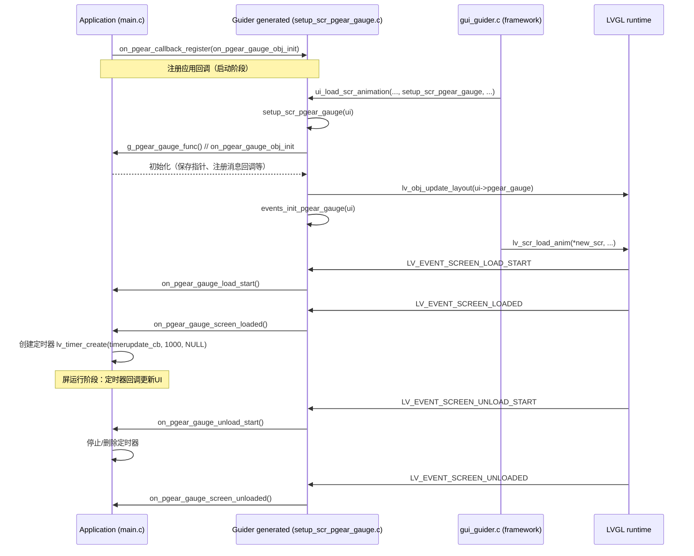

# pgear 屏切换与初始化机制（简明说明）

本文档简短说明 `pgear` 屏（以 `pgear_gauge` 为例）的创建、注册、切换与生命周期回调的实现路径，便于快速定位和修改。只包含必需信息。

## 一句话概览
- 生成器（guider）负责创建屏幕对象并绑定事件；应用在启动时通过 `on_*_callback_register` 注册自己的初始化/生命周期回调；上层通过 `ui_load_scr_animation` 将屏幕载入 LVGL，LVGL 发出 SCREEN_* 事件，生成的事件处理器将事件转发给应用回调，应用在 `SCREEN_LOADED` 回调中启动定时器做屏幕数据更新。

## 关键文件与函数（快速索引）
- 生成代码（UI 构建与事件）
  - `lvgl-ui/.../generated/setup_scr_pgear_gauge.c`
    - `void setup_scr_pgear_gauge(lv_ui *ui)`：创建 `ui->pgear_gauge` 及子控件；调用 `g_pgear_gauge_func()`（应用回调）；调用 `lv_obj_update_layout()`；调用 `events_init_pgear_gauge(ui)`。
    - `void on_pgear_callback_register(gauge_func fun)`：让应用注册 `on_pgear_gauge_obj_init`。
    - 结尾包含 `RTM_EXPORT(setup_scr_pgear_gauge);`。
  - `lvgl-ui/.../generated/events_init.c`
    - `events_init_pgear_gauge(lv_ui *ui)`：把 `pgear_gauge_event_handler` 绑定为屏幕事件回调。
    - `pgear_gauge_event_handler`：根据 LVGL 事件（LOAD_START/LOADED/UNLOAD_START/UNLOADED）调用对应的 `on_pgear_*` 函数指针。
  - `lvgl-ui/.../generated/gui_guider.c`
    - `ui_load_scr_animation(...)`：负责调用 `setup_scr`（若需要），调用 `lv_scr_load_anim` 切换屏幕，并删除旧屏（若 auto_del）。

# pgear 屏切换与初始化机制（详尽单文件说明）

本档为单一、完整的说明，覆盖 `pgear` 屏（以 `pgear_gauge` 为例）从构建/生成、注册、运行时切换到卸载的完整链路，并包含文本序列图、构建/导出相关说明与调试要点。目标是：一个文件里能找到所有关联调用与定位点，便于维护与排查。

## 概览（一句话）
- 生成器（guider）生成屏幕对象并提供“钩子/注册函数”；应用在启动时通过 `on_*_callback_register` 把初始化和生命周期回调注册进去；上层通过 `ui_load_scr_animation`（或其变体）加载屏幕；LVGL 在切换时触发 SCREEN 事件，生成的事件处理器将这些事件转发给应用回调；应用通常在 `SCREEN_LOADED` 中启动定时器完成周期性数据刷新。

## 关键文件与函数（索引）
- 生成器 / 框架（由 guider 工具生成）：
  - `lvgl-ui/.../generated/setup_scr_pgear_gauge.c`
    - `void setup_scr_pgear_gauge(lv_ui *ui)`
      - 创建 `ui->pgear_gauge`（根对象）及整棵控件树（label、img、arc 等）。
      - 调用 `g_pgear_gauge_func()` —— 即应用注册的对象初始化回调（`on_pgear_gauge_obj_init`）。
      - 调用 `lv_obj_update_layout(ui->pgear_gauge)` 更新布局。
      - 调用 `events_init_pgear_gauge(ui)` 绑定屏幕事件回调。
    - `void on_pgear_callback_register(gauge_func fun)`：供应用调用以注册 `on_pgear_gauge_obj_init`。
    - 尾部 `RTM_EXPORT(setup_scr_pgear_gauge);`（见构建/运行时说明）。

  - `lvgl-ui/.../generated/events_init.c`
    - `events_init_pgear_gauge(lv_ui *ui)`：为 `ui->pgear_gauge` 添加 `LV_EVENT_ALL` 的事件回调（`pgear_gauge_event_handler`）。
    - `pgear_gauge_event_handler`：根据 LVGL 事件码（LOAD_START/LOADED/UNLOAD_START/UNLOADED）调用对应的 `on_pgear_*` 回调（这些回调是函数指针，由注册函数设置）。

  - `lvgl-ui/.../generated/gui_guider.c`
    - `ui_load_scr_animation(...)` / `ui_load_scr_animation2(...)`：
      - 负责条件性调用 `setup_scr_*`（若 new_scr 尚未创建或需要重新生成）；
      - 调用 `lv_scr_load_anim(*new_scr, anim_type, ...)` 把屏设为活动屏；
      - 在需要时删除/清理旧屏对象。

- 应用端（实现/注册回调）：
  - `aic-dm-apps/xnapp/main.c`
    - `gui_callback_init()`：程序启动时调用一系列 `on_*_callback_register(...)`，把应用的初始化函数（例如 `on_pgear_gauge_obj_init`）绑定到生成器提供的钩子。

  - `aic-dm-apps/xnapp/gui/gt_pgear.c`
    - `on_pgear_gauge_obj_init()`：在 `setup_scr_pgear_gauge` 内被 `g_pgear_gauge_func()` 调用，用于应用层对生成的控件做额外处理（保存指针、设置样式、注册消息回调等）。
    - `on_pgear_load_start()` / `on_pgear_screen_loaded()`：这些通过 `events_init.c` 的注册函数绑定，当 LVGL 触发 `LV_EVENT_SCREEN_LOAD_START` / `LV_EVENT_SCREEN_LOADED` 时被调用。常见做法：在 `SCREEN_LOADED` 中创建定时器（如 `lv_timer_create(timerupdate_cb, 1000, NULL)`）启动周期刷新；在 `unload_start` 中停止/删除定时器。

## 构建与运行时导出（RTM_EXPORT）说明
- `RTM_EXPORT(symbol)` 的作用：
  - 这是 RT-Thread 的模块符号导出宏（见 `kernel/rt-thread/include/rtm.h`）。当启用模块支持（RT_USING_MODULE）时，宏会把函数地址与名称放入特定的符号表段（linker section），以便运行时的模块/动态加载器（dlmodule）可以按名称查找并调用这些符号。
  - 注意：这与 SCons（或任意构建工具）本身无直接的“构建指示”关系：SCons 负责编译/链接源文件，而 `RTM_EXPORT` 通过特定属性影响链接后的二进制符号段布局，从而实现运行时的符号可查找性。

## 详细顺序（文本序列图，Mermaid 与 ASCII 两种形式）
下面给出 Mermaid 格式的顺序图（如果你的阅读环境支持 Mermaid，可以直接渲染），以及不可渲染时的 ASCII 版本。

### Mermaid（若支持）

### ASCII 顺序图（兼容任何渲染器）

App(main.c) -> Gen(setup_scr_pgear_gauge): on_pgear_callback_register(on_pgear_gauge_obj_init)
Note: 应用在启动时注册回调

Gui(gui_guider) -> Gen: ui_load_scr_animation(..., setup_scr_pgear_gauge, ...)
Gen -> Gen: setup_scr_pgear_gauge(ui)  (创建对象)
Gen -> App: g_pgear_gauge_func()  // on_pgear_gauge_obj_init
App -> App: 保存引用/注册消息/样式等
Gen -> LV: lv_obj_update_layout(ui->pgear_gauge)
Gen -> Gen: events_init_pgear_gauge(ui)
Gui -> LV: lv_scr_load_anim(*new_scr,...)

LVGL triggers: LV_EVENT_SCREEN_LOAD_START -> events_init -> on_pgear_gauge_load_start()
LVGL triggers: LV_EVENT_SCREEN_LOADED -> events_init -> on_pgear_gauge_screen_loaded()
App -> App: 在 screen_loaded 中创建定时器 (lv_timer_create)

LVGL triggers unload start/unloaded -> 相应的 on_pgear_unload_start/on_pgear_screen_unloaded -> 删除定时器/清理

## 逐步动作与定位（按步骤，含具体函数/文件位置）
1. 程序启动：
   - 文件：`aic-dm-apps/xnapp/main.c` -> 函数 `gui_callback_init()`。
   - 动作：调用 `on_pgear_callback_register(on_pgear_gauge_obj_init);`（以及其它屏的注册）。

2. 请求切换到 pgear 屏：
   - 常见调用位置：`gt_readygear.c`、`gt_pgear.c`、`gauge_timer.c` 等处都可能调用 `ui_load_scr_animation(g_ui, &g_ui->pgear_gauge, ..., setup_scr_pgear_gauge, ...)`。
   - 函数：`lvgl-ui/.../generated/gui_guider.c::ui_load_scr_animation`

3. `setup_scr_pgear_gauge` 执行：
   - 文件：`lvgl-ui/.../generated/setup_scr_pgear_gauge.c`。
   - 关键调用顺序：
     - 创建控件（`lv_obj_create` / `lv_label_create` / `lv_img_create` / `lv_arc_create`...）。
     - `g_pgear_gauge_func();` —— 应用的 `on_pgear_gauge_obj_init()` 在此被调用（通常用于保存控件指针和消息订阅）。
     - `lv_obj_update_layout(ui->pgear_gauge);` —— 强制 LVGL 更新布局。
     - `events_init_pgear_gauge(ui);` —— 绑定 `pgear_gauge_event_handler`。

4. lvgl 将屏加载为活动屏：
   - `lv_scr_load_anim(*new_scr, anim_type, ...)` 被调用。
   - LVGL 会在切换过程中触发一系列事件：
     - `LV_EVENT_SCREEN_LOAD_START` -> `pgear_gauge_event_handler` -> `on_pgear_gauge_load_start()`。
     - `LV_EVENT_SCREEN_LOADED` -> `pgear_gauge_event_handler` -> `on_pgear_gauge_screen_loaded()`（常在此函数中创建并启动 timers）。

5. 屏运行：应用通过 timers（`lv_timer_create`）执行定时刷新（如 `timerupdate_cb`、`pgear_gauge_led_pull`）。

6. 卸载/切出：
   - LVGL 触发 `LV_EVENT_SCREEN_UNLOAD_START` / `LV_EVENT_SCREEN_UNLOADED`。
   - 生成事件处理器调用 `on_pgear_unload_start()` / `on_pgear_screen_unloaded()`，应用在这些回调中停止 timers、注销消息回调并清理 UI 引用。

## 调试与排查要点（实战）
- 若屏没有按预期创建/显示：
  - 检查 `ui_load_scr_animation` 的调用处是否传入正确的 `setup_scr_pgear_gauge`。
  - 在 `setup_scr_pgear_gauge` 的开头和结尾打印日志，确认是否被调用。
- 若回调未触发：
  - 检查 `main.c::gui_callback_init()` 是否执行并注册了 `on_pgear_callback_register(on_pgear_gauge_obj_init)`。
  - 检查 `events_init_pgear_gauge(ui)` 是否被执行（在 `setup_scr_pgear_gauge` 末尾）。
- 若定时器未启动或多次启动：
  - 在 `on_pgear_screen_loaded()` 中使用保护逻辑（例如只在 timer==NULL 时创建）；在 `on_pgear_unload_start()` 中删除并置为 NULL。

## 简短建议
- 保持职责分离：
  - 生成器（setup_scr_*.c）只做控件创建与事件绑定；
  - 应用层在 `on_*_callback_register` 的回调中做一次性引用/订阅；
  - 在 `SCREEN_LOADED` / `SCREEN_UNLOAD_START` 中启停 runtime 资源（timers / listeners）。
- 对于高频更新，优先考虑“按需更新”或只在当前可见控件上调用 LVGL API，以降低 CPU 与绘制开销（已在 `gt_readygear.c` 中对 `battery` 做了示范）。

---
文件路径：`docs/pgear_screen_switch.md`（仓库已写入）。

如果你希望我把 Mermaid 图转换为 PNG 并放入仓库（便于不支持 Mermaid 的查看器），或把文档再压缩为“一页速览”，告诉我你的偏好，我会继续。